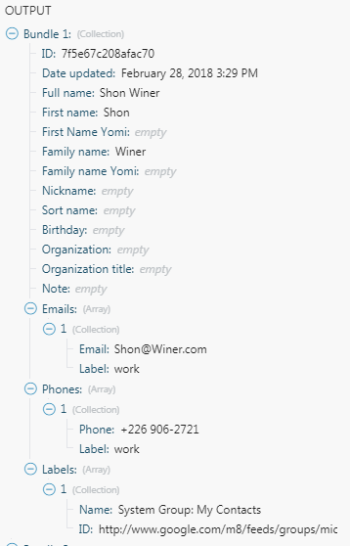

# CSV

的 [!DNL Adobe Workfront Fusion] [!UICONTROL CSV] 通过模块，您可以创建CSV文件并解析来自接收文本值或文件的CSV文本。

## 访问要求

您必须具有以下访问权限才能使用本文中的功能：

<table style="table-layout:auto">
 <col> 
 <col> 
 <tbody> 
  <tr> 
   <td role="rowheader">[!DNL Adobe Workfront] 计划*</td>
  <td> 
[!UICONTROL Pro]或更高版本
 </td>
  </tr> 
  <tr data-mc-conditions=""> 
   <td role="rowheader">[!DNL Adobe Workfront] 许可证*</td>
   <td> 
[!UICONTROL Plan]、[!UICONTROL Work]
 </td> 
  </tr> 
  <tr> 
   <td role="rowheader">[!DNL Adobe Workfront Fusion] 许可证**</td> 
   <td> 
[!UICONTROL [!DNL Workfront Fusion] （用于工作自动化和集成） 
  
[!UICONTROL [!DNL Workfront Fusion] （工作自动化）
</td> 
  </tr> 
  <tr> 
   <td role="rowheader">产品</td> 
   <td>贵组织必须购买 [!DNL Adobe Workfront Fusion] 以及 [!DNL Adobe Workfront] 以使用本文中描述的功能。</td> 
  </tr> 
 </tbody> 
</table>

要了解您拥有的计划、许可类型或访问权限，请联系您的 [!DNL Workfront] 管理员。

有关 [!DNL Adobe Workfront Fusion] 许可证，请参阅 [[!DNL Adobe Workfront Fusion] 许可证](../../workfront-fusion/get-started/license-automation-vs-integration.md).

## [!UICONTROL 创建CSV]

的 [!UICONTROL 创建CSV] 聚合器允许您根据收到的文本值创建CSV文本。

有关聚合器的更多信息，请参阅 [中的聚合器模块 [!DNL Adobe Workfront Fusion]](../../workfront-fusion/modules/aggregator-module.md).

<table style="table-layout:auto">
    <tr>
        <td>[!UICONTROL源模块]</td>
        <td>选择用于聚合所需字段的模块。</td>
    </tr>
    <tr>
        <td>[!UICONTROL聚合字段]</td>
        <td>从可用字段列表中选择要聚合的字段。</td>
    </tr>
    <tr>
        <td>[!UICONTROL第一行中包含标题]</td>
        <td>选择此选项可在结果中包含标头。</td>
    </tr>
    <tr>
        <td>[!UICONTROL Group by]</td>
        <td>输入筛选器以对结果进行分组。 例如，输入日期。</td>
    </tr>
    <tr>
        <td>[!UICONTROL空聚合后停止处理]</td>
        <td>选择此选项可在没有结果时停止方案。</td>
    </tr>
</table>

## [!UICONTROL 创建CSV（高级）]

的 [!UICONTROL 创建CSV（高级）] 聚合器允许您根据收到的文本值创建CSV文本。 它采用一种数据结构，用于定义生成的CSV文件中的CSV列。 定义列后，这些列将在CSV模块设置中显示为字段，并且可以在以后的方案中映射到模块。

有关聚合器的更多信息，请参阅 [中的聚合器模块 [!DNL Adobe Workfront Fusion]](../../workfront-fusion/modules/aggregator-module.md).

<table style="table-layout:auto">
 <col> 
 <col> 
 <tbody> 
  <tr> 
   <td role="rowheader">[!UICONTROL源模块]</td> 
   <td>选择要用于聚合所需字段的应用程序模块。</td> 
  </tr> 
  <tr> 
   <td role="rowheader">[!UICONTROL数据结构]</td> 
   <td> 
选择数据结构以按所需的方式聚合字段。 定义数据结构后，您可以将项目映射到相应的字段。
 
有关更多信息，请参阅 <a href="../../workfront-fusion/modules/data-structures.md" class="MCXref xref">中的数据结构 [!DNL Adobe Workfront Fusion]</a>.
 </td> 
  </tr> 
  <tr> 
   <td role="rowheader">[!UICONTROL第一行中包含标题] </td> 
   <td>选择此选项可在结果中包含标头。 </td> 
  </tr> 
  <tr> 
   <td role="rowheader">[!UICONTROL Group by] </td> 
   <td>输入筛选器以对结果进行分组。 例如，输入日期。 </td> 
  </tr> 
  <tr> 
   <td role="rowheader">[!UICONTROL空聚合后停止处理] </td> 
   <td>选择此选项可在没有结果时停止方案。 </td> 
  </tr> 
 </tbody> 
</table>

我们假定您要将Google联系人导出为包含“全名”和“电子邮件”两列的CSV文件。 [!UICONTROL Google Contacts] &gt;[!UICONTROL Get contacts from a group]模块的输出包具有以下结构。 电子邮件地址存储在 <code>[!UICONTROL Emails[]]</code> 项目，即收藏集数组，每个收藏集包含两个项目： <code>Label</code> 和 <code>Email</code>.

  

如果你用简单的 [!DNL Create CSV] 模块中，会为您提供与包顶级项目对应的复选框列表。 如果你试图勾选 <code>Full name</code> 和 <code>Emails</code> 项目，则[!UICONTROL创建CSV]模块会生成以下输出，这可能不是您想要的输出：

"emails","fullName"

"[对象对象]","Shon Winer"

"[对象对象]","Lizeth Fulmore"

"[对象对象]","Hilario Gullatt"

"[对象对象]","Abby Eisenbarth"

自项目开始 <code>Full Name</code> 类型为“文本”，则导出后无需执行任何操作。 但是这件 <code>Emails</code>，属于复杂类型的集合数组，将导出为[对象对象]，这是默认情况下将集合和数组转换为文本的方式。 有关更多信息，请参阅 <a href="../../workfront-fusion/mapping/item-data-types.md" class="MCXref xref">Adobe Workfront Fusion中的项目数据类型</a>.

要导出 <code>Email </code>的 <code>Emails[]</code> 而是需要使用[!UICONTROL创建CSV（高级）]模块来替换数组。 利用模块，可定义CSV文件的各个列，并将项目（包括嵌套列）映射到这些列。

<ol>
<li value="1">在方案中插入模块[!UICONTROL创建CSV（高级）]，然后打开其配置。</li>
<li value="2">单击 <strong>[!UICONTROL Add]</strong> “[!UICONTROL数据结构]”字段旁边的按钮，以创建新的数据结构。</li>
<li value="3"> 
在数据结构的名称中写入，然后单击 <strong>[!UICONTROL添加项目]</strong> 按钮来添加各个列。 如果要导出两列：“全名”和“电子邮件”，生成的数据结构如下所示：
 
  
 </li>
<li value="4"> 
成功定义数据结构后，与每个单独列对应的字段应会显示在[!UICONTROL创建CSV（高级）]模块的配置中，以便您可以映射项目。 从 <code>[!UICONTROL Emails[]]</code> 数组和映射其项目 <code>Email </code>到字段/列电子邮件：
 
  
 </li>
<li value="5"> 
执行方案。 自项目开始 <code>Emails[1]: Email</code> 映射到“电子邮件”列的类型很简单，现在可以正确导出：
 
"全名"、"电子邮件"
 
"Shon Winer","Shon@Winer.com"
 
"Lizeth Fulmore","Lizeth@Fulmore.com"
 
"Hilario Gullatt","Hilario@Gullatt.com"
 
"Abby Eisenbarth","Abby@Eisenbarth.com"
 </li>
</ol>

## [!UICONTROL 解析CSV]

的 [!UICONTROL 解析CSV] 利用转换器，可解析来自接收文本值或文件的CSV文本。

<table style="table-layout:auto">
 <col> 
 <col> 
 <tbody> 
  <tr> 
   <td role="rowheader">[!UICONTROL列数]</td> 
   <td>指定CSV文件中的列数。</td> 
  </tr> 
  <tr> 
   <td role="rowheader">[!UICONTROL CSV包含标题]</td> 
   <td> 
如果CSV文本的第一行包含标题，请选择此选项。
 
注意：模块不会使用这些标题来标记输出中的列。 相反，此字段可确保输出数据中不包含标头。
 </td> 
  </tr> 
  <tr> 
   <td role="rowheader">[!UICONTROL delimiterType]</td> 
   <td> 
选择CSV文件的分隔符。 分隔符是指示单独值或字段之间边界的文本字符。
 
    <ul> 
     <li>[!UICONTROL逗号]</li> 
     <li>[!UICONTROL选项卡]</li> 
     <li> 
[!UICONTROL其他]
 
如果选择[!UICONTROL其他]，请输入CSV文件用来分隔值的分隔符。 您必须只输入一个字符。 
 </li> 
    </ul> </td> 
  </tr> 
  <tr> 
   <td role="rowheader">[!UICONTROL保留未引号字段内的引号]</td> 
   <td>启用此选项可保留引号。</td> 
  </tr> 
  <tr> 
   <td role="rowheader">[!UICONTROL CSV]</td> 
   <td>输入或映射要解析的CSV文件。
注释: 
如果您的数据以二进制形式（通常来自文件）提供，则必须使用“toString()”函数将二进制数据转换为[!UICONTROL String]:

</td> 
  </tr> 
 </tbody> 
</table>
