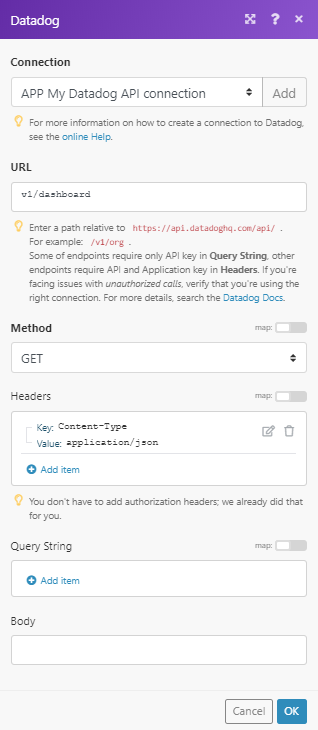

# [!DNL Datadog]模块

在[!DNL Adobe Workfront Fusion]方案中，您可以自动使用[!DNL Datadog]的工作流，并将其连接到多个第三方应用程序和服务。

如果需要有关创建方案的说明，请参阅[在 [!DNL Adobe Workfront Fusion]](../../workfront-fusion/scenarios/create-a-scenario.md)中创建方案。

有关模块的信息，请参阅 [!DNL Adobe Workfront Fusion]](../../workfront-fusion/modules/modules.md)中的[模块。

## 访问要求

您必须具有以下权限才能使用本文中的功能：

<table style="table-layout:auto">
 <col> 
 <col> 
 <tbody> 
  <tr> 
   <td role="rowheader">[!DNL Adobe Workfront] 计划*</td>
  <td> 
[！UICONTROL Pro]或更高版本
 </td>
  </tr> 
  <tr data-mc-conditions=""> 
   <td role="rowheader">[!DNL Adobe Workfront] 许可证*</td>
   <td> 
[！UICONTROL计划]，[！UICONTROL工作]
 </td> 
  </tr> 
  <tr> 
   <td role="rowheader">[!DNL Adobe Workfront Fusion] 许可证**</td> 
   <td>
   
当前许可证要求：无[!DNL Workfront Fusion]许可证要求。

   
或

   
旧版许可证要求：[！UICONTROL [!DNL Workfront Fusion] for Work Automation and Integration] 

   </td> 
  </tr> 
  <tr> 
   <td role="rowheader">产品</td> 
   <td>
   
当前产品要求：如果您有[！UICONTROL Select]或[！UICONTROL Prime] [!DNL Adobe Workfront]计划，则贵组织必须购买[!DNL Adobe Workfront Fusion]和[!DNL Adobe Workfront]才能使用本文中描述的功能。 [!DNL Workfront Fusion]包含在[！UICONTROL Ultimate] [!DNL Workfront]计划中。

   
或

   
旧版产品要求：您的组织必须购买[!DNL Adobe Workfront Fusion]和[!DNL Adobe Workfront]，才能使用本文中介绍的功能。

   </td> 
  </tr> 
 </tbody> 
</table>

要了解您拥有什么计划、许可证类型或访问权限，请与[!DNL Workfront]管理员联系。

有关[!DNL Adobe Workfront Fusion]许可证的信息，请参阅[[!DNL Adobe Workfront Fusion] 许可证](../../workfront-fusion/get-started/license-automation-vs-integration.md)。

## 先决条件

要使用[!DNL Datadog]模块，您必须具有[!DNL Datadog]帐户。

## Datadog API信息

Datadog连接器使用以下对象：

<table style="table-layout:auto"> 
 <col> 
 <col> 
 <tbody> 
  <tr> 
   <td role="rowheader">API标记</td> 
   <td>1.0.11</td> 
  </tr>
 </tbody> 
 </table>

## 将[!DNL Datadog]连接到[!DNL Workfront Fusion] {#connect-datadog-to-workfront-fusion}

### 检索API密钥和应用程序密钥 {#retrieve-your-api-key-and-application-key}

要将您的[!DNL Datadog]帐户连接到[!DNL Workfront Fusion]，您需要从[!DNL Datadog]帐户检索API密钥和应用程序密钥。

1. 登录到您的[!DNL Datadog]帐户。
1. 在左侧导航面板中，单击&#x200B;**[!UICONTROL 集成]**，然后单击&#x200B;**[!UICONTROL API]**。
1. 在主屏幕上，单击&#x200B;**[!UICONTROL API密钥]**。
1. 将鼠标悬停在紫色栏上以显示API密钥。
1. 将API密钥复制到安全位置。
1. 在主屏幕上，单击&#x200B;**[!UICONTROL 应用程序键]**。
1. 将鼠标悬停在紫色栏上以显示应用程序密钥。
1. 将应用程序密钥复制到安全位置。

### 在[!DNL Workfront Fusion]中创建与[!DNL Datadog]的连接

您可以直接从[!UICONTROL Datadog]模块内创建与[!DNL Datadog]帐户的连接。

1. 在任意[!UICONTROL Datadog]模块中，单击[!UICONTROL 连接]字段旁边的&#x200B;**[!UICONTROL 添加]**。
1. 按如下方式填写模块的字段：

<table style="table-layout:auto">
    <col> 
    <col> 
    <tbody> 
     <tr> 
      <td role="rowheader">[！UICONTROL连接类型]</td> 
      <td> 
 选择[！UICONTROL [!DNL Datadog] Application]选项以完全访问[!DNL Datadog] API。
 </td> 
     </tr> 
     <tr> 
      <td role="rowheader">[！UICONTROL连接名称]</td> 
      <td> 
 输入连接的名称。
 </td> 
     </tr> 
     <tr> 
      <td role="rowheader">[！UICONTROL域] </td> 
      <td> 
选择要连接的域（美国或欧盟）。
 </td> 
     </tr> 
     <tr> 
      <td role="rowheader">[！UICONTROL API Key]</td> 
      <td> 
 输入您的[!DNL Datadog] API密钥。 
 
有关检索API密钥的说明，请参阅本文中的<a href="#retrieve-your-api-key-and-application-key" class="MCXref xref">检索API密钥和应用程序密钥</a>。
 </td> 
     </tr> 
     <tr> 
      <td role="rowheader">[！UICONTROL应用程序密钥]</td> 
      <td> 
 输入您的[!DNL Datadog]应用程序密钥。 
 
有关检索应用程序密钥的说明，请参阅本文中的<a href="#retrieve-your-api-key-and-application-key" class="MCXref xref">检索API密钥和应用程序密钥</a>。
 </td> 
     </tr> 
    </tbody> 
   </table>

1. 单击&#x200B;**[!UICONTROL 继续]**&#x200B;以创建连接并返回模块。

## [!DNL Datadog]模块及其字段

配置[!DNL Datadog]模块时，[!DNL Workfront Fusion]显示下面列出的字段。 除此以外，可能还会显示其他[!DNL Datadog]字段，具体取决于应用程序或服务中的访问级别等因素。 模块中的粗体标题表示必填字段。

如果看到字段或函数上方的映射按钮，则可以使用该按钮设置该字段的变量和函数。 有关详细信息，请参阅[在 [!DNL Adobe Workfront Fusion]](../../workfront-fusion/mapping/map-information-between-modules.md)中将信息从一个模块映射到另一个模块。

### 操作

* [[!UICONTROL 发布时序点]](#post-timeseries-points)
* [[!UICONTROL 进行API调用]](#make-an-api-call)

#### [!UICONTROL 发布时序点]

此模块允许您发布可在[!DNL Datadog]的仪表板上绘制的时间系列数据。

压缩有效负载的限制为3.2 MB (3200000)，解压缩有效负载的限制为62 MB (62914560)。

<table style="table-layout:auto">
 <col> 
 <col> 
 <tbody> 
  <tr> 
   <td role="rowheader">[！UICONTROL Connection]</td> 
   <td> 
有关将[!DNL Datadog]帐户连接到[!DNL Workfront Fusion]的说明，请参阅本文中的<a href="#connect-datadog-to-workfront-fusion" class="MCXref xref">将[!DNL Datadog]连接到[!DNL Workfront Fusion]</a>。
 </td> 
  </tr> 
  <tr> 
   <td role="rowheader">[！UICONTROL系列]</td> 
   <td> 
添加要提交到[!DNL Datadog]的时间序列。
 
    <ul> 
     <li> 
<strong>[！UICONTROL量度]</strong> 
 
输入时间系列的名称。
 </li> 
     <li> 
<strong>[！UICONTROL类型]</strong> 
 
选择量度类型。
 </li> 
     <li> 
<strong>[！UICONTROL间隔]</strong> 
 
 如果度量的类型为“比率”或“计数”，则定义相应的时间间隔。
 </li> 
     <li> 
<strong>[！UICONTROL点]</strong> 
 
添加与量度相关的点数。
 
这是JSON点数组。 每个点的格式如下： <code>[[POSIX_timestamp, numeric_value], ...] </code>
 
注意：  
时间戳必须以秒为单位。
 
时间戳必须为最新。 当前被定义为将来不超过10分钟或过去不超过1小时。
 
 数值格式应为浮点值。
 
 
此字段必须包含至少1个项目。
 </li> 
     <li> 
<strong>[！UICONTROL主机]</strong> 
 
输入生成度量的主机的名称。
 </li> 
    </ul> </td> 
  </tr> 
 </tbody> 
</table>

#### [!UICONTROL 进行API调用]

此操作模块允许您执行自定义API调用。

<table style="table-layout:auto">
 <col> 
 <col> 
 <tbody> 
  <tr> 
   <td role="rowheader">[！UICONTROL Connection]</td> 
   <td> 
有关将[!DNL Datadog]帐户连接到[!DNL Workfront Fusion]的说明，请参阅本文中的<a href="#connect-datadog-to-workfront-fusion" class="MCXref xref">将[!DNL Datadog]连接到[!DNL Workfront Fusion]</a>。
 </td> 
  </tr> 
  <tr> 
   <td role="rowheader">[！UICONTROL URL]</td> 
   <td>输入相对于<code>https://api.datadoghq.com/api/</code>的路径。 示例： <code> /v1/org</code>。</td> 
  </tr> 
  <tr> 
   <td role="rowheader">[！UICONTROL方法]</td> 
   <td> 
选择配置API调用所需的HTTP请求方法。 有关详细信息，请参阅[!DNL Adobe Workfront Fusion]</a>中的<a href="../../workfront-fusion/modules/http-request-methods.md" class="MCXref xref">HTTP请求方法。
 </td> 
  </tr> 
  <tr> 
   <td role="rowheader">[！UICONTROL Headers]</td> 
   <td> 
以标准JSON对象的形式添加请求的标头。
 
例如， <code>{"Content-type":"application/json"}</code>
 
Workfront Fusion会为您添加授权标头。
 </td> 
  </tr> 
  <tr> 
   <td role="rowheader">[！UICONTROL查询字符串]</td> 
   <td> 
以标准JSON对象的形式添加API调用的查询。
 
例如： <code>{"name":"something-urgent"}</code>
 </td> 
  </tr> 
  <tr> 
   <td role="rowheader">[！UICONTROL Body]</td> 
   <td> 
以标准JSON对象的形式添加API调用的正文内容。
 
注意：  
在JSON中使用条件语句（如<code>if</code>）时，请将引号放在条件语句之外。
 
     
Example: </b>"> 
      
  
 
     
 
 </td> 
  </tr> 
 </tbody> 
</table>

**示例：**&#x200B;以下API调用返回您[!DNL Datadog]帐户中的所有仪表板：

URL： `/v1/dashboard`

方法： `GET`

结果可以在模块的“输出”中找到，位于“包”>“正文”>“功能板”下。

在我们的示例中，返回了3个仪表板：

