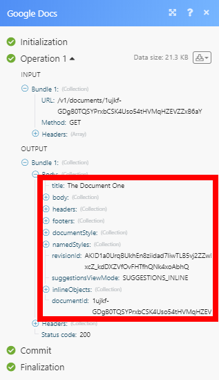

# [!DNL Google Docs] 模块

的 [!DNL Adobe Workfront Fusion] [!DNL Google Docs] 模块可让您监视、创建、编辑和检索 [!DNL Google Docs] 和 [!DNL Google Docs] ( [!DNL G Suite] 用户)。

为了使用 [!DNL Google Docs] with [!DNL Adobe Workfront Fusion]，则需要具有 [!DNL Google] 帐户。 如果你没有 [!DNL Google] 帐户，您可以在 [!DNL Google] 帐户帮助页面。

如果您需要有关创建方案的说明，请参阅 [在中创建方案 [!DNL Adobe Workfront Fusion]](../../workfront-fusion/scenarios/create-a-scenario.md).

有关模块的信息，请参阅 [中的模块 [!DNL Adobe Workfront Fusion]](../../workfront-fusion/modules/modules.md).

## 访问要求

您必须具有以下访问权限才能使用本文中的功能：

<table style="table-layout:auto"> 
 <col> 
 <col> 
 <tbody> 
  <tr> 
   <td role="rowheader">[!DNL Adobe Workfront] 计划*</td>
  <td> 
[!UICONTROL Pro]或更高版本
 </td>
  </tr> 
  <tr data-mc-conditions=""> 
   <td role="rowheader">[!DNL Adobe Workfront] 许可证*</td>
   <td> 
[!UICONTROL Plan]、[!UICONTROL Work]
 </td> 
  </tr> 
  <tr> 
   <td role="rowheader">[!DNL Adobe Workfront Fusion] 许可证**</td> 
   <td> 
[!UICONTROL [!DNL Workfront Fusion] （用于工作自动化和集成） 
 </td> 
  </tr> 
  <tr> 
   <td role="rowheader">产品</td> 
   <td>贵组织必须购买 [!DNL Adobe Workfront Fusion] 以及 [!DNL Adobe Workfront] 以使用本文中描述的功能。</td> 
  </tr>
 </tbody> 
</table>

要了解您拥有的计划、许可类型或访问权限，请联系您的 [!DNL Workfront] 管理员。

有关 [!DNL Adobe Workfront Fusion] 许可证，请参阅 [[!DNL Adobe Workfront Fusion] 许可证](../../workfront-fusion/get-started/license-automation-vs-integration.md).

## 先决条件

使用 [!DNL Google Docs] 模块，您必须拥有Google帐户。

## [!DNL Google Docs] 模块及其字段

配置 [!DNL Google Docs] 模块， [!UICONTROL Workfront Fusion] 显示下面列出的字段。 除了这些， [!DNL Google Docs] 字段可能会显示，具体取决于诸如应用程序或服务中的访问级别等因素。 模块中的粗体标题表示必填字段。

如果您看到字段或函数上方的映射按钮，则可以使用它为该字段设置变量和函数。 有关更多信息，请参阅 [在 [!DNL Adobe Workfront Fusion]](../../workfront-fusion/mapping/map-information-between-modules.md).

### 文档

* [[!UICONTROL 监视文档]](#watch-documents)
* [[!UICONTROL 列出文档]](#list-documents)
* [[!UICONTROL 获取文档内容]](#get-content-of-a-document)
* [[!UICONTROL 创建文档]](#create-a-document)
* [[!UICONTROL 从模板创建文档]](#create-a-document-from-a-template)
* [[!UICONTROL 将段落插入文档]](#insert-a-paragraph-to-a-document)
* [[!UICONTROL 将图像插入文档]](#insert-an-image-to-a-document)
* [[!UICONTROL 将图像替换为新图像]](#replace-an-image-with-a-new-image)
* [[!UICONTROL 替换文档中的文本]](#replace-text-in-a-document)
* [[!UICONTROL 下载文档]](#download-a-document)
* [[!UICONTROL 删除文档]](#delete-a-document)

#### [!UICONTROL 监视文档]

当在所选文件夹中创建或修改新文档时，此触发器模块会返回文档详细信息。

<table style="table-layout:auto"> 
 <col> 
 <col> 
 <tbody> 
  <tr> 
   <td role="rowheader">[!UICONTROL连接]</td> 
   <td> 
有关连接 [!DNL Google] 帐户 [!DNL Workfront Fusion]，请参阅 <a href="../../workfront-fusion/scenarios/create-a-scenario.md#connect" class="MCXref xref">将模块的应用程序或Web服务连接到 [!DNL Workfront Fusion]</a> 在文章中 <a href="../../workfront-fusion/scenarios/create-a-scenario.md" class="MCXref xref">在中创建方案 [!DNL Adobe Workfront Fusion]</a>.
 </td> 
  </tr> 
  <tr> 
   <td role="rowheader">[!UICONTROL Watch文档]</td> 
   <td> 
选择您是要查看创建的文档([!UICONTROL By Created Date])还是修改的文档([!UICONTROL By Modified Date])。
 </td> 
  </tr> 
  <tr> 
   <td role="rowheader">[!UICONTROL选择驱动器]</td> 
   <td> 
选择要监视的驱动器类型。
 
    <ul> 
     <li> 
<strong>[!UICONTROL My Drive]</strong> 
 
选择要监视已创建或已修改文档的文件夹。
 </li> 
     <li> 
<strong>[！与我共享的UICONTROL]</strong> 
 
选择要监视已创建或已修改文档的文件夹。
 </li> 
     <li> 
<strong>[!UICONTROL [!DNL Google] 共享驱动器]</strong> (可用 [!DNL G Suite] 仅限用户)
 
选择是否要[!UICONTROL使用域管理访问]。 选择[!UICONTROL是]将以域管理员身份发出请求，并返回请求者为管理员的所有共享驱动器。
 
选择要监视的共享驱动器。
 
注意：如果已选择 [!DNL Google Shared Drive] 的 [!DNL G Suite] 用户，错误 <code>[400] Invalid Value</code> 的次数。
 </li> 
    </ul> </td> 
  </tr> 
  <tr> 
   <td role="rowheader">[!UICONTROL限制] </td> 
   <td> 
在一个执行周期中设置Workfront Fusion返回的最大文档数。
 </td> 
  </tr> 
 </tbody> 
</table>

#### [!UICONTROL 列出文档]

此操作模块从选定文件夹中检索文档列表。

<table style="table-layout:auto"> 
 <col> 
 <col> 
 <tbody> 
  <tr> 
   <td role="rowheader">[!UICONTROL连接]</td> 
   <td> 
有关连接 [!DNL Google] 帐户 [!DNL Workfront Fusion]，请参阅 <a href="../../workfront-fusion/scenarios/create-a-scenario.md#connect" class="MCXref xref">将模块的应用程序或Web服务连接到 [!DNL Workfront Fusion]</a> 在文章中 <a href="../../workfront-fusion/scenarios/create-a-scenario.md" class="MCXref xref">在中创建方案 [!DNL Adobe Workfront Fusion]</a>.
 </td> 
  </tr> 
  <tr> 
   <td role="rowheader">[!UICONTROL选择驱动器]</td> 
   <td> 
选择要从中列出文档的驱动器类型。
 
    <ul> 
     <li> 
<strong>[!UICONTROL My Drive]</strong> 
 
选择要从中列出文档的文件夹。
 </li> 
     <li> 
<strong>[！与我共享的UICONTROL]</strong> 
 
选择要从中列出文档的文件夹。
 </li> 
     <li> 
<strong>[!UICONTROL [!DNL Google] 共享驱动器]</strong> (可用 [!DNL G Suite] 仅限用户)
 
选择是否要[!UICONTROL使用域管理访问]。 选择[!UICONTROL是]将以域管理员身份发出请求，并返回请求者为管理员的所有共享驱动器。
 
选择要从中列出文档的共享驱动器。
 
注意：如果已选择 [!DNL Google Docs] 的 [!DNL G Suite] 用户，错误 <code>[400] Invalid Value</code> 的次数。
 </li> 
    </ul> </td> 
  </tr> 
  <tr> 
   <td role="rowheader">[!UICONTROL限制] </td> 
   <td> 
设置最大文档数 [!DNL Workfront Fusion] 在一个执行周期中返回。
 </td> 
  </tr> 
 </tbody> 
</table>

#### [!UICONTROL 获取文档内容]

此操作模块检索指定的文档。

您可能需要扩展权限。

<table style="table-layout:auto"> 
 <col> 
 <col> 
 <tbody> 
  <tr> 
   <td role="rowheader">[!UICONTROL连接]</td> 
   <td> 
有关连接 [!DNL Google] 帐户 [!DNL Workfront Fusion]，请参阅 <a href="../../workfront-fusion/scenarios/create-a-scenario.md#connect" class="MCXref xref">将模块的应用程序或Web服务连接到 [!DNL Workfront Fusion]</a> 在文章中 <a href="../../workfront-fusion/scenarios/create-a-scenario.md" class="MCXref xref">在中创建方案 [!DNL Adobe Workfront Fusion]</a>.
 </td> 
  </tr> 
  <tr> 
   <td role="rowheader">[!UICONTROL获取文档内容]</td> 
   <td> 
选择是要映射文档的文档ID，还是手动从下拉菜单中选择文档。
 </td> 
  </tr> 
  <tr> 
   <td role="rowheader">[!UICONTROL选择驱动器]</td> 
   <td> 
选择包含要检索的文档的驱动器类型。
 
    <ul> 
     <li> 
<strong>[!UICONTROL My Drive]</strong> 
 
选择包含要检索的文档的文件夹。
 </li> 
     <li> 
<strong>[！与我共享的UICONTROL]</strong> 
 
选择包含要检索的文档的文件夹。
 </li> 
     <li> 
<strong>[!UICONTROL [!DNL Google] 共享驱动器]</strong> (可用 [!DNL G Suite] 仅限用户)
 
选择是否要[!UICONTROL使用域管理访问]。 选择[!UICONTROL是]将以域管理员身份发出请求，并返回请求者为管理员的所有共享驱动器。
 
选择包含要检索的文档的共享驱动器。
 
注意：如果已选择 [!DNL Google Docs] 的 [!DNL G Suite] 用户，错误 <code>[400] Invalid Value</code> 的次数。
 </li> 
    </ul> </td> 
  </tr> 
  <tr> 
   <td role="rowheader"> 
[!UICONTROL过滤器]
 </td> 
   <td> 
选择要在模块输出中返回的对象。
 
    <ul> 
     <li>[!UICONTROL Image]（默认）</li> 
     <li>[!UICONTROL绘图]</li> 
     <li>[!UICONTROL图表]</li> 
    </ul> 
注释:  
要进一步映射这些对象，请使用此模块输出中的[!UICONTROL Inline Objects Array]值（而不是[!UICONTROL inlineObjects]）。
 
[!UICONTROL Inline Objects Array]对象的排序顺序与它们在文档中的显示顺序相同。 这将使任何进一步的处理更加容易。
 
 </td> 
  </tr> 
 </tbody> 
</table>

#### [!UICONTROL 创建文档]

此操作模块允许您在所选文件夹中创建新文档。

<table style="table-layout:auto"> 
 <col> 
 <col> 
 <tbody> 
  <tr> 
   <td role="rowheader">[!UICONTROL连接]</td> 
   <td> 
有关连接 [!DNL Google] 帐户 [!DNL Workfront Fusion]，请参阅 <a href="../../workfront-fusion/scenarios/create-a-scenario.md#connect" class="MCXref xref">将模块的应用程序或Web服务连接到 [!DNL Workfront Fusion]</a> 在文章中 <a href="../../workfront-fusion/scenarios/create-a-scenario.md" class="MCXref xref">在中创建方案 [!DNL Adobe Workfront Fusion]</a>.
 </td> 
  </tr> 
  <tr> 
   <td role="rowheader">[!UICONTROL名称] </td> 
   <td> 
输入文档的名称。
 </td> 
  </tr> 
  <tr> 
   <td role="rowheader">[!UICONTROL内容]</td> 
   <td> 
输入文档的内容。 支持HTML。
 </td> 
  </tr> 
  <tr> 
   <td role="rowheader">[!UICONTROL选择驱动器]</td> 
   <td> 
选择要创建文档的驱动器类型。
 
    <ul> 
     <li> 
<strong>[!UICONTROL My Drive]</strong> 
 
选择要创建文档的文件夹。
 </li> 
     <li> 
<strong>[！与我共享的UICONTROL]</strong> 
 
选择要创建文档的文件夹。
 </li> 
     <li> 
<strong>[!UICONTROL [!DNL Google] 共享驱动器]</strong> (可用 [!DNL G Suite] 仅限用户)
 
选择是否要[!UICONTROL使用域管理访问]。 选择[!UICONTROL是]将以域管理员身份发出请求，并返回请求者为管理员的所有共享驱动器。
 
选择要创建文档的共享驱动器。
 
注意：如果已选择 [!DNL Google Docs] 的 [!DNL G Suite] 用户，错误 <code>[400] Invalid Value</code> 的次数。
 </li> 
    </ul> </td> 
  </tr> 
  <tr> 
   <td role="rowheader">[!UICONTROL插入标题]</td> 
   <td> 
 启用此选项可将标题插入文档，然后输入或映射标题的文本。
 </td> 
  </tr> 
  <tr> 
   <td role="rowheader">[!UICONTROL插入页脚] </td> 
   <td> 
启用此选项可将页脚插入文档，然后输入或映射页眉的文本。
 </td> 
  </tr> 
 </tbody> 
</table>

#### [!UICONTROL 从模板创建文档]

此操作模块会创建现有模板文档的副本并替换任何标记。 此模块还允许用户通过URL将图像替换为新图像。

<table style="table-layout:auto"> 
 <col> 
 <col> 
 <tbody> 
  <tr> 
   <td role="rowheader">[!UICONTROL连接]</td> 
   <td> 
有关连接 [!DNL Google] 帐户 [!DNL Workfront Fusion]，请参阅 <a href="../../workfront-fusion/scenarios/create-a-scenario.md#connect" class="MCXref xref">将模块的应用程序或Web服务连接到 [!DNL Workfront Fusion]</a> 在文章中 <a href="../../workfront-fusion/scenarios/create-a-scenario.md" class="MCXref xref">在中创建方案 [!DNL Adobe Workfront Fusion]</a>.
 </td> 
  </tr> 
  <tr> 
   <td role="rowheader"> 
[!UICONTROL从模板创建文档]
 </td> 
   <td> 
    <ul> 
     <li><strong>[!UICONTROL By Mapping]</strong>  选择此选项可映射文档模板。</li> 
     <li><strong>[!UICONTROL By Dropdown]</strong>  选择此选项可从下拉菜单中选择文档模板。</li> 
    </ul> </td> 
  </tr> 
  <tr> 
   <td role="rowheader">[!UICONTROL选择驱动器]</td> 
   <td> 
选择模板所在的驱动器类型。 如果您在上一个字段中选择了[!UICONTROL按下拉列表]，则此选项将可用。
 
    <ul> 
     <li> 
<strong>[!UICONTROL My Drive]</strong> 
 
选择模板所在的文件夹。
 </li> 
     <li> 
<strong>[！与我共享的UICONTROL]</strong> 
 
选择模板所在的文件夹。
 </li> 
     <li> 
<strong>[!UICONTROL [!DNL Google] 共享驱动器]</strong> (可用 [!DNL G Suite] 仅限用户)
 
选择是否要[!UICONTROL使用域管理访问]。 选择[!UICONTROL是]将以域管理员身份发出请求，并返回请求者为管理员的所有共享驱动器。
 
选择模板所在的共享驱动器。
 
注意：如果已选择 [!DNL Google Docs] 的 [!DNL G Suite] 用户，错误 <code>[400] Invalid Value</code> 的次数。
 </li> 
    </ul> </td> 
  </tr> 
  <tr> 
   <td role="rowheader"> 
[!UICONTROL值]
 </td> 
   <td> 
输入要输入的值，而不是新文档的变量。
 
    <ul> 
     <li><strong>[!UICONTROL标记]</strong>  输入文档模板中包含的标记。 请勿使用 <code>&#123;&#123;&#125;&#125;</code>. 示例：use <code>name</code> 而不是 <code>&#123;&#123;name&#125;&#125;</code>.</li> 
     <li><strong>[!UICONTROL替换值]</strong> 输入标记的值。</li> 
    </ul> 
例如，<code> &#123;&#123;name&#125;&#125;</code> 变量将在此显示为“名称”字段，可在其中插入值，例如 <code>John</code>.
 </td> 
  </tr> 
  <tr> 
   <td role="rowheader"> 
[!UICONTROL图像替换]
 </td> 
   <td> 
输入将替换当前图像的[!UICONTROL图像对象ID]和[!UICONTROL图像URL]的链接。
 
注意：您可以使用[!UICONTROL获取文档]模块检索图像ID，其中ID包含在数组[!UICONTROL内联对象数组]中。
 
我们建议您向 [!DNL Google] 文档。 
 
向 [!DNL Google Docs] 图像：
 
    <ol> 
     <li value="1">右键单击图像。</li> 
     <li value="2">选择[!UICONTROL ALT text]选项。</li> 
     <li value="3">在[!UICONTROL标题]字段中输入[!UICONTROL ALT text]，然后单击[!UICONTROL OK]。</li> 
    </ol> 
将ALT文本添加到图像后，ALT文本将显示在括号中的字段名称中。
 </td> 
  </tr> 
  <tr> 
   <td role="rowheader">[!UICONTROL标题] </td> 
   <td> 
输入新文档的名称。
 </td> 
  </tr> 
  <tr> 
   <td role="rowheader">[!UICONTROL选择驱动器]</td> 
   <td> 
选择模板所在的驱动器类型。 如果您在上一个字段中选择了[!UICONTROL按下拉列表]，则此选项将可用。
 
    <ul> 
     <li> 
<strong>[!UICONTROL My Drive]</strong> 
 
选择要创建文档的文件夹。
 </li> 
     <li> 
<strong>[！与我共享的UICONTROL]</strong> 
 
选择要创建文档的文件夹。
 </li> 
     <li> 
<strong>[!UICONTROL [!DNL Google] 共享驱动器]</strong> (可用 [!DNL G Suite] 仅限用户)
 
选择是否要[!UICONTROL使用域管理访问]。 选择[!UICONTROL是]将以域管理员身份发出请求，并返回请求者为管理员的所有共享驱动器。
 
选择要创建文档的共享驱动器。
 
注意：如果已选择 [!DNL Google Docs] 的 [!DNL G Suite] 用户，错误 <code>[400] Invalid Value</code> 的次数。
 </li> 
    </ul> </td> 
  </tr> 
 </tbody> 
</table>

#### [!UICONTROL 将段落插入文档]

此操作模块向现有文档追加或插入新段落。

<table style="table-layout:auto"> 
 <col> 
 <col> 
 <tbody> 
  <tr> 
   <td role="rowheader">[!UICONTROL连接]</td> 
   <td> 
有关连接 [!DNL Google] 帐户 [!DNL Workfront Fusion]，请参阅 <a href="../../workfront-fusion/scenarios/create-a-scenario.md#connect" class="MCXref xref">将模块的应用程序或Web服务连接到 [!DNL Workfront Fusion]</a> 在文章中 <a href="../../workfront-fusion/scenarios/create-a-scenario.md" class="MCXref xref">在中创建方案 [!DNL Adobe Workfront Fusion]</a>.
 </td> 
  </tr> 
  <tr> 
   <td role="rowheader"> 
[!UICONTROL选择文档]
 </td> 
   <td> 
    <ul> 
     <li><strong>[!UICONTROL By Mapping]</strong>  选择此选项可映射文档。</li> 
     <li><strong>[!UICONTROL By Dropdown]</strong>   选择此选项可从下拉菜单中选择文档。</li> 
    </ul> </td> 
  </tr> 
  <tr> 
   <td role="rowheader">[!UICONTROL选择驱动器]</td> 
   <td> 
选择要添加段落的文档所在的驱动器类型。 如果您在上一个字段中选择了[!UICONTROL按下拉列表]，则此选项将可用。
 
    <ul> 
     <li> 
<strong>[!UICONTROL My Drive]</strong> 
 
选择要添加段落的文档所在的文件夹，然后选择该文档。
 </li> 
     <li> 
<strong>[！与我共享的UICONTROL]</strong> 
 
选择要添加段落的文档所在的文件夹，然后选择该文档。
 </li> 
     <li> 
<strong>[!UICONTROL [!DNL Google] 共享驱动器]</strong> (可用 [!DNL G Suite] 仅限用户)
 
选择是否要[!UICONTROL使用域管理访问]。 选择[!UICONTROL是]将以域管理员身份发出请求，并返回请求者为管理员的所有共享驱动器。
 
选择要添加段落的文档所在的共享驱动器，然后选择该文档。
 
注意：如果已选择 [!DNL Google Docs] 的 [!DNL G Suite] 用户，错误 <code>[400] Invalid Value</code> 的次数。
 </li> 
    </ul> </td> 
  </tr> 
  <tr> 
   <td role="rowheader"> 
[!UICONTROL插入段落]
 </td> 
   <td> 
选择希望在文档中插入新文本的方式。
 
    <ul> 
     <li> 
<strong>[!UICONTROL按位置规范]</strong> 
 
      <ul> 
       <li> 
<strong>[!UICONTROL By Index]</strong> 
 
        <ul> 
         <li> 
<strong>[!UICONTROL索引]</strong> 
 
输入要插入文本的索引编号。 您可以使用[!UICONTROL获取文档]模块检索索引号。
 
要显示文档中的所有字符（包括隐藏字符），您可以使用[!UICONTROL Show]附加组件。 您可以在[!UICONTROL Add-ons] &gt; [!UICONTROL Get add-ons]下找到该加载项。 搜索[!UICONTROL Show]并安装[!UICONTROL Show]加载项。
 </li> 
         <li> 
<strong>[!UICONTROL插入的文本]</strong> 
 
输入要插入到文档中的文本。
 </li> 
        </ul> </li> 
       <li> 
<strong>[!UICONTROL By Segment ID]</strong> 
 
选择要插入文本内容的页眉和页脚，然后输入要插入到相应字段的文本。
 
如果页眉或页脚已包含文本，则新文本将添加在现有文本之前。
 </li> 
      </ul> </li> 
     <li> 
<strong>[!UICONTROL — 通过将附加到文档正文]</strong> 
 
在文档正文内容的末尾附加输入的文本。
 
新段落的样式将从当前插入索引的段落中复制，包括列表和项目符号。
 </li> 
    </ul> 
    <ul> 
     <li> 
<strong>[!UICONTROL通过附加到区段的末尾（页眉和页脚）]</strong> 
 
选择要插入文本内容的页眉和页脚，然后输入要插入到相应字段的文本。
 
如果页眉或页脚已包含文本，则新文本将添加在现有文本之后。
 </li> 
    </ul> </td> 
  </tr> 
  <tr> 
   <td role="rowheader">[!UICONTROL附加的文本]</td> 
   <td>输入或映射要附加到文档的文本</td> 
  </tr> 
 </tbody> 
</table>

#### [!UICONTROL 将图像插入文档]

此操作模块将图像从URL插入到文档。

<table style="table-layout:auto"> 
 <col> 
 <col> 
 <tbody> 
  <tr> 
   <td role="rowheader">[!UICONTROL连接]</td> 
   <td> 
有关连接 [!DNL Google] 帐户 [!DNL Workfront Fusion]，请参阅 <a href="../../workfront-fusion/scenarios/create-a-scenario.md#connect" class="MCXref xref">将模块的应用程序或Web服务连接到 [!DNL Workfront Fusion]</a> 在文章中 <a href="../../workfront-fusion/scenarios/create-a-scenario.md" class="MCXref xref">在中创建方案 [!DNL Adobe Workfront Fusion]</a>.
 </td> 
  </tr> 
  <tr> 
   <td role="rowheader"> 
[!UICONTROL选择文档]
 </td> 
   <td> 
    <ul> 
     <li><strong>[!UICONTROL By Mapping]</strong>  选择此选项可映射文档模板。</li> 
     <li><strong>[!UICONTROL By Dropdown]</strong>   选择此选项可从下拉菜单中选择文档。</li> 
    </ul> </td> 
  </tr> 
  <tr> 
   <td role="rowheader">[!UICONTROL选择驱动器]</td> 
   <td> 
选择要添加图像的文档所在的驱动器类型。 如果您在上一个字段中选择了[!UICONTROL按下拉列表]，则此选项将可用。
 
    <ul> 
     <li> 
<strong>[!UICONTROL My Drive]</strong> 
 
选择要添加图像的文档所在的文件夹，然后选择该文档。
 </li> 
     <li> 
<strong>[！与我共享的UICONTROL]</strong> 
 
选择要添加图像的文档所在的文件夹，然后选择该文档。
 </li> 
     <li> 
<strong>[!UICONTROL [!DNL Google] 共享驱动器]</strong> (可用 [!DNL G Suite] 仅限用户)
 
选择是否要[!UICONTROL使用域管理访问]。 选择[!UICONTROL是]将以域管理员身份发出请求，并返回请求者为管理员的所有共享驱动器。
 
选择要添加图像的文档所在的共享驱动器，然后选择该文档。
 
注意：如果已选择 [!DNL Google Docs] 的 [!DNL G Suite] 用户，错误 <code>[400] Invalid Value</code> 的次数。
 </li> 
    </ul> </td> 
  </tr> 
  <tr> 
   <td role="rowheader"> 
[!UICONTROL插入图像]
 </td> 
   <td> 
选择希望在文档中插入新图像的方式。
 
    <ul> 
     <li> 
<strong>[!UICONTROL按位置规范]</strong> 
 
      <ul> 
       <li> 
<strong>[!UICONTROL By Index]</strong> 
 
        <ul> 
         <li> 
<strong>[!UICONTROL索引]</strong> 
 
输入要插入图像的索引号。 您可以使用[!UICONTROL获取文档]模块检索[!UICONTROL索引编号]。
 
要显示文档中的所有字符（包括隐藏字符），您可以使用[!UICONTROL Show]附加组件。 您可以在[!UICONTROL Add-ons] &gt; [!UICONTROL Get add-ons]下找到该加载项。 搜索[!UICONTROL Show]并安装[!UICONTROL Show]加载项。
 </li> 
         <li> 
<strong>[!UICONTROL图像URL]</strong> 
 
输入要插入到文档中的图像的URL。
 
最大图像大小为50 MB。 不能超过2500万像素。 仅支持PNG、JPEG或GIF格式。
 </li> 
        </ul> </li> 
       <li> 
<strong>[!UICONTROL By Segment ID]</strong> 
 
选择要插入图像的页眉和页脚，然后输入相应字段的图像URL。
 
最大图像大小为50 MB。 图像不能超过2500万像素。 仅支持PNG、JPEG或GIF格式。
 </li> 
      </ul> </li> 
     <li> 
<strong>[!UICONTROL — 通过将附加到文档正文]</strong> 
 
在文档正文内容的末尾附加特定图像。
 </li> 
    </ul> 
    <ul> 
     <li> 
<strong>[!UICONTROL通过附加到区段的末尾（页眉和页脚）]</strong> 
 
选择要插入图像的页眉和页脚，然后输入要插入到相应字段的图像URL。
 </li> 
    </ul> </td> 
  </tr> 
  <tr> 
   <td role="rowheader"> 
[!UICONTROL点/宽度量的高度大小（点）]
 </td> 
   <td> 
定义插入图像的大小。 将保持宽高比。
 </td> 
  </tr> 
 </tbody> 
</table>

#### [!UICONTROL 将图像替换为新图像]

此操作模块会替换现有图像。 将保持原始图像的宽高比。

<table style="table-layout:auto"> 
 <col> 
 <col> 
 <tbody> 
  <tr> 
   <td role="rowheader">[!UICONTROL连接]</td> 
   <td> 
有关连接 [!DNL Google] 帐户 [!DNL Workfront Fusion]，请参阅 <a href="../../workfront-fusion/scenarios/create-a-scenario.md#connect" class="MCXref xref">将模块的应用程序或Web服务连接到 [!DNL Workfront Fusion]</a> 在文章中 <a href="../../workfront-fusion/scenarios/create-a-scenario.md" class="MCXref xref">在中创建方案 [!DNL Adobe Workfront Fusion]</a>.
 </td> 
  </tr> 
  <tr> 
   <td role="rowheader"> 
[!UICONTROL选择文档]
 </td> 
   <td> 
    <ul> 
     <li><strong>[!UICONTROL By Mapping]</strong>  选择此选项可映射文档模板。</li> 
     <li><strong>[!UICONTROL By Dropdown]</strong>   选择此选项可从下拉菜单中选择文档。</li> 
    </ul> </td> 
  </tr> 
  <tr> 
   <td role="rowheader">[!UICONTROL选择驱动器]</td> 
   <td> 
选择要替换图像的文档所在的驱动器类型。 如果您在上一个字段中选择了[!UICONTROL按下拉列表]，则此选项将可用。
 
    <ul> 
     <li> 
<strong>[!UICONTROL My Drive]</strong> 
 
选择要替换图像的文档所在的文件夹，然后选择该文档。
 </li> 
     <li> 
<strong>[！与我共享的UICONTROL]</strong> 
 
选择要替换图像的文档所在的文件夹，然后选择该文档。
 </li> 
     <li> 
<strong>[!UICONTROL [!DNL Google] 共享驱动器]</strong> (可用 [!DNL G Suite] 仅限用户)
 
选择是否要[!UICONTROL使用域管理访问]。 选择[!UICONTROL是]将以域管理员身份发出请求，并返回请求者为管理员的所有共享驱动器。
 
选择要替换图像的文档所在的共享驱动器，然后选择该文档。
 
注意：如果已选择 [!DNL Google Docs] 的 [!DNL G Suite] 用户，错误 <code>[400] Invalid Value</code> 的次数。
 </li> 
    </ul> </td> 
  </tr> 
  <tr> 
   <td role="rowheader"> 
[!UICONTROL图像URL]
 </td> 
   <td> 
输入或映射将替换现有图像的新图像的URL。
 
图像会按它们在文档中的显示顺序列出。 例如， <code>Body: Image No. 1</code> 是文档中的第一个图像。
 </td> 
  </tr> 
 </tbody> 
</table>

#### [!UICONTROL 替换文档中的文本]

此操作模块将替换文档中的文本。

<table style="table-layout:auto"> 
 <col> 
 <col> 
 <tbody> 
  <tr> 
   <td role="rowheader">[!UICONTROL连接]</td> 
   <td> 
有关连接 [!DNL Google] 帐户 [!DNL Workfront Fusion]，请参阅 <a href="../../workfront-fusion/scenarios/create-a-scenario.md#connect" class="MCXref xref">将模块的应用程序或Web服务连接到 [!DNL Workfront Fusion]</a> 在文章中 <a href="../../workfront-fusion/scenarios/create-a-scenario.md" class="MCXref xref">在中创建方案 [!DNL Adobe Workfront Fusion]</a>.
 </td> 
  </tr> 
  <tr> 
   <td role="rowheader"> 
[!UICONTROL选择文档]
 </td> 
   <td> 
    <ul> 
     <li><strong>[!UICONTROL By Mapping]</strong>  选择此选项可映射文档模板。</li> 
     <li><strong>[!UICONTROL By Dropdown]</strong>   选择此选项可从下拉菜单中选择文档。</li> 
    </ul> </td> 
  </tr> 
  <tr> 
   <td role="rowheader">[!UICONTROL选择驱动器]</td> 
   <td> 
选择要添加文本的文档所在的驱动器类型。 如果您在上一个字段中选择了[!UICONTROL按下拉列表]，则此选项将可用。
 
    <ul> 
     <li> 
<strong>[!UICONTROL My Drive]</strong> 
 
选择要添加文本的文档所在的文件夹，然后选择该文档。
 </li> 
     <li> 
<strong>[！与我共享的UICONTROL]</strong> 
 
选择要添加文本的文档所在的文件夹，然后选择该文档。
 </li> 
     <li> 
<strong>[!UICONTROL [!DNL Google] 共享驱动器]</strong> (可用 [!DNL G Suite] 仅限用户)
 
选择是否要[!UICONTROL使用域管理访问]。 选择[!UICONTROL是]将以域管理员身份发出请求，并返回请求者为管理员的所有共享驱动器。
 
选择要添加文本的文档所在的共享驱动器，然后选择该文档。
 
注意：如果已选择 [!DNL Google Docs] 的 [!DNL G Suite] 用户，错误 <code>[400] Invalid Value</code> 的次数。
 </li> 
    </ul> </td> 
  </tr> 
  <tr> 
   <td role="rowheader"> 
[!UICONTROL替换文本]
 </td> 
   <td> 
添加要替换的每个文本。
 
    <ul> 
     <li> 
<strong>[!UICONTROL要替换的旧文本]</strong> 
 
输入要替换的文本。
 </li> 
     <li> 
<strong>[!UICONTROL要插入的新文本]</strong> 
 
输入新文本。
 </li> 
    </ul> </td> 
  </tr> 
 </tbody> 
</table>

#### [!UICONTROL 下载文档]

此操作模块转换并下载所选文档。

<table style="table-layout:auto"> 
 <col> 
 <col> 
 <tbody> 
  <tr> 
   <td role="rowheader">[!UICONTROL连接]</td> 
   <td> 
有关连接 [!DNL Google] 帐户 [!DNL Workfront Fusion]，请参阅 <a href="../../workfront-fusion/scenarios/create-a-scenario.md#connect" class="MCXref xref">将模块的应用程序或Web服务连接到 [!DNL Workfront Fusion]</a> 在文章中 <a href="../../workfront-fusion/scenarios/create-a-scenario.md" class="MCXref xref">在中创建方案 [!DNL Adobe Workfront Fusion]</a>.
 </td> 
  </tr> 
  <tr> 
   <td role="rowheader">[!UICONTROL选择驱动器]</td> 
   <td> 
选择要下载的文档所在的驱动器类型。
 
    <ul> 
     <li> 
<strong>[!UICONTROL My Drive]</strong> 
 
选择要下载的文档所在的文件夹，然后选择该文档。
 </li> 
     <li> 
<strong>[！与我共享的UICONTROL]</strong> 
 
选择要下载的文档所在的文件夹，然后选择该文档。
 </li> 
     <li> 
<strong>[!UICONTROL [!DNL Google] 共享驱动器]</strong> (可用 [!DNL G Suite] 仅限用户)
 
选择是否要[!UICONTROL使用域管理访问]。 选择[!UICONTROL是]将以域管理员身份发出请求，并返回请求者为管理员的所有共享驱动器。
 
选择要下载的文档所在的共享驱动器，然后选择该文档。
 
注意：如果已选择 [!DNL Google Docs] 的 [!DNL G Suite] 用户，错误 <code>[400] Invalid Value</code> 的次数。
 </li> 
    </ul> </td> 
  </tr> 
  <tr> 
   <td role="rowheader"> 
[!UICONTROL Type] 
 </td> 
   <td> 
选择下载文档的目标文件格式。
 </td> 
  </tr> 
 </tbody> 
</table>

#### [!UICONTROL 删除文档]

此操作模块会删除文档。

<table style="table-layout:auto"> 
 <col> 
 <col> 
 <tbody> 
  <tr> 
   <td role="rowheader">[!UICONTROL连接]</td> 
   <td> 
有关连接 [!DNL Google] 帐户 [!DNL Workfront Fusion]，请参阅 <a href="../../workfront-fusion/scenarios/create-a-scenario.md#connect" class="MCXref xref">将模块的应用程序或Web服务连接到 [!DNL Workfront Fusion]</a> 在文章中 <a href="../../workfront-fusion/scenarios/create-a-scenario.md" class="MCXref xref">在中创建方案 [!DNL Adobe Workfront Fusion]</a>.
 </td> 
  </tr> 
  <tr> 
   <td role="rowheader">[!UICONTROL选择驱动器]</td> 
   <td> 
选择要删除的文档所在的驱动器类型。
 
    <ul> 
     <li> 
<strong>[!UICONTROL My Drive]</strong> 
 
选择要删除的文档所在的文件夹，然后选择该文档。
 </li> 
     <li> 
<strong>[！与我共享的UICONTROL]</strong> 
 
选择要删除的文档所在的文件夹，然后选择该文档。
 </li> 
     <li> 
<strong>[!UICONTROL [!DNL Google] 共享驱动器]</strong> (可用 [!DNL G Suite] 仅限用户)
 
选择是否要[!UICONTROL使用域管理访问]。 选择[!UICONTROL是]将以域管理员身份发出请求，并返回请求者为管理员的所有共享驱动器。
 
选择要删除的文档所在的共享驱动器，然后选择该文档。
 
注意：如果已选择 [!DNL Google Docs] 的 [!DNL G Suite] 用户，错误 <code>[400] Invalid Value</code> 的次数。
 </li> 
    </ul> </td> 
  </tr> 
  <tr> 
   <td role="rowheader">[!UICONTROL共享驱动器]</td> 
   <td> 
选择包含要下载的文档的驱动器，然后选择一个文档。 如果您已选择 [!DNL Google Docs] 在[!UICONTROL选择驱动器]字段中。
 </td> 
  </tr> 
  <tr> 
   <td role="rowheader">[!UICONTROL文档ID]</td> 
   <td> 
 选择或映射要替换中一个或多个图像的文档。
 </td> 
  </tr> 
 </tbody> 
</table>

### 其他

* [[!UICONTROL 进行API调用]](#make-an-api-call)
* [[!UICONTROL 使文档中的所有链接都可点击]](#make-all-links-in-a-document-clickable)

#### [!UICONTROL 进行API调用]

此操作模块允许您执行自定义API调用。

<table style="table-layout:auto"> 
 <col> 
 <col> 
 <tbody> 
  <tr> 
   <td role="rowheader">[!UICONTROL连接] </td> 
   <td> 
有关连接 [!DNL Google] 帐户 [!DNL Workfront Fusion]，请参阅 <a href="../../workfront-fusion/scenarios/create-a-scenario.md#connect" class="MCXref xref">将模块的应用程序或Web服务连接到 [!DNL Workfront Fusion]</a> 在文章中 <a href="../../workfront-fusion/scenarios/create-a-scenario.md" class="MCXref xref">在中创建方案 [!DNL Adobe Workfront Fusion]</a>.
 </td> 
  </tr> 
  <tr> 
   <td role="rowheader">[!UICONTROL URL]</td> 
   <td> 
输入相对于 <code>https://docs.googleapis.com/</code>. 示例: <code>/v1/documents/{presentationID}</code>. 
 </td> 
  </tr> 
  <tr> 
   <td role="rowheader">[!UICONTROL方法]</td> 
   <td> 
选择配置API调用所需的HTTP请求方法。 有关更多信息，请参阅 <a href="../../workfront-fusion/modules/http-request-methods.md" class="MCXref xref">中的HTTP请求方法 [!DNL Adobe Workfront Fusion]</a>.
 
 
 </td> 
  </tr> 
  <tr> 
   <td role="rowheader">[!UICONTROL标头]</td> 
   <td> 
以标准JSON对象的形式添加请求的标头。例如， <code>{"Content-type":"application/json"}</code>. [!DNL Workfront Fusion] 为您添加授权标头。
 </td> 
  </tr> 
  <tr> 
   <td role="rowheader">[!UICONTROL查询字符串]</td> 
   <td> 
 输入请求查询字符串。
 </td> 
  </tr> 
  <tr> 
   <td role="rowheader">[!UICONTROL主体]</td> 
   <td> 
以标准JSON对象的形式为API调用添加正文内容。
 
注释:  
使用条件语句时，例如 <code>if</code> 在JSON中，将引号放置在条件语句的外部。
 
     
Example: </b>"> 
      
  
 
     
 
 </td> 
  </tr> 
 </tbody> 
</table>

**示例：** 以下API调用可检索您的Google文档中指定文档的详细信息：

**URL:**

/v1/documents/1ujkf-GDgB0TQSYPrxbCSK4Uso54tHVMqHZEVZxB6aY

**方法:**

[!UICONTROL GET]

有关检索到的文档的详细信息，请参阅模块的“输出”(位于 [!UICONTROL 捆绑] > [!UICONTROL 正文].

#### [!UICONTROL 使文档中的所有链接都可点击]

此操作模块会查找文档中的所有链接，并使其可单击。

<table style="table-layout:auto"> 
 <col> 
 <col> 
 <tbody> 
  <tr> 
   <td role="rowheader">[!UICONTROL连接]</td> 
   <td> 
有关连接 [!DNL Google] 帐户 [!DNL Workfront Fusion]，请参阅 <a href="../../workfront-fusion/scenarios/create-a-scenario.md#connect" class="MCXref xref">将模块的应用程序或Web服务连接到 [!DNL Workfront Fusion]</a> 在文章中 <a href="../../workfront-fusion/scenarios/create-a-scenario.md" class="MCXref xref">在中创建方案 [!DNL Adobe Workfront Fusion]</a>.
 </td> 
  </tr> 
  <tr> 
   <td role="rowheader"> 
[!UICONTROL在文档中创建所有链接]
 </td> 
   <td> 
    <ul> 
     <li><strong>[!UICONTROL By Mapping]</strong>  选择此选项可映射文档模板。</li> 
     <li><strong>[!UICONTROL By Dropdown]</strong>   选择此选项可从下拉菜单中选择文档。</li> 
    </ul> </td> 
  </tr> 
  <tr> 
   <td role="rowheader">[!UICONTROL选择驱动器]</td> 
   <td> 
选择要使链接可点击的文档所在的驱动器类型。 如果您在上一个字段中选择了[!UICONTROL按下拉列表]，则此选项将可用。
 
    <ul> 
     <li> 
<strong>[!UICONTROL My Drive]</strong> 
 
选择要使文档在中可单击的链接所在的文件夹，然后选择该文档。
 </li> 
     <li> 
<strong>[！与我共享的UICONTROL]</strong> 
 
选择要使文档在中可单击的链接所在的文件夹，然后选择该文档。
 </li> 
     <li> 
<strong>[!UICONTROL [!DNL Google] 共享驱动器]</strong> (可用 [!DNL G Suite] 仅限用户)
 
选择是否要[!UICONTROL使用域管理访问]。 选择[!UICONTROL是]将以域管理员身份发出请求，并返回请求者为管理员的所有共享驱动器。
 
选择要使链接可点击的文档所在的共享驱动器，然后选择该文档。
 
注意：如果已选择 [!DNL Google Docs] 的 [!DNL G Suite] 用户，错误 <code>[400] Invalid Value</code> 的次数。
 </li> 
    </ul> </td> 
  </tr> 
  <tr> 
   <td role="rowheader">[!UICONTROL共享驱动器]</td> 
   <td> 
选择包含要更新链接的文档的驱动器，然后选择一个文档。 如果您已选择 [!DNL Google Docs] 在[!UICONTROL选择驱动器字段]中。
 </td> 
  </tr> 
  <tr> 
   <td role="rowheader">[!UICONTROL文档ID]</td> 
   <td> 
 选择或映射要更新中链接的文档。
 </td> 
  </tr> 
 </tbody> 
</table>
