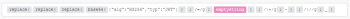

# HTTP >其他模块

>[!NOTE]
>
>[!UICONTROL Adobe Workfront Fusion] 需要 [!UICONTROL Adobe Workfront Fusion] 除 [!UICONTROL Adobe Workfront] 许可证。

的 [!DNL Adobe Workfront Fusion] [!UICONTROL HTTP] 应用程序提供了基于超文本传输协议(HTTP)协议的各种通信模块。 HTTP是万维网数据通信的基础。 您可以使用模块下载网页和文件、调用Web挂接和API端点等。

模块的正确选择取决于您要访问的资源所使用的身份验证/授权机制。 以下是模块示例

* 发出请求：通用模块主要用于不采用任何类型的身份验证/授权的资源
* 发出基本身份验证请求：适用于使用的资源 [!DNL HTTP] 基本身份验证(BA)
* 发出OAuth 2.0请求：适用于使用OAuth 2.0授权协议的资源
* 发出客户端证书身份验证请求：适用于使用需要客户端证书的授权协议的资源。
* 发出API密钥授权请求：适用于使用API密钥进行授权的资源。

## 请求模块

有关特定请求模块说明，请参阅以下文章：

* [[!UICONTROL HTTP] >[!UICONTROL 请求] 模块](../../../workfront-fusion/apps-and-their-modules/http-modules/http-module-make-a-request.md)
* [[!UICONTROL HTTP] >[!UICONTROL 发出基本授权请求] 模块](../../../workfront-fusion/apps-and-their-modules/http-modules/http-module-make-a-basic-auth-request.md)
* [[!UICONTROL HTTP] > [!UICONTROL 发出OAuth 2.0请求] 模块](../../../workfront-fusion/apps-and-their-modules/http-modules/http-module-make-an-oauth-2-request.md)
* [[!UICONTROL HTTP] >[!UICONTROL 发出客户端证书授权请求] 模块](../../../workfront-fusion/apps-and-their-modules/http-modules/http-module-make-a-client-cert-auth-request.md)
* [[!UICONTROL HTTP] >[!UICONTROL 发出API密钥授权请求]](../../../workfront-fusion/apps-and-their-modules/http-modules/http-module-make-an-api-key-auth-request.md)

## 其他操作模块

* [[!UICONTROL 获取文件]](#get-a-file)
* [[!UICONTROL 解析目标URL]](#resolve-a-target-url)

### [!UICONTROL 获取文件]

此操作模块从指定的URL下载文件。 下载文件后，您可以使用场景中的其他模块进一步处理文件（映射文件数据）。

<table style="table-layout:auto"> 
 <col> 
 <col> 
 <tbody> 
  <tr> 
   <td role="rowheader">[!UICONTROL URL] </td> 
   <td> <p>输入或映射要下载的文件的URL。 </p> </td> 
  </tr> 
 </tbody> 
</table>

### [!UICONTROL 解析目标URL]

此操作模块解析了HTTP重定向链并返回目标URL。

<table style="table-layout:auto"> 
 <col> 
 <col> 
 <tbody> 
  <tr> 
   <td role="rowheader">[!UICONTROL URL] </td> 
   <td> <p>输入或映射要解析的URL，例如 [!DNL bit.ly] URL。</p> </td> 
  </tr> 
  <tr> 
   <td role="rowheader">[!UICONTROL方法] </td> 
   <td> <p>选择是要使用[!UICONTROLHEAD]方法还是[!UICONTROLGET]方法。</p> </td> 
  </tr> 
 </tbody> 
</table>

## 迭代器模块

### [!UICONTROL 检索标头]

此模块在单独的包中返回指定HTTP模块中的每个标头（名称和值）。

<table style="table-layout:auto"> 
 <col> 
 <col> 
 <tbody> 
  <tr> 
   <td role="rowheader">[!UICONTROL源模块]</td> 
   <td> <p> 选择要从中检索标头的模块。</p> </td> 
  </tr> 
 </tbody> 
</table>

## 生成JSON Web令牌(JWT)

借助内置函数，可以生成JWT令牌：

标头:



复制并粘贴代码：

```
{{replace(replace(replace(base64("{""alg"":""HS256"",""typ"":""JWT""}"); "/=/g"; emptystring); "/\+/g"; "-"); "/\//g"; "_")}}
```

负载：


复制并粘贴代码：

```
{{replace(replace(replace(base64("{""iss"":""key"",""exp"":" + (timestamp + 60) + "}"); "/=/g"; emptystring); "/\+/g"; "-"); "/\//g"; "_")}}
```

令牌：


复制并粘贴代码：

```
{{1.value}}.{{2.value}}.{{replace(replace(replace(sha256(1.value + "." + 2.value; "base64"; "secret"); "/=/g"; emptystring); "/\+/g"; "-"); "/\//g"; "_")}}
```
