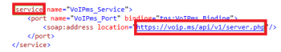

# [!UICONTROL SOAP]模块

>[!IMPORTANT]
>
>Adobe Workfront Fusion文档已移至新位置。
>
>本文中的信息现在可在以下文章中找到：
>
>* [SOAP模块](https://experienceleague.adobe.com/docs/workfront-fusion/using/references/apps-and-their-modules/universal-connectors/soap-module.html)
>
>请更新任何书签。
>
>本文不再更新，不久将会删除。

您可以使用[!UICONTROL SOAP]模块连接到[!UICONTROL Adobe Workfront Fusion]中的[!UICONTROL SOAP] API。

## 访问要求

您必须具有以下权限才能使用本文中的功能：

<table style="table-layout:auto"> 
 <col> 
 <col> 
 <tbody> 
  <tr> 
   <td role="rowheader">[!DNL Adobe Workfront] 计划*</td>
  <td> <p>[！UICONTROL Pro]或更高版本</p> </td>
  </tr> 
  <tr data-mc-conditions=""> 
   <td role="rowheader">[!DNL Adobe Workfront] 许可证*</td>
   <td> <p>[！UICONTROL计划]，[！UICONTROL工作]</p> </td> 
  </tr> 
  <tr> 
   <td role="rowheader">[!DNL Adobe Workfront Fusion] 许可证**</td> 
   <td>
   <p>当前许可证要求：无[!DNL Workfront Fusion]许可证要求。</p>
   <p>或</p>
   <p>旧版许可证要求：[！UICONTROL [!DNL Workfront Fusion] for Work Automation and Integration] </p>
   </td> 
  </tr> 
  <tr> 
   <td role="rowheader">产品</td> 
   <td>
   <p>当前产品要求：如果您有[！UICONTROL Select]或[！UICONTROL Prime] [!DNL Adobe Workfront]计划，则贵组织必须购买[!DNL Adobe Workfront Fusion]和[!DNL Adobe Workfront]才能使用本文中描述的功能。 [!DNL Workfront Fusion]包含在[！UICONTROL Ultimate] [!DNL Workfront]计划中。</p>
   <p>或</p>
   <p>旧版产品要求：您的组织必须购买[!DNL Adobe Workfront Fusion]和[!DNL Adobe Workfront]，才能使用本文中介绍的功能。</p>
   </td> 
  </tr> 
 </tbody> 
</table>

要了解您拥有什么计划、许可证类型或访问权限，请与[!DNL Workfront]管理员联系。

有关[!DNL Adobe Workfront Fusion]许可证的信息，请参阅[[!DNL Adobe Workfront Fusion] 许可证](../../workfront-fusion/get-started/license-automation-vs-integration.md)。

## [!UICONTROL SOAP]模块的限制

>[!NOTE]
>
>在WDSL加载期间禁用重定向。 这是一项安全功能，但可能意味着运行模块时会阻止未验证的重定向。

[!UICONTROL SOAP]模块当前为测试版，不支持：

* 重新定义元素
* 分数数字限制
* 总数字限制
* 空格限制
* 输入和输出消息中有多个部分。 仅支持单部分消息
* 在[[!UICONTROL SOAP]编码](https://schemas.xmlsoap.org)架构和元素的帮助下定义的自定义XML架构元素。

>[!INFO]
>
>**示例：**
>  
>[!UICONTROL Workfront Fusion]无法正确识别以下内容：
>
>```
><complexType name="ArrayOfFloat">
>     <complexContent>
>           <restriction base="soapenc:Array">
>                 <attribute ref="soapenc:arrayType"
>                       wsdl:arrayType="xsd:integer[]"/>
>           </restriction>
>     </complexContent>
></complexType>
>```
>
>此示例包括[!UICONTROL Workfront Fusion]中尚不支持的`soapenc:Array`、`soapenc:arrayType`和`wsdl:arrayType`引用。

## 解决方法

如果[!UICONTROL SOAP]模块拒绝处理WSDL文件或在该模块的配置中引发各种错误，您可以尝试改用通用&#x200B;**[!UICONTROL HTTP] > [!UICONTROL 发出请求]**&#x200B;模块：

1. 在[!DNL Workfront Fusion]中，创建新方案。
1. 在方案中插入&#x200B;**[!UICONTROL HTTP] > [!UICONTROL 发出请求]**&#x200B;模块。
1. 打开模块的配置，并填写以下字段：

   <table style="table-layout:auto"> 
    <col> 
    <col> 
    <tbody> 
     <tr> 
      <td role="rowheader">[！UICONTROL方法]</td> 
      <td> <p>[！UICONTROLPOST]</p> </td> 
     </tr> 
     <tr data-mc-conditions=""> 
      <td role="rowheader">[！UICONTROL主体类型]</td> 
      <td> <p>[！UICONTROL Raw]</p> </td> [！UICONTROL ]
     </tr> 
     <tr> 
      <td role="rowheader">[！UICONTROL内容类型]</td> 
      <td> <p>[！UICONTROL XML (application/xml)]</p> </td> 
     </tr> 
     <tr> 
      <td role="rowheader">[！UICONTROL解析响应]</td> 
      <td>[！UICONTROL已启用]</td> 
     </tr> 
    </tbody> 
   </table>

   

1. 打开新的Web浏览器窗口或选项卡。
1. 将WSDL URL粘贴到Web浏览器的地址栏并提取XML文件。

   WSDL URL通常以`?wsdl`结尾，但不一定以`http://voip.ms/api/v1/server.wsdl`结尾。

1. 如果WSDL文件未直接显示在Web浏览器中，请在文本编辑器中打开下载的文件。
1. 搜索`<service>`或`<wsdl:service>`标记：

   

1. 找到后，从`location`属性复制URL。
1. 在[!DNL Workfront Fusion]中，将URL粘贴到HTTP模块的URL字段中。
1. 在新的Web浏览器窗口/选项卡中打开[联机[!UICONTROL SOAP]客户端](https://wsdlbrowser.com/)。
1. 将WSDL URL粘贴到“WSDL URL”字段中。
1. 单击&#x200B;**[!UICONTROL 浏览]**。
1. 从左侧的函数列表中选取，例如`getLanguages`。
1. 复制[!UICONTROL 请求XML]文本区域的内容。
1. 在[!UICONTROL Workfront Fusion]中，将复制的内容粘贴到模块的URL字段。
1. 通过将问号替换为实际值来为所选参数提供值：

   

1. 单击&#x200B;**[!UICONTROL 确定]**&#x200B;关闭模块的配置。
1. 执行方案或模块。
