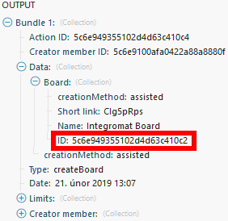

# [!UICONTROL 特雷洛] 模块

在 [!DNL Adobe Workfront Fusion] 方案中，您可以自动执行使用 [!UICONTROL 特雷洛]，并将其连接到多个第三方应用程序和服务。

如果您需要有关创建方案的说明，请参阅 [在中创建方案 [!DNL Adobe Workfront Fusion]](../../workfront-fusion/scenarios/create-a-scenario.md).

有关模块的信息，请参阅 [中的模块 [!DNL Adobe Workfront Fusion]](../../workfront-fusion/modules/modules.md).

## 访问要求

您必须具有以下访问权限才能使用本文中的功能：

<table style="table-layout:auto"> 
 <col> 
 <col> 
 <tbody> 
  <tr> 
   <td role="rowheader">[!DNL Adobe Workfront] 计划*</td>
  <td> 
[!UICONTROL Pro]或更高版本
 </td>
  </tr> 
  <tr data-mc-conditions=""> 
   <td role="rowheader">[!DNL Adobe Workfront] 许可证*</td>
   <td> 
[!UICONTROL Plan]、[!UICONTROL Work]
 </td> 
  </tr> 
  <tr> 
   <td role="rowheader">[!DNL Adobe Workfront Fusion] 许可证**</td> 
   <td> 
[!UICONTROL [!DNL Workfront Fusion] （用于工作自动化和集成） 
 </td> 
  </tr> 
  <tr> 
   <td role="rowheader">产品</td> 
   <td>贵组织必须购买 [!DNL Adobe Workfront Fusion] 以及 [!DNL Adobe Workfront] 以使用本文中描述的功能。</td> 
  </tr> 
 </tbody> 
</table>

要了解您拥有的计划、许可类型或访问权限，请联系您的 [!DNL Workfront] 管理员。

有关 [!DNL Adobe Workfront Fusion] 许可证，请参阅 [[!DNL Adobe Workfront Fusion] 许可证](../../workfront-fusion/get-started/license-automation-vs-integration.md).

## 先决条件

使用 [!DNL Trello] 模块，您必须 [!UICONTROL 特雷洛] 帐户。

## 连接 [!UICONTROL 特雷洛] to [!DNL Workfront Fusion]

有关连接 [!UICONTROL 特雷洛] 帐户 [!DNL Workfront Fusion]，请参阅 [创建连接 [!DNL Adobe Workfront Fusion]  — 基本说明](../../workfront-fusion/connections/connect-to-fusion-general.md)

## [!UICONTROL 特雷洛] 模块及其字段

配置 [!UICONTROL 特雷洛] 模块， [!DNL Workfront Fusion] 显示下面列出的字段。 除了这些， [!UICONTROL 特雷洛] 字段可能会显示，具体取决于诸如应用程序或服务中的访问级别等因素。 模块中的粗体标题表示必填字段。

如果您看到字段或函数上方的映射按钮，则可以使用它为该字段设置变量和函数。 有关更多信息，请参阅 [在 [!DNL Adobe Workfront Fusion]](../../workfront-fusion/mapping/map-information-between-modules.md).

* [展示板](#boards)
* [列表](#lists)
* [卡片](#cards)
* [成员](#members)
* [检查列表](#checklists)
* [标签](#labels)
* [注释](#comments)

### 展示板

+++ **[!UICONTROL 手表板]**

此触发器模块会在添加新展示板时开始一个方案。

<table style="table-layout:auto"> 
 <col> 
 <col> 
 <tbody> 
  <tr> 
   <td role="rowheader">[!UICONTROL连接] </td> 
   <td> 
有关将[!UICONTROL Trello]帐户连接到 [!DNL Workfront Fusion]，请参阅 <a href="../../workfront-fusion/connections/connect-to-fusion-general.md" class="MCXref xref" data-mc-variable-override="">创建连接 [!DNL Adobe Workfront Fusion]  — 基本说明</a>
 </td> 
  </tr> 
  <tr> 
   <td role="rowheader">[!UICONTROL限制] </td> 
   <td> 
展示板的最大数量 [!DNL Workfront Fusion] 将在一个执行周期中返回。
 </td> 
  </tr> 
 </tbody> 
</table>

+++

+++ **[!UICONTROL 创建展示板]**

此操作模块会使用选定的设置创建一个新展示板。

<table style="table-layout:auto"> 
 <col> 
 <col> 
 <tbody> 
  <tr> 
   <td role="rowheader">[!UICONTROL连接] </td> 
   <td> 
有关将[!UICONTROL Trello]帐户连接到 [!DNL Workfront Fusion]，请参阅 <a href="../../workfront-fusion/connections/connect-to-fusion-general.md" class="MCXref xref" data-mc-variable-override="">创建连接 [!DNL Adobe Workfront Fusion]  — 基本说明</a>
 </td> 
  </tr> 
  <tr> 
   <td role="rowheader">[!UICONTROL名称] </td> 
   <td> 
输入或映射新展示板的名称。
 </td> 
  </tr> 
  <tr> 
   <td role="rowheader">[!UICONTROL描述]</td> 
   <td> 
根据需要输入或映射展示板说明。
 </td> 
  </tr> 
  <tr> 
   <td role="rowheader"> 
[!UICONTROL组织ID]
 </td> 
   <td> 
输入或映射组织的ID。 组织ID可以使用其他模块（如“监视活动”模块）进行检索。
 
  
 </td> 
  </tr> 
  <tr> 
   <td role="rowheader"> 
[!UICONTROL权限级别]
 </td> 
   <td> 
董事会对每个权限级别有不同的投票和评论规则。 例如：如果您的展示板是[!UICONTROL Private]，并且您将投票和注释规则设置为[!UICONTROL All]，则会收到错误。 
 
每个权限级别的投票和评论仅限于以下组：
 
    <ul> 
     <li><strong>[!UICONTROL Private]</strong>:—&gt;成员、成员和观察员</li> 
     <li><strong>[!UICONTROL For organization]</strong>:—&gt;成员、成员和观察员、组织成员</li> 
     <li><strong>[!UICONTROL Public]</strong>:—&gt;成员、成员和观察员、组织成员、所有</li> 
    </ul> </td> 
  </tr> 
  <tr> 
   <td role="rowheader"> 
[!UICONTROL投票]
 </td> 
   <td> 
选择一个选项，以指定谁可在此董事会投票。 有关权限级别的投票限制，请参阅[!UICONTROL权限级别]字段。
 </td> 
  </tr> 
  <tr> 
   <td role="rowheader"> 
[!UICONTROL注释]
 </td> 
   <td> 
选择一个选项，以指定谁可以在此展示板的卡片上发表评论。 有关权限级别的注释限制，请参阅[!UICONTROL权限级别]字段。
 </td> 
  </tr> 
  <tr> 
   <td role="rowheader"> 
[!UICONTROL邀请]
 </td> 
   <td> 
选择可以邀请其他人员加入此展示板的人员。
 </td> 
  </tr> 
  <tr> 
   <td role="rowheader"> 
[!UICONTROL自连接]
 </td> 
   <td> 
选择团队成员是可以自己加入董事会还是必须被邀请。
 </td> 
  </tr> 
  <tr> 
   <td role="rowheader"> 
[!UICONTROL默认标签]
 </td> 
   <td> 
选择是否对新展示板使用默认标签集。
 </td> 
  </tr> 
  <tr> 
   <td role="rowheader"> 
[!UICONTROL默认列表]
 </td> 
   <td> 
选择是否将默认的列表集添加到展示板([!UICONTROL To Do]、[!UICONTROL Doing]、[!UICONTROL Done])。
 </td> 
  </tr> 
  <tr> 
   <td role="rowheader"> 
[!UICONTROL主板源ID]
 </td> 
   <td> 
选择或映射要复制到新展示板的展示板ID。
 </td> 
  </tr> 
  <tr> 
   <td role="rowheader"> 
[!UICONTROL卡封盖]
 </td> 
   <td> 
选择 <strong>[!UICONTROL Yes]</strong> 如果要为展示板启用信息卡封盖，请执行以下操作：
 </td> 
  </tr> 
  <tr> 
   <td role="rowheader"> 
[!UICONTROL背景]
 </td> 
   <td> 
选择背景或自定义背景的颜色。
 
注意：自定义背景仅对[!UICONTROL Trello Gold和Business Class]订阅者可用。
 </td> 
  </tr> 
  <tr> 
   <td role="rowheader"> 
[!UICONTROL卡老化]
 </td> 
   <td> 
在两种卡老化模式之间进行选择。 
 
    <ul> 
     <li><strong>[!UICONTROL Regular]</strong>:随着年龄的增长，信息卡变得越来越透明。 </li> 
     <li><strong>[!UICONTROL Pirate]</strong>:纸牌会撕裂，黄色，像老海盗地图一样破裂。</li> 
    </ul> </td> 
  </tr> 
 </tbody> 
</table>

+++

+++ **[!UICONTROL 编辑展示板]**

此操作模块编辑现有展示板的设置。

<table style="table-layout:auto"> 
 <col> 
 <col> 
 <tbody> 
  <tr> 
   <td role="rowheader">[!UICONTROL连接] </td> 
   <td> 
有关将[!UICONTROL Trello]帐户连接到 [!DNL Workfront Fusion]，请参阅 <a href="../../workfront-fusion/connections/connect-to-fusion-general.md" class="MCXref xref" data-mc-variable-override="">创建连接 [!DNL Adobe Workfront Fusion]  — 基本说明</a>
 </td> 
  </tr> 
  <tr> 
   <td role="rowheader"> 
[!UICONTROL主板ID]
 </td> 
   <td> 
输入或映射您希望模块创建的展示板的唯一[!UICONTROL Trello] ID。 您可以使用其他模块（如Watch Boards模块）检索展示板ID
 
  
 </td> 
  </tr> 
  <tr> 
   <td role="rowheader">[!UICONTROL新名称]</td> 
   <td> 
 输入或映射展示板的新名称。
 </td> 
  </tr> 
  <tr> 
   <td role="rowheader">[!UICONTROL新描述]</td> 
   <td> 
 根据需要输入或映射新展示板说明。
 </td> 
  </tr> 
  <tr> 
   <td role="rowheader"> 
[!UICONTROL组织ID]
 </td> 
   <td> 
输入或映射您希望模块编辑的展示板的唯一[!UICONTROL Trello] ID。 您可以使用其他模块检索展示板ID，例如 [!DNL Watch Activities] 模块。
 
  
 </td> 
  </tr> 
  <tr> 
   <td role="rowheader">[!UICONTROL订阅] </td> 
   <td> 
选择一个选项，以指定代理用户是否订阅了展示板。
 </td> 
  </tr> 
  <tr> 
   <td role="rowheader"> 
[!UICONTROL权限级别]
 </td> 
   <td> 
董事会对每个权限级别有不同的投票和评论规则。 例如：如果您的展示板是[!UICONTROL Private]，并且您将投票和注释规则设置为[!UICONTROL All]，则会收到错误。 
 
每个权限级别的投票和评论仅限于以下组：
 
    <ul> 
     <li><strong>[!UICONTROL Private]</strong>:—&gt;成员、成员和观察员</li> 
     <li><strong>[!UICONTROL For organization]</strong>:—&gt;成员、成员和观察员、组织成员</li> 
     <li><strong>[!UICONTROL Public]</strong>:—&gt;成员、成员和观察员、组织成员、所有</li> 
    </ul> </td> 
  </tr> 
  <tr> 
   <td role="rowheader"> 
[!UICONTROL投票]
 </td> 
   <td> 
选择一个选项，以指定谁可在此董事会投票。 有关权限级别的投票限制，请参阅[!UICONTROL权限级别]字段。
 </td> 
  </tr> 
  <tr> 
   <td role="rowheader"> 
[!UICONTROL注释]
 </td> 
   <td> 
选择一个选项，以指定谁可以在此展示板的卡片上发表评论。 有关权限级别的注释限制，请参阅[!UICONTROL权限级别]字段。
 </td> 
  </tr> 
  <tr> 
   <td role="rowheader">[!UICONTROL邀请] </td> 
   <td> 
选择可以邀请人员加入此展示板的人员。
 </td> 
  </tr> 
  <tr> 
   <td role="rowheader">[!UICONTROL自连接]</td> 
   <td> 
 选择团队成员是可以自己加入董事会还是必须被邀请。
 </td> 
  </tr> 
  <tr> 
   <td role="rowheader">[!UICONTROL卡盖]</td> 
   <td> 
 选择是否应在此展示板上显示卡盖。
 </td> 
  </tr> 
  <tr> 
   <td role="rowheader">[!UICONTROL背景] </td> 
   <td> 
选择背景或自定义背景的颜色。
 
注意：自定义背景仅对[!UICONTROL Trello Gold和Business Class]订阅者可用。
 </td> 
  </tr> 
  <tr> 
   <td role="rowheader">[!UICONTROL背景ID]</td> 
   <td> 
 如果您在[!UICONTROL背景]字段中选择使用自定义背景，请输入或映射要使用的背景的ID。
 </td> 
  </tr> 
  <tr> 
   <td role="rowheader"> 
[!UICONTROL卡老化]
 </td> 
   <td> 
在两种卡老化模式之间进行选择。 
 
    <ul> 
     <li><strong>[!UICONTROL Regular]</strong>:随着年龄的增长，信息卡变得越来越透明。 </li> 
     <li><strong>[!UICONTROL Pirate]</strong>:纸牌会撕裂，黄色，像老海盗地图一样破裂。</li> 
    </ul> </td> 
  </tr> 
  <tr> 
   <td role="rowheader">[！启用UICONTROL日历馈送]</td> 
   <td> 
 选择是否启用日历馈送。
 </td> 
  </tr> 
  <tr> 
   <td role="rowheader">[!UICONTROL &lt;color&gt; 标签名称]</td> 
   <td> 
 为所需的颜色标签指定名称。
 </td> 
  </tr> 
  <tr> 
   <td role="rowheader">[!UICONTROL存档] </td> 
   <td> 
选择一个选项以指示您是否要存档（关闭）展示板。 
 </td> 
  </tr> 
 </tbody> 
</table>

+++

+++ **[!UICONTROL 获取展示板]**

此操作模块可检索展示板的详细信息。

<table style="table-layout:auto"> 
 <col> 
 <col> 
 <tbody> 
  <tr> 
   <td role="rowheader">[!UICONTROL连接] </td> 
   <td> 
有关将[!UICONTROL Trello]帐户连接到 [!DNL Workfront Fusion]，请参阅 <a href="../../workfront-fusion/connections/connect-to-fusion-general.md" class="MCXref xref" data-mc-variable-override="">创建连接 [!DNL Adobe Workfront Fusion]  — 基本说明</a>
 </td> 
  </tr> 
  <tr> 
   <td role="rowheader"> 
[!UICONTROL主板ID]
 </td> 
   <td> 
输入或映射要检索相关信息的展示板的ID。
 </td> 
  </tr> 
 </tbody> 
</table>

+++

+++ **[!DNL Search for Boards]**

此搜索模块可检索有关您指定的展示板的信息。

<table style="table-layout:auto"> 
 <col> 
 <col> 
 <tbody> 
  <tr> 
   <td role="rowheader">[!UICONTROL连接] </td> 
   <td> 
有关将[!UICONTROL Trello]帐户连接到 [!DNL Workfront Fusion]，请参阅 <a href="../../workfront-fusion/connections/connect-to-fusion-general.md" class="MCXref xref" data-mc-variable-override="">创建连接 [!DNL Adobe Workfront Fusion]  — 基本说明</a>
 </td> 
  </tr> 
  <tr> 
   <td role="rowheader">[!UICONTROL查询] </td> 
   <td> 
输入或映射您要获取相关信息的展示板的名称（或部分名称）。
 </td> 
  </tr> 
  <tr> 
   <td role="rowheader">[!UICONTROL返回展示板的最大数量]</td> 
   <td> 
 输入展示板的最大数量 [!DNL Workfront Fusion] 将在一个执行周期中返回。 此值必须小于或等于1000。
  </td> 
  </tr> 
  <tr> 
   <td role="rowheader"> 
[!UICONTROL Partial] 
 </td> 
   <td> 
默认情况下，此模块会搜索成员内容，以查找查询中每个词的精确匹配项。 启用[!UICONTROL Partial]后，模块将查找以查询中任意单词开头的内容。
 
 例如，如果您使用“开发”一词来查找标题为“我的开发状态报表”的展示板，则默认情况下，您需要搜索整个词。 如果启用了[!UICONTROL Partial]，则将能够搜索“dev”，但不能搜索“development”。
 </td> 
  </tr> 
  <tr> 
   <td role="rowheader">[!UICONTROL展示板] </td> 
   <td> 
输入“mine”，或映射以逗号分隔的展示板ID列表。
 </td> 
  </tr> 
 </tbody> 
</table>

+++

+++ **[!UICONTROL 存档或取消存档展示板]**

此操作模块关闭或重新打开您指定的展示板。

<table style="table-layout:auto"> 
 <col> 
 <col> 
 <tbody> 
  <tr> 
   <td role="rowheader">[!UICONTROL连接] </td> 
   <td> 
有关将[!UICONTROL Trello]帐户连接到 [!DNL Workfront Fusion]，请参阅 <a href="../../workfront-fusion/connections/connect-to-fusion-general.md" class="MCXref xref" data-mc-variable-override="">创建连接 [!DNL Adobe Workfront Fusion]  — 基本说明</a>
 </td> 
  </tr> 
  <tr> 
   <td role="rowheader">[!UICONTROL主板ID]</td> 
   <td> 
 输入或映射要关闭或重新打开的展示板的ID。
 </td> 
  </tr> 
  <tr> 
   <td role="rowheader">[!UICONTROL存档或取消存档]</td> 
   <td> 
 选择要关闭（存档）还是重新打开（取消存档）展示板。
 </td> 
  </tr> 
 </tbody> 
</table>

+++

+++ **[!UICONTROL 将成员分配给展示板]**

此操作模块将成员分配到您指定的展示板。

<table style="table-layout:auto"> 
 <col> 
 <col> 
 <tbody> 
  <tr> 
   <td role="rowheader">[!UICONTROL连接] </td> 
   <td> 
有关将[!UICONTROL Trello]帐户连接到 [!DNL Workfront Fusion]，请参阅 <a href="../../workfront-fusion/connections/connect-to-fusion-general.md" class="MCXref xref" data-mc-variable-override="">创建连接 [!DNL Adobe Workfront Fusion]  — 基本说明</a>
 </td> 
  </tr> 
  <tr> 
   <td role="rowheader">[!UICONTROL主板ID]</td> 
   <td> 
 选择要添加成员的展示板。
 </td> 
  </tr> 
  <tr> 
   <td role="rowheader">[!UICONTROL电子邮件地址]</td> 
   <td> 
 输入或映射要添加到展示板的成员的电子邮件地址。
 </td> 
  </tr> 
  <tr> 
   <td role="rowheader"> 
[!UICONTROL成员类型]
 </td> 
   <td> 
选择要添加到展示板的成员类型。
 
    <ul> 
     <li><strong>[!UICONTROL Admin]</strong>:展示板管理员可以在展示板上执行任何展示板操作。</li> 
     <li><strong>[!UICONTROL Normal]</strong>:普通会员只是董事会成员。</li> 
     <li><strong>[!UICONTROL观察者]</strong>:观察者是具有对展示板的只读访问权限的成员。  观察员仅可供具有[!UICONTROL Trello Business Class]的团队使用。</li> 
    </ul> </td> 
  </tr> 
  <tr> 
   <td role="rowheader">[!UICONTROL全名]</td> 
   <td> 
 输入要添加到展示板的用户的全名。
 </td> 
  </tr> 
 </tbody> 
</table>

+++

+++ **[!UICONTROL 从展示板中取消分配成员]**

此操作模块从展示板中删除成员。

<table style="table-layout:auto"> 
 <col> 
 <col> 
 <tbody> 
  <tr> 
   <td role="rowheader">[!UICONTROL连接] </td> 
   <td> 
有关将[!UICONTROL Trello]帐户连接到 [!DNL Workfront Fusion]，请参阅 <a href="../../workfront-fusion/connections/connect-to-fusion-general.md" class="MCXref xref" data-mc-variable-override="">创建连接 [!DNL Adobe Workfront Fusion]  — 基本说明</a>
 </td> 
  </tr> 
  <tr> 
   <td role="rowheader">[!UICONTROL主板ID]</td> 
   <td> 
 输入（映射或选择）您要将用户从中删除的展示板的ID。
 </td> 
  </tr> 
  <tr> 
   <td role="rowheader">[!UICONTROL成员] </td> 
   <td> 
选择要从展示板中移除的成员。
 </td> 
  </tr> 
 </tbody> 
</table>

+++

### 列表

+++ **[!UICONTROL 手表卡已移至列表]**

将信息卡移动到特定列表时，此触发器模块会激活。

<table style="table-layout:auto"> 
 <col> 
 <col> 
 <tbody> 
  <tr> 
   <td role="rowheader">[!UICONTROL连接] </td> 
   <td> 
有关将[!UICONTROL Trello]帐户连接到 [!DNL Workfront Fusion]，请参阅 <a href="../../workfront-fusion/connections/connect-to-fusion-general.md" class="MCXref xref" data-mc-variable-override="">创建连接 [!DNL Adobe Workfront Fusion]  — 基本说明</a>
 </td> 
  </tr> 
  <tr> 
   <td role="rowheader">[!UICONTROL主板]</td> 
   <td>选择包含您要监视信息卡列表的展示板。</td> 
  </tr> 
  <tr> 
   <td role="rowheader">[!UICONTROL List]</td> 
   <td>选择您要监视卡片的列表。</td> 
  </tr> 
  <tr> 
   <td role="rowheader">[!UICONTROL限制] </td> 
   <td> 
卡的最大数量 [!DNL Workfront Fusion] 将在一个执行周期中返回。
  </td> 
  </tr> 
 </tbody> 
</table>

+++

+++ **[!UICONTROL 创建列表]**

此操作模块会在您指定的展示板上创建一个列表。

<table style="table-layout:auto"> 
 <col> 
 <col> 
 <tbody> 
  <tr> 
   <td role="rowheader">[!UICONTROL连接] </td> 
   <td> 
有关将[!UICONTROL Trello]帐户连接到 [!DNL Workfront Fusion]，请参阅 <a href="../../workfront-fusion/connections/connect-to-fusion-general.md" class="MCXref xref" data-mc-variable-override="">创建连接 [!DNL Adobe Workfront Fusion]  — 基本说明</a>
 </td> 
  </tr> 
  <tr> 
   <td role="rowheader">[!UICONTROL主板ID]</td> 
   <td> 
 输入或映射要在其中创建列表的展示板的ID。
 </td> 
  </tr> 
  <tr> 
   <td role="rowheader">[!UICONTROL名称] </td> 
   <td> 
输入或映射新列表的名称。
 </td> 
  </tr> 
  <tr> 
   <td role="rowheader">[!UICONTROL位置] </td> 
   <td> 
选择是要将列表添加到卡片的顶部还是附加到卡片的底部。
 </td> 
  </tr> 
  <tr> 
   <td role="rowheader">[!UICONTROL复制列表]</td> 
   <td> 
 选择要输入要复制的列表ID的方式。
 
    <ul> 
     <li> 
<strong>手动输入</strong> 
 
在 <strong>[!UICONTROL列表ID]</strong> 字段，输入或映射要复制的列表的ID。 
 </li> 
     <li> 
<strong>选择</strong> 
 
选择包含要复制的列表的展示板，然后选择该列表。
 </li> 
    </ul> </td> 
  </tr> 
 </tbody> 
</table>

+++

+++ **[!UICONTROL 编辑列表]**

此操作模块编辑现有列表。

<table style="table-layout:auto"> 
 <col> 
 <col> 
 <tbody> 
  <tr> 
   <td role="rowheader">[!UICONTROL连接] </td> 
   <td> 
有关将[!UICONTROL Trello]帐户连接到 [!DNL Workfront Fusion]，请参阅 <a href="../../workfront-fusion/connections/connect-to-fusion-general.md" class="MCXref xref" data-mc-variable-override="">创建连接 [!DNL Adobe Workfront Fusion]  — 基本说明</a>
 </td> 
  </tr> 
  <tr> 
   <td role="rowheader">[!UICONTROL列表ID]</td> 
   <td> 
 输入或映射要更新的列表的ID。
 </td> 
  </tr> 
  <tr> 
   <td role="rowheader">[!UICONTROL名称] </td> 
   <td> 
输入或映射列表的新名称。
 </td> 
  </tr> 
  <tr> 
   <td role="rowheader">[!UICONTROL主板ID]</td> 
   <td> 
 映射或选择要移动列表的展示板。
 </td> 
  </tr> 
  <tr> 
   <td role="rowheader">[!UICONTROL位置] </td> 
   <td> 
选择是要将列表添加到卡片的顶部还是附加到卡片的底部。
 </td> 
  </tr> 
  <tr> 
   <td role="rowheader">[!UICONTROL已订阅]</td> 
   <td> 
如果要将活动成员订阅到列表，请启用此选项。
 </td> 
  </tr> 
 </tbody> 
</table>

+++

+++ **[!UICONTROL 获取列表]**

此操作模块可检索有关特定列表的详细信息。

<table style="table-layout:auto"> 
 <col> 
 <col> 
 <tbody> 
  <tr> 
   <td role="rowheader">[!UICONTROL连接] </td> 
   <td> 
有关将[!UICONTROL Trello]帐户连接到 [!DNL Workfront Fusion]，请参阅 <a href="../../workfront-fusion/connections/connect-to-fusion-general.md" class="MCXref xref" data-mc-variable-override="">创建连接 [!DNL Adobe Workfront Fusion]  — 基本说明</a>
 </td> 
  </tr> 
  <tr> 
   <td role="rowheader"> 
[!UICONTROL列表ID]
 </td> 
   <td> 
输入或映射要检索相关信息的列表的ID。
 </td> 
  </tr> 
 </tbody> 
</table>

+++

### 卡片

+++ **[!UICONTROL 手表卡]**

添加新卡时，会激活此触发器模块。

<table style="table-layout:auto"> 
 <col> 
 <col> 
 <tbody> 
  <tr> 
   <td role="rowheader">[!UICONTROL连接] </td> 
   <td> 
有关将[!UICONTROL Trello]帐户连接到 [!DNL Workfront Fusion]，请参阅 <a href="../../workfront-fusion/connections/connect-to-fusion-general.md" class="MCXref xref" data-mc-variable-override="">创建连接 [!DNL Adobe Workfront Fusion]  — 基本说明</a>
 </td> 
  </tr> 
  <tr> 
   <td role="rowheader">[!UICONTROL Watched对象]</td> 
   <td> 
选择您要监视卡片的位置。
 
    <ul> 
     <li><strong>[!UICONTROL所有卡]</strong> </li> 
     <li> 
<strong>特定展示板上的信息卡</strong> 
 
选择您要监视信息卡的展示板
 </li> 
     <li> 
<strong>[！特定列表上的UICONTROL信息卡]</strong> 
 
选择包含您要监视信息卡列表的展示板，然后选择该列表。
 </li> 
    </ul> </td> 
  </tr> 
  <tr> 
   <td role="rowheader">[!UICONTROL限制] </td> 
   <td> 
卡的最大数量 [!DNL Workfront Fusion] 将在一个执行周期中返回。
 </td> 
  </tr> 
 </tbody> 
</table>

+++

+++ **[!UICONTROL 创建信息卡]**

此操作模块会在选定列表中创建信息卡。

<table style="table-layout:auto"> 
 <col> 
 <col> 
 <tbody> 
  <tr> 
   <td role="rowheader">[!UICONTROL连接] </td> 
   <td> 
有关将[!UICONTROL Trello]帐户连接到 [!DNL Workfront Fusion]，请参阅 <a href="../../workfront-fusion/connections/connect-to-fusion-general.md" class="MCXref xref" data-mc-variable-override="">创建连接 [!DNL Adobe Workfront Fusion]  — 基本说明</a>
 </td> 
  </tr> 
  <tr> 
   <td role="rowheader">[!UICONTROL输入列表ID]</td> 
   <td> 
 选择您希望如何输入要添加信息卡的列表ID。
 
    <ul> 
     <li> 
<strong>[!UICONTROL Enter manually]</strong> 
 
在 <strong>[!UICONTROL列表ID]</strong> 字段中，输入或映射要添加卡片的列表ID。 
 </li> 
     <li> 
<strong>[!UICONTROL Select]</strong> 
 
选择包含要复制的列表的展示板，然后选择该列表。
 </li> 
    </ul> </td> 
  </tr> 
  <tr> 
   <td role="rowheader">[!UICONTROL标签] </td> 
   <td> 
对于要添加到卡的每个标签，输入标签的ID。 例如，可以使用[!UICONTROL检索标签]模块来检索ID。
 </td> 
  </tr> 
  <tr> 
   <td role="rowheader">[!UICONTROL成员]</td> 
   <td>对于要添加到卡中的每个成员，输入该成员的ID。 </td> 
  </tr> 
  <tr> 
   <td role="rowheader">[!UICONTROL名称] </td> 
   <td> 
输入新卡的名称。
 </td> 
  </tr> 
  <tr> 
   <td role="rowheader"> 
[!UICONTROL描述]
 </td> 
   <td> 
输入卡的说明。
 </td> 
  </tr> 
  <tr> 
   <td role="rowheader">[!UICONTROL位置] </td> 
   <td> 
选择是要将信息卡添加到顶部，还是将信息卡附加到列表底部。
 </td> 
  </tr> 
  <tr> 
   <td role="rowheader">[!UICONTROL到期日期]</td> 
   <td> 
 输入卡的到期日期。 有关支持的日期和时间格式的列表，请参阅 <a href="../../workfront-fusion/mapping/type-coercion.md" class="MCXref xref">在中键入强制 [!DNL Adobe Workfront Fusion]</a>.
 </td> 
  </tr> 
  <tr> 
   <td role="rowheader">[!UICONTROL到期完成]</td> 
   <td> 
 启用此选项可将卡在到期日期完成。
 </td> 
  </tr> 
  <tr> 
   <td role="rowheader">[!UICONTROL文件URL]</td> 
   <td> 
输入或映射要作为附件添加到卡中的文件的URL。
 </td> 
  </tr> 
  <tr> 
   <td role="rowheader"> 
[!UICONTROL源文件]
 </td> 
   <td> 
输入或映射要作为附件添加到卡中的文件的信息。
 
    <ul> 
     <li>[!UICONTROL文件名]:输入或映射文件名，包括文件扩展名。</li> 
     <li> 
     
从前一个模块中选择一个文件，或映射文件的名称和数据
 
     
注意：每个附件的文件上载限制为10 MB。 但是，[!UICONTROL Business Class]和[!UICONTROL Trello Gold]成员的每个附件的文件上传限制为250 MB。
 
     </li> 
    </ul> </td> 
  </tr> 
  <tr> 
   <td role="rowheader">[!UICONTROL复制卡]</td> 
   <td> 
 选择要输入要复制的卡ID的方式。
 
    <ul> 
     <li> 
<strong>[!UICONTROL Enter manually]</strong> 
 
在 <strong>[!UICONTROL卡ID]</strong> 字段，输入或映射要复制的卡的ID。 
 </li> 
     <li> 
<strong>[!UICONTROL Select]</strong> 
 
选择包含要复制的卡的展示板，选择包含该卡的列表，然后选择该卡。
 </li> 
    </ul> </td> 
  </tr> 
 </tbody> 
</table>

+++

+++ **[!UICONTROL 编辑信息卡]**

此操作模块会编辑现有信息卡。

<table style="table-layout:auto"> 
 <col> 
 <col> 
 <tbody> 
  <tr> 
   <td role="rowheader">[!UICONTROL连接] </td> 
   <td> 
有关将[!UICONTROL Trello]帐户连接到 [!DNL Workfront Fusion]，请参阅 <a href="../../workfront-fusion/connections/connect-to-fusion-general.md" class="MCXref xref" data-mc-variable-override="">创建连接 [!DNL Adobe Workfront Fusion]  — 基本说明</a>
 </td> 
  </tr> 
  <tr> 
   <td role="rowheader">[!UICONTROL输入卡ID]</td> 
   <td> 
 选择要输入要编辑的卡ID的方式。
 
    <ul> 
     <li> 
<strong>[!UICONTROL Enter manually]</strong> 
 
在 <strong>[!UICONTROL卡ID]</strong> 字段，输入或映射要编辑的卡的ID。 
 </li> 
     <li> 
<strong>[!UICONTROL Select]</strong> 
 
选择包含要编辑的卡的展示板，选择包含该卡的列表，然后选择该卡。
 </li> 
    </ul> </td> 
  </tr> 
  <tr> 
   <td role="rowheader">[!UICONTROL新名称]</td> 
   <td> 
输入或映射信息卡的新名称。
 </td> 
  </tr> 
  <tr> 
   <td role="rowheader"> 
[!UICONTROL新描述]
 </td> 
   <td> 
输入或映射卡片的新描述。
 </td> 
  </tr> 
  <tr> 
   <td role="rowheader"> 
[!UICONTROL移动信息卡]
 </td> 
   <td> 
选择展示板或展示板，并列出您希望将信息卡移动到的位置。
 </td> 
  </tr> 
  <tr> 
   <td role="rowheader">[!UICONTROL标签] </td> 
   <td> 
添加要添加到卡中的任何标签的ID。 
 </td> 
  </tr> 
  <tr> 
   <td role="rowheader">[!UICONTROL位置] </td> 
   <td> 
选择是要将信息卡添加到顶部，还是将信息卡附加到列表底部。
 </td> 
  </tr> 
  <tr> 
   <td role="rowheader">[!UICONTROL到期日期]</td> 
   <td> 
 输入卡的到期日期。 有关支持的日期和时间格式的列表，请参阅 <a href="../../workfront-fusion/mapping/type-coercion.md" class="MCXref xref">在中键入强制 [!DNL Adobe Workfront Fusion]</a>.
 </td> 
  </tr> 
  <tr> 
   <td role="rowheader">[!UICONTROL到期完成]</td> 
   <td> 
 如果启用了此选项，则卡在到期日期标记为完成。
 </td> 
  </tr> 
  <tr> 
   <td role="rowheader">[!UICONTROL成员] </td> 
   <td> 
添加或映射要添加到卡中的任何成员的ID。
 </td> 
  </tr> 
  <tr> 
   <td role="rowheader"> 
[!UICONTROL附件封面ID]
 </td> 
   <td> 
输入或映射您希望卡片用作封面的图像附件的ID。
 </td> 
  </tr> 
  <tr> 
   <td role="rowheader">[!UICONTROL订阅] </td> 
   <td> 
选择成员是否应订阅卡。
 </td> 
  </tr> 
  <tr> 
   <td role="rowheader">[!UICONTROL存档] </td> 
   <td> 
选择一个选项以指示您是否要存档（关闭）信息卡。 
 </td> 
  </tr> 
 </tbody> 
</table>

+++

+++ **[!UICONTROL 获取信息卡]**

此操作模块可检索所选卡的详细信息。

<table style="table-layout:auto"> 
 <col> 
 <col> 
 <tbody> 
  <tr> 
   <td role="rowheader">[!UICONTROL连接] </td> 
   <td> 
有关将[!UICONTROL Trello]帐户连接到 [!DNL Workfront Fusion]，请参阅 <a href="../../workfront-fusion/connections/connect-to-fusion-general.md" class="MCXref xref" data-mc-variable-override="">创建连接 [!DNL Adobe Workfront Fusion]  — 基本说明</a>
 </td> 
  </tr> 
  <tr> 
   <td role="rowheader">[!UICONTROL主板ID]</td> 
   <td> 
输入展示板的ID，其中包含要检索相关详细信息的信息卡。 这样，您就可以看到展示板自定义字段的名称。
 </td> 
  </tr> 
  <tr> 
   <td role="rowheader">[!UICONTROL输入卡ID]</td> 
   <td> 
 选择要输入要检索有关详细信息的卡ID的方式。
 
    <ul> 
     <li> 
<strong>[!UICONTROL Enter manually]</strong> 
 
在 <strong>[!UICONTROL卡ID]</strong> 字段中，输入或映射要检索相关详细信息的卡的ID。 
 </li> 
     <li> 
<strong>[!UICONTROL Select]</strong> 
 
选择包含要检索相关详细信息的信息卡的展示板，选择包含该信息卡的列表，然后选择该信息卡。
 </li> 
    </ul> </td> 
  </tr> 
 </tbody> 
</table>

+++

+++ **[!UICONTROL 搜索信息卡]**

此操作模块会返回与搜索查询匹配的卡片。

<table style="table-layout:auto"> 
 <col> 
 <col> 
 <tbody> 
  <tr> 
   <td role="rowheader">[!UICONTROL连接] </td> 
   <td> 
有关将[!UICONTROL Trello]帐户连接到 [!DNL Workfront Fusion]，请参阅 <a href="../../workfront-fusion/connections/connect-to-fusion-general.md" class="MCXref xref" data-mc-variable-override="">创建连接 [!DNL Adobe Workfront Fusion]  — 基本说明</a>
 </td> 
  </tr> 
  <tr> 
   <td role="rowheader">[!UICONTROL主板] </td> 
   <td> 
选择要搜索的展示板。 如果未选择任何展示板，则将搜索所有展示板。
 </td> 
  </tr> 
  <tr> 
   <td role="rowheader"> 
[!UICONTROL查询]
 </td> 
   <td> 
输入搜索查询。 您可以使用以下搜索运算符优化搜索：
 
    <ul> 
     <li><code><strong>-operator</strong></code> 
您可以向任何运算符添加“ — ”以执行反向搜索，例如 <code>[!UICONTROL -has:members]</code> 搜索未分配任何成员的信息卡。
 </li> 
     <li><code><strong>@name</strong></code> 
返回分配给成员的卡。 您还可以使用 <code>member:</code>. 使用 <code>@me</code> 以仅包含您的卡。
 </li> 
     <li><code><strong>#label</strong></code> 
返回标记卡。 您还可以使用 <code>label:</code>. 例如， <code>label:"FIX IT"</code> 将返回标签为“FIX IT”的信息卡。
 </li> 
     <li><code><strong>board:id</strong></code> 
返回特定展示板中的信息卡。 例如， <code>board:Trello</code> 将在具有[!UICONTROL Trello]的展示板上返回展示板名称中的信息卡。
 </li> 
     <li><code><strong>list:name</strong></code> 
返回名为“name”的列表中的信息卡。
 </li> 
     <li><code><strong>has:attachments</strong></code> 
返回带有附件的信息卡。 的 <code>has</code>:运算符也可以与其他属性一起使用，例如 <code>has:description</code>, <code>has:cover</code>, <code>has:members</code>或 <code>has:stickers</code>.
 </li> 
     <li><code><strong>due:day</strong></code> 
在24小时内退回到期的卡。 的 <code>due:</code> 运算符也可用于其他时间范围，例如 <code>due:week</code>, <code>due:month</code>或 <code>due:overdue</code>. 您还可以搜索特定的日期范围。 例如，添加 <code>due:14</code> 要搜索，请包含未来14天内到期的信息卡。
 </li> 
     <li><code><strong>created:day</strong></code> 
返回过去24小时内创建的信息卡。 的<code> created:</code> 运算符也可用于其他时间范围，例如 <code>created:week</code> 或 <code>created:month</code>. 您还可以搜索特定的日期范围。 例如，添加 <code>created:14</code> 搜索包含过去14天内创建的信息卡。
 </li> 
     <li><code><strong>edited:day</strong></code> 
返回过去24小时内编辑的信息卡。 的 <code>edited:</code> 运算符也可用于其他时间范围，例如 <code>edited:week</code> 或 <code>edited:month</code>. 您还可以搜索特定的日期范围。 例如，添加 <code>edited:21</code> 搜索包含过去21天内编辑的信息卡。
 </li> 
     <li><code><strong>description:</strong>, <strong>checklist:</strong>, <strong>comment:</strong>, and <strong>name:</strong></code> 
返回与卡片描述、复选列表、注释或名称的文本匹配的卡片。 例如，注释：“FIX IT”将返回注释中包含“FIX IT”的信息卡。
 </li> 
     <li><code><strong>is:open</strong> and <strong>is:archived</strong></code> 
返回打开或存档的信息卡。 如果两者均未指定，则[!UICONTROL Trello]会返回这两种类型。
 </li> 
     <li><code><strong>is:starred</strong> </code> 
只包括有星号的展示板上的卡片。
 </li> 
    </ul> </td> 
  </tr> 
  <tr> 
   <td role="rowheader">[!UICONTROL返回卡的最大数量]</td> 
   <td> 
 卡的最大数量 [!DNL Workfront Fusion] 将在一个执行周期中返回。 此值必须小于或等于1000。
 </td> 
  </tr> 
  <tr> 
   <td role="rowheader">[!UICONTROL Partial] </td> 
   <td> 
默认情况下，此模块会搜索成员内容，以查找查询中每个词的精确匹配项。 启用[!UICONTROL Partial]后，模块将查找以查询中任意单词开头的内容。
 
 例如，如果您使用“开发”一词来查找标题为“我的开发状态报表”的展示板，则默认情况下，您需要搜索整个词。 如果启用了[!UICONTROL Partial]，则将能够搜索“dev”，但不能搜索“development”。
 </td> 
  </tr> 
  <tr> 
   <td role="rowheader">[!UICONTROL卡] </td> 
   <td> 
添加您想要专门搜索的任何信息卡。
 </td> 
  </tr> 
 </tbody> 
</table>

+++

+++ **[!UICONTROL 存档或取消存档信息卡]**

此操作模块会存档或将信息卡发送回展示板。

<table style="table-layout:auto"> 
 <col> 
 <col> 
 <tbody> 
  <tr> 
   <td role="rowheader">[!UICONTROL连接] </td> 
   <td> 
有关将[!UICONTROL Trello]帐户连接到 [!DNL Workfront Fusion]，请参阅 <a href="../../workfront-fusion/connections/connect-to-fusion-general.md" class="MCXref xref" data-mc-variable-override="">创建连接 [!DNL Adobe Workfront Fusion]  — 基本说明</a>
 </td> 
  </tr> 
  <tr> 
   <td role="rowheader">[!UICONTROL卡ID]</td> 
   <td> 
 输入或映射要存档或发送回展示板的信息卡ID。
 </td> 
  </tr> 
  <tr> 
   <td role="rowheader">[!UICONTROL存档或取消存档]</td> 
   <td> 
 选择要关闭信息卡（存档）还是将其发送回展示板（取消存档）。
 </td> 
  </tr> 
 </tbody> 
</table>

+++

+++ **[!UICONTROL 添加附件]**

此操作模块会将附件添加到所选卡。

<table style="table-layout:auto"> 
 <col> 
 <col> 
 <tbody> 
  <tr> 
   <td role="rowheader">[!UICONTROL连接] </td> 
   <td> 
有关将[!UICONTROL Trello]帐户连接到 [!DNL Workfront Fusion]，请参阅 <a href="../../workfront-fusion/connections/connect-to-fusion-general.md" class="MCXref xref" data-mc-variable-override="">创建连接 [!DNL Adobe Workfront Fusion]  — 基本说明</a>
 </td> 
  </tr> 
  <tr> 
   <td role="rowheader">[!UICONTROL输入卡ID]</td> 
   <td> 
 选择要输入要检索有关详细信息的卡ID的方式。
 
    <ul> 
     <li> 
<strong>手动输入</strong> 
 
在 <strong>[!UICONTROL卡ID]</strong> 字段中，输入或映射要检索相关详细信息的卡的ID。 
 </li> 
     <li> 
<strong>[!UICONTROL Select]</strong> 
 
选择包含要检索相关详细信息的信息卡的展示板，选择包含该信息卡的列表，然后选择该信息卡。
 </li> 
    </ul> </td> 
  </tr> 
  <tr> 
   <td role="rowheader"> 
[!UICONTROL附件类型]
 </td> 
   <td> 
选择是要直接上传文件，还是提供指向文件的URL。
 
    <ul> 
     <li> 
<strong>[!UICONTROL文件]</strong> 
 
从前一个模块中选择源文件，或映射源文件的名称和数据。
 </li> 
     <li> 
<strong>[!UICONTROL URL]</strong> 
 
输入文件的URL，并提供附件的名称。
 </li> 
    </ul> </td> 
  </tr> 
 </tbody> 
</table>

+++

### 成员

+++ **[!UICONTROL 将成员分配给展示板]**

请参阅“[!UICONTROL 将成员分配给展示板]“” [展示板](#boards).

+++

+++ **[!UICONTROL 从展示板中取消分配成员]**

请参阅“[!UICONTROL 从展示板中取消分配成员]“” [展示板](#boards).

+++

+++ **[!UICONTROL 将成员添加到信息卡]**

此操作模块将指定的成员添加到指定的卡。

<table style="table-layout:auto"> 
 <col> 
 <col> 
 <tbody> 
  <tr> 
   <td role="rowheader">[!UICONTROL连接] </td> 
   <td> 
有关将[!UICONTROL Trello]帐户连接到 [!DNL Workfront Fusion]，请参阅 <a href="../../workfront-fusion/connections/connect-to-fusion-general.md" class="MCXref xref" data-mc-variable-override="">创建连接 [!DNL Adobe Workfront Fusion]  — 基本说明</a>
 </td> 
  </tr> 
  <tr> 
   <td role="rowheader"> 
[!UICONTROL输入卡ID和成员ID]
 </td> 
   <td> 
选择输入卡ID和成员ID的方式。
 
    <ul> 
     <li> 
<strong>[!UICONTROL Enter manually]</strong> 
 
输入或映射 <strong>[!UICONTROL卡ID]</strong> 和 <strong>[!UICONTROL成员ID]</strong>.
 </li> 
     <li> 
<strong>[!UICONTROL Select]</strong> 
 
选择包含要向其添加成员的卡的展示板，然后选择包含该卡的列表、卡本身以及要添加到该卡的成员。
 </li> 
    </ul> </td> 
  </tr> 
 </tbody> 
</table>

+++

+++ **[!UICONTROL 搜索成员]**

此操作模块检索有关 [!UICONTROL 特雷洛] 成员。

<table style="table-layout:auto"> 
 <col> 
 <col> 
 <tbody> 
  <tr> 
   <td role="rowheader">[!UICONTROL连接] </td> 
   <td> 
有关将[!UICONTROL Trello]帐户连接到 [!DNL Workfront Fusion]，请参阅 <a href="../../workfront-fusion/connections/connect-to-fusion-general.md" class="MCXref xref" data-mc-variable-override="">创建连接 [!DNL Adobe Workfront Fusion]  — 基本说明</a>
 </td> 
  </tr> 
  <tr> 
   <td role="rowheader">[!UICONTROL查询] </td> 
   <td> 
输入要查找的用户的全名或用户名。
 </td> 
  </tr> 
  <tr> 
   <td role="rowheader">[!UICONTROL Partial] </td> 
   <td> 
默认情况下，此模块会搜索成员内容，以查找查询中每个词的精确匹配项。 启用[!UICONTROL Partial]后，模块将查找以查询中任意单词开头的内容。
 
 例如，如果您使用“开发”一词来查找标题为“我的开发状态报表”的展示板，则默认情况下，您需要搜索整个词。 如果启用了[!UICONTROL Partial]，则将能够搜索“dev”，但不能搜索“development”。
 </td> 
  </tr> 
  <tr> 
   <td role="rowheader">[!UICONTROL返回成员的最大数]</td> 
   <td> 
 成员的最大数量 [!DNL Workfront Fusion] 将在一个执行周期中返回。
 </td> 
  </tr> 
 </tbody> 
</table>

+++

### 检查列表

+++ **[!UICONTROL 创建核对清单]**

此操作模块会在选定的卡上创建检查列表。

<table style="table-layout:auto"> 
 <col> 
 <col> 
 <tbody> 
  <tr> 
   <td role="rowheader">[!UICONTROL连接] </td> 
   <td> 
有关将[!UICONTROL Trello]帐户连接到 [!DNL Workfront Fusion]，请参阅 <a href="../../workfront-fusion/connections/connect-to-fusion-general.md" class="MCXref xref" data-mc-variable-override="">创建连接 [!DNL Adobe Workfront Fusion]  — 基本说明</a>
 </td> 
  </tr> 
  <tr> 
   <td role="rowheader">[!UICONTROL输入卡ID]</td> 
   <td> 
 选择要在其中添加核对清单的卡中输入ID的方式。
 
    <ul> 
     <li> 
<strong>[!UICONTROL Enter manually]</strong> 
 
在 <strong>[!UICONTROL卡ID]</strong> 字段中，输入或映射要添加核对清单的卡的ID。 
 </li> 
     <li> 
<strong>[!UICONTROL Select]</strong> 
 
选择包含要添加核对清单的卡的展示板，选择包含该卡的列表，然后选择该卡。
 </li> 
    </ul> </td> 
  </tr> 
  <tr> 
   <td role="rowheader">[!UICONTROL名称] </td> 
   <td> 
输入或映射核对清单的名称。
 </td> 
  </tr> 
  <tr> 
   <td role="rowheader">[!UICONTROL位置] </td> 
   <td> 
选择是要将核对清单添加到卡片顶部，还是要[!UICONTROL]将核对清单附加到卡片底部。
 </td> 
  </tr> 
  <tr> 
   <td role="rowheader"> 
[!UICONTROL输入核对清单ID]
 </td> 
   <td> 
输入或映射要复制到新清单中的源清单的ID。
 </td> 
  </tr> 
 </tbody> 
</table>

+++

+++ **[!UICONTROL 创建核对清单项目]**

此操作模块将项目添加到特定核对清单。

<table style="table-layout:auto"> 
 <col> 
 <col> 
 <tbody> 
  <tr> 
   <td role="rowheader">[!UICONTROL连接] </td> 
   <td> 
有关将[!UICONTROL Trello]帐户连接到 [!DNL Workfront Fusion]，请参阅 <a href="../../workfront-fusion/connections/connect-to-fusion-general.md" class="MCXref xref" data-mc-variable-override="">创建连接 [!DNL Adobe Workfront Fusion]  — 基本说明</a>
 </td> 
  </tr> 
  <tr> 
   <td role="rowheader">[!UICONTROL输入核对清单ID]</td> 
   <td> 
 选择要输入要在其中添加项目的核对清单ID的方式。
 
    <ul> 
     <li> 
<strong>[!UICONTROL Enter manually]</strong> 
 
在 <strong>[!UICONTROL核对清单ID]</strong> 字段中，输入或映射要添加核对清单的卡的ID。 
 </li> 
     <li> 
<strong>[!UICONTROL Select]</strong> 
 
选择包含要添加核对清单的卡的展示板，选择包含该卡的列表，选择该卡，然后选择核对清单。
 </li> 
    </ul> </td> 
  </tr> 
  <tr> 
   <td role="rowheader"> 
[!UICONTROL项目名称]
 </td> 
   <td> 
输入或映射新项目的名称。
 </td> 
  </tr> 
  <tr> 
   <td role="rowheader"> 
[!UICONTROL位置]
 </td> 
   <td> 
选择是要将项目添加到列表顶部，还是要将[!UICONTROL append]添加到列表底部。
 </td> 
  </tr> 
  <tr> 
   <td role="rowheader"> 
[!UICONTROL已选中]
 </td> 
   <td> 
如果要添加已选中的项目，请启用此选项。
 </td> 
  </tr> 
 </tbody> 
</table>

+++

+++ **[!UICONTROL 编辑核对清单项目]**

此操作模块会编辑现有的核对清单。

<table style="table-layout:auto"> 
 <col> 
 <col> 
 <tbody> 
  <tr> 
   <td role="rowheader">[!UICONTROL连接] </td> 
   <td> 
有关将[!UICONTROL Trello]帐户连接到 [!DNL Workfront Fusion]，请参阅 <a href="../../workfront-fusion/connections/connect-to-fusion-general.md" class="MCXref xref" data-mc-variable-override="">创建连接 [!DNL Adobe Workfront Fusion]  — 基本说明</a>
 </td> 
  </tr> 
  <tr> 
   <td role="rowheader">[!UICONTROL输入卡ID和核对清单项目ID]</td> 
   <td> 
 选择您希望如何输入要在其中编辑项目的卡片ID和核对清单。
 
    <ul> 
     <li> 
<strong>[!UICONTROL Enter manually]</strong> 
 
在 <strong>[!UICONTROL核对清单ID]</strong> 字段中，输入或映射要添加核对清单的卡的ID。
 
在 <strong>[!UICONTROL核对清单项目ID]</strong> 字段，输入或映射核对清单的ID。
 </li> 
     <li> 
<strong>[!UICONTROL Select]</strong> 
 
选择包含要添加核对清单的卡的展示板，选择包含该卡的列表，选择该卡，然后选择核对清单。
 </li> 
    </ul> </td> 
  </tr> 
  <tr> 
   <td role="rowheader">[!UICONTROL核对清单ID]</td> 
   <td>选择或映射要将核对清单项目移动到的核对清单。</td> 
  </tr> 
  <tr> 
   <td role="rowheader"> 
[!UICONTROL项目名称]
 </td> 
   <td> 
输入或映射新项目的名称。
 </td> 
  </tr> 
  <tr> 
   <td role="rowheader"> 
[!UICONTROL位置]
 </td> 
   <td> 
选择是要将项目添加到清单的顶部还是附加到清单的底部。
 </td> 
  </tr> 
  <tr> 
   <td role="rowheader"> 
[!UICONTROL State]
 </td> 
   <td> 
选择核对清单项目是完成还是未完成。
 </td> 
  </tr> 
 </tbody> 
</table>

+++

### 标签

+++ **[!UICONTROL 向信息卡添加标签]**

此操作模块会将标签添加到选定的卡。

<table style="table-layout:auto"> 
 <col> 
 <col> 
 <tbody> 
  <tr> 
   <td role="rowheader">[!UICONTROL连接] </td> 
   <td> 
有关将[!UICONTROL Trello]帐户连接到 [!DNL Workfront Fusion]，请参阅 <a href="../../workfront-fusion/connections/connect-to-fusion-general.md" class="MCXref xref" data-mc-variable-override="">创建连接 [!DNL Adobe Workfront Fusion]  — 基本说明</a>
 </td> 
  </tr> 
  <tr> 
   <td role="rowheader">[!UICONTROL输入卡ID]</td> 
   <td> 
 选择要在其中添加核对清单的卡中输入ID的方式。
 
    <ul> 
     <li> 
<strong>[!UICONTROL Enter manually]</strong> 
 
在 <strong>[!UICONTROL卡ID]</strong> 字段中，输入或映射要添加核对清单的卡的ID。 在<strong>[!UICONTROL标签ID]</strong> 字段，输入或映射要添加的标签的ID。 
 </li> 
     <li> 
<strong>[!UICONTROL Select]</strong> 
 
选择包含要添加核对清单的卡的展示板，选择包含该卡的列表，然后选择该卡。 
 
选择要添加到卡的标签。
 </li> 
    </ul> </td> 
  </tr> 
 </tbody> 
</table>

+++

### 注释

+++ **[!UICONTROL 观看评论]**

在指定位置中存在新注释时检索注释详细信息。

<table style="table-layout:auto"> 
 <col> 
 <col> 
 <tbody> 
  <tr> 
   <td role="rowheader">[!UICONTROL连接] </td> 
   <td> 
有关将[!UICONTROL Trello]帐户连接到 [!DNL Workfront Fusion]，请参阅 <a href="../../workfront-fusion/connections/connect-to-fusion-general.md" class="MCXref xref" data-mc-variable-override="">创建连接 [!DNL Adobe Workfront Fusion]  — 基本说明</a>
 </td> 
  </tr> 
  <tr> 
   <td role="rowheader">[!UICONTROL Watched对象]</td> 
   <td> 
选择您要监视的注释位置。
 
    <ul> 
     <li><strong>[!UICONTROL所有信息卡]无处不在</strong> </li> 
     <li> 
<strong>[!UICONTROL主板]</strong> 
 
选择您要监视以进行评论的展示板
 </li> 
     <li> 
<strong>[!UICONTROL List]</strong> 
 
选择包含要监视以供评论的列表的展示板，然后选择该列表。
 </li> 
     <li><strong>[!UICONTROL卡]</strong> </li> 
     <li>选择包含您要观看的卡片以进行评论的展示板，选择包含卡片的列表，然后选择卡片。</li> 
    </ul> </td> 
  </tr> 
  <tr> 
   <td role="rowheader">[!UICONTROL限制] </td> 
   <td> 
评论的最大数量 [!DNL Workfront Fusion] 将在一个执行周期中返回。
 </td> 
  </tr> 
 </tbody> 
</table>

+++

+++ **[!UICONTROL 在信息卡中创建评论]**

此操作模块会向选定的信息卡添加注释。

<table style="table-layout:auto"> 
 <col> 
 <col> 
 <tbody> 
  <tr> 
   <td role="rowheader">[!UICONTROL连接] </td> 
   <td> 
有关将[!UICONTROL Trello]帐户连接到 [!DNL Workfront Fusion]，请参阅 <a href="../../workfront-fusion/connections/connect-to-fusion-general.md" class="MCXref xref" data-mc-variable-override="">创建连接 [!DNL Adobe Workfront Fusion]  — 基本说明</a>
 </td> 
  </tr> 
  <tr> 
   <td role="rowheader">[!UICONTROL输入卡ID]</td> 
   <td> 
 选择要在其中添加评论的卡片中输入ID的方式。
 
    <ul> 
     <li> 
<strong>[!UICONTROL Enter manually]</strong> 
 
在 <strong>[!UICONTROL卡ID]</strong> 字段中，输入或映射要添加评论的卡的ID。 
 </li> 
     <li> 
<strong>[!UICONTROL Select]</strong> 
 
选择包含要添加评论的卡片的展示板，选择包含卡片的列表，然后选择卡片。
 </li> 
    </ul> </td> 
  </tr> 
  <tr> 
   <td role="rowheader">[!UICONTROL注释] </td> 
   <td> 
输入要添加到所选卡片的评论。
 </td> 
  </tr> 
 </tbody> 
</table>

+++

+++ **[!UICONTROL 在信息卡中列出评论]**

<table style="table-layout:auto"> 
 <col> 
 <col> 
 <tbody> 
  <tr> 
   <td role="rowheader">[!UICONTROL连接] </td> 
   <td> 
有关将[!UICONTROL Trello]帐户连接到 [!DNL Workfront Fusion]，请参阅 <a href="../../workfront-fusion/connections/connect-to-fusion-general.md" class="MCXref xref" data-mc-variable-override="">创建连接 [!DNL Adobe Workfront Fusion]  — 基本说明</a>
 </td> 
  </tr> 
  <tr> 
   <td role="rowheader">[!UICONTROL输入卡ID]</td> 
   <td> 
 选择要在其中添加评论的卡片中输入ID的方式。
 
    <ul> 
     <li> 
<strong>[!UICONTROL Enter manually]</strong> 
 
在 <strong>[!UICONTROL卡ID]</strong> 字段中，输入或映射要添加评论的卡的ID。 
 </li> 
     <li> 
<strong>[!UICONTROL Select]</strong> 
 
选择包含要添加评论的卡片的展示板，选择包含卡片的列表，然后选择卡片。
 </li> 
    </ul> </td> 
  </tr> 
  <tr> 
   <td role="rowheader">[!UICONTROL返回评论的最大数量]</td> 
   <td> 
 输入最大评论数 [!DNL Workfront Fusion] 将在一个执行周期中返回。
 </td> 
  </tr> 
  <tr> 
   <td role="rowheader">[!UICONTROL Since] </td> 
   <td> 
设置创建评论的期间的开始日期。 有关支持的日期和时间格式的列表，请参阅 <a href="../../workfront-fusion/mapping/type-coercion.md" class="MCXref xref">在中键入强制 [!DNL Adobe Workfront Fusion]</a>.
 </td> 
  </tr> 
  <tr> 
   <td role="rowheader">[!UICONTROL Before] </td> 
   <td> 
设置创建评论的期间的结束日期。 有关支持的日期和时间格式的列表，请参阅 <a href="../../workfront-fusion/mapping/type-coercion.md" class="MCXref xref">在中键入强制 [!DNL Adobe Workfront Fusion]</a>.
 </td> 
  </tr> 
 </tbody> 
</table>

+++

## [!UICONTROL 特雷洛] 对象ID

* [如何在 [!DNL Trello]](#how-to-find-the-id-or-the-shortlink-of-a-card-in-trello)
* [如何在 [!DNL Trello]](#how-to-find-ids-of-other-objects-in-trello)

### 如何在 [!DNL Trello]

如果要编辑信息卡或创建新评论，您需要知道信息卡的ID或其短链接。 您可以从的输出 [!UICONTROL 新信息卡] 触发器。 通过打开卡并单击 [!UICONTROL 共享] 按钮。 在 [!UICONTROL 链接到此卡] 框中，在URL的末尾 `https://trello.com/c/`.

### 如何在 [!DNL Trello]

展示板、列表和评论ID只能使用触发器获取。 的 [!DNL trello.com] 网站不显示这些ID。
