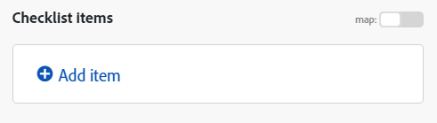

# 在[!DNL Adobe Workfront Fusion]中映射数组

>[!IMPORTANT]
>
>Adobe Workfront Fusion文档已移至新位置。
>
>本文中的信息现在可在以下文章中找到：
>
>* [映射数组或数组元素](https://experienceleague.adobe.com/docs/workfront-fusion/using/create-scenarios/map-data/map-an-array.html)
>
>请更新任何书签。
>
>本文不再更新，不久将会删除。

数组是一种特殊类型的项，可以包含以下内容：

* 一个或多个文本值（简单数组）
* 同一类型（复杂数组）的一个或多个集合

>[!INFO]
>
>**示例：** [!UICONTROL 关注电子邮件]模块为每个电子邮件返回一个附件数组。 每个附件表示一个集合，该集合可能包含名称、内容、大小等。

有关详细信息，请参阅 [!DNL Adobe Workfront Fusion]](../../workfront-fusion/mapping/item-data-types.md)中的[项数据类型。

## 访问要求

您必须具有以下权限才能使用本文中的功能：

<table style="table-layout:auto">
 <col> 
 <col> 
 <tbody> 
  <tr> 
    <td role="rowheader">[!DNL Adobe Workfront] 计划*</td> 
   <td> 
[!DNL Pro] 或更高
 </td> 
  </tr> 
  <tr data-mc-conditions=""> 
   <td role="rowheader">[!DNL Adobe Workfront] 许可证*</td> 
   <td> 
[！UICONTROL计划]，[！UICONTROL工作]
 </td> 
  </tr> 
  <tr> 
   <td role="rowheader">[！UICONTROL Adobe Workfront Fusion]许可证**</td> 
   <td>
   
当前许可证要求：无[!DNL Workfront Fusion]许可证要求。

   
或

   
旧版许可证要求：[！UICONTROL [!DNL Workfront Fusion] for Work Automation and Integration] 

   </td> 
  </tr> 
  <tr> 
   <td role="rowheader">产品</td> 
   <td>
   
当前产品要求：如果您有[！UICONTROL Select]或[！UICONTROL Prime] [!DNL Adobe Workfront]计划，则贵组织必须购买[!DNL Adobe Workfront Fusion]和[!DNL Adobe Workfront]才能使用本文中描述的功能。 [!DNL Workfront Fusion]包含在[！UICONTROL Ultimate] [!DNL Workfront]计划中。

   
或

   
旧版产品要求：您的组织必须购买[!DNL Adobe Workfront Fusion]和[!DNL Adobe Workfront]，才能使用本文中介绍的功能。

   </td> 
  </tr> 
 </tbody> 
</table>

要了解您拥有什么计划、许可证类型或访问权限，请与[!DNL Workfront]管理员联系。

有关[!DNL Adobe Workfront Fusion]许可证的信息，请参阅[[!DNL Adobe Workfront Fusion] 许可证](../../workfront-fusion/get-started/license-automation-vs-integration.md)。

## 映射整个数组

1. 在要将数组映射到的模块中，单击要映射数组的字段。 这是数组映射到的字段。

1. 在显示的框中，映射项目。

   利用面板，可使用与映射任何其他类型项目相同的方式映射字段。 如果您不想单独填写每个项，但希望将另一个数组映射到目标字段，请使用[!UICONTROL 映射]按钮。 在这种情况下，请确保两个阵列（源阵列和目标阵列）具有相同的结构。

   可以将任意数量的项添加到数组。

您可以使用迭代器将数组划分为单独的包。 有关详细信息，请参阅 [!DNL Adobe Workfront Fusion]](/help/quicksilver/workfront-fusion/modules/iterator-module.md)中的[[!UICONTROL 迭代器]模块。

## 将项目映射到新数组

Workfront Fusion中的某些字段允许您将元素映射到数组中。 例如，您可以在Workfront展示板>添加清单项目模块中创建一系列清单项目。 运行模块时，所有清单项目都会添加到信息卡中。

任何显示“添加项”的模块字段都会创建一个数组。

要将元素添加到数组，请执行以下操作：

1. 单击&#x200B;**添加项**
1. 在打开的面板中，输入有关项目的详细信息。
1. 单击&#x200B;**添加**。
1. （可选）对要添加到数组的每个元素重复步骤1-3。

## 映射数组元素

### 按数字映射数组元素

数组元素在数组名称后方括号中显示为一个数字。 您可以使用此索引号将数组的单个元素映射到字段中。

>[!NOTE]
>
>Workfront Fusion中的数组索引从1开始。

要映射数组元素，请执行以下操作：

1. 单击要将元素映射到其中的字段。

   将打开映射面板。

1. 找到包含要映射的元素的数组。
1. 单击阵列旁边的下拉箭头。
1. 单击要映射的元素。

   元素已映射，索引为1。 这将映射数组中的第一个元素。

1. 要映射数组的其他元素，请单击[1]并输入要映射的数组元素的索引号。

   

### 使用给定键映射数组的元素

某些数组包含具有键值项的集合，例如元数据、属性等。 要使用其中一个值，您可以按元素给定的键值查找元素并从值项获取相应的值。 我们建议使用采用`map()`和`get()`函数组合的公式。

>[!BEGINSHADEBOX]

以下示例显示了[!DNL Jira]应用程序的输出。

此示例从ID为10108的特定附件的附件数组中获取文件名。

此示例生成以下输出：

公式解释如下：

* `map`

   1. `map()`函数的第一个参数是整个数组项。
   1. 第二个参数是值项的原始名称。 要获取原始名称，请将鼠标悬停在[!UICONTROL 映射]面板中的项上：

      

      >[!NOTE]
      >
      >所有参数均区分大小写。 即使在此特定示例中，项目的标签与其原始名称不同（仅在大写中不同），仍需要使用原始名称。

   1. 第三个参数是关键项的原始名称：

      

   1. 第四个参数是给定的键值。

  由于`map()`函数返回一个数组（因为给定键值可能有更多元素），因此必须应用`get()`函数以获取其第一个元素：

* `get`

   1. `get()`函数的第一个参数是`map()`函数的结果。

   1. 第二个参数是元素的索引。 在此示例中，索引为`1`。

此示例生成以下输出：

>[!ENDSHADEBOX]

有关`map()`函数的更多信息，请参阅[数组函数](/help/quicksilver/workfront-fusion/functions/array-functions.md)。

有关`get()`函数的更多信息，请参阅[常规函数](/help/quicksilver/workfront-fusion/functions/general-functions.md)。

## 将数组元素转换为一系列包

可以使用[!UICONTROL 迭代器]模块将数组转换为一系列包。 有关详细信息，请参阅[[!UICONTROL 迭代器]模块](/help/quicksilver/workfront-fusion/modules/iterator-module.md)。

