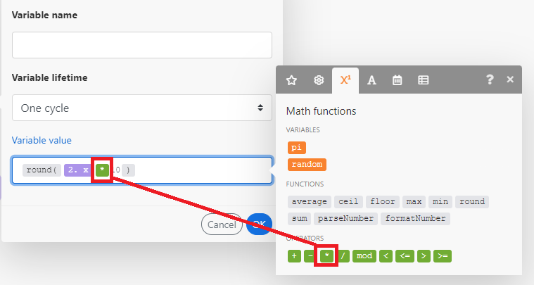
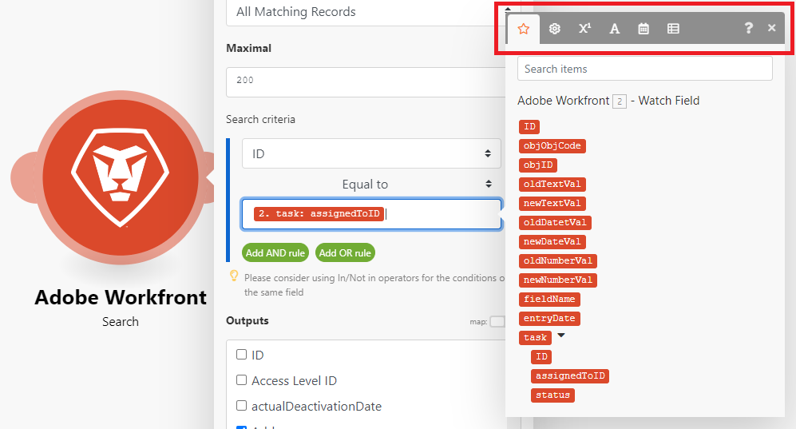
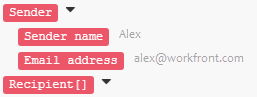

# 在中将信息从一个模块映射到另一个模块 [!DNL Adobe Workfront Fusion]

映射是将模块的输出（按项目结构）分配给其他模块的输入字段的过程。

当您想要在场景中插入从前一个模块输出的值时，单击某个字段时将显示映射面板。 在模块中，在可用于映射的任何字段中，您可以使用映射面板中的函数和映射项的任意组合以及键入的静态文本来创建公式。 这些元素可以相互嵌套。

## 访问要求

您必须具有以下权限才能使用本文中的功能：

<table style="table-layout:auto">
 <col> 
 <col> 
 <tbody> 
  <tr> 
    <td role="rowheader">[!DNL Adobe Workfront] 计划*</td> 
   <td> 
[!DNL Pro] 或更高
 </td> 
  </tr> 
  <tr data-mc-conditions=""> 
   <td role="rowheader">[!DNL Adobe Workfront] 许可证*</td> 
   <td> 
[！UICONTROL计划]，[！UICONTROL工作]
 </td> 
  </tr> 
  <tr> 
   <td role="rowheader">[！UICONTROL Adobe Workfront Fusion]许可证**</td> 
   <td>
   
当前许可证要求：否 [!DNL Workfront Fusion] 许可证要求。

   
或

   
旧版许可证要求： [！UICONTROL [!DNL Workfront Fusion] 用于工作自动化和集成] 

   </td> 
  </tr> 
  <tr> 
   <td role="rowheader">产品</td> 
   <td>
   
当前产品要求：如果您有[！UICONTROL Select]或[！UICONTROL Prime] [!DNL Adobe Workfront] 计划，您的组织必须购买 [!DNL Adobe Workfront Fusion] 以及 [!DNL Adobe Workfront] 以使用本文中描述的功能。 [!DNL Workfront Fusion] 包含在[！UICONTROL Ultimate]中 [!DNL Workfront] 计划。

   
或

   
旧版产品要求：您的组织必须购买 [!DNL Adobe Workfront Fusion] 以及 [!DNL Adobe Workfront] 以使用本文中描述的功能。

   </td> 
  </tr> 
 </tbody> 
</table>

要了解您拥有的计划、许可证类型或访问权限，请联系贵机构的 [!DNL Workfront] 管理员。

有关的信息 [!DNL Adobe Workfront Fusion] 许可证，请参阅 [[!DNL Adobe Workfront Fusion] 许可证](../../workfront-fusion/get-started/license-automation-vs-integration.md).

## 包和项目

模块的操作将生成零、一个或多个捆绑作为其输出。 捆绑包由一个或多个项目组成。

要浏览模块的输出，请执行以下操作：

1. 单击 **[!UICONTROL 运行一次]** 以执行模块。
1. 单击模块上方的气泡。

   此时将显示一个包含模块所有阶段的日志。 您可以在下面找到模块操作阶段输出的捆绑包 **[!UICONTROL 输出]** 标题。 每个捆绑包都包含其项和每个项的值。

>[!INFO]
>
>**示例：** 此示例显示了模块 [!UICONTROL 电子邮件] > [!UICONTROL 观看电子邮件]. 您可以看到它执行了1个操作，生成包含各种项目的单个束，例如 `Date`， `Email ID (UID)`， `size`，等等。
>
>

>[!NOTE]
>
>模块输出封装在 [!UICONTROL 迭代器] 和 [!UICONTROL 汇总] 无法访问 [!UICONTROL 汇总] 模块。

## 映射项目

通过链接两个或多个模块创建一系列模块后，每个模块可以处理其前面的模块输出的项目值。

要将项目分配给模块的输入字段，请执行以下操作：

1. 单击应处理上述一个或多个模块输出的模块。
1. 在显示的模块设置面板中，单击要使用从之前模块输出的项目值的字段。

   将打开映射面板。

1. 单击映射面板中的项以将其插入到字段中。
1. （可选）要在映射面板中搜索特定字段，请单击映射面板搜索栏，然后键入要搜索的搜索词。 当字段显示在列表中时，单击该字段。

   搜索结果包含搜索词且不区分大小写。

有关更多信息，请参阅 [在中配置模块设置 [!DNL Adobe Workfront Fusion]](../../workfront-fusion/modules/configure-a-modules-settings.md).

## 公式

您可以将多个项映射到字段中，将它们与文本（固定值）组合，然后使用运算符和函数来构建复杂的公式：

您可以在映射面板的某个选项卡下找到函数和运算符。

第一个选项卡  （在打开面板时显示）显示可从其他模块映射的项目。

其他选项卡包含以下类型的函数：

* **常规函数**   — 请参阅 [中的常规函数 [!DNL Adobe Workfront Fusion]](../../workfront-fusion/functions/general-functions.md) 以了解更多信息。

* **数学函数**   — 请参阅 [中的数学函数 [!DNL Adobe Workfront Fusion]](../../workfront-fusion/functions/math-functions.md) 以了解更多信息。

* **文本和二进制函数**   — 请参阅 [中的字符串函数 [!DNL Adobe Workfront Fusion]](../../workfront-fusion/functions/string-functions.md) 以了解更多信息。

* **日期和时间**   — 请参阅 [中的日期和时间函数 [!DNL Adobe Workfront Fusion]](../../workfront-fusion/functions/date-and-time-functions.md) 和以下文章以了解更多信息。

   * [日期和时间格式的令牌 [!DNL Adobe Workfront Fusion]](../../workfront-fusion/functions/tokens-for-date-and-time-formatting.md)
   * [Adobe Workfront Fusion中的日期和时间解析令牌](../../workfront-fusion/functions/tokens-for-date-and-time-parsing.md)

* **使用数组的函数**   — 请参阅 [中的数组函数 [!DNL Adobe Workfront Fusion]](../../workfront-fusion/functions/array-functions.md) 以了解更多信息。

>[!TIP]
>
>创建要在其他字段中重复使用的复杂公式时，可以单击包含该组合的字段，使用Command-A或Ctrl-A选择它，然后将其复制并粘贴到其他字段中。

有关使用函数映射项目的详细信息，请参阅 [使用中的函数映射项目 [!DNL Adobe Workfront Fusion]](../../workfront-fusion/functions/map-using-functions.md).

## 收藏集

某些项可以包含多种类型的多个值。 这些是收藏集类型项目。

您可以识别 [!UICONTROL 收藏集] 按项目标签右边显示的黑色小矩形及其自动展开的子项目列表键入item：

>[!NOTE]
>
>在大多数情况下，您需要映射收藏集的子项目，而不是表示整个收藏集的项目。

有关收藏集的详细信息，请参阅 [中的项目数据类型 [!UICONTROL Adobe Workfront Fusion]](../../workfront-fusion/mapping/item-data-types.md)

## 数组

某些项目可以包含相同类型的多个元素。 这些是数组类型的项。

您可以通过项目标签末尾的方括号来标识数组类型项目。 单击项目标签右侧的小黑色矩形可显示元素的项目：

有关数组的详细信息，请参见 [中的项目数据类型 [!DNL Adobe Workfront Fusion]](../../workfront-fusion/mapping/item-data-types.md)

### 映射数组的第一个元素

如果映射数组的 `Recipient name` 项目，它如下所示地显示在字段中：

方括号中的数字是一个索引，可确定使用数组的哪个元素。 默认情况下，设置为1。

### 映射数组的第n个元素

如果要访问其他元素，请单击方括号并编辑索引值：

### 使用给定键映射数组的元素

某些数组包含多个具有键和值项的集合。 这些通常是各种元数据、属性等。

以下示例显示了 [!DNL Jira] 应用程序。

在本例中，我们将从特定附件的附件数组中获取一个文件名，其ID为10108。

输出来自 [!DNL Jira] 如下所示：

典型的要求是根据给定的键值查找元素，并从值项中获取相应的值。 这可以通过以下公式来完成： `map()` 和 `get()` 函数。

以下是公式的详细细分：

1. 的第一个参数 `map()` 函数是整个数组项。
1. 第二个参数是值项的原始名称。 要获取原始名称，请将鼠标悬停在 [!UICONTROL 映射] 面板：

   

   >[!NOTE]
   >
   >所有参数均区分大小写。 即使在此特定示例中，项目的标签与仅在大写形式的原始名称不同，也需要使用原始名称，该原始名称与标签Value相比全部为小写值。

1. 第三个参数是关键项的原始名称：

   

1. 第4个参数是给定的键值。

因为 `map()` 函数返回一个数组（因为给定键值可能会有更多的元素），因此需要应用 `get()` 函数以获取其第一个元素：

* 的第1个参数 `get()` 函数是 `map()` 函数。

* 第二个参数是元素的索引 — 一个。

欲知关于 `map()` 函数，请参见 [中的数组函数 [!DNL Adobe Workfront Fusion]](../../workfront-fusion/functions/array-functions.md).

欲知关于 `get()` 函数，请参见 [中的常规函数 [!DNL Adobe Workfront Fusion]](../../workfront-fusion/functions/general-functions.md).

## 将元素转换为一系列包

可以使用将数组转换为一系列包 [!UICONTROL 迭代器] 模块。 有关更多信息，请参阅 [[!UICONTROL 迭代器] 中的模块 [!UICONTROL Adobe Workfront Fusion]](../../workfront-fusion/modules/iterator-module.md).

## 故障排除

### 映射面板中缺少项目

对于每个模块，映射面板会显示所有输出项，由模块的作者列出。 在某些情况下，由于各种原因，此列表可能不完整，并且可能缺少某些项目。 [!DNL Workfront Fusion] 在场景编辑器中运行模块时，可以自动发现缺少的输出项。 确切的过程会因模块的类型而略有不同：

#### 即时触发

1. 右键单击模块，然后单击 **[!UICONTROL 仅运行此模块]** 在显示的菜单中。

   如果没有已排队的webhook，则模块将等待处理新的webhook。

1. 生成webhook。

   例如，webhook模块 **[!DNL Slack]>[!UICONTROL 侦听新事件]** （监视渠道中的新渠道消息）向渠道发送消息。

1. 当模块完成运行时，单击模块上方的气泡以浏览其完整输出。

   映射面板将包含在模块输出中发现的所有项目。

#### 轮询触发器

1. 右键单击模块，然后单击 **[!UICONTROL 仅运行此模块]** 在显示的菜单中。
1. 如果没有输出，请单击 **[!UICONTROL 选择开始位置]** 并调整设置。
1. 如果没有要处理的事件，请创建一个事件并返回步骤2。

   例如，webhook模块 **[!UICONTROL Gmail] >[!UICONTROL 观看电子邮件]** 会向模块正在监视的文件夹发送电子邮件。

1. 当模块完成运行时，单击模块上方的气泡以浏览其完整输出。

   现在，映射面板包含在模块输出中发现的所有项目。

#### 其他模块

您可以选择执行：

* 整个场景（或仅包含模块的部分）

  如果您的方案以触发器开头，请参阅 [即时触发](#instant-trigger) 或 [轮询触发器](#polling-trigger) 部分。

* 仅单个模块

如果选择只执行单个模块：

1. 右键单击模块，然后单击 **[!UICONTROL 仅运行此模块]** 在显示的菜单中……
1. 提供输入项的示例值，然后单击 **[!UICONTROL 确定]** .
1. 当模块完成运行时，单击模块上方的气泡以浏览其完整输出。

   现在，映射面板包含在模块输出中发现的所有项目。
