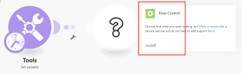
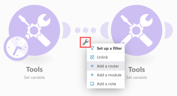

# [!UICONTROL 路由器] 模块 [!DNL Adobe Workfront Fusion]

的 [!UICONTROL 路由器] 模块允许您将流量分支到多条路由中，并以不同方式处理每条路由中的数据。 一次 [!UICONTROL 路由器] 模块接收一个包，它将它转发给每个连接的路由，这些路由按路由附加到的顺序排列 [!UICONTROL 路由器] 模块。

>[!NOTE]
>
>* 要验证路由的顺序，您可以单击 [!UICONTROL 自动对齐] 图标，该图标将按从上到下的顺序排列路由。
>
>  要更改顺序，请删除 [!UICONTROL 路由器] 模块，并按所需顺序重新连接路由。
>
>* 路由是按顺序处理的，而不是并行处理。 在上一条路由完全处理之前，不会将包发送到下一条路由。
>

## 访问要求

您必须具有以下访问权限才能使用本文中的功能：

<table style="table-layout:auto">
 <col> 
 <col> 
 <tbody> 
  <tr> 
    <td role="rowheader">[!DNL Adobe Workfront] 计划*</td> 
   <td> 
[!DNL Pro] 或更高
 </td> 
  </tr> 
  <tr data-mc-conditions=""> 
   <td role="rowheader">[!DNL Adobe Workfront] 许可证*</td> 
   <td> 
[!UICONTROL Plan]、[!UICONTROL Work]
 </td> 
  </tr> 
  <tr> 
   <td role="rowheader">[!UICONTROL Adobe Workfront Fusion]许可证**</td> 
   <td> 
[!UICONTROL [!DNL Workfront Fusion] （用于工作自动化和集成） 
  </td> 
  </tr> 
  <tr> 
   <td role="rowheader">产品</td> 
   <td>贵组织必须购买 [!DNL Adobe Workfront Fusion] 以及 [!DNL Adobe Workfront] 以使用本文中描述的功能。</td> 
  </tr> 
 </tbody> 
</table>

要了解您拥有的计划、许可类型或访问权限，请联系您的 [!DNL Workfront] 管理员。

有关 [!DNL Adobe Workfront Fusion] 许可证，请参阅 [[!DNL Adobe Workfront Fusion] 许可证](../../workfront-fusion/get-started/license-automation-vs-integration.md).

## 添加 [!UICONTROL 路由器] 模块到方案

A [!UICONTROL 路由器] 可以通过以下方式之一添加到方案中：

* 如果要连接 [!UICONTROL 路由器] 模块后，单击模块的右手柄，开始键入 **[!UICONTROL 路由器]** 搜索，然后选择 **[!UICONTROL 流量控制]** > **[!UICONTROL 路由器]** 在显示的模块列表中。

   

* 如果要插入 [!UICONTROL 路由器] 模块之间，单击连接两个模块的路径下方的扳手图标（或右键单击路径），然后选择 **[!UICONTROL 添加路由器]** 中。

   

* 您可以插入 [!UICONTROL 路由器] 模块。 例如，在下图中，要将右下角的模块与左上角的模块（已与右上角的模块连接）连接，请拖动右下角模块的左手柄，并将其放置到左上角的模块。

   

## 过滤器

您可以在 [!UICONTROL 路由器] 模块，以像在任何其他路径上一样过滤包：

1. 单击路由中的一个圆点。

   

1. 在 **[!UICONTROL 设置过滤器]** 框中，添加条件，然后单击 **[!UICONTROL 确定]** 以保存过滤器设置。

   

有关更多信息，请参阅 [在 [!DNL Adobe Workfront Fusion]](../../workfront-fusion/scenarios/add-a-filter-to-a-scenario.md).

## 回退路由

在 [!UICONTROL 路由器] 模块包含特殊选项：后备路由：

启用后，此路由将用于捆绑包无法从 [!UICONTROL 路由器] 模块，因为其他路由上的过滤器过滤掉了。

回退路由在 [!UICONTROL 路由器] 模块：

## If/Else

回退路由的典型用例是，如果满足条件，则继续使用一条路由；如果不满足条件，则继续使用另一条路由，如以下步骤所示：

1. 插入 [!UICONTROL 路由器] 模块。
1. 将两条路由连接到 [!UICONTROL 路由器] 模块。
1. 单击第一条路由并指定一个条件：

   

1. 单击第二条路由并启用 [!UICONTROL 回退路由] 选项：

   
