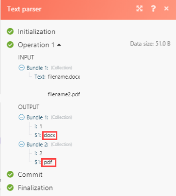

# [!DNL Adobe Workfront Fusion]中的文本分析器故障排除

如果无法获取文本解析器来生成任何输出，请使用此信息。

## 访问要求

您必须具有以下权限才能使用本文中的功能：

<table style="table-layout:auto">
 <col> 
 <col> 
 <tbody> 
  <tr> 
    <td role="rowheader">[!DNL Adobe Workfront] 计划*</td> 
   <td> 
[!DNL Pro] 或更高
 </td> 
  </tr> 
  <tr data-mc-conditions=""> 
   <td role="rowheader">[!DNL Adobe Workfront] 许可证*</td> 
   <td> 
[！UICONTROL计划]，[！UICONTROL工作]
 </td> 
  </tr> 
  <tr> 
   <td role="rowheader">[！UICONTROL Adobe Workfront Fusion]许可证**</td> 
   <td>
   
当前许可证要求：无[!DNL Workfront Fusion]许可证要求。

   
或

   
旧版许可证要求：[！UICONTROL [!DNL Workfront Fusion] for Work Automation and Integration] 

   </td> 
  </tr> 
  <tr> 
   <td role="rowheader">产品</td> 
   <td>
   
当前产品要求：如果您有[！UICONTROL Select]或[！UICONTROL Prime] [!DNL Adobe Workfront]计划，则贵组织必须购买[!DNL Adobe Workfront Fusion]和[!DNL Adobe Workfront]才能使用本文中描述的功能。 [!DNL Workfront Fusion]包含在[！UICONTROL Ultimate] [!DNL Workfront]计划中。

   
或

   
旧版产品要求：您的组织必须购买[!DNL Adobe Workfront Fusion]和[!DNL Adobe Workfront]，才能使用本文中介绍的功能。

   </td> 
  </tr> 
 </tbody> 
</table>

要了解您拥有什么计划、许可证类型或访问权限，请与[!DNL Workfront]管理员联系。

有关[!DNL Adobe Workfront Fusion]许可证的信息，请参阅[[!DNL Adobe Workfront Fusion] 许可证](../../workfront-fusion/get-started/license-automation-vs-integration.md)。

## 故障排除

案例方案示例，您希望解析文件文档“filename.docx”的文件类型，并且文件名的扩展名在DOCX、PDF和CSV中始终不同。

在这种情况下，您可以选择使用的表达式是[!DNL \..+]

如果您要在regex101.com上的正则表达式上使用它，则将获得完全匹配。

在上图中，文件扩展名正确匹配。 如果接受该内容并尝试在文本解析器中实施它：

您不会获得匹配项：

原因在于“i”仅显示每个匹配的匹配数，因此在本例中，我们有2个匹配，因此“i”后面有一个数值1和2。 用例是，如果您需要仅匹配或传递第二个匹配值的过滤器中的数据，则可以指定由数值表示的值。

为了能够获取所需的匹配值，以便在要解析的部分中添加括号（例如，从“filename.docx”中提取 — 仅从“docx”中提取），根据我们用于此案例的正则表达式，应在\上应用括号。(.+)

这会捕获DOCX，将其放入组中，然后保留“。” 别想了。

在下图所示的输出中，捕获组将匹配任何字符（行终止符除外）。

另一个同时包含正则表达式的解决方法是使用替换函数

`{{replace("abcdefghijklmno pqr stuvw xyz.docx"; "/.\./"; ".")}}`

然后将`abcdefghijklmno pqr stuvw xyz.docx`替换为您的实际文件名变量。
