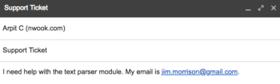

# [!DNL Adobe Workfront Fusion]方案示例：连接电子邮件、[!UICONTROL 文本分析器]和[!DNL Google Sheets]

>[!IMPORTANT]
>
>本文将在不久的将来删除。

此方案可帮助您创建包含所有电子邮件的日志，并在电子表格中为它们添加标记以供进一步操作。 它使用正则表达式(Regex)作为搜索模式，在电子表格中的两个单独表中捕获电子邮件正文。 第一模式搜索短语，而第二模式搜索相同的短语和电子邮件地址。

## 访问要求

您必须具有以下权限才能使用本文中的功能：

<table style="table-layout:auto"> 
 <col> 
 <col> 
 <tbody> 
  <tr> 
    <td role="rowheader">[!DNL Adobe Workfront] 计划*</td> 
   <td> 
[!DNL Pro] 或更高
 </td> 
  </tr> 
  <tr data-mc-conditions=""> 
   <td role="rowheader">[!DNL Adobe Workfront] 许可证*</td> 
   <td> 
[！UICONTROL计划]，[！UICONTROL工作]
 </td> 
  </tr> 
  <tr> 
   <td role="rowheader">[！UICONTROL Adobe Workfront Fusion]许可证**</td> 
   <td>
   
当前许可证要求：无[!DNL Workfront Fusion]许可证要求。

   
或

   
旧版许可证要求：[！UICONTROL [!DNL Workfront Fusion] for Work Automation and Integration] 

   </td> 
  </tr> 
  <tr> 
   <td role="rowheader">产品</td> 
   <td>
   
当前产品要求：如果您有[！UICONTROL Select]或[！UICONTROL Prime] [!DNL Adobe Workfront]计划，则贵组织必须购买[!DNL Adobe Workfront Fusion]和[!DNL Adobe Workfront]才能使用本文中描述的功能。 [!DNL Workfront Fusion]包含在[！UICONTROL Ultimate] [!DNL Workfront]计划中。

   
或

   
旧版产品要求：您的组织必须购买[!DNL Adobe Workfront Fusion]和[!DNL Adobe Workfront]，才能使用本文中介绍的功能。

   </td> 
  </tr> 
 </tbody> 
</table>

要了解您拥有什么计划、许可证类型或访问权限，请与[!DNL Workfront]管理员联系。

有关[!DNL Adobe Workfront Fusion]许可证的信息，请参阅[[!DNL Adobe Workfront Fusion] 许可证](../../workfront-fusion/get-started/license-automation-vs-integration.md)。

## 先决条件

本教程需要具备正则表达式的基本知识。 要了解正则表达式，请访问[https://regexone.com](https://regexone.com/)。

添加并配置第一个模块

1. 搜索电子邮件并选择&#x200B;**[!UICONTROL 查看电子邮件]**&#x200B;作为触发器。

   >[!NOTE]
   >
   >虽然可以使用E邮件模块连接[!DNL Google]帐户，但也可以使用[!DNL Gmail]模块。

1. 连接[!DNL Google]帐户或任何其他基于IMAP的电子邮件客户端（如[!DNL Outlook]）。
1. 连接后，选择要监视其接收电子邮件的文件夹，如[!UICONTROL 收件箱]。
1. 在[!UICONTROL 标准]下，选择&#x200B;**[!UICONTROL 所有电子邮件]**（或将其缩小为读取或未读取电子邮件）。

   您还可以选择将获取的电子邮件标记为已读或未读。

1. 将[!UICONTROL 最大结果数]设置为1。

   

   您可以根据收到的消息数量更改此值。 但是，建议设置低值并更频繁地运行场景。

1. 单击底部的&#x200B;**[!UICONTROL 显示高级设置]**。

   

1. 按[!UICONTROL 发件人地址]、[!UICONTROL 主题]和[!UICONTROL 短语]过滤电子邮件。

   这样，您就只能查看相关电子邮件。 在本例中，我们仅添加了一个“主题”过滤器，并将另外2个留空。

   >[!NOTE]
   >
   >我们将添加路由器以使用[!UICONTROL 匹配模式]迭代器和正则表达式(Regex)作为搜索模式来查找电子邮件中的短语。 这也使我们能够构建一个多用途方案。

1. 完成配置后，系统会提示您指定开始观看电子邮件的位置，请单击&#x200B;**[!DNL From now on]**。

   

1. 继续[搜索[!UICONTROL 流量控制]并添加[!UICONTROL 路由器]](#search-for-flow-control-and-add-a-router)

## 搜索[!UICONTROL 流量控制]并添加[!UICONTROL 路由器]

1. 在任何模块之后添加路由器，将数据拆分或复制，然后发送到下一个模块。

   在本例中，我们使用[!UICONTROL 路由器]将电子邮件正文文本发送到[!DNL Google Sheet]中的2个单独的表。

   

## 使用[!UICONTROL 文本分析器]模块

1. 添加[!UICONTROL 匹配模式]转换器以在电子邮件中搜索短语。

   我们将在所有传入电子邮件中搜索短语“[!UICONTROL 文本解析器模块]”，以捕获正文和与该短语匹配的发件人姓名。

   1. 将模式编写为正则表达式：

      文本\稀疏器\模块

   1. （可选）使用任何其它模式选项。

      

      如果文本包含多行，并且需要搜索每行中的模式，则多行很有用。 在本教程中，我们需要在整个电子邮件正文文本中搜索模式，因此我们将取消选中该模式。

   1. 在[!UICONTROL 文本]字段中，单击列表中的属性&#x200B;**文本内容**。

      

      这是用于存储电子邮件正文文本的属性，我们将在其中搜索模式。

1. 添加另一搜索相同短语和电子邮件地址的[!UICONTROL 匹配模式]。

   如果您的客户帐户具有多个用户，此功能会特别有用。 为了节省时间，您可以克隆刚刚创建的[!UICONTROL 文本解析器]模块，并将其链接到路由器。

   

1. 按如下方式编辑模式：

   文本\稀疏器\模块。+\s([\w.-]+@[\w.-]+)

   

   此模式将搜索短语“[!UICONTROL 文本解析器模块]”和电子邮件地址(如john.doe@gmail.com)，并且仅返回电子邮件地址。

   >[!NOTE]
   >
   >根据您所接受的电子邮件地址的规范编写正则表达式很重要，但上面规范需要处理大多数标准电子邮件地址。

   * 如果您只想搜索电子邮件地址，可以使用下面的正则表达式：

     ([\w.-]+@[\w.-]+)

   * 您还可以使用以下正则表达式仅搜索电话号码：

     ^[+]？\(？(\d{1，3})\)？[\s-]？\(？(\d{3})\)？[\s-]？\d{3}[\s-]？\d{3，4}
上述模式涵盖了写入电话号码的最常见格式。

   要测试您的模式，我们建议使用带有[!DNL javascript]的[[!DNL https://regex101.com]](https://regex101.com/)作为Flavor。

   配置的其他部分与之前的相同。

## 添加[!DNL Google Sheets]模块

对于[!DNL Sheets]，我们需要首先创建一个具有所需标题的电子表格。

1. 创建一个电子表格，其中包含您要在其下捕获用户数据的列。 （您也可以使用现有文件。）

   例如，创建一个名为“Email Data： Support Ticket”的文件，并将发件人姓名、发件人电子邮件和电子邮件内容作为列。 将工作表命名为“包含：文本解析器模块”。

1. 添加[!UICONTROL Google工作表]模块，并将&#x200B;**[!UICONTROL 添加行]**&#x200B;作为操作。

   

1. 连接您的[!DNL Google]帐户（如果尚未连接）。 选择之前创建的文件，然后选择要在其中捕获数据的工作表。

   您的设置应如下所示：

   

1. 映射相关字段（列）中的属性以完成模块设置。

   

1. 克隆您刚刚创建的模块，并将其链接到第二个[!UICONTROL 文本分析器]模块。

   1. 转到电子表格，复制您之前创建的工作表并为其命名。

      例如，将其命名为“contains： text parser module and email”。

   1. 添加另一列以存储电子邮件正文包含的电子邮件地址。

      例如，将其命名为“Email Address Shared”。

   1. 单击克隆的[!DNL Google Sheets]模块以配置安装程序。
   1. 将工作表更改为您刚刚创建的新工作表。
   1. 将[!UICONTROL 匹配模式]模块($1)的输出映射到要存储电子邮件地址（共享的电子邮件地址）的列。

      

      

   1. 单击&#x200B;**[!UICONTROL 确定]**，保存方案，然后将其用于测试运行。

      您将需要向连接的电子邮件地址发送两封单独的电子邮件，如下所示：

      * 包含短语“[!UICONTROL 文本解析器模块]”（无电子邮件地址）

        

      * 包含上述短语和电子邮件地址

        

        如果设置中没有错误，您将看到第一个工作表捕获所有包含短语“[!UICONTROL 文本解析器模块]”的电子邮件，而第二个工作表仅捕获包含短语“[!UICONTROL 文本解析器模块]”和电子邮件地址的电子邮件。 您可以参阅下面的屏幕截图。

        工作表1：

        

        工作表2：

        

## 资源

* [免费练习](https://regexone.com/)以了解正则表达式
* [了解使用Regex匹配的电话号码](https://regexone.com/problem/matching_phone_numbers)
* [了解使用Regex进行电子邮件匹配](https://regexone.com/problem/matching_emails)
* [测试您的正则表达式](https://regex101.com/)
