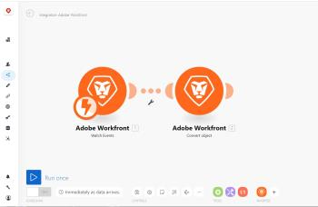

# 中的方案编辑器 [!DNL Adobe Workfront Fusion]

方案编辑器允许您在可视化界面中创建和编辑方案。

## 访问要求

您必须具有以下访问权限才能使用本文中的功能：

<table style="table-layout:auto"> 
 <col> 
 <col> 
 <tbody> 
  <tr> 
    <td role="rowheader">[!DNL Adobe Workfront] 计划*</td> 
   <td> 
[!DNL Pro] 或更高
 </td> 
  </tr> 
  <tr data-mc-conditions=""> 
   <td role="rowheader">[!DNL Adobe Workfront] 许可证*</td> 
   <td> 
[!UICONTROL Plan]、[!UICONTROL Work]
 </td> 
  </tr> 
  <tr> 
   <td role="rowheader">[!UICONTROL Adobe Workfront Fusion]许可证**</td> 
   <td> 
[!UICONTROL [!DNL Workfront Fusion] （用于工作自动化和集成） 

[!UICONTROL [!DNL Workfront Fusion] （工作自动化）
  </td> 
  </tr> 
  <tr> 
   <td role="rowheader">产品</td> 
   <td>贵组织必须购买 [!DNL Adobe Workfront Fusion] 以及 [!DNL Adobe Workfront] 以使用本文中描述的功能。</td> 
  </tr> 
 </tbody> 
</table>

要了解您拥有的计划、许可类型或访问权限，请联系您的 [!DNL Workfront] 管理员。

有关 [!DNL Adobe Workfront Fusion] 许可证，请参阅 [[!DNL Adobe Workfront Fusion] 许可证](../../workfront-fusion/get-started/license-automation-vs-integration.md).

## 打开方案编辑器：

1. 单击 **[!UICONTROL 方案]**  中。

1. 如果要创建方案，请单击 **[!UICONTROL 创建新方案]** 的双曲余切值。

   或

   如果要编辑现有方案，请单击该方案。

1. （视情况而定）如果您要创建新方案，请在 **[!UICONTROL 您希望集成哪些服务]**，选择要在方案中使用的应用程序，然后单击 **[!UICONTROL 继续]**.

   或

   单击 **[!UICONTROL 跳过]** 如果您希望从方案编辑器中选择应用程序，请执行以下操作：

   在显示的方案编辑器中，您可以执行下表中列出的所有操作。 有关更多信息，请参阅 [在中创建方案 [!DNL Adobe Workfront Fusion]](../../workfront-fusion/scenarios/create-a-scenario.md).

1. 完成方案编辑（或在编辑时随时）后，单击 [!UICONTROL 保存] 图标。 

   >[!NOTE]
   >
   >保存方案后，可通过三点式菜单访问新版本，以备将来需要访问。 之前保存的方案版本仅可在60天内使用。

## 可用的方案编辑器操作

<table style="table-layout:auto"> 
<tbody>
  <tr>
     <td role="rowheader">添加第一个模块</td>
     <td> 
单击问号图标。 
 
 然后，找到并单击您要开始使用的应用程序或服务。 如果您在步骤2中选择了任何应用程序，则这些应用程序将显示在此处以便于访问(在 <strong>[!UICONTROL收藏夹]</strong> )。
 </td>
  </tr>
  <tr>
     <td role="rowheader">添加模块</td>
     <td>将鼠标悬停在某个模块上，单击右侧显示的加号图标，然后在显示的菜单中单击所需的模块。</td>
  </tr>  
  <tr>   
     <td role="rowheader">指定执行方案的时间和频率</td>  
      <td> 
单击时钟图标。 
 
  
 
有关更多信息，请参阅 <a href="../../workfront-fusion/scenarios/schedule-a-scenario.md" class="MCXref xref">在中计划方案 [!DNL Adobe Workfront Fusion]</a>.
 </td>
  </tr>  
  <tr>
     <td role="rowheader">设置路由</td>   
     <td> 
单击[!UICONTROL扳手]图标  使用以下任意选项：
    
       <ul>
         <li><strong>[!UICONTROL设置过滤器]</strong>:控制在场景中的特定点使用哪些包。 有关更多信息，请参阅 <a href="../../workfront-fusion/scenarios/add-a-filter-to-a-scenario.md" class="MCXref xref">在 [!DNL Adobe Workfront Fusion]</a>.</li>     
         <li><strong>[!UICONTROL取消链接]</strong>:删除路由。</li>     
         <li><strong>[!UICONTROL添加路由器]</strong>:在模块之间添加路由器。 </li>     
         <li><strong>[!UICONTROL添加模块]</strong>:在模块之间添加新模块。</li>     
         <li><strong>[!UICONTROL添加注释]</strong>:向路由添加注释。</li>   
       </ul> 
     </td>  
  </tr>  
  <tr>  
     <td role="rowheader">删除模块</td>   
     <td>右键单击模块，然后单击 <strong>[!UICONTROL删除模块]</strong>.</td>  
   </tr>  
   <tr> 
     <td role="rowheader">查看所发生事件的日志是一种情况</td>     
     <td> 
       
运行方案。 当方案运行完成时，日志将显示在[!UICONTROL方案编辑器]的右下角。 
 
  
 
根据情景，日志可以包含有关每个阶段的难度以及执行情景期间遇到的任何错误的信息。
 
     </td>  
   </tr>  
   <tr>   
     <td role="rowheader">配置方案设置</td>   
     <td>单击[!UICONTROL方案设置]图标。  这些设置主要面向高级用户。</td>  
   </tr>  
   <tr>   
     <td role="rowheader">键入或查看有关方案的注释</td>   
     <td>单击[!UICONTROL Notes]图标。 </td>  
   </tr>  
   <tr> 
     <td role="rowheader">自动对齐模块的布局 </td>   
     <td>单击[!UICONTROL自动对齐]图标。 </td>  </tr>  <tr>   <td role="rowheader">查看显示数据如何在场景中流动的动画</td>   <td>单击[!UICONTROL解释流程]图标。 </td>  
   </tr>  
   <tr> 
     <td role="rowheader">将方案作为Blueprint导出到计算机</td>   
     <td>单击[!UICONTROL More]菜单 ，然后单击[!UICONTROL Export Blueprint]。</td>  
   </tr>  
   <tr>   
     <td role="rowheader">从计算机导入方案Blueprint</td>   
     <td>单击[!UICONTROL More]菜单 ，然后单击[!UICONTROL Import Blueprint]。</td>  
   </tr>  
   <tr>   
     <td role="rowheader">恢复方案的先前版本</td>   
     <td>请参阅文章 <a href="../../workfront-fusion/scenarios/restore-a-scenario-version.md" class="MCXref xref">在中恢复方案版本 [!DNL Adobe Workfront Fusion]</a>.</td>  
   </tr>  
   <tr> 
     <td role="rowheader">配置[!UICONTROL Flow Control]设置</td>   
     <td> 
单击[!UICONTROL Flow Control]图标。  您可以设置任务以重复指定次数，将数组转换为一系列包，然后将多个包合并到一个包中。 有关更多信息，请参阅 <a href="../../workfront-fusion/apps-and-their-modules/flow-control.md" class="MCXref xref">中的流量控制 [!DNL Adobe Workfront Fusion]</a>.
 </td>  
   </tr>  
   <tr> 
     <td role="rowheader">使用高级工具增强方案</td>   
     <td>单击[!UICONTROL工具]图标。  您可以创建触发器、操作、聚合器和变压器。 有关更多信息，请参阅 <a href="../../workfront-fusion/apps-and-their-modules/tools-modules.md" class="MCXref xref">工具</a>.</td>  
   </tr>  
   <tr> 
     <td role="rowheader">使用文本解析工具</td>   
     <td>单击[!UICONTROL文本解析器]图标。  您可以从HTML代码中检索元素，查找和提取与搜索模式匹配的字符串元素，搜索和替换文本，以及从网站中“抓取”数据。 有关更多信息，请参阅 <a href="../../workfront-fusion/apps-and-their-modules/tools-modules.md" class="MCXref xref">工具</a>.</td>  
   </tr>  
   <tr> 
     <td role="rowheader">访问最常用的应用程序和服务</td>   
     <td> 单击 <strong>[!UICONTROL收藏夹]</strong> 的位置。 当您向方案添加应用程序和服务时，此部分中会自动显示图标。 您还可以单击添加图标  手动将应用程序和服务添加到此区域。</td>  
   </tr>  
   <tr> 
     <td role="rowheader">测试 — 运行方案</td>   
     <td>单击 <strong>[!UICONTROL运行一次]</strong> 以在激活方案之前验证方案是否按预期运行。 激活后，方案将根据其计划执行。 如果一切未按预期运行，您可以访问我们的错误处理部分以了解如何处理错误。</td> 
   </tr> 
</tbody>
</table>
