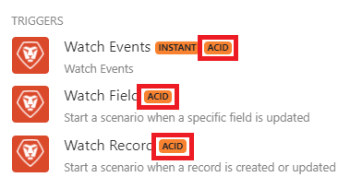

# 场景执行、周期和阶段 [!DNL Adobe Workfront Fusion]

[!DNL Adobe Workfront Fusion] 是一个事务型系统，与关系数据库类似。 每个场景执行从初始化阶段开始，至少包含一个由操作和提交/回滚阶段组成的周期，并在最终确定阶段结束：

>[!INFO]
>
>**示例**
>
>初始化
>
>周期#1
>
>操作（读取或写入）
>
>提交或回滚
>
>周期#2
>
>操作（读取或写入）
>
>提交或回滚
>
>...
>
>周期#N
>
>操作（读取或写入）
>
>提交或回滚
>
>最终完成

## 访问要求

您必须具有以下权限才能使用本文中的功能：

<table style="table-layout:auto"> 
 <col> 
 <col> 
 <tbody> 
  <tr> 
    <td role="rowheader">[!DNL Adobe Workfront] 计划*</td> 
   <td> 
[!DNL Pro] 或更高
 </td> 
  </tr> 
  <tr data-mc-conditions=""> 
   <td role="rowheader">[!DNL Adobe Workfront] 许可证*</td> 
   <td> 
[！UICONTROL计划]，[！UICONTROL工作]
 </td> 
  </tr> 
  <tr> 
   <td role="rowheader">[！UICONTROL Adobe Workfront Fusion]许可证**</td> 
  <td>
   
当前许可证要求：否 [!DNL Workfront Fusion] 许可证要求。

   
或

   
旧版许可证要求： [！UICONTROL [!DNL Workfront Fusion] （对于工作自动化和集成），[！UICONTROL [!DNL Workfront Fusion] 工作自动化]

   </td>  
  </tr> 
  <tr> 
   <td role="rowheader">产品</td> 
   <td>
   
当前产品要求：如果您有[！UICONTROL Select]或[！UICONTROL Prime] [!DNL Adobe Workfront] 计划，您的组织必须购买 [!DNL Adobe Workfront Fusion] 以及 [!DNL Adobe Workfront] 以使用本文中所述的功能。 [!DNL Workfront Fusion] 包含在[！UICONTROL Ultimate]中 [!DNL Workfront] 计划。

   
或

   
旧版产品要求：您的组织必须购买 [!DNL Adobe Workfront Fusion] 以及 [!DNL Adobe Workfront] 以使用本文中所述的功能。

   </td> 
  </tr> 
 </tbody> 
</table>

要了解您拥有什么计划、许可证类型或访问权限，请联系贵机构的 [!DNL Workfront] 管理员。

有关以下项的信息 [!DNL Adobe Workfront Fusion] 许可证，请参见 [[!DNL Adobe Workfront Fusion] 许可证](../../workfront-fusion/get-started/license-automation-vs-integration.md).

## 初始化

在初始化阶段，将创建所有必需的连接（与数据库、电子邮件服务等的连接）。 此外，还检查每个模块是否能够执行其预期操作。

## 周期

每个周期都代表一个不可分割的工作单位，由一系列操作组成。 可以设置中的最大循环数 [!UICONTROL 方案设置] 面板。 默认数字为1。

有关更多信息，请参阅 [中的方案设置面板 [!DNL Adobe Workfront Fusion]](../../workfront-fusion/scenarios/scenario-settings-panel.md).

## 操作

在操作阶段期间，执行读取和/或写入操作：

* 读取操作包括从服务获取数据，然后由其它模块根据预定义场景处理该数据。 例如， [!UICONTROL Dropbox] >[!UICONTROL 关注文件] 模块返回自上次场景执行以来创建的新包（文件）。
* 写入操作包括向给定服务发送数据以供进一步处理。 例如， [!DNL Dropbox] >[!UICONTROL 上传文件] 模块将文件上传到 [!DNL Dropbox] 文件夹。

## 提交

如果所有模块的操作阶段都成功，则提交阶段开始，在此期间将提交模块执行的所有操作。 这意味着 [!DNL Workfront Fusion] 会向操作阶段涉及的所有服务发送有关其成功的信息。

## 回滚

如果在任何模块的操作或提交阶段发生错误，该阶段将中止，并且回滚阶段将启动，从而使给定周期内的所有操作都无效。 某些模块不支持回滚，并且无法恢复这些模块执行的操作。 欲了解更多信息，请参见 [ACID模块](#acid-modules) 部分。

## 最终完成

在最终确定阶段，将关闭打开的连接（例如FTP连接、数据库连接等），并完成场景。

## ACID模块

全部 [!DNL Workfront Fusion] 支持回滚（也称为事务性）的模块使用ACID标记进行标记。

当其他模块发生错误时，未使用此标记标记的模块无法恢复为初始状态。 非ACID模块的典型示例是 [!UICONTROL 电子邮件] >[!UICONTROL 发送电子邮件] 操作。 发送电子邮件后，无法撤消发送。
