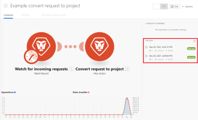

# 在中查看方案的执行历史记录 [!DNL Adobe Workfront Fusion]

您可以显示某个方案的所有运行信息，也可以搜索方案的所有执行以获取特定数据。

场景的执行历史记录显示过去30天的所有场景执行。

## 访问要求

您必须具有以下权限才能使用本文中的功能：

<table style="table-layout:auto">  
 <col> 
 <col> 
 <tbody> 
  <tr> 
    <td role="rowheader">[!DNL Adobe Workfront] 计划*</td> 
   <td> 
[!DNL Pro] 或更高
 </td> 
  </tr> 
  <tr data-mc-conditions=""> 
   <td role="rowheader">[!DNL Adobe Workfront] 许可证*</td> 
   <td> 
[！UICONTROL计划]，[！UICONTROL工作]
 </td> 
  </tr> 
  <tr> 
   <td role="rowheader">[！UICONTROL Adobe Workfront Fusion]许可证**</td> 
  <td>
   
当前许可证要求：否 [!DNL Workfront Fusion] 许可证要求。

   
或

   
旧版许可证要求： [！UICONTROL [!DNL Workfront Fusion] 对于工作自动化和集成]，[！UICONTROL [!DNL Workfront Fusion] 工作自动化]

   </td>  
  </tr> 
  <tr> 
   <td role="rowheader">产品</td> 
   <td>
   
当前产品要求：如果您有[！UICONTROL Select]或[！UICONTROL Prime] [!DNL Adobe Workfront] 计划，您的组织必须购买 [!DNL Adobe Workfront Fusion] 以及 [!DNL Adobe Workfront] 以使用本文中描述的功能。 [!DNL Workfront Fusion] 包含在[！UICONTROL Ultimate]中 [!DNL Workfront] 计划。

   
或

   
旧版产品要求：您的组织必须购买 [!DNL Adobe Workfront Fusion] 以及 [!DNL Adobe Workfront] 以使用本文中描述的功能。

   </td> 
  </tr> 
 </tbody> 
</table>

要了解您拥有的计划、许可证类型或访问权限，请联系贵机构的 [!DNL Workfront] 管理员。

有关的信息 [!DNL Adobe Workfront Fusion] 许可证，请参阅 [[!DNL Adobe Workfront Fusion] 许可证](../../workfront-fusion/get-started/license-automation-vs-integration.md).

## 查看场景的所有执行

### 在上查看方案执行历史记录 [!UICONTROL 方案详细信息] 页面

1. 单击 **[!UICONTROL 方案]** 选项卡，然后单击方案。

   或

   如果您在方案编辑器中处理方案，请单击向左箭头  靠近窗口的左上角。

1. 查看右侧列表中的信息。

   

   您还可以单击以查看此信息的全页视图。 全页视图允许您过滤历史记录以查看特定执行。

   针对方案的每次执行都列出了以下详细信息：

   * 运行日期 **[!UICONTROL 已开始]**
   * **[!UICONTROL 状态]** （成功或失败）
   * 运行 **[!UICONTROL 持续时间]**
   * 数量 **[!UICONTROL 操作]**
   * 大小 **[!UICONTROL 数据传输]**
   * 链接到 **[!UICONTROL 详细信息]**

>[!NOTE]
>
>方案历史记录显示 **正在处理** 标记位于最近执行的方案旁边，而执行详细信息将写入存储。 在场景执行后立即进行处理。 并且持续时间不应超过几分钟。 处理执行时，场景执行的详细信息可能不可见。

### 在上查看方案执行历史记录 [!UICONTROL 历史记录] 选项卡

此 [!UICONTROL 历史记录] 选项卡显示的详细信息比 [!UICONTROL 方案详细信息] 页面。 您还可以对上的执行进行过滤和排序 [!UICONTROL 历史记录] 选项卡。

1. 单击 **[!UICONTROL 方案]** 选项卡，然后单击方案。

   或

   如果您在方案编辑器中处理方案，请单击向左箭头  靠近窗口的左上角。

1. 单击 **[!UICONTROL 历史记录]** 选项卡位于页面的左上角附近
1. （可选）有关所选方案运行的详细信息（包括已处理的捆绑包），请单击 **[!UICONTROL 详细信息]** 链接。

   有关处理捆绑包的详细信息，请参阅 [中的方案执行流程 [!DNL Adobe Workfront Fusion]](../../workfront-fusion/scenarios/scenario-execution-flow.md).

   >[!NOTE]
   >
   >* 此 [!UICONTROL 详细信息] 仅当执行有详细信息时，链接才可见。
   >
   >* 方案历史记录显示 **处理历史记录** 标记位于最近执行的方案旁边，而执行详细信息将写入存储。 在场景执行后立即进行处理。 并且持续时间不应超过几分钟。 处理执行时，场景执行的详细信息可能不可见。

## 筛选场景执行历史记录

您可以过滤执行历史记录以仅查看具有指定值的执行。

1. 打开方案的全页历史记录，如中所述 [在上查看方案执行历史记录 [!UICONTROL 历史记录] 选项卡](#view-scenario-execution-history-on-the-history-tab) 本文章中。
1. 单击 [!UICONTROL 筛选] 图标  在要作为筛选依据的列的标题中。
1. 在 [!UICONTROL 筛选] 对话框，请输入要作为筛选依据的值。
1. 单击&#x200B;**[!UICONTROL 保存]**。

过滤器图标位于包含当前活动过滤器的列中，且为橙色。

## 对方案执行历史记录排序

您可以对方案执行历史记录进行排序。

1. 打开方案的全页历史记录，如中所述 [在上查看方案执行历史记录 [!UICONTROL 历史记录] 选项卡](#view-scenario-execution-history-on-the-history-tab) 本文章中。
1. 单击 [!UICONTROL 排序] 图标来进行筛选。
1. 可选：要反转排序顺序，请单击 [!UICONTROL 排序] 图标。

## 搜索场景的所有执行

1. 单击 **[!UICONTROL 方案]** 图标  在左侧面板中，然后单击方案。

   或

   如果您在方案编辑器中处理方案，请单击向左箭头  靠近窗口的左上角。

1. 单击 **[!UICONTROL 历史记录]** 选项卡位于屏幕左上角附近。
1. 单击 **[!UICONTROL 全文搜索]** 在处决名单中名列前茅。

   或

   类型 **Ctrl+Shift+F** (Windows)或 **Cmd+Shift+F** (Mac) [!UICONTROL 在历史记录中搜索] 窗口打开。

1. （可选）要搜索包含特定文本的执行，请在的搜索栏中输入文本 **[!UICONTROL 在历史记录中搜索]** 窗口。

   要搜索精确文本，请用双引号将文本括起来（“示例”）。

   >[!INFO]
   >
   >**示例：** 如果要查找创建特定项目的执行，请在中输入项目ID [!UICONTROL 全文搜索] 栏。
   >
   >“625ef2ef0006036bd1794b6e52d737c5”

1. （可选）要按日期范围限制搜索，请在 [!UICONTROL 按日期范围] 区域。

   >[!NOTE]
   >
   >* 执行仅可用于之前的30天。
   >
   >* [!DNL Workfront Fusion] 存储webhook负载30天。 创建webhook有效负载超过30天后对其进行访问会导致错误»[!UICONTROL 无法从存储中读取文件。]&quot;

1. （可选）要按状态限制搜索，请在 **[!UICONTROL 按状态]** 下拉菜单。

   可用状态包括：

   * [!UICONTROL 全部]

   * [!UICONTROL 错误]

   * [!UICONTROL 警告]

   * [!UICONTROL 成功]

1. （可选）更改结果在 **[!UICONTROL 按日期排序]** 下拉菜单。

1. （可选）要复制场景执行ID，请单击 **[!UICONTROL 复制执行Id]** 图标  在所需执行的行中

1. （可选）单击结果 [!UICONTROL 全文搜索] 检查包含信息的方案模块输出包。
