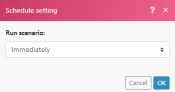

# 中的即时触发器(Webhook) [!DNL Adobe Workfront Fusion]

许多服务都提供Web挂接，以便在服务中发生特定更改时提供即时通知。 要处理这些通知，我们建议您使用即时触发器。 在 [!DNL Adobe Workfront Fusion] 因为它们的标记：

如果服务不提供Web挂接，则需要使用轮询触发器定期轮询服务。

## 访问要求

您必须具有以下访问权限才能使用本文中的功能：

<table style="table-layout:auto"> 
 <col> 
 <col> 
 <tbody> 
  <tr> 
    <td role="rowheader">[!DNL Adobe Workfront] 计划*</td> 
   <td> 
[!DNL Pro] 或更高
 </td> 
  </tr> 
  <tr data-mc-conditions=""> 
   <td role="rowheader">[!DNL Adobe Workfront] 许可证*</td> 
   <td> 
[!UICONTROL Plan]、[!UICONTROL Work]
 </td> 
  </tr> 
  <tr> 
   <td role="rowheader">[!UICONTROL Adobe Workfront Fusion]许可证**</td> 
   <td> 
[!UICONTROL [!DNL Workfront Fusion] （用于工作自动化和集成） 
 
[!UICONTROL [!DNL Workfront Fusion] （工作自动化）
  </td> 
  </tr> 
  <tr> 
   <td role="rowheader">产品</td> 
   <td>贵组织必须购买 [!DNL Adobe Workfront Fusion] 以及 [!DNL Adobe Workfront] 以使用本文中描述的功能。</td> 
  </tr> 
 </tbody> 
</table>

要了解您拥有的计划、许可类型或访问权限，请联系您的 [!DNL Workfront] 管理员。

有关 [!DNL Adobe Workfront Fusion] 许可证，请参阅 [[!DNL Adobe Workfront Fusion] 许可证](../../workfront-fusion/get-started/license-automation-vs-integration.md).

## 查看Webhook的队列

来自传入Webhook的所有消息都存储在Webhook的队列中。

1. 单击 **[!UICONTROL Webhooks]** 菜单中。
1. 查找要查看其队列的Webhook。
1. 单击带有卡车图标的按钮以及接收的网络挂钩数量。

   

   >[!NOTE]
   >
   >传入的Webhook数据始终存储在队列中，无论您如何设置选项 [!UICONTROL 数据] 是机密的(如 [中的“方案设置”面板 [!DNL Adobe Workfront Fusion]](../../workfront-fusion/scenarios/scenario-settings-panel.md))。 在某种情况下处理数据后，该数据会立即从系统中永久删除。

## 计划即时触发器

如果您的方案包含即时触发器，您可以安排方案立即运行：

在这种情况下，您的方案将在 [!DNL Workfront Fusion] 从服务接收新数据。 方案执行后，将计算队列中等待的挂网钩的总数量，并且方案执行的周期与挂网钩的周期数相同，每个周期处理一个挂网钩。 有关更多信息，请参阅 [方案执行、循环和阶段(位于 [!DNL Adobe Workfront Fusion]](../../workfront-fusion/scenarios/scenario-execution-cycles-phases.md).

>[!NOTE]
>
>* 周期与方案运行不同。 在1个方案运行中可能有多个周期。
>* 当您执行计划立即触发的方案时，将会出现以下例外：
   >
   >     * 两次执行之间的间隔不受定价计划中最小间隔的限制。

      >
      >       例如，一旦方案完成其执行，将再次检查Webhook的队列。 如果存在任何挂起的Web挂接，则方案会立即再次执行，并再次处理所有挂起的Web挂接。
   >   
   >     * 最大循环次数方案设置将被忽略并设置为100，这意味着在单个方案执行期间将不会处理超过100个待处理的Webhook（每个周期处理一次事件的速率）。
>

如果您使用 [!UICONTROL 立即]，则方案将按您指定的间隔执行。 由于在间隔期间可以在队列中收集多个Web挂接，因此建议将 [[!UICONTROL 最大循环数]](../../workfront-fusion/scenarios/scenario-settings-panel.md#maximum) 值大于默认值1时，在一种情况下运行处理多个webhook:

1. 单击 [!UICONTROL 方案设置] 图标  的URL。
1. 在 **[!UICONTROL 方案设置]** 框中，在 **[!UICONTROL 最大循环数]** 框，指示每次执行方案时要运行的队列中的webhook数。

## 速率限制

当前速率限制为每秒5个网络挂接。 如果超出限制，则返回429状态代码。

## 非活动Web挂接的过期

已超过120小时未分配给任何方案的Webhook将被删除。

## Webhook负载

[!DNL Workfront Fusion] 存储30天的网页挂钩负载。 在创建Webhook有效负载30天后访问该负载会导致错误“[!UICONTROL 无法从存储中读取文件。]&quot;

## 错误处理

当您的方案中出现即时触发器错误时，该方案将：

* 立即停止 — 当方案设置为运行时 [!UICONTROL 立即].
* 尝试3次失败后停止（3个错误） — 将方案设置为按计划运行。

如果在方案执行期间发生错误，则在即时触发器的回滚阶段期间，Webhook会被重新置于队列中。 在这种情况下，您可以修复方案并再次重新运行它。 有关更多信息，请参阅 [回滚](../../workfront-fusion/scenarios/scenario-execution-cycles-phases.md#rollback) 在文章中 [方案执行、循环和阶段(位于 [!DNL Adobe Workfront Fusion]](../../workfront-fusion/scenarios/scenario-execution-cycles-phases.md).

如果您的方案中存在Webhook响应模块，则将错误发送到Webhook响应。 Webhook响应模块始终最后执行(如果 [!UICONTROL 自动提交] 选项)。 有关更多信息，请参阅 [响应Web挂接](../../workfront-fusion/apps-and-their-modules/webhooks-updated.md#respondi) 在文章中 [Webhooks](../../workfront-fusion/apps-and-their-modules/webhooks-updated.md).

## 自定义Web挂接

您可以创建自己的网络挂接。 有关更多信息，请参阅 [Webhooks](../../workfront-fusion/apps-and-their-modules/webhooks-updated.md).

## Webhook停用

如果出现以下任一情况，将自动停用Web挂接：

* 网页挂接已超过5天未连接到任何方案
* Webhook仅用于不活动情景（已处于非活动状态超过30天）。

如果已停用的Web挂接未连接到任何方案并且处于停用状态超过30天，则会自动删除和取消注册这些挂接。

