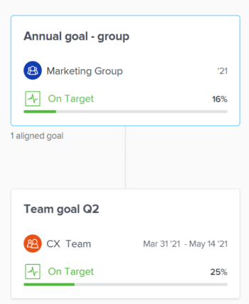

# 通过在Adobe Workfront目标中连接目标来调整目标

如果您是具有个人目标的个人投稿人，则可能需要将其与团队的目标保持一致，以便在组织战略的大背景下有效显示您自己目标的进度。

当贵组织中的每个人都将目标与贵组织的目标一致时，他们可以清楚地看到其个人贡献和团队努力如何帮助在较大的公司级别优先事项上向前推进。 有关对齐目标的最佳实践的更多信息，请参阅Adobe Workfront目标中的[目标对齐概述](../../workfront-goals/goal-alignment/goal-alignment-overview.md)。

在Adobe Workfront目标中连接目标的方法有两种：

* 通过将目标相互连接起来，可以创建目标之间的对齐方式。

* 您可以手动对齐两个目标，也可以将现有目标的结果和活动转换为另一个目标。 转换后的结果或活动成为原始目标的子目标。

>[!IMPORTANT]
>
>一个目标可以有总共1000个进度指标。

本文介绍了如何通过将目标相互连接来调整目标。 有关通过将结果和活动转换为目标来调整目标的信息，请参阅[通过将结果和活动转换为目标来调整目标](../../workfront-goals/goal-alignment/align-goals-by-converting-results-activities.md)。

## 访问要求

您必须具备以下条件：

<table style="table-layout:auto">
<col>
</col>
<col>
</col>
<tbody>
 <tr>
 <td role="rowheader">Adobe Workfront计划</td>
 <td>
 
任何

</td>
 </tr>
 <tr>
 <td role="rowheader">Adobe Workfront许可证*</td>
 <td>
 
新许可证：参与者或更高版本

 或
 
当前许可证：请求或更高版本
 </td>
 </tr>
 <tr>
 <td role="rowheader">产品*</td>
 <td>
 
 新产品要求，为以下项之一： 

<ul>
<li>Select或Prime Adobe Workfront计划和附加Adobe Workfront Goals许可证。</li>
<li>Ultimate Workfront计划，默认情况下包括Workfront目标。 </li></ul>
 
或

 
当前产品要求： Workfront计划和Adobe Workfront Goals的附加许可证。 
 
有关信息，请参阅<a href="../../workfront-goals/goal-management/access-needed-for-wf-goals.md" class="MCXref xref">使用Workfront目标的要求</a>。 
 </td>
 </tr>
 <tr>
 <td role="rowheader">访问级别</td>
 <td> 
编辑对目标的访问权限
 </td>
 </tr>
 <tr>
 <td role="rowheader">对象权限</td>
 <td>

查看目标的权限或更高以查看目标

  
管理目标的权限以编辑它

  
有关共享目标的信息，请参阅<a href="../../workfront-goals/workfront-goals-settings/share-a-goal.md" class="MCXref xref">在Workfront目标中共享目标</a>。 

   </td>
 </tr>
<tr>
   <td role="rowheader">
布局模板
</td>
   <td> 
必须为包括Workfront管理员在内的所有用户分配一个布局模板，该模板应包括主菜单中的目标区域。 
  
</td>
  </tr>
</tbody>
</table>

*有关详细信息，请参阅Workfront文档中的[访问要求](/help/quicksilver/administration-and-setup/add-users/access-levels-and-object-permissions/access-level-requirements-in-documentation.md)。

## 通过将目标相互连接来调整目标

<!--
Aligning goals by connecting them differs depending on what environment you use. 

### Align goals by connecting them in the Production environment

1. Create two goals that you want to align. For information about creating goals, see [Create goals in Adobe Workfront Goals](../../workfront-goals/goal-management/create-goals.md).
1. (Optional) Activate the goals that you want to align. You can align goals that have a Draft, Active, or Inactive status. For information about activating goals, see [Activate goals in Adobe Workfront Goals](../../workfront-goals/goal-management/activate-goals.md).
1. Go to the goal that you want to align (child goal) to another goal (parent goal) and click its name to open the **Goal Details** panel.

   For example, if you want Goal 2 to influence the progress of Goal 1, you must go to Goal 2. 

1. Click **Align to another goal** in the upper-right corner of the right panel.

   

1. Start typing the name of an existing goal or the name of an owner in the **Align to another goal** field, then select it when it appears in the list. Only goals that are from the same or future periods display in the list. 
1. Click **Save**.

   The goal you started with (Goal 2) is now the child goal of the goal you aligned it with (Goal 1).   
   The aligned goals display connected in the Goal Alignment section with Goal 2 as secondary to Goal 1.

   

1. (Optional) To view the goals in the Goal Alignment section, do one of the following:

   * Click the Goal Alignment section in the left panel and find the goals by applying the correct filter. For information about filtering information in Workfront Goals, see [Filter information in Adobe Workfront Goals](../../workfront-goals/goal-management/filter-information-wf-goals.md).
   * Click the Goal List, Check-in, or Pulse sections in the left panel and find one of the goals, then click the **Alignment icon**  next to the goal name to go directly to the goal in the Goal Alignment section.

   For information about the Goal Alignment section, see [Navigate the Goal Alignment section in Adobe Workfront Goals](../../workfront-goals/goal-alignment/navigate-goal-alignment-chart.md). 

1. (Optional) Add activities and results to either goal to indicate their progress. For information about adding activities and results, see the following articles:

   * [Add activities to goals in Adobe Workfront Goals](../../workfront-goals/results-and-activities/add-activities-to-goals.md) 
   * [Add results to goals in Adobe Workfront Goals](../../workfront-goals/results-and-activities/add-results-to-goals.md)

1. (Optional) Remove the alignment between two goals, when you consider that no longer is relevant to your organization's overall strategy For information about removing alignment between goals, see [Remove goal alignment in Adobe Workfront Goals](../../workfront-goals/goal-alignment/remove-goal-alignment.md).

-->
1. 创建两个要对齐的目标。 有关创建目标的信息，请参阅[在Adobe Workfront目标中创建目标](../../workfront-goals/goal-management/create-goals.md)。
1. （可选）激活要对齐的目标。 您可以对齐状态为“草稿”、“活动”或“不活动”的目标。 有关激活目标的信息，请参阅[在Adobe Workfront目标中激活目标](../../workfront-goals/goal-management/activate-goals.md)。
1. 转到要与其他目标（父目标）对齐的目标（子目标），然后单击其名称以打开目标页面。

   >[!INFO]
   >
   >例如，如果您希望目标2影响目标1的进度，则必须转到目标2。

1. 单击左侧面板中的&#x200B;**目标详细信息**。

1. 在&#x200B;**父目标信息**&#x200B;区域中，如果没有父目标，请单击&#x200B;**父目标**&#x200B;字段中的&#x200B;**添加**。

   或

   单击父目标的名称以选择另一个目标。

1. 开始在&#x200B;**父目标**&#x200B;字段中键入现有目标的名称，然后当它出现在列表中时将其选定。 只有来自相同或将来时段的目标才会显示在列表中。

1. 单击&#x200B;**保存更改**。

   您开始使用的目标（目标2）现在是将它与（目标1）对齐的父目标的子目标。\
   对齐的目标显示在“目标对齐方式”部分中，目标2作为目标1的次要。
当子目标的进度更新父目标的进度时，其进度指示器部分将显示子目标。

   

1. （可选）要查看“目标对齐方式”部分中的目标，请转到Workfront的“目标”区域，然后单击左侧面板中的&#x200B;**目标对齐方式**&#x200B;部分。 有关“目标对齐方式”部分的信息，请参阅[导航Adobe Workfront目标中的目标对齐方式部分](../../workfront-goals/goal-alignment/navigate-goal-alignment-chart.md)。

1. （可选）将活动和结果添加到任一目标以指示其进度。 有关添加活动和结果的信息，请参阅以下文章：

   * [将活动添加到Adobe Workfront目标中的目标](../../workfront-goals/results-and-activities/add-activities-to-goals.md)
   * [将结果添加到Adobe Workfront目标中的目标](../../workfront-goals/results-and-activities/add-results-to-goals.md)

1. （可选）如果您认为与组织的整体策略不再相关，请删除两个目标之间的对齐方式。 有关删除目标之间的对齐的信息，请参阅[在Adobe Workfront目标中删除目标对齐方式](../../workfront-goals/goal-alignment/remove-goal-alignment.md)。

