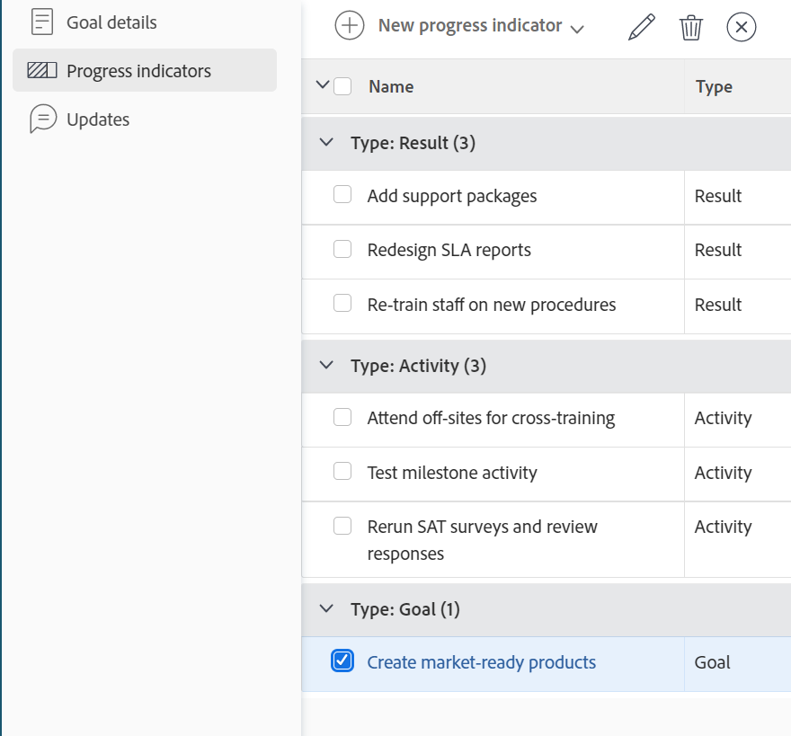

# 在Adobe Workfront目标中移除目标对齐方式

如果两个目标之间的连接不再合理，则可以取消两个目标之间的对齐。

有关对齐目标的信息，请参阅以下文章：

* [通过在Adobe Workfront目标中连接目标来调整目标](../../workfront-goals/goal-alignment/align-goals-by-connecting-them.md)
* [通过将结果和活动转换为目标来调整目标](../../workfront-goals/goal-alignment/align-goals-by-converting-results-activities.md)

## 访问要求

您必须具备以下条件：

<table style="table-layout:auto">
<col>
</col>
<col>
</col>
<tbody>
 <tr>
 <td role="rowheader">Adobe Workfront计划</td>
 <td>
 
任何

</td>
 </tr>
 <tr>
 <td role="rowheader">Adobe Workfront许可证*</td>
 <td>
 
新许可证：参与者或更高版本

 或
 
当前许可证：请求或更高版本
 </td>
 </tr>
 <tr>
 <td role="rowheader">产品*</td>
 <td>
 
 新产品要求，为以下项之一： 

<ul>
<li>Select或Prime Adobe Workfront计划和其他Adobe Workfront Goals许可证。</li>
<li>默认包含Workfront目标的Ultimate Workfront计划。 </li></ul>
 
或

 
当前产品要求： Workfront计划和Adobe Workfront Goals的附加许可证。 
 
有关信息，请参阅<a href="../../workfront-goals/goal-management/access-needed-for-wf-goals.md" class="MCXref xref">使用Workfront目标的要求</a>。 
 </td>
 </tr>
 <tr>
 <td role="rowheader">访问级别</td>
 <td> 
编辑对目标的访问权限
 </td>
 </tr>
 <tr data-mc-conditions="">
 <td role="rowheader">对象权限</td>
 <td>
  
查看目标的权限或更高以查看目标

  
管理目标的权限以编辑它

  
有关共享目标的信息，请参阅<a href="../../workfront-goals/workfront-goals-settings/share-a-goal.md" class="MCXref xref">在Workfront目标中共享目标</a>。 

  </td>
 </tr>
   <td role="rowheader">
布局模板
</td>
   <td> 
必须为包括Workfront管理员在内的所有用户分配一个布局模板，该模板应包括主菜单中的目标区域。 
  
</td>
  </tr>
</tbody>
</table>

*有关详细信息，请参阅Workfront文档中的[访问要求](/help/quicksilver/administration-and-setup/add-users/access-levels-and-object-permissions/access-level-requirements-in-documentation.md)。

## 先决条件

在开始之前，您必须具备以下条件：

* 至少具有一个关联子目标的父目标。 儿童目标是目标的进度指示器。

## 有关删除目标对齐的注意事项

删除两个目标之间的对齐时，请考虑以下事项：

* 父目标必须具有与其关联的其他目标、活动或结果才能保持活动状态。
* 如果对齐的子目标是父目标的唯一进度指示器，则无法从父目标中删除它。
* 当您移除子目标与父目标的对齐方式时，子目标会变为独立目标。

## 删除目标对齐

<!--
Removing goal alignment differs depending on which environment you use.

### Remove goal alignment in the Production environment

1. Go to a child goal aligned to a parent goal. 
1. Click the goal name to open the **Goal Details** panel. 
1. Click the **gear icon**  next to the parent goal, then click **Remove alignment**.

   

   The goal becomes a standalone goal and its progress no longer influences the progress of the original parent goal. 

1. (Optional) Click **Undo** in the lower-left corner of the screen if you want to revert this change and keep the goals aligned. 
1. (Optional) Add activities and results to either goals to indicate their progress. For information about adding activities and results, see the following articles:

   * [Add activities to goals in Adobe Workfront Goals](../../workfront-goals/results-and-activities/add-activities-to-goals.md) 
   * [Add results to goals in Adobe Workfront Goals](../../workfront-goals/results-and-activities/add-results-to-goals.md)
-->

1. 访问Workfront中的&#x200B;**目标**&#x200B;区域，然后单击目标的名称以打开目标的页面。
1. 从父目标的页面，单击左侧面板中的&#x200B;**进度指示器**。

   

1. 在&#x200B;**类型：目标**&#x200B;分组中，选择一个目标，然后单击列表顶部的&#x200B;**断开连接**&#x200B;图标。

   出现“Disconnect（断开连接）”框。

1. 单击&#x200B;**断开连接**&#x200B;将所选目标与其父目标断开连接。

   目标会变为独立目标，不再作为原始目标的进度指示器列出。 断开连接目标的进度不再影响原始目标的进度。

   成功消息将显示在页面的右上角，以确认目标已断开连接。