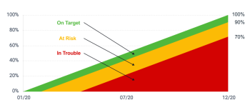

# Adobe Workfront目标中的目标进度和条件概述

您的组织必须具备以下条件才能使用本文中所述的功能：

* 对于新计划和许可证结构：

   * Ultimate计划

     或

     适用于Prime或选择Adobe Workfront计划的Adobe Workfront目标的附加许可证。

* 对于当前计划和许可证结构：

   * Pro或更高版本
   * 除了Adobe Workfront许可证之外，还提供了Workfront目标许可证。

请联系您的Workfront客户经理，了解有关Workfront Goals许可证的信息。

有关访问Workfront目标的更多信息，请参阅[使用Workfront目标的要求](../../workfront-goals/goal-management/access-needed-for-wf-goals.md)。

Adobe Workfront会根据其进度指示器的进度，自动计算目标进度。

## 目标进度和阈值概述

激活目标后，Workfront目标将开始计算其进度和条件，并在您将鼠标悬停在进度字段上时显示以下指标：

| 指示器 | 指示器描述 |
|---|---|
| 实际完成百分比 | 目前为止实际完成了多少目标。 Workfront目标通过平均与目标关联的所有进度指示器的完成百分比来计算此值。 |
| 预期完成百分比 | 为了目标能够按时完成，迄今为止应完成的目标数量。 Workfront目标通过查看目标的持续时间和当前时间点来计算此值。 如果按时完成，目标应在当前时间显示此值。 |
| 进度 | 指示目标是否按计划按时完成，或者目标是否存在风险或无法完成的问题的标签。 |


<!--drafted for the redesign: replace the screen shot above with the redesigned one which is white, not black-->

* [实际完成百分比](#actual-percent-complete)
* [预期完成百分比](#expected-percent-complete)
* [进度和条件](#progress)

### 实际完成百分比 {#actual-percent-complete}

Workfront目标根据目标进度指标的完成百分比平均数，自动计算目标的实际完成百分比。

以下项目被视为目标的进度指标：

* 结果

  有关将结果添加到目标的信息，请参阅[在Adobe Workfront目标中添加结果](../../workfront-goals/results-and-activities/add-results-to-goals.md)。

* 活动

  有关将活动（包括项目到目标）添加的信息，请参阅[在Adobe Workfront目标中将活动添加到目标](../../workfront-goals/results-and-activities/add-activities-to-goals.md)。

* 调整后的子目标

  有关父目标和子目标的信息，请参阅[在Adobe Workfront目标中通过连接来对齐目标](../../workfront-goals/goal-alignment/align-goals-by-connecting-them.md)。

  Workfront目标使用以下公式计算实际完成百分比：

  ```
  Actual percent complete of goal = SUM(Percent complete of goal progress indicators)* 100 / Number of progress indicators
  ```

  例如，如果目标的结果为20%完成，手动进度条为30%完成，项目为10%完成，子目标为40%完成，则目标完成百分比为25%。

### 预期完成百分比 {#expected-percent-complete}

Workfront目标根据目标持续时间的总天数以及自目标开始日期以来经过的天数，自动计算目标的预期完成百分比。

Workfront目标使用以下公式计算预期完成百分比：

```
Expected percent complete of goal = Number of days since the goal start date * 100/ Number of days in the goal duration
```

例如，如果目标应在90天内完成，而今天是该持续时间的第45天，则预计完成百分比为50%。

### 进度和条件 {#progress}

Workfront Goals会计算进度百分比，并根据当前时间在预期完成百分比中所占的百分比，将进度标签分配给目标。 目标完成百分比栏的颜色将发生更改，以指示目标的进度。

目标的条件也会相应地更新，以指示目标是否按计划按时完成，还是落后。

Workfront目标使用以下公式计算目标的进度百分比：

```
Goal progress percentage = Actual percent complete * 100 / Expected percent complete
```

例如，如果当前时间的预期完成百分比为53%，而实际完成百分比为30%，则目标进度完成百分比为56%。 Workfront目标将此目标标记为“存在问题”状态。

下图说明了条件标签与进度百分比之间的关系：



下表列出了目标条件标签以及与每个标签关联的目标进度百分比。

>[!TIP]
>
>目标条件标签与Workfront项目条件名称和颜色匹配。

<table style="table-layout:auto"> 
 <col> 
 <col> 
 <col> 
 <col> 
 <tbody> 
  <tr> 
   <td><b>目标进度名称</b></td> 
   <td><b>目标进度定义</b></td> 
   <td><b>目标进度百分比</b></td> 
   <td><b>完成百分比栏的颜色</b></td> 
   <td><b>条件指示器图标</b></td> 
  </tr> 
  <tr> 
   <td>新建</td> 
   <td> <p>目标是新创建的，尚未记录进度。 目标进度显示为新，直到有人首次更新其进度为止。 </p> <p>有关更新目标进度的信息，请参阅<a href="../../workfront-goals/goal-review-and-workfront-goals-sections/check-in-goals.md" class="MCXref xref">Adobe Workfront目标中的更新目标进度</a>。</p> </td> 
   <td>无百分比</td> 
   <td>无条形图</td> 
   <td></td>
  </tr> 
  <tr> 
   <td> <p><span>位于目标</span> </p> </td> 
   <td>目标正在按预期执行，很有可能按时完成。 </td> 
   <td>90-100%</td> 
   <td>绿色</td> 
    <td></td>
  </tr> 
  <tr> 
   <td> <p><span>处于风险中</span> </p> </td> 
   <td>目标有所滞后，但仍有可能按时完成。 </td> 
   <td>70-89.99%</td> 
   <td>黄色</td>
   <td></td> 
  </tr> 
  <tr> 
   <td> <p><span>存在问题</span> </p> </td> 
   <td> <p>很有可能无法按时完成目标。 </p> </td> 
   <td>0-69.99%</td> 
   <td>红色</td> 
   <td></td> 
  </tr> 
 </tbody> 
</table>