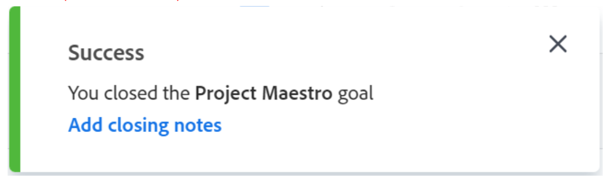

# 在Adobe Workfront目标中关闭和重新打开目标

当要指示以下内容时，可以关闭目标：

* 目标已完成，这或者是因为您已实现该目标，或者是因为该时间段已过。
* 你不再从事这项工作，也不打算在不久的将来从事这项工作。

您可以重新打开已关闭的目标，只要这些目标再次相关。

## 访问要求

您必须具备以下条件：

<table style="table-layout:auto">
<col>
</col>
<col>
</col>
<tbody>
 <tr>
 <td role="rowheader">Adobe Workfront计划</td>
 <td>
 
任何

</td>
 </tr>
 <tr>
 <td role="rowheader">Adobe Workfront许可证*</td>
 <td>
 
新许可证：参与者或更高版本

 或
 
当前许可证：请求或更高版本
 
有关更多信息，请参阅 <a href="../../administration-and-setup/add-users/access-levels-and-object-permissions/wf-licenses.md" class="MCXref xref">Adobe Workfront许可证概述</a>.
 </td>
 </tr>
 <tr>
 <td role="rowheader">产品*</td>
 <td>
 
 新产品要求，为以下项之一： 

<ul>
<li>Select或Prime Adobe Workfront计划和其他Adobe Workfront Goals许可证。</li>
<li>默认包含Workfront目标的Ultimate Workfront计划。 </li></ul>
 
或

 
当前产品要求： Workfront计划和Adobe Workfront Goals的附加许可证。 
 
有关信息，请参阅 <a href="../../workfront-goals/goal-management/access-needed-for-wf-goals.md" class="MCXref xref">使用Workfront Goals的要求</a>. 
 </td>
 </tr>
 <td role="rowheader">访问级别</td>
 <td> 
编辑对目标的访问权限
 </td>
 </tr>
 <tr data-mc-conditions="">
 <td role="rowheader">对象权限</td>
 <td>
  

  
查看目标的权限或更高以查看目标

  
管理目标的权限以编辑它

  
有关共享目标的信息，请参阅 <a href="../../workfront-goals/workfront-goals-settings/share-a-goal.md" class="MCXref xref">在Workfront目标中共享目标</a>. 

  
 </td>
 </tr>
<tr>
   <td role="rowheader">
布局模板
</td>
   <td> 
必须为包括Workfront管理员在内的所有用户分配一个布局模板，该模板应包括主菜单中的目标区域。 
  
</td>
  </tr>
</tbody>
</table>

*有关详细信息，请参阅 [Workfront文档中的访问要求](/help/quicksilver/administration-and-setup/add-users/access-levels-and-object-permissions/access-level-requirements-in-documentation.md).

## 关闭或重新打开目标时的注意事项

* 在关闭和重新打开目标之前，您必须拥有在访问级别中编辑目标的访问权限。 有关授予对“目标”的访问权限的信息，请参阅 [授予对Adobe Workfront目标的访问权限](../../administration-and-setup/add-users/configure-and-grant-access/grant-access-goals.md).
* 您只能关闭活动目标。 您无法关闭处于草稿状态的目标。

  有关目标状态的信息，请参阅 [Adobe Workfront目标中的目标状态概述](../../workfront-goals/goal-management/goal-status-overview.md).

* 关闭目标会锁定其进度，并允许您对完成目标的效果进行评分。

  >[!CAUTION]
  >
  >在关闭具有积极贡献目标的目标时，其进度会在关闭后更改，以指示提供积极目标的进度。 有关对齐目标的信息，请参阅 [通过在Adobe Workfront目标中连接目标来调整目标](../../workfront-goals/goal-alignment/align-goals-by-connecting-them.md).

* 在关闭目标之前更新目标的进度指示器，以确保使用准确的进度值关闭目标。 如果所有进度指示器都已实现，则目标完成百分比应为100%，且您的目标已实现。 有关更新目标的信息，请参阅 [在Adobe Workfront目标中更新目标进度](../../workfront-goals/goal-review-and-workfront-goals-sections/check-in-goals.md).
* 将任何最终注释作为关闭目标的更新保留。 有关向目标添加注释的信息，请参阅 [在Adobe Workfront目标中管理目标注释](../../workfront-goals/goal-management/manage-goal-comments.md).
* 您无法再更新关闭的目标上的结果和活动的进度。
* 如果要继续处理已关闭的目标，可以将其重新打开。
* 如果未能实现目标，请考虑将其中的大多数信息复制到下一个时间段（季度或年）。 对于从一个时间段到下一个时间段保持相同的目标或者您可能仍需要努力在下一个时间框架内实现的目标而言，这是一个很好的选项。 有关复制目标的信息，请参阅 [在Adobe Workfront目标中复制目标](../../workfront-goals/goal-management/copy-goals.md). 您还可以更新目标上的时间段，而不是将其复制到另一个时间段。
* 当您重新打开某个已关闭的目标时，Workfront会删除该目标的注释。 如果必须保留注释，我们建议复制已关闭的目标（包括与其关联的任何结果），而不是重新打开它。

## 关闭目标

<!--
Closing goals differs depending on what environment you use. 

### Close goals in the Production environment

1. Click the **Main Menu** icon  > **Goals** in the upper-right corner.

   (!-- Add this when Shell is available to all: or (if available), click the **Main Menu** icon  in the upper-left corner)
   --)

   The Goal List opens. 

1. (Optional) Modify your filters to display only goals that are active.

   For information about filtering information in Workfront Goals, see [Filter information in Adobe Workfront Goals](../../workfront-goals/goal-management/filter-information-wf-goals.md). 

1. Click an active goal.

   The Goal Details panel displays on the right. 

1. (Optional and recommended) Click the **Updates** tab and add an update in the **Comment here** field about the reason you are closing the goal, then click **Post**. 

1. Click the **More icon**  to the right of the goal name, then click **Close** > **Close Goal**.

   This closes the goal and saves the current progress on the goal and its results and activities.

   >[!IMPORTANT]
   >
   >If the goal has contributing goals that are still active, the progress of the goal continues to update based on the progress of the aligned goals.
   >
   >
   >   >
   >

1. (Optional) Modify your filters again to display only closed goals. The goals you closed display on the screen.
-->

1. 单击 **主菜单** 图标  > **目标** 在右上角。

   此时将打开“目标列表”。

   <!-- Add this when Shell is available to all: or (if available), click the **Main Menu** icon  in the upper-left corner)
   -->

1. （可选）修改筛选器以仅显示处于活动状态的目标。

   有关在Workfront目标中过滤信息的信息，请参阅 [在Adobe Workfront目标中过滤信息](../goal-management/filter-information-wf-goals.md).
1. 单击活动目标。

   此时将打开目标页面。

   
1. 单击 **更多** 菜单  目标名称的右侧，然后单击 **关闭**.

   目标关闭，您将收到屏幕右上角的确认消息。

   

1. （可选）在确认框中，单击 **添加关闭注释** 以添加有关此目标的注释以及需要将其关闭的原因。
1. 添加关闭注释，然后单击 **添加注释**.

   

   备注显示在目标页面的“目标详细信息”部分的“结束备注”区域。

   >[!NOTE]
   >
   >如果您稍后重新打开已关闭的目标，Workfront将删除关闭注释。

## 重新打开目标

如果您确定已关闭的目标已再次相关，并且需要继续更新其进度，则可以重新打开这些目标。

<!--
Reopening goals differs depending on what environment you use.

### Reopen goals in the Production environment

1. Click the **Main Menu** icon  > **Goals** in the upper-right corner.

   (!-- Add this when Shell is available to all: or (if available), click the **Main Menu** icon  in the upper-left corner)
   --)

   The Goal List opens. 

1. (Optional) Modify your filters to display only goals that are closed.

   For information about filtering information in Workfront Goals, see [Filter information in Adobe Workfront Goals](../../workfront-goals/goal-management/filter-information-wf-goals.md).

1. Click a closed goal.

   This opens the Goal Details panel on the right. 

1. Click the **More icon**  to the right of the goal name, then click **Reopen** > **Reopen**.

   This reopens the goal and places it in a status of Active. The progress of the goal is recalculated starting with the current date. 

1. (Optional) Modify your filters again to display only active goals. The goals you opened display on the screen.

-->

1. 单击 **主菜单** 图标 > **目标** 在右上角。

   此时将打开“目标列表”。

   <!-- Add this when Shell is available to all: or (if available), click the **Main Menu** icon  in the upper-left corner)
   -->

1. （可选）修改过滤器以仅显示已关闭的目标。

   有关在Workfront目标中过滤信息的信息，请参阅 [在Adobe Workfront目标中过滤信息](../goal-management/filter-information-wf-goals.md).
1. 单击已关闭目标的名称。

   此时将打开目标页面。
1. 单击 **更多** 菜单  在目标名称的右侧，然后 **重新打开** > **重新打开**.

   出现以下情况：
   * 目标现在处于打开状态，且状态为“活动”。
   * 目标的进度将从当前日期开始重新计算。
   * 任何关闭注释都会从“目标详细信息”页面中删除。 无法恢复已删除的关闭注释。

1. （可选）再次修改筛选器以仅显示活动目标。

   您打开的目标将显示在屏幕上。

