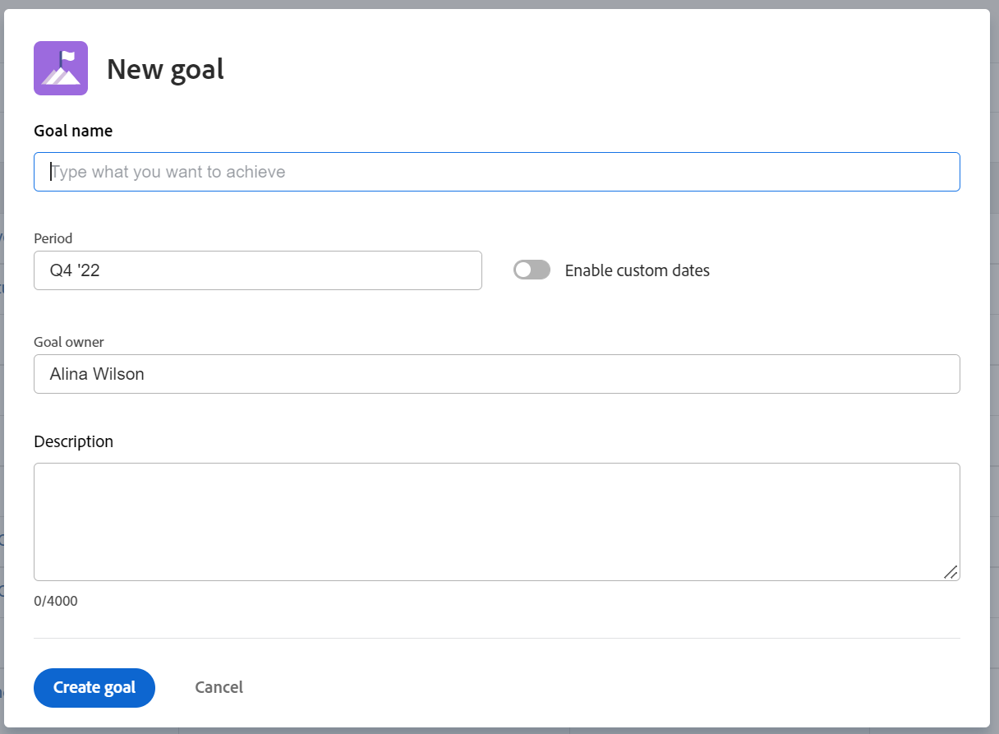

# 在Adobe Workfront目标中创建目标

无论您是CEO、经理还是个人投稿人，都可以在Adobe Workfront目标中创建目标，以使您的工作与概述组织策略的目标保持一致。

## 访问要求

您必须具备以下条件：

<table style="table-layout:auto">
<col>
</col>
<col>
</col>
<tbody>
<tr> 
   <td role="rowheader">Adobe Workfront计划*</td> 
   <td> 
   
对于新计划和许可证结构：
  <ul><li>最终计划 </li></ul>
   

对于当前计划和许可证结构： 
<ul><li> Pro或更高版本 </li>
  <li>除了Adobe Workfront许可证之外，还提供了Workfront目标许可证。</li></ul>

   </td> 
  </tr>
  <tr>
 <td role="rowheader">Adobe Workfront许可证*</td>
 <td>
 
新许可证：参与者或更高版本

 或
 
当前许可证：请求或更高版本
 
有关详细信息，请参阅<a href="../../administration-and-setup/add-users/access-levels-and-object-permissions/wf-licenses.md" class="MCXref xref">Adobe Workfront许可证概述</a>。
 </td>
 </tr>
 <tr>
 <td role="rowheader">产品*</td>
 <td>
 
 新产品要求，为以下项之一： 

<ul>
<li>Select或Prime Adobe Workfront计划和其他Adobe Workfront Goals许可证。</li>
<li>默认包含Workfront目标的Ultimate Workfront计划。 </li></ul>
 
或

 
当前产品要求： Workfront计划和Adobe Workfront Goals的附加许可证。 
 
有关信息，请参阅<a href="../../workfront-goals/goal-management/access-needed-for-wf-goals.md" class="MCXref xref">使用Workfront目标的要求</a>。 
 </td>
 </tr>
<tr>
<td role="rowheader">访问级别</td>
<td> 
编辑对目标的访问权限
 </td>
</tr>
<tr data-mc-conditions="">
<td role="rowheader">对象权限</td>
<td>

查看目标的权限或更高以查看目标

管理目标的权限以编辑它

有关共享目标的信息，请参阅<a href="../../workfront-goals/workfront-goals-settings/share-a-goal.md" class="MCXref xref">在Workfront目标中共享目标</a>。 

</td>
</tr>
<tr>
   <td role="rowheader">
布局模板
</td>
   <td> 
必须为包括Workfront管理员在内的所有用户分配一个布局模板，该模板应包括主菜单中的目标区域。 
  
</td>
  </tr>
</tbody>
</table>

*有关详细信息，请参阅Workfront文档中的[访问要求](/help/quicksilver/administration-and-setup/add-users/access-levels-and-object-permissions/access-level-requirements-in-documentation.md)。

## 创建目标的准则

在开始使用Workfront目标之前，我们建议您阅读有关有效管理目标的最佳实践建议和指南。 有关创建和管理目标的准则的更多信息，请参阅[Adobe Workfront目标概述](../../workfront-goals/goal-management/wf-goals-overview.md)。

## 创建目标

本文介绍了如何在Workfront目标中创建战略目标。 有关创建业务案例目标的信息，请参阅[创建业务案例目标](../../manage-work/projects/define-a-business-case/create-business-case-goals.md)。

您可以通过以下方式之一创建战略目标：

* [从头开始创建目标](#create-a-goal-from-scratch)
* [复制现有目标](#copy-an-existing-goal)
* [将结果或活动转化为目标](#convert-a-result-or-activity-to-a-goal)

### 从头开始创建目标 {#create-a-goal-from-scratch}

<!--
Creating goals differs depending on what environment you use.

#### Create a goal from scratch in the Production environment 

1. Click the **Main Menu** icon  in the upper right corner, then click **Goals**.

   (!-- Add this when Shell is available to all: or (if available), click the **Main Menu** icon  in the upper-left corner)
   -)

   The Goal List displays.

1. (Conditional) Click **Goal List**, **Graphs**, **Pulse**, or **Check-in** in the left pane, then click **Add Goal** in the upper-right corner of the page. The Add Goal box displays.

   

   >[!TIP]
   >
   >You can add a goal from any section in Workfront Goals. The process for creating a goal is identical regardless of the section you choose to add the goal from.

1. Start typing what you want to achieve in the **Goal** field. This is the name of the goal and a required field. 
1. Select a time period when the goal should be executed in the **Period** drop-down menu. This is a pre-filled field. The default is the current quarter.

   Select from the following predefined options:

   * The current year
   * The quarters of the current year
   * The next two years
   * The quarters of the next two years

   Or

   Click **Define custom dates** to select a custom time frame. 

1. (Conditional) Select a **Start date** and an **End date** for your goal, if you clicked **Define custom dates**.

   >[!TIP]
   >
   >* You can create a goal with dates in any time period, including up to 2 years in the past. 
   >* When defining custom dates, they are constrained by the initial date you selected. So if you select quarter and then custom dates, you can't go beyond that quarter.

1. (Optional) Click **Reset custom dates** to return to the predefined options.

   >[!TIP]
   >
   >We recommend that everyone in your organization selects the same timeframes for similar goals or goals that are aligned. This provides better alignment between goals and ensures that everyone's work supports your over-arching strategy.

1. (Optional) Click your name in the **Owner** field, if you want to indicate someone else as the owner of the goal. By default, you are the owner of goals you create. 
1. Start typing the name of a user, team, group, or the name of your organization in the **Owner** field, then select it when it displays in the list. You can have only one owner for a goal. 
1. (Optional) Enter a **Description** for the goal. This field is optional. 
1. Click **Save**.

   The status of the new goal is Draft.

   >[!IMPORTANT]
   >
   >You must associate a goal with a progress indicator to activate it and start working on it. 
   >
   >Do at least one of the following to be able to activate a goal: 
   >
   >* Add a Result
   >
   >  For information about adding results, see [Add results to goals in Adobe Workfront Goals](../../workfront-goals/results-and-activities/add-results-to-goals.md).
   >   
   >* Add an Activity
   >   
   >  For information about adding activities, see [Add activities to goals in Adobe Workfront Goals](../../workfront-goals/results-and-activities/add-activities-to-goals.md). 
   >   
   >* Align another goal to it
   >   
   >  For information about aligning goals, see [Align goals by connecting them in Adobe Workfront Goals](../../workfront-goals/goal-alignment/align-goals-by-connecting-them.md).

1. Click the **X** icon in the upper-right of the Goal Details panel to close it.

-->

1. 单击右上角的&#x200B;**主菜单**&#x200B;图标，然后单击&#x200B;**目标**。

   <!-- Add this when Shell is available to all: or (if available), click the **Main Menu** icon  in the upper-left corner)
   -->

   此时将显示目标列表。
1. 单击&#x200B;**新建目标**。

   此时将显示新建目标框。

   

1. 在以下字段中输入信息：
   * **目标名称**：输入目标的名称。 这是必填字段。
   * **期间**：从&#x200B;**期间**&#x200B;下拉列表中选择预定义的季度或年份

     或

     选择&#x200B;**启用自定义日期**&#x200B;选项，然后为目标选择&#x200B;**开始**&#x200B;和&#x200B;**结束日期**。

     以前、当前和随后年份及其各自的季度在期间下拉字段中作为预定义选项列出。

     目标的期间指示您预期目标完成的时间范围。

   * **目标所有者**：开始键入用户、团队、组或组织的名称，以指示目标的所有者是谁。 默认情况下，您被选为目标的所有者。
   * **描述**：输入有关目标的其他信息。
1. 单击&#x200B;**创建目标**。

   新目标列在目标列表中，其状态为&#x200B;**草稿**。

   您必须将目标与进度指示器关联才能激活它并开始处理它。

   执行以下至少一项操作以准备要激活的目标：
   * 添加结果

     有关添加结果的信息，请参阅[在Adobe Workfront目标中添加结果](../results-and-activities/add-results-to-goals.md)。
   * 添加活动

     有关添加活动的信息，请参阅[将活动添加到Adobe Workfront目标中的目标](../results-and-activities/add-activities-to-goals.md)。
   * 使另一个目标与其保持一致

     有关对齐目标的信息，请参阅[在Adobe Workfront目标中通过连接来对齐目标](../goal-alignment/align-goals-by-connecting-them.md)。

### 复制现有目标 {#copy-an-existing-goal}

您可以通过复制现有目标来创建目标。

有关复制目标的信息，请参阅[在Adobe Workfront目标中复制目标](../../workfront-goals/goal-management/copy-goals.md)。

### 将结果或活动转化为目标 {#convert-a-result-or-activity-to-a-goal}

通过将现有目标的结果或活动转换为目标，可创建目标。 新目标与原始目标一致。

有关将结果和活动转换为目标的信息，请参阅[通过将结果和活动转换为目标来调整目标](../../workfront-goals/goal-alignment/align-goals-by-converting-results-activities.md)。

