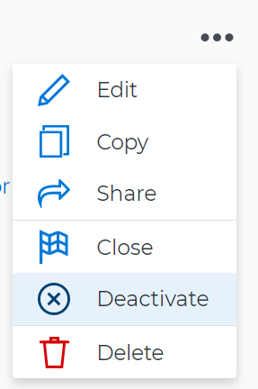

# 删除和停用Adobe Workfront目标中的目标

当您开始处理目标并且该目标在您的组织中变得无关紧要时，我们建议取消激活该目标，而不是将其删除。 取消激活目标可保留其历史信息，并让您有机会在以后重新激活它。 但是，有时，如果删除目标可能有意义，则可以确保目标列表的准确性。

## 访问要求

<!--drafted for P&P release: 

You must have the following:

<table style="table-layout:auto">
 <col>
 </col>
 <col>
 </col>
 <tbody>
  <tr>
   <td role="rowheader">Adobe Workfront plan*</td>
   <td>
   
Current plan: Select or higher

   Or
   
Legacy plan: Pro or higher

   
   </td>
  </tr>
  <tr>
   <td role="rowheader">Adobe Workfront license*</td>
   <td>
   
Current license: Contributor or higher

   Or
   
Legacy license: Request or higher
 
For more information, see <a href="../../administration-and-setup/add-users/access-levels-and-object-permissions/wf-licenses.md" class="MCXref xref">Adobe Workfront licenses overview</a>.
 </td>
  </tr>
  <tr>
   <td role="rowheader">Product</td>
   <td>
   
 Current product requirement: If you have the Select or Prime Adobe Workfront plan, you must also buy an additional Adobe Workfront Goals license.  Workfront Goals are included in the Ultimate Workfront Plan.

   Or
   
Legacy product requirement: You must purchase an additional license for the Adobe Workfront Goals to access functionality described in this article. 
 
For information, see <a href="../../workfront-goals/goal-management/access-needed-for-wf-goals.md" class="MCXref xref">Requirements to use Workfront Goals</a>. 
 </td>
  </tr>
  <tr>
   <td role="rowheader">Access level*</td>
   <td> 
Edit access to Goals
 
<b>NOTE</b>
If you still don't have access, ask your Workfront administrator if they set additional restrictions in your access level. For information on how a Workfront administrator can change your access level, see:

     <ul>
      <li> 
<a href="../../administration-and-setup/add-users/configure-and-grant-access/create-modify-access-levels.md" class="MCXref xref">Create or modify custom access levels</a> 
 </li>
      <li> 
<a href="../../administration-and-setup/add-users/configure-and-grant-access/grant-access-goals.md" class="MCXref xref">Grant access to Adobe Workfront Goals</a> 
 </li>
     </ul> 
 </td>
  </tr>
  <tr data-mc-conditions="">
   <td role="rowheader">Object permissions</td>
   <td>
    

     
View or higher permissions to the goal to view it

     
Manage permissions to the goal to edit it

     
For information about sharing goals, see <a href="../../workfront-goals/workfront-goals-settings/share-a-goal.md" class="MCXref xref">Share a goal in Workfront Goals</a>. 

    
 </td>
  </tr>
 </tbody>
</table>

-->

您必须具备以下条件：

<table style="table-layout:auto"> 
 <col> 
 <col> 
 <tbody> 
  <tr> 
   <td role="rowheader">Adobe Workfront计划*</td> 
   <td> 
专业或更高
 </td> 
  </tr> 
  <tr> 
   <td role="rowheader">Adobe Workfront许可证*</td> 
   <td> 
请求或更高版本
 
有关更多信息，请参阅 <a href="../../administration-and-setup/add-users/access-levels-and-object-permissions/wf-licenses.md" class="MCXref xref">Adobe Workfront许可证概述</a>.
 </td> 
  </tr> 
  <tr> 
   <td role="rowheader">产品</td> 
   <td> 
您必须为Adobe Workfront目标购买额外的许可证才能访问本文所述的功能。 
 
有关信息，请参阅 <a href="../../workfront-goals/goal-management/access-needed-for-wf-goals.md" class="MCXref xref">使用Workfront目标的要求</a>. 
 </td> 
  </tr> 
  <tr> 
   <td role="rowheader">访问级别配置*</td> 
   <td> 
编辑对目标或更高版本的访问权限
 
<b>注释</b>

如果您仍然没有访问权限，请咨询Workfront管理员，他们是否在您的访问级别设置了其他限制。 有关Workfront管理员如何更改访问级别的信息，请参阅：
 
     <ul> 
      <li> 
<a href="../../administration-and-setup/add-users/configure-and-grant-access/create-modify-access-levels.md" class="MCXref xref">创建或修改自定义访问级别</a> 
 </li> 
      <li> 
<a href="../../administration-and-setup/add-users/configure-and-grant-access/grant-access-goals.md" class="MCXref xref">授予对Adobe Workfront目标的访问权限</a> 
 </li> 
     </ul> 
 </td> 
  </tr> 
  <tr data-mc-conditions=""> 
   <td role="rowheader">对象权限</td> 
   <td> 
    
 
     
管理目标的权限
 
     
有关共享目标的信息，请参阅 <a href="../../workfront-goals/workfront-goals-settings/share-a-goal.md" class="MCXref xref">在Workfront目标中共享目标</a>. 
 
    
 </td> 
  </tr> 
 </tbody> 
</table>

&#42;要了解您拥有的计划、许可证类型或访问权限，请联系您的Workfront管理员。

## 先决条件

在开始之前，您必须具备以下条件：

* 包含主菜单中“目标”区域的布局模板。

## 停用目标

您可以停用不再相关且将来可能希望重新激活的目标。

* [停用目标时的注意事项](#considerations-when-deactivating-goals)
* [停用目标](#deactivate-goals)

### 停用目标时的注意事项

取消激活目标时请记住以下事项：

* 您只能停用处于“活动”状态的目标。 有关激活目标的信息，请参阅 [在Adobe Workfront目标中激活目标](../../workfront-goals/goal-management/activate-goals.md).

   >[!TIP]
   >
   >您无法停用处于“草稿”状态的目标。

* Workfront停止计算已停用目标的进度。
* 不活动的目标不再显示在Workfront目标的图表部分中，或者不再将其考虑在内。 有关Workfront目标图的信息，请参阅 [查看图表以了解Adobe Workfront目标中的目标进度趋势](../../workfront-goals/goal-review-and-workfront-goals-sections/review-goal-graphs.md).

   <!--* The Check-in section. For information about the Check-in page, see [Update goal progress in Adobe Workfront Goals](../../workfront-goals/goal-review-and-workfront-goals-sections/check-in-goals.md). -->

* 您无法再对已停用的目标进行更新。
* 您可以编辑有关目标及其对齐方式的信息。
* 您可以重新激活之前已停用的目标。

### 停用目标

<!--
Deactivating goals differs depending on which environment you use.

### Deactivate goals in the Production environment

1. Go to the goal that you want to deactivate.

   For example, go to the Goal List and click the name of a goal.

   The Goal Details panel opens on the right.

   >[!TIP]
   >
   >You can open goals from any sections of Workfront Goals.

1. Click the **More icon** , then click **Deactivate**.

   

   The goal status changes to Inactive. 

1. Click the **X** icon in the upper-right to close Goal Details.
-->

1. 单击 **主菜单** 图标  ，然后单击 **目标**.

   此时会显示目标列表。

   <!-- Add this when Shell is available to all: or (if available), click the **Main Menu** icon  in the upper-left corner)
   -->

1. （可选）修改过滤器，以仅显示处于活动状态的目标。

   有关在Workfront目标中过滤信息的信息，请参阅 [在Adobe Workfront目标中筛选信息](../goal-management/filter-information-wf-goals.md).

1. 单击活动目标。

   随即会打开目标页面。

   

1. 单击 **更多** 菜单  在目标名称的右侧，单击 **停用**.

1. 目标已停用，其状态将变为“不活动”。

## 删除目标

您可以删除不再相关或可能永远不相关的目标。

* [删除目标时的注意事项](#considerations-when-deleting-goals)
* [删除目标](#delete-goals)

### 删除目标时的注意事项 {#considerations-when-deleting-goals}

* 您可以删除任何状态的目标，包括已关闭的目标。
* 无法恢复已删除的目标。
* 此外，还会删除附加到目标的结果栏和手动进度栏活动。
* 与目标关联的项目不会被删除，但它们与目标的关联会被删除。

### 删除目标

<!--
Deleting  goals differs depending on which environment you use.

#### Delete goals in the Production environment

1. Go to the goal that you want to delete.

   For example, go to the Goal List and click a goal.

   The Goal Details panel opens on the right. 

1. Click the **More icon** , then click **Delete**.

   

1. Click **Yes, delete**.

   The goal is removed from the Goal List and cannot be recovered.
-->

1. 单击主菜单图标  ，然后单击 **目标**.

   此时会显示目标列表。

   <!-- Add this when Shell is available to all: or (if available), click the **Main Menu** icon  in the upper-left corner)
   -->
1. 单击目标的名称。 此时将打开目标页面。
1. 单击 **更多** 菜单  在目标名称的右侧，单击 **删除目标**，则 **删除**.

   目标及其活动和结果也将被删除，无法恢复。 不会删除与目标或子目标关联的项目。

