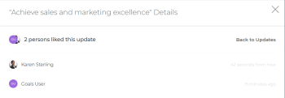
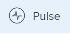

# 在Adobe Workfront目标中管理目标注释

<!--consider retiring this article when goals and all objects are in parity - after the new commenting experience goes to production GA-->

<!--take "legacy" and "new commenting" references out when we remove the legacy - Jan 2024???-->

此页面上高亮显示的信息是指尚未普遍可用的功能。 它仅在“预览”环境中对所有客户可用。 

有关当前发行计划的信息，请参阅 [2024年第一季度发行版概述](../../product-announcements/product-releases/24-q1-release-activity/24-q1-release-overview.md).

<!--
After the monthly releases to Production, the same features are also available in the Production environment for customers who enabled fast releases.   
For information about fast releases, see [Enable or disable fast releases for your organization](../../administration-and-setup/set-up-workfront/configure-system-defaults/enable-fast-release-process.md)  
-->

您可以向可在Adobe Workfront目标中查看的所有目标添加注释。

<!--drafted for P&P:

<table style="table-layout:auto">
 <col>
 </col>
 <col>
 </col>
 <tbody>
  <tr>
   <td role="rowheader">Adobe Workfront plan*</td>
   <td>
   
Current plan: Select or higher

   Or
   
Legacy plan: Pro or higher

   
   </td>
  </tr>
  <tr>
   <td role="rowheader">Adobe Workfront license*</td>
   <td>
   
Current license: Contributor or higher

   Or
   
Legacy license: Request or higher
 
For more information, see <a href="../../administration-and-setup/add-users/access-levels-and-object-permissions/wf-licenses.md" class="MCXref xref">Adobe Workfront licenses overview</a>.
 </td>
  </tr>
  <tr>
   <td role="rowheader">Product</td>
   <td>
   
 Current product requirement: If you have the Select or Prime Adobe Workfront plan, you must also buy an additional Adobe Workfront Goals license.  Workfront Goals are included in the Ultimate Workfront Plan.

   Or
   
Legacy product requirement: You must purchase an additional license for the Adobe Workfront Goals to access functionality described in this article. 
 
For information, see <a href="../../workfront-goals/goal-management/access-needed-for-wf-goals.md" class="MCXref xref">Requirements to use Workfront Goals</a>. 
 </td>
  </tr>
  <tr>
   <td role="rowheader">Access level*</td>
   <td> 
Edit access to Goals
 
<b>NOTE</b>
If you still don't have access, ask your Workfront administrator if they set additional restrictions in your access level. For information on how a Workfront administrator can change your access level, see:

     <ul>
      <li> 
<a href="../../administration-and-setup/add-users/configure-and-grant-access/create-modify-access-levels.md" class="MCXref xref">Create or modify custom access levels</a> 
 </li>
      <li> 
<a href="../../administration-and-setup/add-users/configure-and-grant-access/grant-access-goals.md" class="MCXref xref">Grant access to Adobe Workfront Goals</a> 
 </li>
     </ul> 
 </td>
  </tr>
  <tr data-mc-conditions="">
   <td role="rowheader">Object permissions</td>
   <td>
    

     
View or higher permissions to the goal to view it

     
Manage permissions to the goal to edit it

     
For information about sharing goals, see <a href="../../workfront-goals/workfront-goals-settings/share-a-goal.md" class="MCXref xref">Share a goal in Workfront Goals</a>. 

    
 </td>
  </tr>
 </tbody>
</table>
-->

## 访问要求

您必须具有以下权限才能执行本文中所述的操作：

<table style="table-layout:auto"> 
 <col> 
 <col> 
 <tbody> 
  <tr> 
   <td role="rowheader">Adobe Workfront计划*</td> 
   <td> 
专业或专业以上
 </td> 
  </tr> 
  <tr> 
   <td role="rowheader">Adobe Workfront许可证*</td> 
   <td> 
请求或更高版本
 
有关更多信息，请参阅 <a href="../../administration-and-setup/add-users/access-levels-and-object-permissions/wf-licenses.md" class="MCXref xref">Adobe Workfront许可证概述</a>.
 </td> 
  </tr> 
  <tr> 
   <td role="rowheader">产品</td> 
   <td> 
您必须为Adobe Workfront目标购买额外的许可证，才能访问本文中所述的功能。 
 
有关信息，请参阅 <a href="../../workfront-goals/goal-management/access-needed-for-wf-goals.md" class="MCXref xref">使用Workfront Goals的要求</a>. 
 </td> 
  </tr> 
  <tr> 
   <td role="rowheader">访问级别*</td> 
   <td> 
查看或更高的目标访问权限
 
<b>注释</b>
如果您仍然没有访问权限，请咨询Workfront管理员是否对您的访问级别设置了其他限制。 有关Workfront管理员如何更改您的访问级别的信息，请参阅：
 
     <ul> 
      <li> 
<a href="../../administration-and-setup/add-users/configure-and-grant-access/create-modify-access-levels.md" class="MCXref xref">创建或修改自定义访问级别</a> 
 </li> 
      <li> 
<a href="../../administration-and-setup/add-users/configure-and-grant-access/grant-access-goals.md" class="MCXref xref">授予对Adobe Workfront目标的访问权限</a> 
 </li> 
     </ul> 
 </td> 
  </tr> 
  <tr data-mc-conditions=""> 
   <td role="rowheader">对象权限</td> 
   <td> 
    
 
     
查看目标的权限或更高的权限
 
     
有关共享目标的信息，请参阅 <a href="../../workfront-goals/workfront-goals-settings/share-a-goal.md" class="MCXref xref">在Workfront目标中共享目标</a>. 
 
    
 </td> 
  </tr> 
 </tbody> 
</table>

*要了解您拥有的计划、许可证类型或访问权限，请联系您的Workfront管理员。

## 先决条件

在开始之前，您必须具备以下条件：

* 在主菜单中包含目标区域的布局模板。

## 管理目标注释

您可以在目标页面的“更新”部分中向目标添加评论。

您可以回复或喜欢您或其他人在此区域添加的评论。

1. 单击 **主菜单** 图标  位于右上角，或 **主菜单** 图标  （如果可用），然后单击 **目标**.
这将打开目标列表。
1. 找到要添加注释的目标，然后单击其名称以打开目标页面。
1. 单击  **更新** 在左侧面板中。
1. （可选）要查找现有注释，请开始键入关键字 <!--or a user's name--> 在 **Search** 框（位于右上角） **评论** 选项卡。 

   

   关键字 <!--or user--> 所搜索的注释会突出显示，并且包含该注释的注释将显示在“更新”部分的顶部。 

   有关更多信息，请参阅 [更新工作](../../workfront-basics/updating-work-items-and-viewing-updates/update-work.md)

1. 单击 **x** 图标，以清除搜索结果并返回至开始状态。
1. 单击 **评论** 选项卡。
1. 开始在 **新建评论** 盒子。

   

   >[!TIP]
   >
   >在完成键入和提交评论之前导航离开更新部分，即使注销并重新登录后，页面上评论仍会以草稿模式保留。 添加到注释的任何图像也会保存在草稿中。 草稿会保存7天，之后将丢弃它们并且无法恢复。 草稿注释仅对输入它们的用户可见。

1. （可选）要撤消或重做更改，请使用以下快捷键：
   * CTRL + Z(Mac为⌘ + z)可撤消更改
   * 按CTRL + Y(对于Mac，按⌘ + y)可重做更改
1. （可选）要向更新、超链接或图像添加富文本格式，请使用富文本工具栏上的任意选项或其旁边的图标。 有关更多信息，请参阅 [更新工作](../../workfront-basics/updating-work-items-and-viewing-updates/update-work.md).
1. （可选）在 **标记人员或团队** 区域，开始键入要包含在此注释中的用户或团队的名称或电子邮件，然后当其显示在列表中时将其选定。
1. 选择 **我的公司私有** 切换以使评论仅对您公司中的人员可见。

   >[!TIP]
   >
   >您必须在配置文件中指定公司，才能在更新区域提供此选项。

1. 单击 **提交**.

   >[!TIP]
   >
   >如果另一用户向您正在更新的同一项目提交评论，则会显示一条带“New”指示器的红线以通知您较新的评论，并且屏幕底部会显示一个蓝色通知，指示新评论的数量。
   >
   >指示符仅在提交项目的评论之后显示，而不在评论仍在撰写时显示。
   >

1. （可选）要编辑评论，请单击 **更多** 菜单  点按赞”图标右侧，然后单击 **编辑**.
1. 编辑评论中的信息，添加或删除图像，或删除任何已标记用户。
您可以在提交评论后15分钟内对其进行编辑。 “已编辑”指标将添加到更新评论时显示的日期戳的左侧。

   

   >[!TIP]
   >
   > * 仅当提交原始更新时，才会生成电子邮件通知用户您的更新。 编辑更新后不会生成电子邮件。
   >
   > * 日期戳是原始注释的日期，而不是最新更新的日期。

   1. （可选）单击 **更多** 菜单 ，然后单击以下任一选项以将信息从评论复制到剪贴板：

      * **复制链接** 复制更新的链接，而不复制回复。
      * **复制正文文本** 以复制更新的文本。

        有关更多信息，请参阅 [更新工作](../../workfront-basics/updating-work-items-and-viewing-updates/update-work.md).

1. （可选）单击 **更多** 菜单  单击注释右侧，然后单击 **删除** 以删除您添加的评论。 有关更多信息，请参阅 [更新工作](../../workfront-basics/updating-work-items-and-viewing-updates/update-work.md).
1. （可选）单击 **回复** 要回复现有评论，请按照上述步骤5至9操作。 有关回复更新的详细信息，请参阅 [回复更新](../../workfront-basics/updating-work-items-and-viewing-updates/reply-to-updates.md). <!--insure this stays accurate-->
1. （视情况而定，可选）如果其他用户添加了显示在“更新”部分的可见区域之外的注释，请单击 **视图** 蓝色内部 **新评论横幅** 在屏幕底部显示这些注释。

   

   屏幕底部会显示其他注释。
1. （可选）单击 **点赞** 图标 喜欢其他人添加的评论。 图标会随喜欢的数量而更新。

1. （可选）单击 **系统活动** 选项卡以查看系统记录的更新。 更新目标后，Workfront会生成有关该更新的注释，并将其显示在System Activity选项卡中。 在将结果、活动或项目添加到目标或进行更新时，Workfront还会记录系统更新。 <!--ensure the casing on the tab has not changed-->

<!--BELOW IS OLD, ATIIM/ WORKFRONT GOALS INFORMATION ABOUT COMMENTS: 

## Add comments to goals in the Check-in section

The Check-in section has been removed from the Preview environment. You can update goals by accessing the goal page. For information, see 
[Update goals in the Goal details section in Adobe Workfront Goals](../goal-management/update-goals-in-goal-details-panel.md). 

>[!TIP]
>
>You must have access to Edit Goals in your access level to view the Check-in section.

You can add comments to goals in the Check-in section of Workfront Goals, as part of updating your list of goals. For information about updating goals, see [Update goal progress in Adobe Workfront Goals](../../workfront-goals/goal-review-and-workfront-goals-sections/check-in-goals.md).

You can also like goal comments that other users have added to mark your approval of them in the Check-in section.

1. Click the **Main Menu** icon  > **Goals** in the upper-right corner.

   ( Add this when Shell is available to all: or (if available), click the **Main Menu** icon  in the upper-left corner))

   This opens the Workfront Goals area. 

1. Click the **Check-in** section in the left panel.

   

   Goals assigned to you or that have results and activities that are assigned to you display in this area. 

1. (Optional) Click the right-pointing arrow to the left of the goal name to expand the goal, if the goal is not already expanded. 
1. Type your comment in the **Add a comment to this goal (optional)** field, then click **Post**.

   Two most recent comments display by default under each goal.

1. Click **Show all comments** to display all comments on a goal. A number of total comments for the goal also displays. Comments display in the order they were entered, with the most recent first. 
1. (Optional) Click the **Like icon**  to like a comment. The icon updates with the number of likes. 

1. (Optional) Click the number of likes next to a comment and a list with the names of the users who liked the comment displays in the right panel.

   

1. (Conditional) Click **Back to Updates** to return to the Updates tab of the Goal Details panel, or click the **X icon** in the upper-right corner to close the right panel.

## Add comments to goals in the Pulse section

The Pulse section has been removed from the Preview environment. You can update goals by accessing the goal page. For information, see 
[Update goals in the Goal details section in Adobe Workfront Goals](../goal-management/update-goals-in-goal-details-panel.md). 

You can add comments to goals in the Pulse section of Workfront Goals, as part of reviewing goals that might affect yours. For information about reviewing goals in the Pulse section, see [Review goals in the Adobe Workfront Goals Pulse section](../../workfront-goals/goal-review-and-workfront-goals-sections/review-goals-in-pulse.md).

You can also like goal comments that other users have added to mark your approval of them in the Pulse section.

1. Click the **Main Menu** icon  > **Goals** in the upper-right corner.

   (Add this when Shell is available to all: or (if available), click the **Main Menu** icon  in the upper-left corner))

   This opens the Workfront Goals area. 

1. Click the Pulse section in the left panel.

   

   All current goals display in this section, regardless of their status.

1. Click **Add a comment**, then type your comment in the **Add a comment to this goal (optional)** field.
1. Click **Post**.

   Three comments display by default under each goal.

1. Click **Show all updates** to display all comments on a goal. A number of total comments for the goal also displays. Comments display in the order they were entered, with the most recent first. 
1. (Optional) Click the **Like icon**  to like a comment. The icon updates with the number of likes. 

1. (Optional) Click the number of likes next to a comment and a list with the names of the users who liked the comment displays in the right panel.

   

1. (Conditional) Click **Back to Updates** to return to the Updates tab of the Goal Details panel, or click the **X icon** in the upper-right corner to close the right panel.

-->

<!--
Locating goal comments differs depending on what environment you use. 

### Locate goal comments in the Production environment

You can add comments to goals in the following areas of Workfront Goals:

* The Goal Details panel
* The Check-in section 
* The Pulse section

Although the process for adding comments to goals is similar in these areas, there are differences in being able to edit, delete, or react to a comment when using one area versus another. When you enter a comment in any of these areas, the comment is visible in all areas where goal comments display.

>[!NOTE]
>
>You cannot add comments to results and activities.

-->

<!--
## Add comments to goals in the Goal Details panel

Adding comments to goals differs depending on what environment you use.

### Add comments to goals in the Production environment

You can add comments to goals in the Goal Details panel, as part of updating an individual goal.

You can edit or delete a comment that you entered in this area, or you can like comments.

1. Click the **Main Menu** icon  > **Goals** in the upper-right corner.

   (Add this when Shell is available to all: or (if available), click the **Main Menu** icon  in the upper-left corner))
   

   This opens the Workfront Goals area. 

1. Locate the goal you want to add comments to, then click its name to open the Goal Details panel to the right. 
1. Click the **Updates** tab.
1. Type your comment in the **Comment here** field, then click **Post**. 
1. (Optional and conditional) Select the **Comments** option at the top of the list to view your comment at the top of the list. It is enabled by default and comments display here with the most recent comment first. 
1. (Optional) Click **Edit** to edit your comment, then click **Save** to save your changes, or **Cancel** to revert to the original update.

   >[!TIP]
   >
   >* You can only edit comments you entered. 
   >* There is no time limit for how long after you enter a comment you are allowed to edit it.

1. (Optional) Click **Delete** to delete your comment, then click **Yes, Delete** to confirm.

   >[!TIP]
   >
   >* You can only delete comments you entered. 
   >* There is no time limit for how long after you enter a comment you are allowed to delete it.

1. (Optional) Click the **Like icon**  to like a comment that someone else added. The icon updates with the number of likes. 

1. (Optional) Click the number of likes next to a comment and a list with the names of the users who liked the comment displays in the right panel.

   <!--
   
(NOTE: this functionality might change)

   

   

1. (Conditional) Click **Back to Updates** to return to the Updates tab of the Goal Details panel, or click the **X icon** in the upper-right corner to close the right panel.

-->