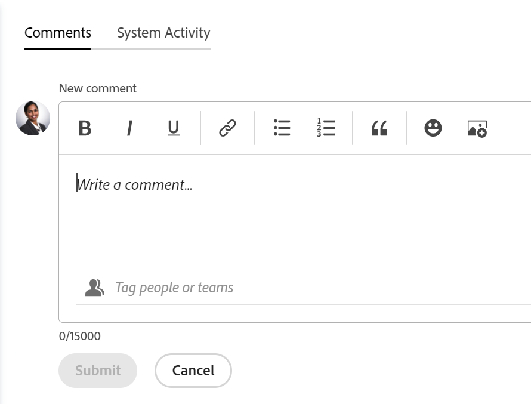

# 在Adobe Workfront目标中管理目标注释

<!--Audited for P&P only: 04/2025-->

<!--consider retiring this article when goals and all objects are in parity and we remove the legacy commenting from the system. From then on, there is just ONE way to comment and that will be documented in the Update Work article-->

<!--take "legacy" and "new commenting" references out when we remove the legacy - April 2024???-->

<!--The highlighted information on this page refers to functionality not yet generally available. It is available only in the Preview environment for all customers. 

For information about the current release schedule, see [First Quarter 2024 release overview](../../product-announcements/product-releases/24-q1-release-activity/24-q1-release-overview.md).-->

<!--
After the monthly releases to Production, the same features are also available in the Production environment for customers who enabled fast releases.   
For information about fast releases, see [Enable or disable fast releases for your organization](../../administration-and-setup/set-up-workfront/configure-system-defaults/enable-fast-release-process.md)  
-->

您可以向所有可以在Adobe Workfront目标中查看的目标添加注释。

## 访问要求

+++ 展开以查看本文中各项功能的访问要求。

您必须具有以下权限才能执行本文中所述的操作：

<table style="table-layout:auto">
<col>
</col>
<col>
</col>
<tbody>
 <tr> 
   <td role="rowheader">Adobe Workfront计划*</td> 
   <td> 
   
对于新计划和许可证结构：
  <ul><li>Ultimate计划 </li></ul>
   

对于当前计划和许可证结构： 
<ul><li> Pro或更高版本 </li>
  <li>除了Adobe Workfront许可证之外，还提供了Workfront目标许可证。</li></ul>

   </td> 
  </tr>
 <tr>
 <td role="rowheader">Adobe Workfront许可证</td>
 <td>
 
任何</td>
 </tr>
 <tr>
 <td role="rowheader">产品*</td>
 <td>
 
 新产品要求：Workfront

 或
 
当前产品要求：除了Workfront许可证之外，您必须为Adobe Workfront Goals购买许可证。 
 
有关信息，请参阅<a href="../../workfront-goals/goal-management/access-needed-for-wf-goals.md" class="MCXref xref">使用Workfront目标的要求</a>。 
 </td>
 </tr>
 <tr>
 <td role="rowheader">访问级别配置</td>
 <td> 
查看或更高的目标访问权限
 </td>
 </tr>
 <tr data-mc-conditions="">
 <td role="rowheader">对象权限</td>
 <td>
  

  
查看目标的或更高权限

  
默认情况下，用户无权访问目标 

 
有关共享目标的信息，请参阅<a href="../../workfront-goals/workfront-goals-settings/share-a-goal.md" class="MCXref xref">在Workfront目标中共享目标</a>。 

  
 </td>
 </tr>
 <tr>
   <td role="rowheader">
版面模板
</td>
   <td> 
必须为包括Workfront管理员在内的所有用户分配一个布局模板，该模板应包括主菜单中的目标区域。 
  
</td>
  </tr>
</tbody>
</table>

*有关详细信息，请参阅Workfront文档中的[访问要求](/help/quicksilver/administration-and-setup/add-users/access-levels-and-object-permissions/access-level-requirements-in-documentation.md)。

+++

## 管理目标注释

您可以在目标页面的“更新”部分中向目标添加评论。

1. 单击右上角的&#x200B;**主菜单**&#x200B;图标或左上角的&#x200B;**主菜单**&#x200B;图标（如果可用），然后单击&#x200B;**目标**。
这将打开目标列表。
1. 找到要添加注释的目标，然后单击其名称以打开目标页面。
1. 单击左侧面板中的&#x200B;**更新**。

   有关管理Workfront对象的注释的详细信息，请参阅[更新工作](/help/quicksilver/workfront-basics/updating-work-items-and-viewing-updates/update-work.md)。

<!--   
1. (Optional) To locate an existing comment, start typing a keyword (*****or a user's name********) in the **Search** box in the upper-right corner of the **Comments** tab. 
   
   

   The keyword (****or user****) you searched for is highlighted and the comments that contain it display at the top of the Updates section. 

      >[!NOTE]
      >
      >You must search for a word included in a comment or reply. You cannot search for a tagged user or team.
   
   For more information, see [Update work](../../workfront-basics/updating-work-items-and-viewing-updates/update-work.md).

1. Click the **x** icon in the search field to clear the search results and return to the complete update.
1. Click the **Comments** tab in the upper-left corner of the Updates area.
1. Start entering a comment in the **New comment** box.
         
   

   >[!TIP]
   >
   >Navigating away from the Updates section before you finish typing and submitting a comment keeps the comment on the page in draft mode even after you log off and log back on. Drafts are saved for 7 days after which they are discarded and cannot be recovered. Drafted comments are only visible to the user entering them.

1. (Optional) To undo or redo a change, use the following shortcut keys:
      * CTRL + Z (⌘+z for Mac) to undo a change 
      * CTRL + Y (⌘+y for Mac) to redo a change 
1. (Optional) To add rich-text formatting to your update, a hyperlink, or an emoji, use any options on the Rich Text toolbar or the icons adjacent to it. For more information, see [Update work](../../workfront-basics/updating-work-items-and-viewing-updates/update-work.md). 
1. (Optional) In the **Tag people or teams** area, start typing the name or the email of a user, or a team that you would like to include in this comment, then select it when it displays in the list. 
1. Select the **Private to my company** toggle to make the comment visible only to people in your company. 

      >[!TIP]
      >
      >You must have a Company specified in your profile to have this option available in the Updates area. 

1. Click **Submit**. 

      >[!TIP]
      >
      >If another user submits a comment to the same item you are updating, there will be a red line with a "New" indicator to inform you of the newer comments, as well as a blue notification at the bottom of the screen indicating the number of new comments. 
      >
      >The indicator only displays only after the comment was submitted on the item, and not when the comment is still composed. 
      >
      
1. (Optional) To edit a comment, click the **More** menu  to the right of the Like icon, then click **Edit**. 
1. Edit the information in the comment or remove any of the tagged users. 
   You can edit your comment within 15 minutes from submitting it. An "edited" indicator is added to the left of the date stamp that displays when the comment was updated.

   

   >[!TIP]
   >
   > * An email is generated to notify users of your update only when you submit the original update. No email is generated after you edited your update.
   >
   > * The date stamp is the date of the original comment and not the date of the latest update. 

1. (Optional) Click the **More** menu , then click any of the following options to copy information from a comment to the clipboard or into a new reply:

      * **Copy link** to copy the link of an update, without the replies.
      * **Copy body text** to copy the text of an update. 
      * **Quote reply** to open a new comment box where the original comment is quoted in a new reply and is marked as a block quote.

         For more information, see [Update work](../../workfront-basics/updating-work-items-and-viewing-updates/update-work.md). 

1. (Optional) Click the **More** menu  to the right of a comment, then click **Delete** to delete a comment you added. For more information, see [Update work](../../workfront-basics/updating-work-items-and-viewing-updates/update-work.md).
1. (Optional) Click **Reply** to reply to an existing comment, then follow the steps 5-9 above. For more information about replying to updates, see [Reply to updates](../../workfront-basics/updating-work-items-and-viewing-updates/reply-to-updates.md). (**********insure this stays accurate*********)
1. (Conditional and optional) If other users have added comments that display outside of the visible area in the Updates section, click **View** inside the blue **new comments banner** at the bottom of the screen  to display these comments.
   
   
   
   Additional comments display at the bottom of the screen.
1. (Optional) Click the **Like** icon to like a comment that someone else added. The icon updates with the number of likes.

1. (Optional) Click the **System Activity** tab to view updates logged by the system. When a goal is updated, Workfront generates a note about that update that and displays it in the System Activity tab. Workfront also records a system update when a result, activity, or project is added to the goal or when it is updated. (*********ensure the casing on the tab has not changed**********)-->

