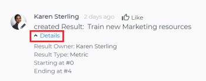

# 在Adobe Workfront目标的“目标详细信息”部分中更新目标

<!--drafted for the goal redesign:
- change the title for Production to Update goals in the Goal details section in Adobe Workfront Goals. 
- update the description in the metadata above
-->

您可以通过访问目标详细信息面板来更新各个目标的信息。

>[!NOTE]
>
>您无法更新状态为“已关闭”的目标。

## 访问要求

您必须具备以下条件：

<table style="table-layout:auto">
<col>
</col>
<col>
</col>
<tbody>
 <tr> 
   <td role="rowheader">Adobe Workfront计划*</td> 
   <td> 
   
对于新计划和许可证结构：
  <ul><li>最终计划 </li>
  或
  <li>适用于Prime或Select Adobe Workfront计划的Adobe Workfront目标的附加许可证。 </li></ul> 

对于当前计划和许可证结构： 
<ul><li> Pro或更高版本 </li>
  <li>除了Adobe Workfront许可证之外，还提供了Workfront目标许可证。</li></ul>

   </td> 
  </tr>
 <tr>
 <td role="rowheader">Adobe Workfront许可证*</td>
 <td>
 
新许可证：参与者或更高版本

 或
 
当前许可证：请求或更高版本
 
有关更多信息，请参阅 <a href="../../administration-and-setup/add-users/access-levels-and-object-permissions/wf-licenses.md" class="MCXref xref">Adobe Workfront许可证概述</a>.
 </td>
 </tr>
 <tr>
 <td role="rowheader">产品*</td>
 <td>
 
 新产品要求，为以下项之一： 

<ul>
<li>Select或Prime Adobe Workfront计划和其他Adobe Workfront Goals许可证。</li>
<li>默认包含Workfront目标的Ultimate Workfront计划。 </li></ul>
 
或

 
当前产品要求： Workfront计划和Adobe Workfront Goals的附加许可证。 
 
有关信息，请参阅 <a href="../../workfront-goals/goal-management/access-needed-for-wf-goals.md" class="MCXref xref">使用Workfront Goals的要求</a>. 
 </td>
 </tr>
 <tr>
 <td role="rowheader">访问级别*</td>
 <td> 
编辑对目标的访问权限
 </td>
 </tr>
 <tr data-mc-conditions="">
 <td role="rowheader">对象权限</td>
 <td>
  

  
查看目标的权限或更高以查看目标

  
管理目标的权限以编辑它

  
有关共享目标的信息，请参阅 <a href="../../workfront-goals/workfront-goals-settings/share-a-goal.md" class="MCXref xref">在Workfront目标中共享目标</a>. 

  
 </td>
 </tr>
 <tr>
   <td role="rowheader">
布局模板
</td>
   <td> 
必须为包括Workfront管理员在内的所有用户分配一个布局模板，该模板应包括主菜单中的目标区域。 
  
</td>
  </tr>
</tbody>
</table>

*有关详细信息，请参阅 [Workfront文档中的访问要求](/help/quicksilver/administration-and-setup/add-users/access-levels-and-object-permissions/access-level-requirements-in-documentation.md).

## 更新目标详细信息部分中的目标

您可以从目标列表中访问单个目标。

<!--

Updating goals in the Goal Details panel differs depending on where you access the goal from. 

### Update goals in the Goal Details panel in the Production environment

1. Click the **Main Menu** icon  > **Goals** in the upper-right corner.

   (!-- Add this when Shell is available to all: or (if available), click the **Main Menu** icon  in the upper-left corner)
   --)

   This opens the Goals area in Workfront. 

1. Click the name of a goal in the Goal List, then click the name of a goal.

   This opens the Goal Details panel on the right.
   

   >[!TIP]
   >
   >You can also click the name of a goal in the Goal Alignment, Check-in, or Pulse sections. 
   >
   ><!-- drafted for goal redesign:
   >Add this to the TIP above with goal redesign: 
   >
   >The Check-in and Pulse sections have been removed from the Preview environment.
   >

1. On the Summary tab, click the **More icon** , then click any of the following options:

   1. **Edit**. For information about editing goals, see [Edit goals in Adobe Workfront Goals](../../workfront-goals/goal-management/edit-goals.md).
   1. **Copy**. For information about copying goals, see [Copy goals in Adobe Workfront Goals](../../workfront-goals/goal-management/copy-goals.md).
   1. **Activate**. This option is available only for drafted and inactive goals.

      For information about activating goals, see [Access and open goals in Adobe Workfront Goals](../../workfront-goals/goal-management/access-goals-in-wf-goals.md). 
   
   1. **Close**, then click**Close Goal**. This option is available only for active goals.

      For information about closing goals, see [Close and reopen goals in Adobe Workfront Goals](../../workfront-goals/goal-management/close-and-reopen-goals.md). 
   
   1. **Deactivate**. This option is available only for active goals. This deactivates the goal immediately.

      For information about deactivating goals, see [Delete and deactivate goals in Adobe Workfront Goals](../../workfront-goals/goal-management/delete-and-deactivate-goals.md).
   
   1. **Delete**, then click **Yes, Delete**.

      For information about deleting goals, see [Delete and deactivate goals in Adobe Workfront Goals](../../workfront-goals/goal-management/delete-and-deactivate-goals.md).

      >[!NOTE]
      >
      >Deleted goals cannot be recovered.

   1. **Reopen**, then click **Reopen**. This option is available only for closed goals that are from a current time period.

      For information about reopening goals, see [Close and reopen goals in Adobe Workfront Goals](../../workfront-goals/goal-management/close-and-reopen-goals.md). 
   
   1. (Conditional) If you clicked any of the options between steps a-i above except Delete or Reopen, click **Save**.    
   
      (!--ensure this is accurate)--)

1. Click **Align to another goal** in the upper-right of the Summary tab, then specify the name of a goal in the **Align to** **another goal** field that you want to align the current goal to. The current goal becomes the child of the goal you align it to. For information about child and parent goals, see [Align goals by connecting them in Adobe Workfront Goals](../../workfront-goals/goal-alignment/align-goals-by-connecting-them.md). 
1. Click **Add results**. Results drive the progress of your goal. For information about adding results, see [Add results to goals in Adobe Workfront Goals](../../workfront-goals/results-and-activities/add-results-to-goals.md).

1. Click **Add activities**. Activities drive the progress of your goal. For information about adding activities, see [Add activities to goals in Adobe Workfront Goals](../../workfront-goals/results-and-activities/add-activities-to-goals.md). 

1. Click the **Updates** tab. Here, you can view goal comments and review the entire editing history of the goal, activities, and results, to understand who changed what and when.

   

1. (Optional) Deselect any of the following options if you want to not display them in the Updates tab.&nbsp;They are selected by default: 

   | Option |Description  |
   |---|---|
   | Progress Updates |Displays information about the history of progress updates on results and activities.  |
   | Comments |Displays comments made by users on the goal.  |
   | Editing History |Displays information about creating and updating the goal, results, and activities.  |

1. (Optional) Click **Details** under a progress or an editing history update to display additional information about the update.

   

-->

1. 单击目标列表中目标的名称，然后单击目标的名称。

   这将打开 **目标详细信息** 部分。

   

1. 单击 **“编辑”图标**  图标，然后单击 **编辑全部** 或 **概述**

   或

   开始在“目标详细信息”部分的其中一个可编辑字段中键入信息。 该部分将变为可编辑。

   >[!IMPORTANT]
   >
   >并非所有显示在目标详细信息部分中的字段都可以编辑。 Workfront会计算某些字段，这些字段为只读。

1. 更新或查看以下字段：

   * **描述**：添加或更新有关目标的信息。
   * **进度**：指示到目前为止已完成目标的百分比。 您无法手动更新目标的进度。 目标进度是计算所有进度指标。
   * **条件**：指示目标是新目标且尚未更新、目标是按时完成还是落后。 您无法更新目标的条件。 目标条件由Workfront自动计算。\
     有关目标条件和进度的更多信息，请参阅
     [Adobe Workfront目标中的目标进度和条件概述](../goal-management/calculate-goal-progress.md).
   * **状态**：您无法手动更新目标的状态。 有关更多信息，请参阅 [Adobe Workfront目标中的目标状态概述](../goal-management/goal-status-overview.md).
   * **目标所有者**：单击以更新目标所有者的名称。 开始键入用户、团队、组的名称或您的组织的名称，然后当它显示在列表中时将其选定。 一个目标只能有一个所有者。
   * **父目标**：开始键入要设置为所选目标的父目标的名称。 所选目标的进度将自动更新父目标的进度。

     >[!TIP]
     >
     >您无法更新以下有关父目标的信息：
     >    * 父目标期间
     >    * 父目标进度
     >    * 父目标所有者。
     >      
     >您必须更新有关父目标本身的此信息。

   * **期间**：单击以更新目标的时间段\
     或\
     选择 **启用自定义日期** 指定目标的日期 **开始** 和 **结束日期**.
   * **关闭注释**：此字段仅对状态为“已关闭”的目标可见。 无法编辑已关闭的目标。 重新打开已关闭的目标会永久删除关闭注释。

