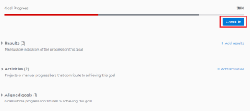

# 在Adobe Workfront目标中更新目标进度

您必须定期审查目标并更新其进度，以确保其不会落后或面临无法实现的危险。

<!--And: take this last sentence ^^ out when you update this for goal redesign production.-->

## 访问要求

您必须具备以下条件：

<table style="table-layout:auto">
<col>
</col>
<col>
</col>
<tbody>
 <tr> 
   <td role="rowheader">Adobe Workfront计划*</td> 
   <td> 
   
对于新计划和许可证结构：
  <ul><li>最终计划 </li></ul>
   

对于当前计划和许可证结构： 
<ul><li> Pro或更高版本 </li>
  <li>除了Adobe Workfront许可证之外，还提供了Workfront目标许可证。</li></ul>

   </td> 
  </tr>
 <tr>
 <td role="rowheader">Adobe Workfront许可证*</td>
 <td>
 
新许可证：参与者或更高版本

 或
 
当前许可证：请求或更高版本
 
有关详细信息，请参阅<a href="../../administration-and-setup/add-users/access-levels-and-object-permissions/wf-licenses.md" class="MCXref xref">Adobe Workfront许可证概述</a>。
 </td>
 </tr>
 <tr>
 <td role="rowheader">产品*</td>
 <td>
 
 新产品要求，为以下项之一： 

<ul>
<li>Select或Prime Adobe Workfront计划和其他Adobe Workfront Goals许可证。</li>
<li>默认包含Workfront目标的Ultimate Workfront计划。 </li></ul>
 
或

 
当前产品要求： Workfront计划和Adobe Workfront Goals的附加许可证。 
 
有关信息，请参阅<a href="../../workfront-goals/goal-management/access-needed-for-wf-goals.md" class="MCXref xref">使用Workfront目标的要求</a>。 
 </td>
 </tr>
 <tr>
 <td role="rowheader">访问级别</td>
 <td> 
编辑对目标的访问权限
</td>
 </tr>
 <tr data-mc-conditions="">
 <td role="rowheader">对象权限</td>
 <td>
  

  
查看目标的权限或更高以查看目标

  
管理目标的权限以编辑它

  
有关共享目标的信息，请参阅<a href="../../workfront-goals/workfront-goals-settings/share-a-goal.md" class="MCXref xref">在Workfront目标中共享目标</a>。 

  
 </td>
 </tr>
<tr>
   <td role="rowheader">
布局模板
</td>
   <td> 
必须为包括Workfront管理员在内的所有用户分配一个布局模板，该模板应包括主菜单中的目标区域。 
  
</td>
  </tr>
</tbody>
</table>

*有关详细信息，请参阅Workfront文档中的[访问要求](/help/quicksilver/administration-and-setup/add-users/access-levels-and-object-permissions/access-level-requirements-in-documentation.md)。

## 先决条件

在开始之前，您必须具有活动目标。

您无法更新处于草稿、非活动或已关闭状态的目标上的进度。

## 更新目标的注意事项

更新目标进度时，请考虑以下事项：

* 当您更新目标的进度指示器时，Workfront目标会自动计算目标的进度。

  >[!TIP]
  >
  >您不能直接在目标上更新进度。 您必须更新目标的进度指示器（活动、结果、连接的项目）的进度，这些进度指示器进而更新目标的进度。 要更新项目进度，必须更新项目中的任务。

  另请参阅以下文章：

   * 有关将活动添加到目标的信息，请参阅[在Adobe Workfront目标中添加活动](../../workfront-goals/results-and-activities/add-activities-to-goals.md)。
   * 有关将结果添加到目标的信息，请参阅[在Adobe Workfront目标中添加结果](../../workfront-goals/results-and-activities/add-results-to-goals.md)。
   * 有关Workfront目标如何计算目标进度的信息，请参阅[Adobe Workfront目标中的目标进度和条件概述](../../workfront-goals/goal-management/calculate-goal-progress.md)。

* 您必须先创建并激活目标，然后才能更新其进度。

  另请参阅以下文章：

   * 有关创建目标的信息，请参阅[在Adobe Workfront目标中创建目标](../../workfront-goals/goal-management/create-goals.md)。
   * 有关激活目标的信息，请参阅[在Adobe Workfront目标中激活目标](../../workfront-goals/goal-management/activate-goals.md)。

  >[!IMPORTANT]
  >
  >您无法更新草稿、已关闭或不活动的目标的进度。

* 当您或其他人首次更新目标上的结果或活动进度时，目标进度从新目标更改和Workfront目标开始记录进度和进度状态更新。

<!--

## Update goal progress by using Check-in in the Production environment

>[!IMPORTANT]
>
>  The Check-in functionality has been removed from the Preview environment and will be removed from Workfront Goals with the 23.1 release. See the [Update goal progress in the Preview environment](#update-goal-progress-in-the-preview-environment) section in this article to update goal progress in Preview. 

You can check in on goals at the individual goal level, or you can check in on multiple goals from the Check-in section of Workfront Goals.

* [Update individual goals](#update-individual-goals) 
* [Update goals in the Check-in section](#update-goals-in-the-check-in-section)

### Update individual goals {#update-individual-goals}

When you check in on a goal at the goal level, you can update the progress of the results and activities that are assigned to you or other users.

For information about how to update additional information about results and activities, see [Edit results and activities in Adobe Workfront Goals](../../workfront-goals/results-and-activities/edit-results-and-activities.md).

1. Click the **Main Menu** icon  > **Goals** in the upper-right corner.

   (!-- Add this when Shell is available to all: or (if available), click the **Main Menu** icon  in the upper-left corner)
   --)

   This opens the Workfront Goals area.

   All goals display by default. 

1. (Optional) Click any of the following sections in the left panel to access a list of goals:

   * Goal Alignment 
   * Pulse 
   * Check-in

   Or

   From the Goal List, click the name of a goal to open the **Goal Details** panel on the right.

   >[!TIP]
   >
   >You must have Edit access to Goals in your Access Level to view the Check-in section or the Check in button.

1. Click **Check in**.

   

   The progress of results and activities becomes editable.

1. Update the current progress on each of the results. Depending on what type of result you selected, you can do one of the following:

   * Update the quantity 
   * Update the currency amount
   * Update the percent complete

1. Update the percent complete on the Manual progress bar activity.

   >[!TIP]
   >
   >When you add projects as activities to your goals, you cannot manually update projects at the goal level. Workfront automatically updates project progress based on the project of their tasks. When the project percent complete updates in Workfront, the goal progress associated with the project also updates automatically.

1. Click **Back to Summary** to return to the Goal Details panel.

   Your goal progress updates as you update the results and activities of your goal. 

1. Click the **X icon** in the upper-right corner of the Goal Details panel to close it.

### Update goals in the Check-in section {#update-goals-in-the-check-in-section}

You can use the Check-in section to check in on goals when you want to quickly provide updates for several goals at the same time.

>[!TIP]
>
>You can access the Check-in section from any of the following sections:
>
>* Goal List 
>* Goal Alignment 
>* Pulse 
>

When you check in on a goal in the Check-in section, you can update the progress of the results and activities that are assigned only to you. You cannot update the progress of results and activities that are assigned to other users in this section.

1. Click the **Main Menu** icon  > **Goals** in the upper-right corner.

   (!-- Add this when Shell is available to all: or (if available), click the **Main Menu** icon  in the upper-left corner)
   --)

   This opens the Workfront Goals area and the Goal List section displays by default. 

1. Click Check-in in the left panel.

   Or

   (Conditional) If you are in the Goal List, Goal Alignment, or Pulse sections, click the **Check in** button in the upper-right of the screen. This opens the Check-in section.

   

   Goals display in a list and results and activities are listed under each goal.

   

1. (Optional) Click **Show all results**, **Show all activities**, or **Show all aligned goals** to the far right of the goal name to display all results, activities, and aligned goals of a goal whose progress you want to update.

   >[!CAUTION]
   >
   >You cannot directly update aligned goals, but you can update their results and activities.

1. Update the current progress on each of the results assigned to you. Depending on what type of result you selected, you can do one of the following:

   * Update the quantity 
   * Update the currency amount
   * Update the percent complete

   The result and the goal progress updated automatically and you receive a confirmation of your changes.

1. Update the percent complete on your Manual progress bar activity.

   >[!TIP]
   >
   >When you add projects as activities to your goals, you cannot manually update projects at the goal level. Workfront automatically updates project progress based on the project of their tasks. When the project percent complete updates in Workfront, the goal progress associated with the project also updates automatically.

   The activity and the goal progress updated automatically and you receive a confirmation of your changes.

1. (Optional) Add a comment for your goal, then click **Post** to save your comment.

-->

要更新目标的进度，请执行以下操作：

1. 单击右上角的&#x200B;**主菜单**&#x200B;图标 > **目标**。

   <!-- Add this when Shell is available to all: or (if available), click the **Main Menu** icon  in the upper-left corner)
   -->

   这将打开目标列表。 默认情况下，您有权查看的所有目标都会显示。

   或者，您可以单击左侧面板中的“目标对齐方式”。

1. 从目标列表中，单击目标的名称以打开目标页面。
1. 单击左侧面板中的&#x200B;**进度指示器**。

   进度指示器列表会显示选定目标的所有进度指示器。

   >[!NOTE]
   >
   >  * 您只能更新结果和活动。
   >  * 您必须更新子目标的进度指示器，以显示子目标的进度。
   >  * 您必须更新所连接项目上的任务以显示项目进度。
   >   
   >    反过来，子目标的进度和项目的进度会驱动所选目标的进度。

1. 要更新结果或活动的进度，请单击结果或活动的&#x200B;**实际进度**&#x200B;列中的值，并键入一个数字以更新其值，然后按Enter。

   

   进度列中的进度指示器的进度条以及目标标题中的目标的进度会立即更新。

