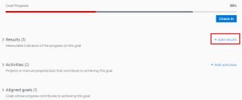

# 将结果添加到Adobe Workfront目标中的目标

结果衡量目标的进度。 如果不将结果、活动或瞄准的目标与某个目标相关联，则无法激活该目标，并且无法记录其进度。

## 访问要求

您必须具备以下条件：

<table style="table-layout:auto">
<col>
</col>
<col>
</col>
<tbody>
 <tr>
 <td role="rowheader">Adobe Workfront计划</td>
 <td>
 
任何

</td>
 </tr>
 <tr>
 <td role="rowheader">Adobe Workfront许可证*</td>
 <td>
 
新许可证：参与者或更高版本

 或
 
当前许可证：请求或更高版本
 
有关更多信息，请参阅 <a href="../../administration-and-setup/add-users/access-levels-and-object-permissions/wf-licenses.md" class="MCXref xref">Adobe Workfront许可证概述</a>.
 </td>
 </tr>
 <tr>
 <td role="rowheader">产品*</td>
 <td>
 
 新产品要求，为以下项之一： 

<ul>
<li>Select或Prime Adobe Workfront计划和其他Adobe Workfront Goals许可证。</li>
<li>默认包含Workfront目标的Ultimate Workfront计划。 </li></ul>
 
或

 
当前产品要求： Workfront计划和Adobe Workfront Goals的附加许可证。 
 
有关信息，请参阅 <a href="../../workfront-goals/goal-management/access-needed-for-wf-goals.md" class="MCXref xref">使用Workfront Goals的要求</a>. 
 </td>
 </tr>
 <tr>
 <td role="rowheader">
访问级别
</td>
 <td> 
编辑对目标的访问权限
  </td>
 </tr>
 <tr data-mc-conditions="">
 <td role="rowheader">对象权限</td>
 <td>
  

  
查看目标的权限或更高以查看目标

  
管理目标的权限以编辑它

  
有关共享目标的信息，请参阅 <a href="../../workfront-goals/workfront-goals-settings/share-a-goal.md" class="MCXref xref">在Workfront目标中共享目标</a>. 

  
 </td>
 </tr>
 <tr>
   <td role="rowheader">
布局模板
</td>
   <td> 
必须为包括Workfront管理员在内的所有用户分配一个布局模板，该模板应包括主菜单中的目标区域。 
  
</td>
  </tr>
</tbody>
</table>

*有关详细信息，请参阅 [Workfront文档中的访问要求](/help/quicksilver/administration-and-setup/add-users/access-levels-and-object-permissions/access-level-requirements-in-documentation.md).

## 先决条件

在开始之前，您必须具备以下条件：

* 在主菜单中包含目标区域的布局模板。
* 现有目标。

  有关创建目标的信息，请参阅 [在Adobe Workfront目标中创建目标](../../workfront-goals/goal-management/create-goals.md).

>[!IMPORTANT]
>一个目标不能包含超过1000个活动、结果、项目或一致的目标。

## 将结果添加到目标

<!--

Adding results to goals differs depending on which environment you use.

### Add a result to a goal in the Production environment

1. Go to the goal for which you want to add a result and click the name to open the **Goal Details** panel.
1. Click **Add results**.

   

1. Start typing the result you want to achieve in the **Result** field. This is the name of the result and it displays wherever the goal displays. 
1. (Optional) If you want to set the Result Owner as someone other than yourself, click your name in the **Owner** field and start typing the name of the user that you want to assign as the owner of the result, then click it when it appears in the drop-down list.

   >[!NOTE]
   >
   >You cannot assign a team or group as a result owner.

1. In the Value drop-down menu, select the type of value that you want to measure your success by.

   

   Select from the following options:

   |Option|Value type|
   |---|---|
   | # |Number value |
   | % |Percentage value |
   |$, CN¥, DKK, KR, Mex$, R, R$, zł, £ , ¥ , &euro; , ₹, ฿, MYR, ₪  |Currency values |

   For example, if you want to increase profit to 8%, and profit is currently at 4%, you can select % as the Measured Value.

   >[!TIP]
   >
   >The result Type is always Metric and cannot be edited.

1. In the Initial field, indicate the value that the result has in the beginning, before any progress on it has been recorded. For example, if you want to increase profit to 8%, and profit is currently at 4%, you can enter 4 as the Starting At value. 
1. In the Target field, indicate the value that the result aims to achieve. For example, if you want to increase profit to 8%, and profit is currently at 4%, you can enter 8 as the Ending At value.
1. Click **Save**.

   The result is saved for the selected goal. The progress of the goal automatically updates when you update the progress of a result.

-->

1. 单击主菜单 ，则 **目标**.

1. 从 **目标列表**，单击目标的名称以打开目标页面。
1. 单击 **进度指示器** 在左侧面板中。
1. 展开 **新进度指示器** 下拉菜单，然后单击 **创建结果**.

   “新建结果”框打开。

   

1. 在中输入结果的名称 **结果名称** 字段。 这是必填字段。
1. （可选）将您的姓名从 **结果所有者** 字段。 默认情况下，您是所创建活动的所有者。

   >[!NOTE]
   >
   >您不能将团队、组或公司分配为结果所有者。

1. 在 **您希望如何衡量结果？** 区域，指定以下信息：
   * **值类型**：这指示您希望如何测量结果的进度。 您可以使用百分比值或货币金额以数字形式衡量进度。

     从下表列出的选项中选择值类型：

     | 值类型 | 描述 |
     |---------------------------------------------------------|------------------|
     | 数字 | 数值 |
     | % | 百分比值 |
     | CN¥、DKK、KR、Mex$、R、$、 zl、 £ 、 € 、 ₹、 ฿、 MYR、 ₪、$ | 货币值 |

   * **初始值**：结果在记录任何进度之前的开始值。
   * **目标值**：结果被视为完成时目标实现的值。
1. 单击 **创建结果**.

   结果将显示在目标页面的进度指示器部分的“结果”分组下。

   激活目标后，当您更新结果的进度时，目标的进度将自动更新。 有关激活目标的信息，请参阅 [在Adobe Workfront目标中激活目标](../goal-management/activate-goals.md).
