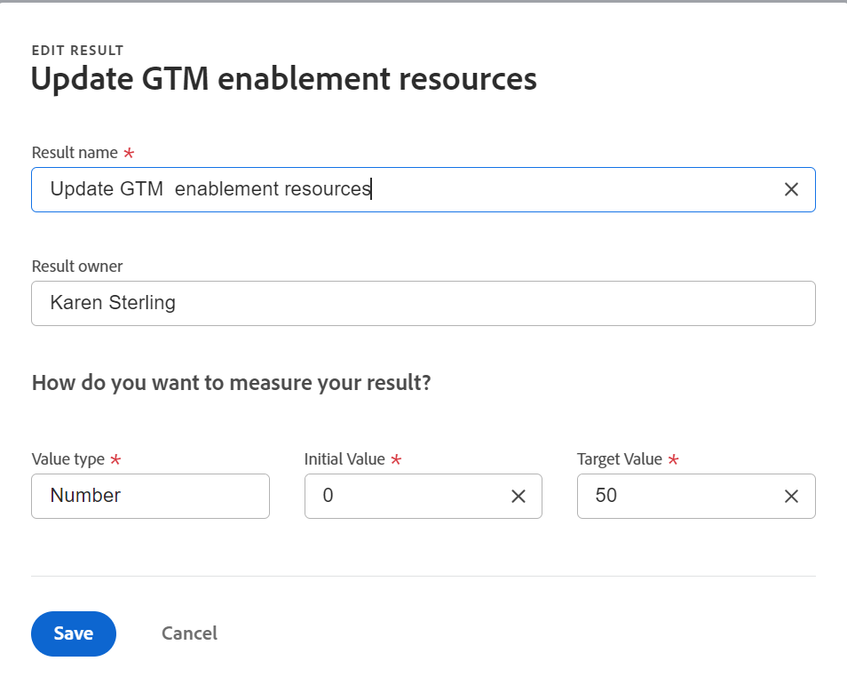

# 在Adobe Workfront目标中编辑结果和活动

Adobe Workfront管理员向您授予对Adobe Workfront目标的正确访问权限后，您可以创建和编辑目标、结果和活动。

有关创建目标、结果和活动的信息，请参阅以下文章：

* [在Adobe Workfront目标中创建目标](../../workfront-goals/goal-management/create-goals.md)
* [Adobe Workfront目标中的结果和活动入门](../../workfront-goals/results-and-activities/get-started-with-results-and-activities.md)
* [将结果添加到Adobe Workfront目标中的目标](../../workfront-goals/results-and-activities/add-results-to-goals.md)
* [将活动添加到Adobe Workfront目标中的目标](../../workfront-goals/results-and-activities/add-activities-to-goals.md)

## 访问要求

您必须具备以下条件：

<table style="table-layout:auto">
<col>
</col>
<col>
</col>
<tbody>
 <tr> 
   <td role="rowheader">Adobe Workfront计划*</td> 
   <td> 
   
对于新计划和许可证结构：
  <ul><li>Ultimate计划 </li></ul>
   

对于当前计划和许可证结构： 
<ul><li> Pro或更高版本 </li>
  <li>除了Adobe Workfront许可证之外，还提供了Workfront目标许可证。</li></ul>

   </td> 
  </tr>
 <tr>
 <td role="rowheader">Adobe Workfront许可证*</td>
 <td>
 
新许可证：参与者或更高版本

 或
 
当前许可证：请求或更高版本
 
有关详细信息，请参阅<a href="../../administration-and-setup/add-users/access-levels-and-object-permissions/wf-licenses.md" class="MCXref xref">Adobe Workfront许可证概述</a>。
 </td>
 </tr>
 <tr>
 <td role="rowheader">产品*</td>
 <td>
 
 新产品要求，为以下项之一： 

<ul>
<li>Select或Prime Adobe Workfront计划和附加Adobe Workfront Goals许可证。</li>
<li>Ultimate Workfront计划，默认情况下包括Workfront目标。 </li></ul>
 
或

 
当前产品要求： Workfront计划和Adobe Workfront Goals的附加许可证。 
 
有关信息，请参阅<a href="../../workfront-goals/goal-management/access-needed-for-wf-goals.md" class="MCXref xref">使用Workfront目标的要求</a>。 
 </td>
 </tr>
 <tr>
 <td role="rowheader">
访问级别
</td>
 <td> 
编辑对目标的访问权限
 </td>
 </tr>
 <tr data-mc-conditions="">
 <td role="rowheader">对象权限</td>
 <td>
  

  
查看目标的权限或更高以查看目标

  
管理目标的权限以编辑它

  
有关共享目标的信息，请参阅<a href="../../workfront-goals/workfront-goals-settings/share-a-goal.md" class="MCXref xref">在Workfront目标中共享目标</a>。 

  
 </td>
 </tr>
 <tr>
   <td role="rowheader">
布局模板
</td>
   <td> 
必须为包括Workfront管理员在内的所有用户分配一个布局模板，该模板应包括主菜单中的目标区域。 
  
</td>
  </tr>
</tbody>
</table>

*有关详细信息，请参阅Workfront文档中的[访问要求](/help/quicksilver/administration-and-setup/add-users/access-levels-and-object-permissions/access-level-requirements-in-documentation.md)。

## 编辑结果和活动时的注意事项

<!--
According to Vazgen, access levels will add more considerations.)
-->

* 您可以编辑属于您创建的目标或您有权管理的目标的结果和活动。
* 您无法从Workfront目标中编辑作为活动连接到目标的项目进度。 当项目中的任务完成时，将更新项目进度。 您可以通过断开项目之间的连接将其从目标中删除。 有关详细信息，请参阅文章[从Adobe Workfront目标中的目标删除结果、活动和项目](../../workfront-goals/results-and-activities/remove-results-activities-from-goals.md)中的“断开项目连接”部分。

  >[!NOTE]
  >
  >如果在项目级别更新以下项目信息，则Workfront目标会自动在目标级别更新该信息：
  >
  >   
  >   
  >   * 项目所有者
  >   * 项目名称
  >   * 项目完成百分比
  >   
  >   
  >有关将项目连接到目标的信息，请参阅[在Adobe Workfront目标中添加项目](../../workfront-goals/results-and-activities/connect-projects-to-goals-overview.md)。

* 当结果和活动不再与目标进度相关时，您可以从目标中删除它们。 无法恢复已删除的结果和活动。 有关删除结果和活动的信息，请参阅[从Adobe Workfront目标中的目标删除结果、活动和项目](../../workfront-goals/results-and-activities/remove-results-activities-from-goals.md)。
* 您可以编辑与任何时间段（包括过去）的目标关联的结果和活动。
* 编辑结果和活动会更新其设置，而不会更新其进度。 您必须更新结果和活动的进度。 有关更新目标、结果和活动进度的信息，请参阅[在Adobe Workfront目标中更新目标进度](../../workfront-goals/goal-review-and-workfront-goals-sections/check-in-goals.md)。

## 编辑结果

<!--
Editing results differs depending on which environment you use.

### Edit results in the Production environment

1. Go to the goal for which you want to edit a result and click the goal name to open the **Goal Details** panel.
1. Click **Results**.
1. Click the **gear icon**  to the right of the result you want to edit.

   

1. Click **Edit** to edit the following information:

   | Field |Description|
   |---|---|
   | Name |The name of the result. |
   | Owner |The owner of result.  |
   | Value |How you measure the progress of the result. |
   | Initial |The original value of the result. |
   | Target |The desired value when the result is completed. |

1. Click **Save**.
-->

1. 单击&#x200B;**主菜单** ，然后单击&#x200B;**目标**。
1. 从目标列表中，单击目标的名称以打开目标页面。
1. 单击左侧面板中的&#x200B;**进度指示器**。
1. 在进度指示器列表中选择一个结果，然后单击&#x200B;**编辑**&#x200B;图标。

   “编辑结果”框打开。

   

1. 编辑以下信息：
   * **结果名称**：结果的名称。 使用说明性名称，说明完成目标需要获得的结果。
   * **结果所有者**：结果的所有者。 所有者必须是活动的Workfront用户。
   * **值类型**：如何度量结果的进度。
   * **初始值**：结果的原始值。
   * **目标值**：结果完成时所需的值。
有关结果字段的详细信息，请参阅[将结果添加到目标](../results-and-activities/add-results-to-goals.md)。
1. 单击&#x200B;**保存**。

## 编辑活动

<!--
Editing activities differs depending on which environment you use.

### Edit activities in the Production environment

>[!TIP]
>
>You cannot edit the Activity Type after you saved an activity on a goal.

1. Go to the goal for which you want to edit an activity and click the goal name to open the **Goal Details** panel.
1. Click **Activities**.
1. Click the **gear icon**  to the right of the activity you want to edit .

   

1. Click **Edit** to edit the following information:

   | Field |Description |
   |---|---|
   | Name |The name of the activity. |
   | Owner |The owner of activity.  |

1. Click **Save**.
-->

1. 单击&#x200B;**主菜单** ，然后单击&#x200B;**目标**。
1. 从目标列表中，单击目标的名称以打开目标页面。
1. 单击左侧面板中的&#x200B;**进度指示器**。
1. 在“进度指示器”列表中选择活动，然后单击&#x200B;**编辑**&#x200B;图标。

   将打开“编辑活动”框。

   

1. 编辑以下信息：
   * **活动名称**：活动的名称。 使用说明性名称，说明应该执行哪些活动以指示目标完成。
   * **活动所有者：**&#x200B;该活动的所有者。 所有者必须是活动的Workfront用户。\
     有关活动字段的详细信息，请参阅[将活动添加到目标](../results-and-activities/add-activities-to-goals.md)。
1. 单击&#x200B;**保存**。

