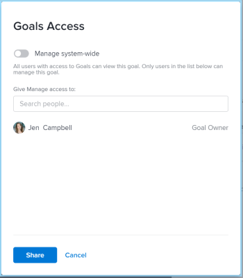

# 在Adobe Workfront目标中共享目标

当您共享目标时，您会将目标的管理权限授予未创建该目标的人员。

## 访问要求

您必须具备以下条件：

<table style="table-layout:auto">
<col>
</col>
<col>
</col>
<tbody>
 <tr> 
   <td role="rowheader">Adobe Workfront计划*</td> 
   <td> 
   
对于新计划和许可证结构：
  <ul><li>Ultimate计划 </li></ul>
   

对于当前计划和许可证结构： 
<ul><li> Pro或更高版本 </li>
  <li>除了Adobe Workfront许可证之外，还提供了Workfront目标许可证。</li></ul>

   </td> 
  </tr>
 <tr>
 <td role="rowheader">Adobe Workfront许可证*</td>
 <td>
 
新许可证：参与者或更高版本

 或
 
当前许可证：请求或更高版本
 </td>
 </tr>
 <tr>
 <td role="rowheader">产品*</td>
 <td>
 
 新产品要求，为以下项之一： 

<ul>
<li>Select或Prime Adobe Workfront计划和附加Adobe Workfront Goals许可证。</li>
<li>Ultimate Workfront计划，默认情况下包括Workfront目标。 </li></ul>
 
或

 
当前产品要求： Workfront计划和Adobe Workfront Goals的附加许可证。 
 
有关信息，请参阅<a href="../../workfront-goals/goal-management/access-needed-for-wf-goals.md" class="MCXref xref">使用Workfront目标的要求</a>。 
 </td>
 </tr>
 <tr>
 <td role="rowheader">访问级别</td>
 <td> 
编辑对目标的访问权限
 </td>
 </tr>
 <tr data-mc-conditions="">
 <td role="rowheader">对象权限</td>
 <td>
  

  
查看目标的权限或更高以查看目标

  
管理目标的权限以编辑它

  
有关共享目标的信息，请参阅<a href="../../workfront-goals/workfront-goals-settings/share-a-goal.md" class="MCXref xref">在Workfront目标中共享目标</a>。 

  
 </td>
 </tr>
<tr>
   <td role="rowheader">
布局模板
</td>
   <td> 
必须为包括Workfront管理员在内的所有用户分配一个布局模板，该模板应包括主菜单中的目标区域。 
  
</td>
  </tr>
</tbody>
</table>

*有关详细信息，请参阅Workfront文档中的[访问要求](/help/quicksilver/administration-and-setup/add-users/access-levels-and-object-permissions/access-level-requirements-in-documentation.md)。

## 有关共享目标的注意事项

* 用户可以对目标具有以下权限：

  <table style="table-layout:auto"> 
   <col> 
   </col> 
   <col> 
   </col> 
   <tbody> 
   <tr> 
      <td role="rowheader">
<b>目标权限</b>
</td> 
      <td>
      
<b>描述</b>
 </td> 
   </tr> 
   <tr> 
      <td role="rowheader">
查看
</td> 
      <td>
      
用户有权查看目标，但他们不能编辑目标的信息，不能添加或编辑结果或活动的信息，不能更新状态或删除目标。
      
      
默认情况下，所有有权访问“目标”的用户都可以查看系统中的所有目标。 如果用户在访问级别具有对目标的编辑访问权限，则可以复制目标。
 </td> 
   </tr> 
   <tr> 
      <td role="rowheader">
管理
</td> 
      <td> 
用户可以编辑目标的所有信息（包括结果或活动），包括删除这些信息。
 
      
只有目标创建者或明确授予目标管理权限的用户才能管理目标。
 
      只有对目标具有管理权限的用户才能与他人共享目标，以便他们获得目标的管理权限。 
 </td> 
   </tr> 
   </tbody> 
   </table>

* 您可以与其他人共享以下类型的目标：

   * 您创建的目标
   * 由您有权管理的其他人创建的目标。

* 如果您具有目标的管理权限，则可以更改目标创建者的目标权限。 默认情况下，他们在创建目标时拥有管理权限，但您可以将他们的权限更改为“查看”。

## 共享目标

1. 单击右上角的&#x200B;**主菜单**&#x200B;图标 > **目标**。

   <!-- Add this when Shell is available to all: or (if available), click the **Main Menu** icon  in the upper-left corner)
   -->

   此时将显示“目标列表”。

1. 单击列表中目标的名称。 此时将打开目标页面。

1. 单击目标名称旁边的&#x200B;**更多图标**，然后单击&#x200B;**共享**。

   

   此时将显示“目标访问”框。

   

1. 执行下列操作之一：

   * 选择&#x200B;**管理系统范围**&#x200B;设置，将管理权限授予系统中对其访问级别中的目标具有编辑访问权限的每个人。 默认情况下，所有新目标均会取消选择此选项。
   * 开始在&#x200B;**将管理权限授予**&#x200B;框中键入要为其授予管理权限的用户名称。 当其名称出现在列表中时选择该名称。

     >[!TIP]
     >
     >您只能与其他用户共享目标。 您无法与组、团队或您的公司共享目标。

1. 单击&#x200B;**共享**。

   目标将与您指定的用户共享。 “系统范围”标签或具有目标管理权限的用户名称将显示在目标详细信息面板的访问管理字段中。

## 目标权限选项

下表列出了在共享目标时可以授予的权限。 有关用户根据其许可证获得的访问权限的详细信息，请参阅[授予对Adobe Workfront目标的访问权限](../../administration-and-setup/add-users/configure-and-grant-access/grant-access-goals.md)。

<table border="1" cellspacing="15" cellpadding="1"> 
 <col> 
 </col> 
 <col> 
 </col> 
 <col> 
 </col> 
 <thead> 
  <tr> 
   <th> 
<strong>操作</strong> 
 </th> 
   <th> 
<strong>管理</strong> 
 </th> 
   <th> 
<strong>视图</strong> 
 </th> 
  </tr> 
 </thead> 
 <tbody> 
  <tr> 
   <td> 
查看目标
 </td> 
   <td> 
✓
 </td> 
   <td> 
✓
 </td> 
  </tr> 
  <tr> 
   <td> 
查看结果或活动
 </td> 
   <td> 
✓
 </td> 
   <td> 
✓
 </td> 
  </tr> 
  <tr> 
   <td>复制目标* </td> 
   <td>✓ </td> 
   <td>✓</td> 
  </tr> 
  <tr data-mc-conditions=""> 
   <td>将结果或活动转换为其他目标*</td> 
   <td>✓</td> 
   <td>✓</td> 
  </tr> 
  <tr> 
   <td>查看添加为活动的项目** </td> 
   <td>✓</td> 
   <td>✓</td> 
  </tr> 
  <tr> 
   <td>编辑目标</td> 
   <td>✓</td> 
   <td> </td> 
  </tr> 
  <tr> 
   <td>编辑结果或活动</td> 
   <td>✓</td> 
   <td> </td> 
  </tr> 
  <tr> 
   <td>添加目标的结果或活动</td> 
   <td>✓</td> 
   <td> </td> 
  </tr> 
  <tr> 
   <td>将项目作为活动关联到目标**</td> 
   <td>✓</td> 
   <td> </td> 
  </tr> 
  <tr> 
   <td> 
删除目标
 </td> 
   <td> 
✓
 </td> 
   <td> 
 
 </td> 
  </tr> 
  <tr> 
   <td> 
删除结果或活动
 </td> 
   <td> 
✓
 </td> 
   <td> 
 
 </td> 
  </tr> 
  <tr> 
   <td>从目标断开项目连接</td> 
   <td>✓</td> 
   <td> </td> 
  </tr> 
 </tbody> 
</table>

*您必须拥有访问级别中目标的“编辑”访问权限，才能将结果和活动转换为目标。

**您必须具有查看项目的访问权限，以及对已添加或要添加到目标以查看项目的查看权限。

有关项目访问级别的信息，请参阅[授予项目访问权限](../../administration-and-setup/add-users/configure-and-grant-access/grant-access-projects.md)。

有关项目权限的信息，请参阅[在Adobe Workfront中共享项目](../../workfront-basics/grant-and-request-access-to-objects/share-a-project.md)。

 
