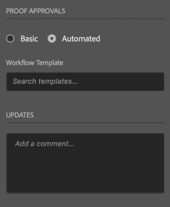

# 从上传校样 [!DNL Illustrator]

您可以将艺术展示板作为校样直接上传到 [!DNL Adobe Workfront] 进行彻底的审查和批准。

## 访问要求

您必须具有以下访问权限才能执行本文中的步骤：

<table style="table-layout:auto"> 
 <col> 
 <col> 
 <tbody> 
 <tr> 
   <td role="rowheader">[!DNL Adobe Workfront] 计划*</td> 
   <td> 
当前计划：[!UICONTROL Pro]或更高版本
 
或
 
旧版计划：[!UICONTROL Premium]
 
有关使用不同计划校样访问权限的更多信息，请参阅。
 </td> 
  </tr> 
  <tr> 
   <td role="rowheader">[!DNL Adobe Workfront] 许可证*</td> 
   <td> 
当前计划：[!UICONTROL Work]或[!UICONTROL Proof]
 
旧版计划：任意（必须为用户启用校样）
 </td> 
  </tr> 
  <tr> 
   <td role="rowheader">产品</td> 
   <td>您必须具有 [!DNL Adobe Creative Cloud] 除 [!DNL Workfront] 许可证。</td> 
  </tr> 
  <tr> 
   <td role="rowheader">校对权限配置文件 </td> 
   <td>[!UICONTROL Manager]或更高版本</td> 
  </tr> 
  <tr> 
   <td role="rowheader">对象权限</td> 
   <td> 
编辑对[!UICONTROL Documents]的访问
 
有关请求其他访问权限的信息，请参阅 <a href="../../workfront-basics/grant-and-request-access-to-objects/request-access.md" class="MCXref xref">请求对对象的访问 </a>.
 </td> 
  </tr> 
 </tbody> 
</table>

&#42;要了解您拥有的计划、角色或校样权限配置文件，请联系您的 [!DNL Workfront] 或 [!DNL Workfront Proof] 管理员。

## 先决条件

* 您必须安装 [!DNL Adobe Workfront for design and video] 插件，然后才能从 [!DNL Illustrator].

   有关说明，请参阅 [安装 [!DNL Adobe Workfront for design and video]](/help/quicksilver/workfront-integrations-and-apps/adobe-workfront-for-creative-cloud/wf-install-cc.md).

## 上传基本校样

1. 单击 **[!UICONTROL 菜单]** 图标，然后选择 **[!UICONTROL 工作列表]**. 您还可以使用菜单导航到父对象。

   

1. 转到要上传校样的工作项。
1. 单击 **[!UICONTROL 文档]** 图标  中。
1. 单击 **[!UICONTROL 新建文件]** 在插件底部附近。
1. 启用 **[!UICONTROL 创建校样]** 切换。
1. 选择 **[!UICONTROL 资产类型]** 下拉菜单中。

   

1. 在 **[!UICONTROL 校样批准]** 选择 **[!UICONTROL 基本]**.
1. （可选）添加批准者。
1. （可选）在 **[!UICONTROL 更新]** 的上界。

   

1. （可选）在中键入校样的名称 **[!UICONTROL 校样名称]** 框中。
1. （可选）选择 **[!UICONTROL 添加外部文件]** 从计算机添加文件。
1. 单击 **[!UICONTROL 上传]**，然后根据上面选择的资产类型配置任何所需的导出选项。

   \
   文档将显示在 [!UICONTROL 文档] 区域。

## 上传自动校样

1. 单击 **[!UICONTROL 菜单]** 图标，然后选择 **[!UICONTROL 工作列表]**. 您还可以使用菜单导航到父对象。

   

1. 转到要上传校样的工作项。
1. 单击 **[!UICONTROL 文档]** 图标  中。

1. 单击 **[!UICONTROL 新建文件]** 在插件底部附近。
1. 启用 **[!UICONTROL 创建校样]** 切换，然后选择 **[!UICONTROL 资产类型]** 下拉菜单中。

   

1. 在 **[!UICONTROL 校样批准]** 选择 **[!UICONTROL 自动]**.
1. （可选）在 **[!UICONTROL 工作流模板]** 框中，键入校样工作流模板的名称。

{{adjust-proof-settings}}

1. （可选）在 **[!UICONTROL 更新]** 的上界。

    <!-- new screenshot -->

1. （可选）在中键入校样的名称 **[!UICONTROL 校样名称]** 框中。
1. （可选）选择 **[!UICONTROL 添加外部文件]** 从计算机添加文件。
1. 单击 **[!UICONTROL 上传]**，然后根据上面选择的资产类型配置任何所需的导出选项。

   \
   文档将显示在 [!UICONTROL 文档] 区域。

## 上传新校样版本

您可以上传校样的新版本。 该插件会记住在以前版本中设置的校对工作流，但您可以根据需要更改此工作流。

1. 单击 **[!UICONTROL 菜单]** 图标，然后选择 **[!UICONTROL 工作列表]**. 您还可以使用菜单导航到父对象。

   

1. 转到将文档上传到所需的工作项。
1. 单击 **[!UICONTROL 文档]** 图标 中。

1. 单击 **[!UICONTROL 新版本]** 在插件底部附近。
1. 选择 **[!UICONTROL 资产类型]** 下拉菜单中。
1. 启用 **[!UICONTROL 创建校样]** 切换，然后选择 **[!UICONTROL 资产类型]** 下拉菜单中。

   

1. 在 *[!UICONTROL *校样批准]**部分，选择 **[!UICONTROL 基本]** 或 **[!UICONTROL 自动]**.

1. 添加 **[!UICONTROL 审阅人]** 或 **[!UICONTROL 工作流模板]** 根据您在步骤7中选择的批准类型。

1. （可选）在 **[!UICONTROL 更新]** 的上界。
1. 单击 **[!UICONTROL 上传]**，然后根据上面选择的资产类型配置任何所需的导出选项。
文档将显示在 [!UICONTROL 文档] 区域。
