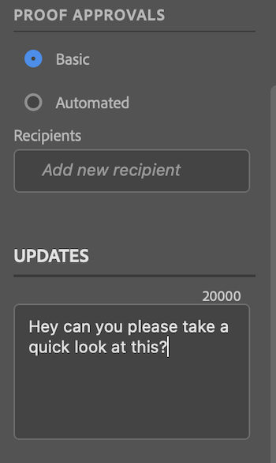

# 从[!DNL Photoshop]上传校样

您可以将某些Photoshop文档预设类型作为验证直接上传到[!DNL Adobe Workfront]，以进行彻底审阅和批准。

>[!IMPORTANT]
>
>该文件必须是照片文档预设，如[Photoshop中的模板和预设](https://helpx.adobe.com/photoshop/using/create-documents.html)中所述。

## 访问要求

+++ 展开以查看本文中各项功能的访问要求。

<table style="table-layout:auto"> 
 <col> 
 <col> 
 <tbody> 
  <tr> 
   <td role="rowheader">[!DNL Adobe Workfront] 包</td> 
   <td> 任何</td> 
  </tr> 
  <tr> 
   <td role="rowheader">[!DNL Adobe Workfront] 许可证</td> 
   <td> 
   
标准

   
工作或更高
 </td> 
  </tr> 
  <tr> 
   <td role="rowheader">其他产品</td> 
   <td>除了[!DNL Adobe Creative Cloud]许可证，您还必须具有[!DNL Workfront]许可证。</td> 
  </tr> 
  <tr> 
   <td role="rowheader">校样权限配置文件 </td> 
   <td>[!UICONTROL Manager]或更高版本</td> 
  </tr> 
  <tr> 
   <td role="rowheader">对象权限</td> 
   <td> 
编辑对[!UICONTROL 文档]的访问权限
  </td> 
  </tr> 
 </tbody> 
</table>

有关信息，请参阅Workfront文档中的[访问要求](/help/quicksilver/administration-and-setup/add-users/access-levels-and-object-permissions/access-level-requirements-in-documentation.md)。

+++

## 先决条件

* 您必须先安装[!DNL Adobe Workfront for Photoshop]，然后才能从[!DNL Adobe Photoshop]上载校样。

  有关说明，请参阅[安装 [!DNL Adobe Workfront for Photoshop]](../../workfront-integrations-and-apps/adobe-workfront-for-creative-cloud/wf-cc-install-ps.md)。

## 上传基本校对

1. 单击右上角的&#x200B;**[!UICONTROL 菜单]**&#x200B;图标，然后选择&#x200B;**[!UICONTROL 工作列表]**。 您还可以使用菜单导航到父对象。

   

1. 转到要上载校样的工作项。
1. 单击导航栏中的&#x200B;**[!UICONTROL 文档]**&#x200B;图标。
1. 单击&#x200B;**[!UICONTROL 面板底部附近的]**&#x200B;新建文件[!DNL Workfront]。
1. 启用&#x200B;**[!UICONTROL 创建验证]**&#x200B;切换开关。
1. （可选）在&#x200B;**[!UICONTROL 校对名称]**&#x200B;文本框中键入校对的名称。
1. 在&#x200B;**[!UICONTROL 校对审批]**&#x200B;部分中，选择&#x200B;**[!UICONTROL 基本]**。
1. （可选）添加批准者。
1. （可选）在&#x200B;**[!UICONTROL 更新]**&#x200B;区域键入评论。

   

1. 从下拉菜单中选择&#x200B;**[!UICONTROL 资源类型]**。

1. （可选）选择&#x200B;**[!UICONTROL 添加外部文件]**&#x200B;以从您的计算机添加文件。
1. 单击&#x200B;**[!UICONTROL 上传]**，然后根据以上选择的资源类型配置任何所需的导出选项。

   插件中的\
   文档出现在[!UICONTROL 的]面板的[!DNL Workfront]文档[!DNL Photoshop]区域和[!DNL Workfront]桌面应用程序中。

## 上传自动验证

1. 单击右上角的&#x200B;**[!UICONTROL 菜单]**&#x200B;图标，然后选择&#x200B;**[!UICONTROL 工作列表]**。 您还可以使用菜单导航到父对象。

   

1. 转到要上载校样的工作项。
1. 单击导航栏中的&#x200B;**[!UICONTROL 文档]**&#x200B;图标。

1. 单击&#x200B;**[!UICONTROL 面板底部附近的]**&#x200B;新建文件[!DNL Workfront]。
1. 启用&#x200B;**[!UICONTROL 创建验证]**&#x200B;切换开关。
1. （可选）在&#x200B;**[!UICONTROL 校对名称]**&#x200B;文本框中键入校对的名称。
1. 在&#x200B;**[!UICONTROL 校对审批]**&#x200B;部分中，选择&#x200B;**[!UICONTROL 自动]**。
1. （可选）在&#x200B;**[!UICONTROL 工作流模板]**&#x200B;框中，键入验证工作流模板的名称。

{{adjust-proof-settings}}

>[!NOTE]
>
> 如果工作流模板中有任何空白必填字段，则自动验证设置会自动打开，并且您需要填充这些字段才能上传验证。

1. （可选）在&#x200B;**[!UICONTROL 更新]**&#x200B;区域键入评论。

   

1. 从下拉菜单中选择&#x200B;**[!UICONTROL 资源类型]**。
1. （可选）选择&#x200B;**[!UICONTROL 添加外部文件]**&#x200B;以从您的计算机添加文件。
1. 单击&#x200B;**[!UICONTROL 上传]**，然后根据以上选择的资源类型配置任何所需的导出选项。
文档出现在[!UICONTROL 的]面板的[!DNL Workfront]文档[!DNL Photoshop]区域和[!DNL Workfront]桌面应用程序中。

## 上传新验证版本

您可以上传新版本的验证。 该插件会记住在以前的版本上设置的验证工作流，但您可以根据需要更改此设置。

1. 单击右上角的&#x200B;**[!UICONTROL 菜单]**&#x200B;图标，然后选择&#x200B;**[!UICONTROL 工作列表]**。 您还可以使用菜单导航到父对象。

   

1. 转到需要上载文档的工作项。
1. 单击导航栏中的&#x200B;**[!UICONTROL 文档]**&#x200B;图标。

1. 单击&#x200B;**[!UICONTROL 面板底部附近的]**&#x200B;新版本[!DNL Workfront]。
1. 启用&#x200B;**[!UICONTROL 创建验证]**&#x200B;切换开关。

1. 在&#x200B;*[!UICONTROL *校对审批]&#x200B;**分区中，选择&#x200B;**&#x200B;[!UICONTROL 基本]&#x200B;**&#x200B;或&#x200B;**&#x200B;[!UICONTROL 自动]**。

1. 根据您在步骤7中选择的审批类型添加&#x200B;**[!UICONTROL 审阅者]**&#x200B;或&#x200B;**[!UICONTROL 工作流模板]**。

1. （可选）在&#x200B;**[!UICONTROL 更新]**&#x200B;区域键入评论。
1. 从下拉菜单中选择&#x200B;**[!UICONTROL 资源类型]**。
1. 单击&#x200B;**[!UICONTROL 上传]**，然后根据以上选择的资源类型配置任何所需的导出选项。
文档出现在[!UICONTROL 的]面板的[!DNL Workfront]文档[!DNL Photoshop]区域和[!DNL Workfront]桌面应用程序中。
