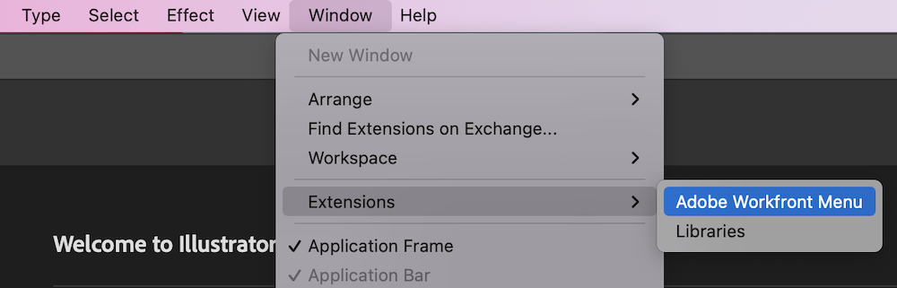

# 安装并打开 [!DNL Adobe Workfront for design and video]

您可以安装 [!DNL Adobe Workfront for design and video] 从 [!DNL Adobe Marketplace]. 此插件支持以下Creative Cloud应用程序：

{{cc-plugin-app-list}}

[!DNL Adobe Workfront for design and video] 支持以下语言：

* 英语
* 法语
* 德语
* 意大利语
* 西班牙语
* 日语
* 葡萄牙语
* 简体中文
* 繁体中文
* 朝鲜语

>[!NOTE]
>
>有单独的安装说明 [!DNL Photoshop] 和 [!DNL XD]. 有关更多信息，请参阅 [安装 [!DNL Adobe Workfront for Photoshop]](/help/quicksilver/workfront-integrations-and-apps/adobe-workfront-for-creative-cloud/wf-cc-install-ps.md) 和 [安装 [!DNL Adobe Workfront for XD]](/help/quicksilver/workfront-integrations-and-apps/adobe-workfront-for-creative-cloud/wf-adobe-xd-install.md).

## 访问要求

您必须具有以下权限才能执行本文中的步骤：

<table style="table-layout:auto"> 
 <col> 
 <col> 
 <tbody> 
 <!-- <tr> 
   <td role="rowheader">[!DNL Adobe Workfront] plan*</td> 
   <td> 
[!UICONTROL Pro] or higher
 </td> 
  </tr> 
  <tr data-mc-conditions=""> 
   <td role="rowheader">[!DNL Adobe Workfront] license*</td> 
   <td> 
[!UICONTROL Work] or [!UICONTROL Plan]
 </td> 
  </tr> -->
  <tr> 
   <td role="rowheader">产品</td> 
   <td>
您必须拥有 [!DNL Adobe Creative Cloud] 除了许可证之外， [!DNL Workfront] 许可证。

有关更多信息，请参阅 <a href="https://helpx.adobe.com/support/programs/cc-support-policy.html#cce" class="MCXref xref" xrefformat="{para}">Creative Cloud支持政策</a>.
</td> 
  </tr> 
 </tbody> 
</table>

&#42;要了解您拥有的计划、许可证类型或访问权限，请联系贵机构的 [!DNL Workfront] 管理员。

## 先决条件

* 您必须安装 [!DNL Creative Cloud] 在为该应用程序安装Workfront插件之前，希望使用该应用程序。

## 安装 [!DNL Workfront for design and video] （贵组织）

如果您是 [!DNL Adobe Admin Console] 管理员，您可以包括 [!DNL Adobe Workfront for design and video] 在 [!DNL Creative Cloud] 部署包。 有关更多信息，请参阅 [在包中包含插件](https://helpx.adobe.com/in/enterprise/using/manage-extensions.html).

[在此处查看视频教程](https://www.youtube.com/watch?v=zzvXNLIBzrc){target=_blank}.

## 安装 [!DNL Workfront for design and video] 单独

您可以安装 [!DNL Adobe Workfront for design and video] 您自己从 [!DNL Adobe Exchange].

1. 转到 [Adobe Workfront for Design and Video安装页面](https://adobe.com/go/cc_plugins_discover_plugin?pluginId=108938&amp;workflow=share) 在Adobe交换上。
1. 在显示的对话框中，单击 **打开 [!DNL Adobe Creative Cloud] 桌面应用程序**.
1. 一次 [!DNL Adobe Creative Cloud] 插件管理器打开，单击 **[!UICONTROL 安装]**.
1. 读取对话框中的信息，然后单击 **[!UICONTROL 确定]**.
1. 一次 [!DNL Workfront for design and video] 在installed中，打开 [!DNL Creative Cloud] 您需要的应用程序，并找到 [!DNL Workfront] 插件面板中的插件。

1. 有关如何打开的信息，请继续阅读以下部分 [!DNL Workfront for design and video].

## 打开 [!DNL Adobe Workfront for design and video]

1. 打开要使用的Creative Cloud插件。

1. 创建新项目，或打开现有项目。

1. 在顶部菜单中，单击 **Windows** > **扩展** > **Adobe Workfront菜单**.

   >[!NOTE]
   >
   >如果您使用Premiere Pro，则必须打开一个项目才能访问此菜单。

   

   >[!TIP]
   >
   >如果您没有看到 [!DNL Adobe Workfront for design and video] 从扩展菜单将其打开后，它可能会位于Creative Cloud应用程序之后。 尝试最小化应用程序以查找插件。

1. 有关如何登录的信息，请继续阅读以下部分 [!DNL Adobe Workfront for design and video].

## 登录 [!DNL Adobe Workfront for design and video]

1. 从 **[!UICONTROL 插件]** 菜单，选择 **[!UICONTROL 插件面板]**.
1. 选择 **[!DNL Adobe Workfront for design and video]**.
1. 输入域，然后单击 **[!UICONTROL 登录]**. 此时将打开一个浏览器页面。

   >[!TIP]
   >
   >* 要查找您的域，请打开浏览器，导航至 [!DNL Workfront] 实例，并复制URL的第一部分：\
   >
   >
   > * 如果您的Workfront实例已与Experience Cloud集成，请要求您的管理员为您提供Admin Console中产品> Workfront下的Workfront域。

1. 在浏览器中，输入 [!DNL Workfront] 凭据，然后单击 **[!UICONTROL 登录]**. 如果贵公司使用单点登录(SSO)，则会将您引导至您的SSO提供商页面以进行登录。

   >[!NOTE]
   >
   >系统可能不会提示您输入 [!DNL Workfront] 凭据（如果您最近登录）。

1. 按照提示登录 [!DNL Workfront].

   >[!NOTE]
   >
   >* [!DNL Workfront] 连接到 [!DNL Adobe Creative Cloud] OAuth 2.0是一种安全标准，大多数基于Web的集成都将其用于用户身份验证和授权。
   >* 当系统提示您输入 [域或主机] 的 [!DNL Workfront] 帐户，使用以下格式键入它： *yourCompany&#39;sDomain.my.workfront.com*. 您公司的域通常是您公司的名称。

1. 单击 **[!UICONTROL 允许访问]** 以完成登录。
1. 返回至 [!DNL Adobe Photoshop] 看看你的作品。

