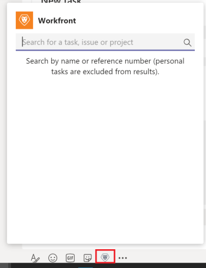

# 从[!DNL Microsoft Teams]访问[!DNL Adobe Workfront]

<!--Audited: 01/2024-->

>[!IMPORTANT]
>
>由于[Microsoft将过渡到“新团队”客户端](https://learn.microsoft.com/en-us/microsoftteams/teams-classic-client-end-of-availability)，因此Classic Teams客户端在2025年7月1日后将不再可用。 要继续使用Microsoft Teams和Workfront等集成应用程序，客户必须在此日期之前过渡到新团队客户端。
>
>更新的Workfront集成现已可用，并与新团队体验完全兼容。 在大多数情况下，用户完成过渡后，Workfront会自动显示。 如果不包含，则可以从Microsoft Teams App Store手动安装集成。 若要在New Teams客户端中安装或验证Workfront集成，请参阅[安装 [!DNL Adobe Workfront] Microsoft Teams](/help/quicksilver/workfront-integrations-and-apps/using-workfront-with-microsoft-teams/install-workfront-ms-teams.md)。

您可以通过在[!DNL Workfront]机器人渠道或任何其他团队渠道中键入命令，从[!DNL Microsoft Teams]访问[!DNL Adobe Workfront]并在[!DNL Workfront]中执行多个操作。

您可以从[!DNL Microsoft Teams]在[!DNL Workfront]中执行以下操作：

* 搜索项目、任务或问题
* 创建个人任务
* 响应通知
* 管理文档审批

您从[!DNL Microsoft Teams]中用于执行这些操作的命令因您想从哪个渠道访问[!DNL Workfront]而异。

>[!NOTE]
>
>[!DNL Microsoft Teams]不再支持[!DNL Internet Explorer]。 要使用[!DNL Adobe Workfront for Microsoft Teams integration]，您必须使用[!DNL Internet Explorer]以外的Web浏览器。

## 访问权限要求

+++ 展开可查看本文所述功能的访问权限要求。

<table style="table-layout:auto"> 
 <col> 
 <col> 
 <tbody> 
  <tr> 
   <td role="rowheader">Adobe Workfront 包</td> 
   <td> 
“任一”
 </td> 
  </tr> 
  <tr> 
   <td role="rowheader">Adobe Workfront许可证</td> 
   <td> 
标准

   
工作版或更高版本
 </td> 
  </tr> 
 </tbody> 
</table>

有关信息，请参阅Workfront文档中的[访问要求](/help/quicksilver/administration-and-setup/add-users/access-levels-and-object-permissions/access-level-requirements-in-documentation.md)。

+++

## 先决条件

如果满足以下条件，则可以从[!DNL Microsoft Teams]在[!DNL Adobe Workfront]中创建个人任务：

* 团队所有者已为您的团队安装和配置[!DNL Workfront for Microsoft Teams]。
* 您已从[!DNL Microsoft Teams]登录[!DNL Workfront]。

## 从[!DNL Workfront]机器人聊天频道访问[!DNL Workfront]

您必须登录到Workfront。

1. 打开&#x200B;**[!DNL Workfront]**&#x200B;机器人聊天频道。
1. 单击文本字段下的&#x200B;**[!DNL Workfront]**&#x200B;图标以显示搜索框。

   

1. 开始键入项目、任务或问题的名称。

   有关搜索项的信息，请参阅[在 [!DNL Microsoft Teams]](../../workfront-integrations-and-apps/using-workfront-with-microsoft-teams/search-for-and-share-wf-items-in-ms-teams.md)的 [!DNL Microsoft Teams][&#128279;](../../workfront-integrations-and-apps/using-workfront-with-microsoft-teams/search-for-and-share-wf-items-in-ms-teams.md) in the article Search for and share [!DNL Adobe Workfront] 项中搜索和共享 [!DNL Adobe Workfront] 项。

1. 单击&#x200B;**[!UICONTROL 在此处键入您的问题]**&#x200B;字段。

   

1. 执行下列操作之一：

   * 单击&#x200B;**[!UICONTROL 我该做什么？]**，然后&#x200B;**[!UICONTROL 登录]**&#x200B;或注销&#x200B;**[!UICONTROL 第]**&#x200B;项（共[!DNL Workfront]项），在[!DNL Workfront]中创建&#x200B;**[!UICONTROL 新任务]** （个人任务），或通过列出可用命令获取&#x200B;**[!UICONTROL 帮助]**。

   * 通过在&#x200B;**[!UICONTROL 在此处键入问题]**&#x200B;字段中键入命令直接访问[!DNL Workfront]。

     命令不区分大小写。

     [!DNL Workfront]机器人在[!DNL Workfront]机器人聊天渠道中响应您的请求。

## 从团队渠道访问[!DNL Workfront]

您必须登录到Workfront。

1. 打开团队渠道并键入&#x200B;**@[!DNL Workfront]**，然后选择&#x200B;**[!DNL Workfront].**

1. 单击&#x200B;**[!UICONTROL 搜索]**&#x200B;以搜索项目、任务或问题。

   有关搜索项的信息，请参阅 [!DNL Microsoft Teams][&#128279;](../../workfront-integrations-and-apps/using-workfront-with-microsoft-teams/search-for-and-share-wf-items-in-ms-teams.md)文章中的 [!DNL Microsoft Teams][&#128279;](../../workfront-integrations-and-apps/using-workfront-with-microsoft-teams/search-for-and-share-wf-items-in-ms-teams.md) section in the Search for and share [!DNL Adobe Workfront] 项中的搜索和共享 [!DNL Adobe Workfront] 项。

1. 键入以下任意命令以在Workfront中执行这些操作。\
   命令不区分大小写：

   * **[!UICONTROL 登录]**&#x200B;以登录[!DNL Workfront]
   * **[!DNL Log out]**&#x200B;以注销Workfront
   * **[!DNL New task]**&#x200B;以创建新的个人任务

     有关从[!DNL Microsoft Teams]创建任务的信息，请参阅[从 [!DNL Microsoft Teams]](../../workfront-integrations-and-apps/using-workfront-with-microsoft-teams/create-workfront-tasks-from-ms-teams.md)创建 [!DNL Adobe Workfront] 任务。

   * **[!UICONTROL 帮助]**&#x200B;查看所有可用命令的列表。

     [!DNL Workfront]机器人在[!DNL Workfront]机器人聊天渠道中响应您的请求。

1. 转到[!DNL Workfront]机器人聊天频道以访问[!DNL Workfront]并完成您的请求。
