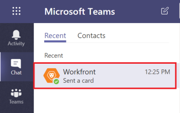

# 安装 [!DNL Adobe Workfront] Microsoft Teams

的 [!DNL Adobe Workfront for Microsoft Teams] 应用程序允许您在 [!DNL Workfront] 不离开 [!DNL Microsoft Teams] 聊天渠道。

>[!NOTE]
>
>[!DNL Microsoft Teams] 不再支持 [!DNL Internet Explorer]. 使用 [!DNL Adobe Workfront for Microsoft Teams integration]，则必须使用 [!DNL Internet Explorer].

## 访问要求

您必须具有以下访问权限才能执行本文中的步骤：

<table style="table-layout:auto"> 
 <col> 
 <col> 
 <tbody> 
  <tr> 
   <td role="rowheader">[!DNL Adobe Workfront] 计划*</td> 
   <td> 
任意
 </td> 
  </tr> 
  <tr> 
   <td role="rowheader">[!DNL Adobe Workfront] 许可证*</td> 
   <td> 
[!UICONTROL Work]、[!UICONTROL Plan]
 </td> 
  </tr> 
 </tbody> 
</table>

&#42;要了解您拥有的计划、许可类型或访问权限，请联系您的 [!DNL Workfront] 管理员。

## 先决条件

您必须是 [!DNL Microsoft Teams] 安装 [!DNL Workfront] 表示 [!DNL Microsoft Teams].

## 安装 [!DNL Workfront for Microsoft Teams]

作为 [!DNL Microsoft Teams]，则可以安装 [!DNL Workfront for Microsoft Teams] 应用程序 [!DNL Microsoft] 存储或来自 [!DNL Workfront].

* [安装 [!DNL Workfront for Microsoft Teams] 从Microsoft商店](#install-workfront-for-microsoft-teams-from-the-microsoft-store)
* [安装 [!DNL Workfront for Microsoft Teams] 从专用文件](#install-workfront-for-microsoft-teams-from-a-private-file)

### 安装 [!DNL Workfront for Microsoft Teams] 从 [!DNL Microsoft] 存储

1. 登录到 [!DNL Microsoft Teams] 作为团队所有者。
1. 选择要为其安装的团队 [!DNL Workfront for Microsoft Teams] 应用程序。
1. 单击 **[!UICONTROL 存储]** 中。

   

1. 在 **[!UICONTROL 全部搜索]** 框，文字 *[!DNL Workfront]*.

1. 单击 **[!DNL Workfront]** 卡，然后按照向导中的说明操作。
1. （推荐）从 **[!UICONTROL 添加到团队]** 下拉菜单，并启用 **[!UICONTROL 是]** 选项，以将应用程序添加到团队。

   

1. 选择 **[!UICONTROL 常规]** 要在该渠道中为选定的团队使用应用程序，请单击 **[!UICONTROL 设置]**.

   

1. 安装完成后，会在 [!UICONTROL 常规] 所选团队的渠道。 团队的所有成员都可以看到此通知。
1. （可选）固定您的 [!DNL Workfront] 更便于访问的应用程序：

   1. 单击 **[!UICONTROL 更多]** 图标 [!UICONTROL 常规] 渠道。

   1. 将鼠标悬停在 [!DNL Workfront] 应用程序，然后单击 **[!UICONTROL 更多]** 图标。

      

   1. 单击 **[!UICONTROL 固定]**.

      这会添加 [!DNL Workfront] 图标。 您可以快速访问 [!UICONTROL 搜索] 区域。

      有关搜索的信息 [!DNL Workfront] 项目，请参阅 [搜索和共享 [!DNL Adobe Workfront] 项目 [!DNL Microsoft Teams]](../../workfront-integrations-and-apps/using-workfront-with-microsoft-teams/search-for-and-share-wf-items-in-ms-teams.md).

1. 单击 **[!UICONTROL 登录到[!DNL Workfront]]** 访问 [!DNL Workfront from Microsoft Teams].

   有关登录到的信息 [!DNL Workfront]，请参阅 [从Microsoft Teams登录Workfront](#log-in-to-workfront-from-microsoft-teams) 章节。

### 安装 [!DNL Workfront for Microsoft Teams] 从专用文件

如果贵组织限制从 [!DNL Microsoft] 存储，您必须联系我们的支持团队，并请求 [!DNL Workfront for Microsoft Teams] 应用程序来安装应用程序。

有关联系我们支持团队的信息，请参阅 [联系客户支持](../../workfront-basics/tips-tricks-and-troubleshooting/contact-customer-support.md).

安装 [!DNL Workfront for Microsoft Teams] 从专用文件：

1. 保存从收到的专用文件 [!DNL Workfront] 在你的电脑上。
1. 登录到 [!DNL Microsoft Teams] as a [!DNL Microsoft] 团队所有者。
1. 单击 **[!UICONTROL 更多]** 图标 [!DNL Workfront for Microsoft Teams].

   

1. 单击 **[!UICONTROL 管理团队]**.
1. 选择 **[!UICONTROL 应用程序]** ，然后单击 **[!UICONTROL 上传自定义应用程序]** 屏幕右下角。

1. 浏览您在计算机上保存的专用文件，然后按照安装步骤进行安装 [!DNL Workfront for Microsoft Teams].
1. 安装完成后，所选团队的常规渠道中会显示安装成功的通知。 团队的所有成员都可以看到此通知。
1. （可选）单击 **[!UICONTROL 更多]** 图标 **[!UICONTROL 在此处键入您的问题]** 字段。

1. （可选）将鼠标悬停在 [!DNL Workfront] 应用程序，然后单击 **[!UICONTROL 更多]** 图标。

   

1. （可选）单击 **[!UICONTROL 固定]**.

   这会添加 [!DNL Workfront] 图标 [!UICONTROL 在此处键入您的问题] 字段。 您可以快速访问 [!UICONTROL 搜索] 区域。\
   有关搜索Workfront项目的信息，请参阅 [搜索和共享 [!DNL Adobe Workfront] 项目 [!DNL Microsoft Teams]](../../workfront-integrations-and-apps/using-workfront-with-microsoft-teams/search-for-and-share-wf-items-in-ms-teams.md).

## 登录到 [!DNL Workfront] 从 [!DNL Microsoft] 团队

As a [!DNL Microsoft Teams] 团队所有者，您必须安装 [!DNL Workfront for Microsoft Teams] 应用程序，然后您或团队中的任何人才能登录 [!DNL Workfront from Microsoft Teams].

登录到 [!DNL Workfront] 从 [!DNL Microsoft Teams]，您可以 [!DNL Workfront] 通知 [!DNL Workfront] 机器人渠道，或者您可以在 [!DNL Workfront] 从 [!DNL Microsoft Teams].

有关安装的信息 [!DNL Workfront] 应用程序，请参阅 [安装 [!DNL Workfront for Microsoft Teams]](#install-workfront-for-microsoft-teams) 章节。

有关访问的信息 [!DNL Workfront] 从 [!DNL Microsoft Teams] 要执行某些操作，请参阅 [访问 [!DNL Adobe Workfront] 从 [!DNL Microsoft Teams]](../../workfront-integrations-and-apps/using-workfront-with-microsoft-teams/access-workfront-from-ms-teams.md).

登录 [!DNL Workfront] 从 [!DNL Microsoft Teams]:

1. 转到 **[!UICONTROL 常规]** 团队的渠道，其中 [!DNL Workfront for Microsoft Teams] 已安装应用程序，并单击 **[!UICONTROL 登录Workfront]**.

   的 [!DNL Workfront] 机器人聊天渠道添加到您的 [!DNL Microsoft Teams] 聊天渠道。

   

1. 转到 [!DNL Workfront] 机器人聊天渠道 [!DNL Microsoft Teams] 和类型 *[!UICONTROL 登录]* 在 **[!UICONTROL 在此处键入您的问题]** 字段。

   或

   单击 **[!UICONTROL 登录]**.

   

   将打开一个新的浏览器选项卡。

1. 按照提示登录 [!DNL Workfront] 使用增强的身份验证、OAuth 2.0或您的安全断言标记语言(SAML)URL。

   >[!NOTE]
   >
   >* 提示您输入的域时 [!DNL Workfront] 帐户，请使用以下格式键入： *yourCompany&#39;sDomain.my.workfront.com*. 您公司的域通常是您公司的名称。
   >* 增强的身份验证在 [!DNL Workfront] 管理员为此集成启用了此功能。

1. 关闭用于登录的浏览器选项卡，然后返回 [!DNL Microsoft Teams].

   通知将显示在 [!DNL Workfront] 机器人聊天渠道确认您已登录到 [!DNL Workfront] 成功。
