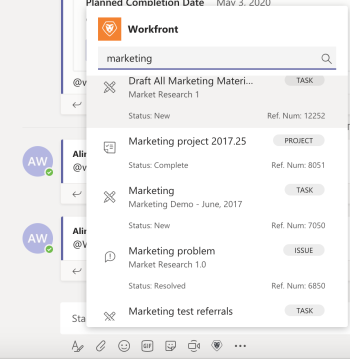

# 在[!DNL Adobe Workfront]中搜索和共享[!DNL Microsoft Teams]项

>[!IMPORTANT]
>
>由于[Microsoft将过渡到“新团队”客户端](https://learn.microsoft.com/en-us/microsoftteams/teams-classic-client-end-of-availability)，因此Classic Teams客户端在2025年7月1日后将不再可用。 要继续使用Microsoft Teams和Workfront等集成应用程序，客户必须在此日期之前过渡到新团队客户端。
>
>更新的Workfront集成现已可用，并与新团队体验完全兼容。 在大多数情况下，用户完成过渡后，Workfront会自动显示。 如果不包含，则可以从Microsoft Teams App Store手动安装集成。 若要在New Teams客户端中安装或验证Workfront集成，请参阅[安装 [!DNL Adobe Workfront] Microsoft Teams](/help/quicksilver/workfront-integrations-and-apps/using-workfront-with-microsoft-teams/install-workfront-ms-teams.md)。

您可以在[!DNL Workfront]的任何[!DNL Adobe Workfront]渠道中搜索[!DNL Microsoft Teams]个项目，并与团队成员共享这些项目。

* [在 [!DNL Workfront] 中共享 [!DNL Microsoft Teams]项的先决条件](#prerequisites-for-sharing-workfront-items-in-microsoft-teams-prerequisites-for-sharing-workfront-items-in-microsoft-teams)
* [搜索并共享 [!DNL Workfront] 中的 [!DNL Microsoft Teams]个项目](#search-for-and-share-adobe-workfront-items-in-microsoft-teams)

## 访问要求

+++ 展开以查看本文中各项功能的访问要求。

<table style="table-layout:auto"> 
 <col> 
 <col> 
 <tbody> 
  <tr> 
   <td role="rowheader">Adobe Workfront包</td> 
   <td> 
任何
 </td> 
  </tr> 
  <tr> 
   <td role="rowheader">Adobe Workfront许可证</td> 
   <td> 
标准

   
工作或更高
 </td> 
  </tr> 
 </tbody> 
</table>

有关信息，请参阅Workfront文档中的[访问要求](/help/quicksilver/administration-and-setup/add-users/access-levels-and-object-permissions/access-level-requirements-in-documentation.md)。

+++

## 共享[!DNL Workfront]中的[!DNL Microsoft Teams]项的先决条件 {#prerequisites-for-sharing-workfront-items-in-microsoft-teams}

如果满足以下条件，则可以搜索并共享[!DNL Workfront]中的[!DNL Microsoft Teams]项：

* 团队所有者已为您的团队安装和配置[!DNL Workfront for Microsoft Teams]。
* 您已从[!DNL Workfront]Microsoft Teams[!UICONTROL 登录]。

有关安装适用于Microsoft Teams的[!UICONTROL Workfront]以及从[!UICONTROL 登录到]Workfront[!DNL Microsoft Teams]的信息，请参阅[安装适用于Microsoft Teams的Adobe Workfront](../../workfront-integrations-and-apps/using-workfront-with-microsoft-teams/install-workfront-ms-teams.md)。

>[!NOTE]
>
>[!DNL Microsoft Teams]不再支持[!DNL Internet Explorer]。 要使用[!DNL Adobe Workfront for Microsoft Teams integration]，您必须使用[!DNL Internet Explorer]以外的Web浏览器。

## 在[!DNL Workfront]中搜索和共享[!DNL Microsoft Teams]项 {#search-for-and-share-workfront-items-in-microsoft-teams}

您可以从[!DNL Workfront]渠道搜索以下[!DNL Microsoft Teams]项：

* 项目
* 任务

  >[!NOTE]
  >
  >您无法搜索个人任务。

* 问题

找到所搜索的项目后，可以在[!DNL Microsoft Teams]中与其他用户共享。

要从[!DNL Workfront]中搜索[!DNL Microsoft Teams]项目并与他人共享，请执行以下操作：

1. 在[!DNL Microsoft Teams]中，转到任何聊天渠道并单击&#x200B;**[!DNL Workfront]**&#x200B;图标。
1. 通过执行以下操作之一搜索[!DNL Workfront]项目：

   * 单击对话字段下的[!DNL Workfront]图标。\

     \
      根据您的设置，此图标可能会显示在&#x200B;**[!UICONTROL 更多]**&#x200B;图标下。\
      \
      默认显示&#x200B;**[!UICONTROL 搜索]**&#x200B;框。

   * 从任何渠道中键入&#x200B;*@[!DNL Workfront]*，选择Workfront，然后选择&#x200B;**[!UICONTROL 搜索].**

     

1. 在提供的[!UICONTROL 搜索]框中，开始键入项目、任务或问题的名称或参考编号，并在项目出现在列表中时单击它。\
   \
   这会将包含[!DNL Workfront]项的卡片添加到聊天字段中。 一些关于项目的信息包含在卡片上，包括项目的名称、父对象、状态、优先级、完成百分比。

1. （可选）在[!DNL Workfront]卡下添加评论，然后单击&#x200B;**[!UICONTROL 发送]**&#x200B;或按Enter。\
   这会将包含[!DNL Workfront]项的消息发送到您的频道。\
   渠道的所有成员都可以看到此消息，包括[!DNL Workfront]卡上的信息。

1. 单击&#x200B;**[!UICONTROL 在Workfront中查看]**&#x200B;以在[!DNL Workfront]中查看该项目。\
   只有拥有[!DNL Workfront]许可证的用户才能查看[!DNL Workfront]中的项目。
