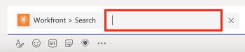

# 搜索和共享 [!DNL Adobe Workfront] 中的项目 [!DNL Microsoft Teams]

>[!NOTE]
>
>Adobe WorkfrontMicrosoft Teams集成当前仅支持ClassicMicrosoft Teams体验。

您可以搜索 [!DNL Workfront] 任何项目中的 [!DNL Adobe Workfront] 中的频道 [!DNL Microsoft Teams] 并与团队成员共享这些项目。

* [共享的先决条件 [!DNL Workfront] 中的项目 [!DNL Microsoft Teams]](#prerequisites-for-sharing-workfront-items-in-microsoft-teams-prerequisites-for-sharing-workfront-items-in-microsoft-teams)
* [搜索和共享 [!DNL Workfront] 中的项目 [!DNL Microsoft Teams]](#search-for-and-share-adobe-workfront-items-in-microsoft-teams)

## 访问要求

您必须具有以下权限才能执行本文中的步骤：

<table style="table-layout:auto"> 
 <col> 
 <col> 
 <tbody> 
  <tr> 
   <td role="rowheader">[!DNL Adobe Workfront] 计划*</td> 
   <td> 
任何
 </td> 
  </tr> 
  <tr> 
   <td role="rowheader">[!DNL Adobe Workfront] 许可证*</td> 
   <td> 
[！UICONTROL工作]，[！UICONTROL计划]
 </td> 
  </tr> 
 </tbody> 
</table>

&#42;要了解您拥有的计划、许可证类型或访问权限，请联系贵机构的 [!DNL Workfront] 管理员。

## 共享的先决条件 [!DNL Workfront] 中的项目 [!DNL Microsoft Teams] {#prerequisites-for-sharing-workfront-items-in-microsoft-teams}

您可以搜索和共享 [!DNL Workfront] 中的项目 [!DNL Microsoft Teams] 如果满足以下条件：

* 已安装和配置团队所有者 [!DNL Workfront for Microsoft Teams] 为你的团队准备的。
* 您已登录 [!DNL Workfront] 从 [!UICONTROL Microsoft Teams].

有关安装的信息 [!UICONTROL 适用于Microsoft Teams的Workfront] 并登录到 [!UICONTROL Workfront] 从 [!DNL Microsoft Teams]，请参见 [安装适用于Microsoft Teams的Adobe Workfront](../../workfront-integrations-and-apps/using-workfront-with-microsoft-teams/install-workfront-ms-teams.md).

>[!NOTE]
>
>[!DNL Microsoft Teams] 不再支持 [!DNL Internet Explorer]. 要使用 [!DNL Adobe Workfront for Microsoft Teams integration]，您必须使用Web浏览器，而不是 [!DNL Internet Explorer].

## 搜索和共享 [!DNL Workfront] 中的项目 [!DNL Microsoft Teams] {#search-for-and-share-workfront-items-in-microsoft-teams}

您可以搜索以下内容 [!DNL Workfront] 项来自 [!DNL Microsoft Teams] 渠道：

* 项目
* 任务

  >[!NOTE]
  >
  >您无法搜索个人任务。

* 问题

找到搜索的项目后，您可以将其与中的其他用户共享。 [!DNL Microsoft Teams].

要搜索 [!DNL Workfront] 项目来源 [!DNL Microsoft Teams] 并与他人共享：

1. 在 [!DNL Microsoft Teams]，转到任意聊天渠道并单击 **[!DNL Workfront]** 图标。
1. 搜索 [!DNL Workfront] 通过执行以下操作之一执行项目：

   * 单击 [!DNL Workfront] 图标。\

     \
      根据您的设置，此图标可能会显示在 **[!UICONTROL 更多]** 图标。\
      \
      此 **[!UICONTROL Search]** 框默认显示。

   * 类型 *@[!DNL Workfront]* 从任意渠道中，选择Workfront ，然后选择 **[!UICONTROL Search].**

     

1. 在 [!UICONTROL 搜索] 框中，开始键入项目、任务或问题的名称或参考编号，并在其出现在列表中时单击它。\
   \
   这会添加一个卡片，其中包含 [!DNL Workfront] 聊天字段中的项目。 一些关于项目的信息包含在卡片上，包括项目的名称、父对象、状态、优先级、完成百分比。

1. （可选）在下面添加注释 [!DNL Workfront] 信息卡，然后单击 **[!UICONTROL 发送]** 或按Enter。\
   这将发送包含 [!DNL Workfront] 将项目添加到您的渠道。\
   渠道的所有成员都可以看到此消息，包括 [!DNL Workfront] 卡片。

1. 单击 **[!UICONTROL 在Workfront中查看]** 在中查看项目 [!DNL Workfront].\
   仅限拥有以下属性的用户： [!DNL Workfront] 许可证可以在中查看项目 [!DNL Workfront].
