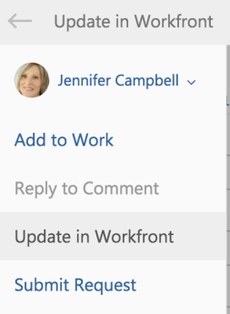

# 从 [!DNL Outlook] 电子邮件

您可以使用 [!DNL Outlook] 电子邮件。

## 访问要求

您必须具有以下访问权限才能执行本文中的步骤：

<table style="table-layout:auto"> 
 <col> 
 <col> 
 <tbody> 
  <tr> 
   <td role="rowheader">[!DNL Adobe Workfront] 计划*</td> 
   <td> 
任意
 </td> 
  </tr> 
  <tr> 
   <td role="rowheader">[!DNL Adobe Workfront] 许可证*</td> 
   <td> 
[!UICONTROL Work]、[!UICONTROL Plan]
 </td> 
  </tr> 
 </tbody> 
</table>

&#42;要了解您拥有的计划、许可类型或访问权限，请联系您的 [!DNL Workfront] 管理员。

## 先决条件

您的 [!DNL Workfront] 管理员必须启用 [!DNL Outlook for Office] with [!DNL Workfront] ，以便您使用此集成。

## 从 [!DNL Outlook] 电子邮件

1. 在 [!DNL Outlook]，选择包含要包含在 [!DNL Adobe Workfront update].
1. 单击 **[!DNL Workfront]** 图标来显示Workfront加载项。\
   您可能需要单击电子邮件右上角的向下箭头才能访问 [!DNL Workfront] 图标。

1. 单击 **[!UICONTROL 菜单]** 图标以显示可用列表 [!DNL Workfront] 选项。\
   

1. 单击 **[!UICONTROL 更新] 在Workfront**.\
   \
   您可以在将电子邮件另存为任务之前，从该电子邮件中更新以下信息：

   * **[!UICONTROL 类型]**:选择要更新的对象类型。 您可以选择 **[!UICONTROL 项目]**, **[!UICONTROL 任务]**&#x200B;或 **[!UICONTROL 问题]**. 您选择的对象将确定在 **[!UICONTROL 名称]** 字段。 如果不确定对象的类型，请选择 **[!UICONTROL 全部]** 以同时搜索项目、任务和问题。

   * **[!UICONTROL 名称]**:开始键入要更新的项目、任务或问题的名称。 当名称显示在下拉列表中时，单击该名称。
   * **[!UICONTROL 更新]**:默认情况下，更新与电子邮件正文相同。 您可以根据需要修改更新。\

      此 [!UICONTROL 更新] 在Workfront中显示为更新状态。

   * **[!UICONTROL 附件]**:任何电子邮件附件都会保存到 [!UICONTROL 文档] 任务区域。 您可以在提交更新之前删除任何附件。

1. （可选）单击 **[!UICONTROL 包括其他]**，开始键入要包含在更新中的用户名称，然后在下拉列表中显示该名称时单击该名称。\
   重复此过程以包含其他用户，然后单击 **[!UICONTROL 完成]**.\
   默认情况下，无论您是否包含通知，您回复的用户都会收到通知。\
   

1. （可选）单击 **[!UICONTROL 锁]** 图标，以限制对公司内用户进行此更新。 锁定更新后，公司外的用户将看不到该更新。

   * **[!UICONTROL 已解锁]:** 对更新所在的项目、任务或问题具有访问权限的任何用户都可以查看更新。\

      默认情况下，将解锁更新。\
      

   * **[!UICONTROL 已锁定]:** 只有贵公司内的用户才能查看更新。\

      

1. 单击 **[!UICONTROL 更新]**.
1. （可选）单击 **[!UICONTROL 在Workfront中查看]** 查看更新项目，其中 [!DNL Workfront] 集成 [!UICONTROL Outlook].
