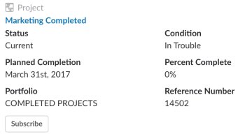

# 访问 [!DNL Adobe Workfront] 对象来自 [!DNL Slack]

链接到 [!DNL Adobe Workfront] 在 [!DNL Slack] 渠道，您可以在 [!DNL Slack]，安装和配置后 [!DNL Workfront for Slack].

有关配置的更多信息 [!DNL Workfront for Slack]，请参阅 [配置 [!DNL Adobe Workfront for Slack]](../../workfront-integrations-and-apps/using-workfront-with-slack/configure-workfront-for-slack.md).

您必须登录到 [!DNL Workfront] 在单独的浏览器选项卡中打开链接，或从 [!DNL Slack].

当用户在 [!DNL Workfront] 与您一起，有关对象的其他信息可能还会与链接一起显示。 发送链接的用户必须至少具有 [!UICONTROL 查看] 对象的权限，以便在 [!DNL Slack].

## 访问要求

您必须具有以下访问权限才能使用本文中描述的功能：

<table style="table-layout:auto"> 
 <col> 
 <col> 
 <tbody> 
  <tr> 
   <td role="rowheader">[!DNL Adobe Workfront] 计划*</td> 
   <td> 
[!UICONTROL Pro]或更高版本
 </td> 
  </tr> 
  <tr> 
   <td role="rowheader">[!DNL Adobe Workfront] 许可证*</td> 
   <td> 
[!UICONTROL计划]
 </td> 
  </tr> 
 </tbody> 
</table>

&#42;要了解您拥有的计划、许可类型或访问权限，请联系您的 [!DNL Workfront] 管理员。

## 先决条件

在从 [!DNL Slack]，您必须

* 配置 [!DNL Workfront for Slack]\
   有关配置的说明 [!DNL Workfront for Slack]，请参阅 [配置 [!DNL Adobe Workfront for Slack]](../../workfront-integrations-and-apps/using-workfront-with-slack/configure-workfront-for-slack.md).

## 从访问项目 [!DNL Slack]

1. 登录到 [!DNL Slack] 实例和登录到 [!DNL Workfront from Slack.]

   有关登录的更多信息，请参阅 [!DNL Workfront] 从 [!DNL Slack]，请参阅“登录到” [!DNL Workfront from Slack]“ ”部分 [访问 [!DNL Adobe Workfront from Slack]](../../workfront-integrations-and-apps/using-workfront-with-slack/access-workfront-from-slack.md).

1. 导航到包含指向 [!DNL Workfront] 项目。

   >[!NOTE]
   >
   >共享链接的用户必须至少具有 [!UICONTROL 查看] 项目的权限，以便您查看有关该项目的其他信息。

   

1. （可选）单击项目的名称以在中将其打开 [!DNL Workfront] 的子菜单。
1. 请考虑查看以下有关项目的其他信息：

   * **[!UICONTROL 状态]:** 有关项目状态的更多信息，请参阅 [访问系统项目状态列表](../../administration-and-setup/customize-workfront/creating-custom-status-and-priority-labels/project-statuses.md).

   * **[!UICONTROL 计划完成日期]**:有关计划完成日期的详细信息，请参阅 [设置项目计划完成日期](../../manage-work/projects/planning-a-project/project-planned-completion-date.md).

   * **[!UICONTROL Portfolio]** 名称：有关组合的更多信息，请参阅 [PortfolioAdobe Workfront概述](../../manage-work/portfolios/portfolios-overview/portfolio-overview.md).

   * **[!UICONTROL 条件]**:有关“项目条件”的更多信息，请参阅 [项目条件和条件类型概述](../../manage-work/projects/manage-projects/project-condition-and-condition-type.md).

   * **[!UICONTROL 完成百分比]**:有关项目完成百分比值的更多信息，请参阅 [项目完成百分比概述](../../manage-work/tasks/task-information/project-percent-complete.md).

   * **[!UICONTROL 参考编号]**:有关对象引用编号的详细信息，请参阅 [使用对象的引用数](../../workfront-basics/navigate-workfront/search/reference-number-of-objects.md).

1. （可选）单击 **[!UICONTROL 订阅]** 订阅项目。

   您会收到一条确认消息，确认您已成功订阅了项目。

## 从访问任务 [!DNL Slack]

1. 登录到 [!DNL Slack] 实例和登录到 [!DNL Workfront from Slack].

   有关登录的更多信息，请参阅 [!DNL Workfront] 从 [!DNL Slack]，请参阅“登录到” [!DNL Workfront] 从 [!DNL Slack]“ ”部分 [访问 [!DNL Adobe Workfront from Slack]](../../workfront-integrations-and-apps/using-workfront-with-slack/access-workfront-from-slack.md).

1. 导航到包含指向 [!DNL Workfront] 任务。

   >[!NOTE]
   >
   >共享链接的用户必须至少具有 [!UICONTROL 查看] 任务的权限，以便您查看有关该任务的其他信息。

1. （可选）单击任务的名称以在中将其打开 [!DNL Workfront] 的子菜单。
1. 请考虑复查有关任务的以下附加信息：

   * **[!UICONTROL 状态]**

      有关任务状态的详细信息，请参阅 [访问系统任务状态列表](../../administration-and-setup/customize-workfront/creating-custom-status-and-priority-labels/task-statuses.md).

   * **[!UICONTROL 完成百分比]**
   * **[!UICONTROL 分配给名称]**
   * **[!DNL Planned Completion Date]**
   * **[!UICONTROL 项目名称]** 或 **[!UICONTROL 父任务名称]**
   * **[!UICONTROL 参考号]**

      有关对象引用编号的详细信息，请参阅 [使用对象的引用数](../../workfront-basics/navigate-workfront/search/reference-number-of-objects.md).

1. （可选）单击 **[!UICONTROL 订阅]** 订阅任务。

   您会收到确认函，确认您已成功订阅了该任务。

1. （可选）单击 **[!UICONTROL 分配给用户]** 将任务分配给用户。
1. （视情况而定）在单击了 **[!UICONTROL 分配给用户]**.

   不能将任务分配给作业角色或团队 [!DNL Slack].

## 访问 [!DNL Slack]

1. 登录到 [!DNL Slack] 实例和登录到 [!DNL Workfront] 从 [!DNL Slack].

   有关从登录Workfront的更多信息 [!DNL Slack]，请参阅“登录到” [!DNL Workfront] 从 [!DNL Slack]“ ”部分 [访问 [!DNL Adobe Workfront] 从 [!DNL Slack]](../../workfront-integrations-and-apps/using-workfront-with-slack/access-workfront-from-slack.md).

1. 导航到包含指向 [!DNL Workfront] 问题。

   >[!NOTE]
   >
   >共享链接的用户必须至少具有 [!UICONTROL 查看] 该问题的权限，以便您查看有关该问题的其他信息。

1. （可选）单击问题的名称以在中将其打开 [!DNL Workfront] 的子菜单。
1. 请考虑复查有关任务的以下附加信息：

   * **[!UICONTROL 状态]**:有关问题状态的更多信息，请参阅 [访问系统问题状态列表](../../administration-and-setup/customize-workfront/creating-custom-status-and-priority-labels/issue-statuses.md).

   * **[!UICONTROL 分配给名称]**
   * **[!UICONTROL 计划完成日期]**
   * **[!UICONTROL 项目名称]**
   * **[!UICONTROL 参考编号]**:有关对象引用编号的详细信息，请参阅 [使用对象的引用数](../../workfront-basics/navigate-workfront/search/reference-number-of-objects.md).

1. （可选）单击 **[!UICONTROL 订阅]** 订阅问题。

   您会收到一条确认消息，表明您已成功订阅了发行。

1. （可选）单击 **[!UICONTROL 分配给用户]** 将问题分配给用户。
1. （视情况而定）在单击了 **[!UICONTROL 分配给用户]**.

   不能将问题分配给作业角色或团队 [!DNL Slack].

## 从访问项目组合 [!DNL Slack]

1. 登录到 [!DNL Slack] 实例和登录到 [!DNL Workfront] 从 [!DNL Slack].

   有关登录的更多信息，请参阅 [!DNL Workfront] 从 [!DNL Slack]，请参阅“登录到” [!DNL Workfront] 从 [!DNL Slack]“ ”部分 [访问 [!DNL Adobe Workfront] 从 [!DNL Slack]](../../workfront-integrations-and-apps/using-workfront-with-slack/access-workfront-from-slack.md).

1. 导航到包含指向 [!DNL Workfront] 组合。

   >[!NOTE]
   >
   >共享链接的用户必须至少具有 [!UICONTROL 查看] 权限，以便您查看有关该组合的其他信息。

1. （可选）单击组合的名称以在中将其打开 [!DNL Workfront] 的子菜单。
1. 请考虑查看以下有关组合的其他信息：

   * **[!UICONTROL Portfolio管理器名称]**
   * **[!UICONTROL 准时]**
   * **[!UICONTROL ROI]**
   * **[!UICONTROL 净值]**
   * **[!UICONTROL 状态]**
   * **[!UICONTROL 预算]**
   * **[!UICONTROL 已对齐]**

      有关组合量度的更多信息，包括 [!UICONTROL ROI], [!UICONTROL 净值], [!UICONTROL 对齐方式]和 [!UICONTROL 开始时间] 和 [!UICONTROL 预算问题] 值，请参阅 [了解 [!UICONTROL Portfolio优化程序].](../../manage-work/portfolios/portfolio-optimizer/portfolio-optimizer-overview.md)

## 从访问程序 [!DNL Slack]

1. 登录到 [!DNL Slack] 实例和登录到 [!DNL Workfront] 从 [!DNL Slack].

   有关登录的更多信息，请参阅 [!DNL Workfront] 从 [!DNL Slack]，请参阅“登录到” [!DNL Workfront] 从 [!DNL Slack]“ ”部分 [访问 [!DNL Adobe Workfront] 从 [!DNL Slack]](../../workfront-integrations-and-apps/using-workfront-with-slack/access-workfront-from-slack.md).

1. 导航到包含指向 [!DNL Workfront] 项目。

   >[!NOTE]
   >
   > 共享链接的用户必须至少具有 [!UICONTROL 查看] 权限，以便您查看有关该程序的其他信息。

1. （可选）单击程序的名称以在中将其打开 [!DNL Workfront] 的子菜单。
1. 请考虑查看有关该计划的以下其他信息：

   * **[!UICONTROL 描述]**
   * **[!UICONTROL 项目组合名称]**
   * **[!UICONTROL 项目经理姓名]**

      有关程序的更多信息，请参阅 [创建和管理程序。](../../manage-work/portfolios/create-and-manage-programs/create-and-manage-programs.md)

## 从 [!DNL Slack]

1. 登录到 [!DNL Slack] 实例和登录到 [!DNL Workfront] 从 [!DNL Slack].

   有关登录的更多信息，请参阅 [!DNL Workfront] 从 [!DNL Slack]，请参阅“登录到” [!DNL Workfront] 从 [!DNL Slack]“ ”部分 [访问 [!DNL Adobe Workfront] 从 [!DNL Slack]](../../workfront-integrations-and-apps/using-workfront-with-slack/access-workfront-from-slack.md).

1. 导航到包含指向 [!DNL Workfront] 报表。

   >[!NOTE]
   >
   >共享链接的用户必须至少具有 [!UICONTROL 查看] 权限，以便您查看有关该报表的其他信息。

1. （可选）单击报表的名称以在中将其打开 [!DNL Workfront] 的子菜单。
