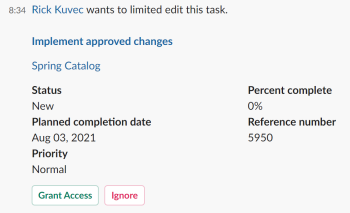

# 从 [!DNL Slack]

安装后 [!DNL Adobe Workfront for Slack]，您可以执行以下操作：

* 访问 [!UICONTROL 主页] 项目来源 [!DNL Slack]
* 查看并接受以下文档处理任务和问题： [!DNL Slack]
* 审核并决定 [!DNL Slack]

有关配置的更多信息 [!DNL Workfront] with [!DNL Slack]，请参阅 [配置 [!DNL Adobe Workfront for Slack]](../../workfront-integrations-and-apps/using-workfront-with-slack/configure-workfront-for-slack.md).

## 访问要求

您必须具备以下条件：

<table style="table-layout:auto"> 
 <col> 
 <col> 
 <tbody> 
  <tr> 
   <td role="rowheader"><a href="https://www.workfront.com/plans" target="_blank">[!DNL Adobe Workfront] 计划</a>*</td> 
   <td> 
[!UICONTROL Pro]或更高版本
 </td> 
  </tr> 
 </tbody> 
</table>

&#42;要了解您拥有的计划、许可证类型或访问权限，请联系您的Workfront管理员。

## 先决条件

在您管理工作和批准之前，请先从 [!DNL Slack]，您必须

* 配置 [!DNL Workfront for Slack]\
   有关配置的说明 [!DNL Workfront for Slack]，请参阅 [配置 [!DNL Adobe Workfront for Slack]](../../workfront-integrations-and-apps/using-workfront-with-slack/configure-workfront-for-slack.md).

## 从 [!DNL Slack]

1. 登录到 [!DNL Slack] 实例和登录到 [!DNL Workfront] 从 [!DNL Slack].\
   有关登录的更多信息，请参阅 [!DNL Workfront] 从 [!DNL Slack]，请参阅“登录到” [!DNL Workfront] 从 [!DNL Slack]“ ”部分 [访问 [!DNL Adobe Workfront] 从 [!DNL Slack]](../../workfront-integrations-and-apps/using-workfront-with-slack/access-workfront-from-slack.md).

1. 在任意渠道中，开始在消息字段中键入以下命令：

   `/workfront home`

   >[!NOTE]
   >
   >* 命令区分大小写。
   >* 您可以使用 `/wf` 而不是 `/workfront`.

   将显示用于访问任务、问题和批准列表的按钮。 单击其中一个按钮，将显示 [!DNL Slack].\
   

1. （可选）单击 **[!UICONTROL 任务]** 以显示所有任务。

   有关管理中任务的详细信息，请参阅 [!DNL Slack]，请参阅 [从 [!DNL Slack]](#manage-your-tasks-from-slack-manage-your-tasks-from-slack).

1. （可选）单击 **[!UICONTROL 问题]** 来显示所有问题。

   有关管理 [!DNL Slack]，请参阅 [从 [!DNL Slack]](#manage-your-issues-from-slack-manage-your-issues-from-slack).

1. （可选）单击 **[!UICONTROL 批准]** 以显示等待您决定的所有批准。\
   有关在 [!DNL Slack]，请参阅 [从 [!DNL Slack]](#manage-your-approvals-from-slack-manage-your-approvals-from-slack).

## 从 [!DNL Slack] {#manage-your-tasks-from-slack}

1. 登录到 [!DNL Slack] 实例和登录到 [!DNL Workfront] 从 [!DNL Slack].\
   有关登录到的信息 [!DNL Workfront] 从 [!DNL Slack]，请参阅“登录到” [!DNL Workfront] 从 [!DNL Slack]“ ”部分 [访问 [!DNL Adobe Workfront] 从 [!DNL Slack]](../../workfront-integrations-and-apps/using-workfront-with-slack/access-workfront-from-slack.md).

1. 在任意渠道中，开始在消息字段中键入以下任一命令：

   `/workfront home`，然后单击 **[!UICONTROL 任务]**

   或

   `/workfront tasks`

   >[!NOTE]
   >
   >* 命令区分大小写。
   >* 您可以使用 `/wf` 而不是 `/workfront`.

   此时将显示列表中的前20项任务。\
   

1. 单击 **[!UICONTROL +`<remaining number>` 更多]** 以显示其他任务。
1. 请考虑查看有关工作项的以下信息：

   * **[!UICONTROL 名称]**
   * **[!UICONTROL 项目名称]** 或 **[!DNL Parent Object Name]**

   * **[!DNL Planned Completion Date]** 工作项的“A/D”部分。
   * **[!DNL Assigned By Name]**:这是分配给您的任务的用户名。
   * **[!UICONTROL 状态]**

1. （可选）单击项目的名称，以在单独的浏览器选项卡中在Workfront中将其打开。
1. （可选）在 **[!UICONTROL 状态]** 字段中，选择新的状态。
1. （可选）单击 **[!UICONTROL 日志时间]**，然后选择 **[!UICONTROL 小时类型]** 和一个小时的时间，记录项目的时间。

   >[!NOTE]
   >
   >* 您只能以整小时或半小时为增量记录小时，最长为12小时30分钟。
   >* 登录日期为今天的小时数。 您无法记录过去或将来日期的时间，从 [!DNL Slack].

   您会收到一条确认消息，指明该时间已被记录。

1. （可选）单击 **[!UICONTROL 处理它]** 接受处理任务。 的 [!UICONTROL 处理它] 按钮。

## 从 [!DNL Slack] {#manage-your-issues-from-slack}

1. 登录到 [!DNL Slack] 实例和登录到 [!DNL Workfront] 从 [!DNL Slack].\
   有关登录的更多信息，请参阅 [!DNL Workfront] 从 [!DNL Slack]，请参阅 [登录到 [!DNL Workfront] 从 [!DNL Slack]](../../workfront-integrations-and-apps/using-workfront-with-slack/access-workfront-from-slack.md#logging-in-to-workfront) section in [Access [!DNL Adobe Workfront] 从 [!DNL Slack]](../../workfront-integrations-and-apps/using-workfront-with-slack/access-workfront-from-slack.md).

1. 在任意渠道中，开始在消息字段中键入以下任一命令：

   `/workfront home`，然后单击 **[!UICONTROL 问题]**

   或

   `/workfront issues`

   >[!NOTE]
   >
   >* 命令区分大小写。
   >* 您可以使用 `/wf` 而不是 `/workfront`.

   此时将显示列表中的前20个问题。\
   

1. 单击 **[!UICONTROL +剩余 `<number>` 更多]** 以显示其他项目。
1. 请考虑查看有关工作项的以下信息：

   * **[!UICONTROL 名称]**
   * **[!UICONTROL 项目]** 名称或父对象名称
   * **[!UICONTROL 到期日]** 日期：这是工作项的计划完成日期。
   * **[!DNL Requested by]** 名称：这是主要联系人（针对问题）或完成分配的用户（针对任务）。

1. （可选）单击问题的名称，以在单独的浏览器选项卡中在Workfront中将其打开。
1. （可选）单击 **[!DNL Work on it]** 要开始处理您尚未接受的问题。

   的 [!UICONTROL 处理它] 按钮。

## 从 [!DNL Slack] {#manage-your-approvals-from-slack}

1. 登录到 [!DNL Slack] 实例和登录到 [!DNL Workfront] 从 [!DNL Slack].\
   有关登录的更多信息，请参阅 [!DNL Workfront] 从 [!DNL Slack]，请参阅“登录到” [!DNL Workfront] 从 [!DNL Slack]“ ”部分 [访问 [!DNL Adobe Workfront] 从 [!DNL Slack]](../../workfront-integrations-and-apps/using-workfront-with-slack/access-workfront-from-slack.md).

1. 在任意渠道中，开始在消息字段中键入以下任一命令：

   `/workfront home`，然后单击 **[!UICONTROL 批准]**

   或

   `/workfront approvals`

   >[!NOTE]
   >
   >* 命令区分大小写。
   >* 您可以使用 `/wf` 而不是 `/workfront`.

   您的 **[!UICONTROL 批准]** 列表显示。 此外，还会显示有关这些项目的其他信息，例如请求该项目的用户名称或该项目所属的项目名称。

1. 单击 **[!UICONTROL +剩余 `<number>` 更多]** 以显示其他项目。

   

   

   

1. 考虑管理以下对象的批准：

   * **项目**

      单击 **[!UICONTROL 批准]** 或 **[!UICONTROL 拒绝]** 接受或拒绝项目的状态更改。

   * **任务**

      单击 **[!UICONTROL 批准]** 或 **[!UICONTROL 拒绝]** 接受或拒绝任务的状态更改。

   * **问题**

      单击 **[!UICONTROL 批准]** 或 **[!DNL Reject]** 接受或拒绝问题的状态更改。

   * **文档**

      单击 **[!UICONTROL 批准]** 要批准文档， **[!UICONTROL 拒绝]** 拒绝，或 **[!UICONTROL 更改]** 以指示您批准了该文档，但文档需要进行其他更改。\
      （可选）将鼠标悬停在文档缩览图上，单击放大镜并预览文档。

   * **校样**&#x200B;单击校样名称以在中将其打开 [!DNL Workfront] 并管理批准。
   * **访问请求**

      单击 **[!UICONTROL 授予访问权限]** 为请求的对象授予增强的权限，或 **[!UICONTROL 忽略]** 以忽略获取更多访问权限的请求。

1. （可选）单击已提交以供审批的对象的名称，以在中将其打开 [!DNL Workfront] 的子菜单。
