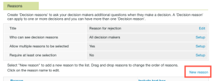

# 在 [!DNL Workfront Proof]

>[!IMPORTANT]
>
>本文介绍独立产品中的功能 [!DNL Workfront Proof]. 有关内部校对的信息 [!DNL Adobe Workfront]，请参阅 [校对](../../../review-and-approve-work/proofing/proofing.md).

As a [!DNL Workfront Proof] 使用“选择”或“高级版”计划的管理员，您可以通过以下方式为创建的所有校样配置审批决策选项 [!DNL Workfront Proof] 组织中的用户：

* 更改决策的名称
* 更改校对查看器中显示的决策顺序
* 决定应显示哪些决策

本文将介绍以下内容：

## 配置决策设置

1. 单击 **[!UICONTROL 帐户设置]**.
1. 打开 **[!UICONTROL 决策]** 选项卡。
1. 进行以下任一更改：

   * 要隐藏决策，请单击 **[!UICONTROL 隐藏]** 你不需要的决定权。
   * 要重命名决策，请单击决策名称，对其进行编辑，然后单击框外（或按Enter）。 [!DNL Workfront Proof] 更新系统中所有现有校样的决策名称。

      >[!IMPORTANT]
      >
      >在重命名决策时保留决策逻辑。 例如，默认决策“已拒绝”可更改为“所需的新版本”，但不应将其更改为“发送到打印机”。

      如果您想返回 [!DNL Workfront Proof] 默认，您可以单击“恢复默认决策”。

>[!NOTE]
>
>* 如果存在多个不同级别的决策，则使用决策背后的逻辑来计算验证工作流的整体状态。
>* “已批准”和“已通过更改批准”的决策将触发自动工作流程的下一个阶段。
>* 如果重命名决策并想要验证逻辑，则可以单击 **[!UICONTROL 活动]** 在左侧的导航面板中，并检查您的活动日志，原始决策会显示在括号中。
>
>  >

## 创建决策原因

决策原因是捕获有关证据的其他决策信息的一种好方法。

1. 单击 **[!UICONTROL 设置]** > **[!UICONTROL 帐户设置]**.

1. 打开 **[!UICONTROL 决策]** 选项卡。
默认情况下，所有决策者都可以获得有关您的验证的理由，但您只能将其限制为主要决策者。
根据您的要求，您可以允许选择多个原因，也可以将其列为单个选择列表。 您还可以强制说明理由，这意味着审阅人必须在允许他们保存对证明的决定之前选择原因。
   

1. 在 **[!UICONTROL 原因]** ，单击 **[!UICONTROL 新原因]**.
   

1. 在下方显示的框中，为“原因”部分键入标题 **[!UICONTROL 原因]**.
1. 如果要包含文本框，请选择 **[!UICONTROL “包含”文本框]**.
1. 单击&#x200B;**[!UICONTROL 保存]**。
   
最重要的步骤是选择应当显示原因的决策。 如果您忘记这样做，原因将不会显示在您的校样中。

1. 选中 **[!UICONTROL 显示原因]** 列。 您可以根据自己的原因选择一个或多个决策。
   

## 创建帖子决策消息

您可以创建帖子决策消息，以在审阅人保存其对校样的决策后显示。

1. 单击 **[!UICONTROL 设置]** > **[!UICONTROL 帐户设置]**.

1. 打开 **[!UICONTROL 决策]** 选项卡。
1. 在 **[!UICONTROL 帖子决策消息]** ，单击 **[!UICONTROL 编辑]** 在 **[!UICONTROL 消息]** 行。
您还可以决定是希望将消息显示给所有决策者，还是希望将消息限制为主要决策者。
   

1. 在 **[!UICONTROL 显示消息]** 列，指定此消息应显示的决策。
如果您没有至少选择一个决策，则校样中将不会显示消息。 请务必至少选中此列中的一个框。
   
