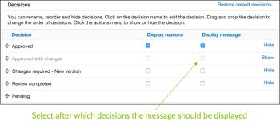

# 在中配置批准决策选项 [!DNL Workfront Proof]

>[!IMPORTANT]
>
>本文介绍了独立版产品中的功能 [!DNL Workfront Proof]. 有关内部校对的信息 [!DNL Adobe Workfront]，请参见 [校对](../../../review-and-approve-work/proofing/proofing.md).

作为 [!DNL Workfront Proof] 管理员使用Select或Premium Edition计划，您可以通过以下方式为创建的所有验证配置批准决策选项 [!DNL Workfront Proof] 您组织中的用户：

* 更改决策的名称
* 更改验证查看器中显示的决策的顺序
* 决定应该显示哪些决策

本文说明以下内容：

## 配置决策设置

1. 单击 **[!UICONTROL 帐户设置]**.
1. 打开 **[!UICONTROL 决策]** 选项卡。
1. 进行以下任何更改：

   * 要隐藏决策，请单击 **[!UICONTROL 隐藏]** 你不需要的决定的右边。
   * 要重命名决策，请单击决策名称，对其进行编辑，然后单击框外部（或按Enter）。 [!DNL Workfront Proof] 更新系统中所有现有校对的决策名称。

     >[!IMPORTANT]
     >
     >在重命名决策时保留决策的逻辑。 例如，默认决策“已拒绝”可以更改为“需要新版本”，但不应更改为“发送到打印机”)。

     如果您想返回 [!DNL Workfront Proof] 默认情况下，您可以单击还原默认决策。

>[!NOTE]
>
>* 如果有多个不同级别的决策，则决策背后的逻辑将用于计算验证工作流的整体状态。
>* “已批准”和“已批准并更改”决策会触发自动工作流的下一阶段。
>* 如果您重命名决策并希望验证逻辑，则可以单击 **[!UICONTROL 活动]** 在左侧导航面板中，查看您的活动日志，其中原始决策显示在括号中。
>
>  >

## 创建决策原因

决策原因是一种获取有关证明的其他决策信息的好方法。

1. 单击 **[!UICONTROL 设置]** > **[!UICONTROL 帐户设置]**.

1. 打开 **[!UICONTROL 决策]** 选项卡。
默认情况下，证明的所有决策者都可以查看原因，但您可以将其限制为仅主要决策者。
根据要求，您可以允许选择多个原因，也可以将其设为单个选择列表。 您还可以将原因设置为必填，这意味着查看者必须先选择原因，然后才能将决策保存到验证中。
   

1. 在 **[!UICONTROL 原因]** 部分，单击 **[!UICONTROL 新原因]**.
   

1. 在下面显示的框中键入原因部分的标题 **[!UICONTROL 原因]**.
1. 如果要包含文本框，请选择 **[!UICONTROL 包含文本框]**.
1. 单击&#x200B;**[!UICONTROL 保存]**。
   
最重要的步骤是选择应显示原因的决策。 如果您忘记这样做，原因将不会显示在您的验证中。

1. 选中 **[!UICONTROL 显示原因]** 列中，标记页面顶部的“决策”列表。 您可以根据自己的原因选择一个或多个决策。
   

## 创建发布决策消息

您可以创建一个帖子决策消息，以供查看者将其决策保存到验证后显示。

1. 单击 **[!UICONTROL 设置]** > **[!UICONTROL 帐户设置]**.

1. 打开 **[!UICONTROL 决策]** 选项卡。
1. 在 **[!UICONTROL 发布决策消息]** 部分，单击 **[!UICONTROL 编辑]** 在 **[!UICONTROL 消息]** 行。
您还可以决定是希望向所有决策者显示消息，还是希望仅向主要决策者显示消息。
   

1. 在 **[!UICONTROL 显示消息]** 列，指定此消息应显示的决策。
如果不选择至少一个决策，则消息将不会显示在您的验证中。 请务必在该列中至少选中一个框。
   
