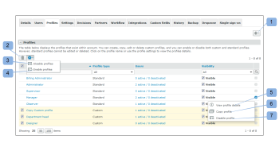

# 在中配置自定义用户档案 [!DNL Workfront Proof]

>[!IMPORTANT]
>
>本文介绍独立产品中的功能 [!DNL Workfront] 证明。 有关内部校对的信息 [!DNL Adobe Workfront]，请参阅 [校对](../../../review-and-approve-work/proofing/proofing.md).

As a [!DNL Workfront Proof] 帐单管理员或 [!DNL Workfront Proof] 管理员，您可以为其他用户配置自定义配置文件。

自定义配置文件允许您为帐户中的用户分配粒度权限，并定义他们对帐户中项目的访问权限级别和权限。 有关自定义用户档案的更多信息，请参阅 [使用创建和管理自定义用户档案 [!DNL Workfront Proof]](../../../workfront-proof/wp-mnguserscontacts/users/create-and-manage-custom-profiles.md).

您可以调整页面布局，以仅查看与您相关的信息：

* 您可以调整显示的项目数(1)
* 您可以过滤用户档案列表以找到要处理的用户档案(2)
* 您可以轻松检查帐户(3)中拥有的用户档案数\
   

## “配置文件”选项卡

的 [!UICONTROL 用户档案] 选项卡，您可以方便地添加和管理自定义用户档案。 在此，您可以执行以下操作：

* 添加新用户档案(1)
* 对配置文件执行批量操作：
* 删除多个用户档案(2)
* 禁用多个配置文件(3)
* 启用多个配置文件(4)
* 访问配置文件详细信息(5)
* 复制用户档案(6)
* 禁用配置文件(7)

有关如何自定义Profiles选项卡的其他信息，请参阅 [使用创建和管理自定义用户档案 [!DNL Workfront Proof]](../../../workfront-proof/wp-mnguserscontacts/users/create-and-manage-custom-profiles.md).

## 配置文件详细信息

利用“配置文件详细信息”页面，可修改为自定义配置文件启用的权限，复制配置文件，删除配置文件，以及查看为其分配配置文件的用户列表。

有关可在此页面上执行的操作的更多信息，请参阅[使用创建和管理自定义用户档案 [!DNL Workfront Proof]](../../../workfront-proof/wp-mnguserscontacts/users/create-and-manage-custom-profiles.md).

* [访问配置文件详细信息页面](#accessing-the-profile-details-page)
* [查看分配了配置文件的用户列表](#viewing-the-list-of-users-with-a-profile-assigned)

### 访问配置文件详细信息页面 {#accessing-the-profile-details-page}

要访问配置文件详细信息，请执行以下操作：

1. 单击配置文件的名称。
1. 

### 查看分配了配置文件的用户列表 {#viewing-the-list-of-users-with-a-profile-assigned}

要查看已分配特定配置文件的用户列表，请执行以下操作：

1. 单击该链接，可显示使用此用户档案的活动用户和已停用用户数(1)。
1. 或者，此列表也显示在“配置文件详细信息”页面上。
1. 

1. 该列表显示了您帐户中为相关用户档案分配的活跃用户和已停用用户。 如果列表太长，您可以方便地调整页面布局，以便仅查看您要查找的信息。
1. 
