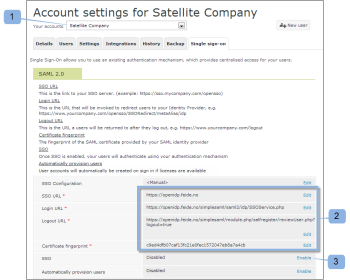
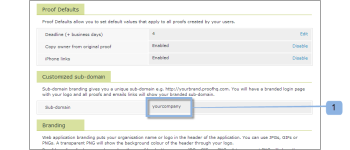

# 为配置单点登录 [!DNL Workfront Proof] 用户

>[!IMPORTANT]
>
>本文介绍独立产品中的功能 [!DNL Workfront Proof]. 有关内部校对的信息 [!DNL Adobe Workfront]，请参阅 [校对](../../../review-and-approve-work/proofing/proofing.md).

如果您拥有Select或Premium计划，则可以提供单点登录(SSO)功能，以便使用现有组织的用户名和密码访问您的 [!DNL Workfront Proof] 帐户。

这意味着您将针对自己的登录系统进行身份验证，而不是针对 [!DNL Workfront Proof] 登录页面。

>[!NOTE]
>
>您必须在 [!DNL Workfront Proof] 帐户启用SAML。 自定义子域可以自由设置。 请参阅 [品牌策略](https://support.workfront.com/hc/en-us/sections/115000921208-Branding) 有关更多信息，请参阅 [品牌 [!DNL Workfront Proof] 站点 — 高级](../../../workfront-proof/wp-acct-admin/branding/brand-wp-site-advanced.md).

## 在内启用SSO [!DNL Workfront Proof]

可以在 [!UICONTROL 单点登录] 选项卡 [!UICONTROL 帐户设置]，并且该规则将应用于 [!DNL Workfront Proof] 帐户。 请参阅 [帐户设置](https://support.workfront.com/hc/en-us/sections/115000912147-Account-settings) 以了解更多信息。

## 实体ID

作为服务提供商，我们已在此处发布了我们的实体ID:

[https://yoursubdomain.my.workfront.com/proof/saml/module.php/saml/sp/metadata.php/phq](https://yoursubdomain.my.workfront.com/proof/saml/module.php/saml/sp/metadata.php/phq) （其中“您的子域”是您帐户的子域）

[!DNL Workfront Proof] 需要用户的电子邮件地址作为其唯一标识符，该标识符可作为以下属性之一传递：

* urn:mace:dir:attribute-def:emailAddress
* http://schemas.xmlsoap.org/ws/2005/05/identity/claims/emailaddress
* http://schemas.xmlsoap.org/claims/EmailAddress
* urn:oid:0.9.2342.19200300.100.1.3
* http://axschema.org/contact/email
* openid.sreg.email
* 邮件
* 电子邮件
* emailAddress

要配置SSO，请执行以下操作：

1. 打开 **[!UICONTROL 单点登录]** 选项卡(1)。
1. 输入 **SSO URL** (2)。
这是指向您的SSO服务器(例如， **https://sso.mycompany.com/opensso**)。

1. 输入 **登录URL** (3)。
将调用此URL以将用户重定向到您的身份提供程序。

1. 这不是您在浏览器中输入的实际URL，而是一个端点，它将处理我们发送的信息以显示“登录”屏幕。

输入 **注销URL** (4)。
例如，这是注销后您将返回到的URL

**https://www.yourcompany.com/services/logout.asp**

1. 输入 **证书指纹** （五）。
1. 您的SAML身份提供程序提供的SAML证书的SHA1指纹。
1. 通过在您的身份提供程序中设置密钥信息，确保包含该密钥信息。
1. 交换机 **单点登录** to **[!UICONTROL 已启用]** (6)。
启用SSO后，您和您帐户中的其他用户将使用您自己的身份验证机制登录。 这意味着当用户访问 [!DNL Workfront Proof] 帐户登录屏幕(例如， **yourcompany.proofhq.com/login**)时，系统会在传输窗口中提示用户访问您自己的身份验证登录页面。

1. （可选）启用 **自动配置用户** (7)。
启用此选项后，将自动为没有自己的用户创建用户帐户 [!DNL Workfront Proof] 用户档案，但将 [!DNL Workfront Proof] 帐户。 仅当帐户尚未达到用户限制时，才会执行此操作。

1. 默认情况下，新配置的用户将分配Manager配置文件权限。 如果您需要更多信息，请参阅 [中的校样权限配置文件 [!DNL Workfront Proof]](../../../workfront-proof/wp-acct-admin/account-settings/proof-perm-profiles-in-wp.md).

## 为卫星帐户启用SSO

将卫星帐户连接到中心帐户后，您可以从中心帐户级别管理它们。

单点登录是Select和Premium的一项功能，因此只能在Select和Premium计划中的卫星上启用单点登录。

1. 单击 **[!UICONTROL 设置]** > **[!UICONTROL 帐户设置]** (1)。

1. 在下拉菜单(2)中单击卫星帐户。
1. 打开 **[!UICONTROL 单点登录]** 选项卡(3)。
1. 开始编辑SSO配置(4)。
1. 
在此，您将使用两种配置方法(5):

1. **继承：** 使用您的中心帐户配置的SSO。
如果用户访问 [!DNL Workfront Proof] 到 **默认登录页面** ([https://www.proofhq.com/login](https://www.proofhq.com/login))将 **两级授权**:首先，系统要求用户使用 [!DNL Workfront Proof] 访问数据（电子邮件和密码）；然后，用户通过SSO窗口转移到SSO登录页面。
因此，启用SSO服务后，我们建议您通过自己的 [!DNL Workfront Proof] 子域/域。

   >[!NOTE]
   >
   >此时，在 [!DNL Workfront Proof] 帐户，您将无法使用这些凭据登录iPhone应用程序。

   1. **手动** （默认）：具有不同配置的SSO（例如，指向另一个身份提供程序）。

      >[!NOTE]
      >
      >如果卫星帐户从中心帐户继承SSO配置，则登录屏幕将为中心帐户的登录屏幕。 当卫星帐户用户在此页面上输入其SSO登录详细信息时，他们将被重定向回卫星帐户。

      

   1. 单击 **[!UICONTROL 保存]** (6)。

## 从中心帐户继承的SSO设置

当您选择从中心帐户继承设置时，您会注意到所有字段现在都填充了中心帐户(7)的数据，并且单点登录在主帐户上自动启用/禁用(8)。 字段中也不再有编辑链接，因为现在已通过您的中心帐户设置和管理卫星帐户的整个单点登录配置。

在您的中心帐户(9)中， [!UICONTROL SSO使用] 字段显示此配置正由卫星帐户(10)使用。\

## 手动配置SSO

如果为卫星帐户(1)选择了手动SSO配置，则需要手动输入单点登录的数据。

1. 单击 **[!UICONTROL 设置]** > **[!UICONTROL 帐户设置]** (1)。

1. 打开 **[!UICONTROL 单点登录]** 选项卡。
1. 单击 **[!UICONTROL 编辑],** 填充字段，然后单击 **[!UICONTROL 保存]** (2)。

1. 在 **[!UICONTROL 单点登录]** 行，单击 **[!UICONTROL 已启用]** (3)。

## SSO登录

1. 单击 **[!UICONTROL 设置]** > **[!UICONTROL 帐户设置]** (1)。

1. 打开 **[!UICONTROL 单点登录]** 选项卡。
1. 确保 [!DNL Workfront Proof] 域/子域(1)已设置，且您的用户有权访问 [!DNL Workfront Proof] 帐户。
   
启用单点登录后，您的子域登录URL(例如yourcompany.proofhq.com/login)会显示一个转移屏幕(2)，通过该屏幕，您可以直接进入单点登录页面。
   

1. 如果用户访问 [!DNL Workfront Proof] 到 **默认登录页** ([https://www.proofhq.com/login](https://www.proofhq.com/login))将 **两级授权**. 首先，系统要求用户使用 [!DNL Workfront Proof] 访问数据（电子邮件和密码）。 然后，用户通过SSO窗口(2)被转移到SSO登录页面。\
   因此，启用SSO服务后，我们建议您通过自己的 [!DNL Workfront Proof] 子域/域。

1. 此时，当您的Workfront Proof帐户上启用了单点登录后，您将无法使用这些凭据登录到iPhone应用程序。

## 关于添加新用户

在 [!DNL Workfront Proof] 帐户时，新用户将不会收到任何确认电子邮件，因为其帐户将被自动激活并准备使用。

从 [!DNL Workfront Proof] 登录页面，在单击 [!UICONTROL 登录] 按钮，用户将被带到您的SSO登录页面，并要求输入您的单点登录登录登录凭据。

>[!IMPORTANT]
>
>用户在身份验证过程中通过电子邮件地址进行标识，这意味着用于SSO登录的电子邮件帐户必须是在您的帐户中注册的用户的电子邮件地址。

## Active Directory联合身份验证服务(AD FS)

Active Directory联合身份验证服务(AD FS)是 [!DNL Microsoft] 可安装在Windows Server操作系统上的软件组件，为用户提供跨组织边界的系统和应用程序的单点登录访问。 有关更多信息，请参阅Microsoft开发人员网络网站上的“Active Directory联合身份验证服务”。

的 [!DNL Workfront Proof] 系统支持SAML 2.0，并且仅与AD FS版本2.0或更高版本兼容。

请参阅 [单点登录 [!DNL Workfront Proof]:AD FS配置](../../../workfront-proof/wp-acct-admin/account-settings/sso-in-wp-adfs-configuration.md) 以了解详细说明。
