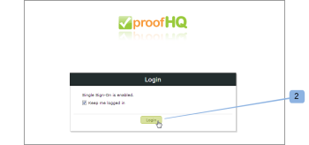

# 配置单点登录 [!DNL Workfront Proof] 用户

>[!IMPORTANT]
>
>本文介绍了独立版产品中的功能 [!DNL Workfront Proof]. 有关内部校对的信息 [!DNL Adobe Workfront]，请参见 [校对](../../../review-and-approve-work/proofing/proofing.md).

如果您拥有Select或Premium计划，则可以提供单点登录(SSO)功能，该功能允许您使用现有组织的用户名和密码来访问 [!DNL Workfront Proof] 帐户。

这意味着您将针对自己的登录系统进行身份验证，而不是针对 [!DNL Workfront Proof] 登录页面。

>[!NOTE]
>
>您必须在上设置自定义子域或域 [!DNL Workfront Proof] 帐户以启用SAML。 自定义子域可自由设置。 参见 [品牌化](https://support.workfront.com/hc/en-us/sections/115000921208-Branding) 欲知更多信息。欲知关于完全自定义域的更多信息，请访问 [品牌化 [!DNL Workfront Proof] 站点 — 高级](../../../workfront-proof/wp-acct-admin/branding/brand-wp-site-advanced.md).

## 在中启用SSO [!DNL Workfront Proof]

单点登录功能可在 [!UICONTROL 单点登录] 选项卡 [!UICONTROL 帐户设置]，并且它适用于您网站上的 [!DNL Workfront Proof] 帐户。 参见 [帐户设置](https://support.workfront.com/hc/en-us/sections/115000912147-Account-settings) 了解更多信息。

## 实体Id

作为服务提供商，我们在此发布了实体ID：

[https://yoursubdomain.proofhq.com/saml/module.php/saml/sp/metadata.php/phq](https://yoursubdomain.proofhq.com/saml/module.php/saml/sp/metadata.php/phq) （其中，“您的子域”是您帐户的子域）

[!DNL Workfront Proof] 需要用户的电子邮件地址作为其唯一标识符，该标识符可以作为以下属性之一传递：

* urn:mace:目录:attribute-def:电子邮件地址
* http://schemas.xmlsoap.org/ws/2005/05/identity/claims/emailaddress
* http://schemas.xmlsoap.org/claims/EmailAddress
* urn:oid:0.9.2342.19200300.100.1.3
* http://axschema.org/contact/email
* openid.sreg.email
* 邮件
* 电子邮件
* 电子邮件地址

要配置SSO，请执行以下操作：

1. 打开 **[!UICONTROL 单点登录]** 选项卡(1)。
1. 输入 **SSO URL** (2)。
这是指向您的SSO服务器的链接(例如， **https://sso.mycompany.com/opensso**)。

1. 输入 **登录URL** （三）。
将调用此URL以将用户重定向到您的身份提供程序。

1. 这不是您在浏览器中输入的实际URL，而是将处理我们发送的信息以显示登录屏幕的端点。

输入 **注销URL** (4)。
例如，这是您注销后返回到的URL

**https://www.yourcompany.com/services/logout.asp**

1. 输入 **证书指纹** (5)。
1. SAML身份提供程序提供的SAML证书的SHA1指纹。
1. 通过在您的身份提供程序中设置此项，确保包括密钥信息。
1. 切换 **SSO** 到 **[!UICONTROL 已启用]** （六）。
启用SSO后，您和您帐户上的其他用户将使用您自己的身份验证机制登录。 这意味着当用户访问 [!DNL Workfront Proof] 帐户登录屏幕(例如， **yourcompany.proofhq.com/login**)，系统将使用传输窗口提示他们进入您自己的身份验证登录页面。

1. （可选）启用 **自动设置用户** (7)。
启用此选项后，将自动为没有自己的用户帐户的用户创建用户帐户 [!DNL Workfront Proof] 配置文件，但将访问您的 [!DNL Workfront Proof] 使用单点登录凭据的帐户。 仅当您的帐户尚未达到用户限制时，才会执行此操作。

1. 默认情况下，新设置的用户将分配有Manager配置文件权限。 如果您需要更多信息，请参阅 [中的校对权限配置文件 [!DNL Workfront Proof]](../../../workfront-proof/wp-acct-admin/account-settings/proof-perm-profiles-in-wp.md).

## 为附属帐户启用SSO

当附属帐户连接到您的中心帐户时，您可以从中心帐户级别管理它们。

单点登录是Select和Premium的一项功能，因此单点登录只能在Select和Premium计划中的卫星上启用。

1. 单击 **[!UICONTROL 设置]** > **[!UICONTROL 帐户设置]** (1)。

1. 在下拉菜单(2)中单击附属帐户。
1. 打开 **[!UICONTROL 单点登录]** 选项卡(3)。
1. 开始编辑SSO配置(4)。
1. 
在此，您将有两种配置方法(5)：

1. **继承：** 使用从您的中心帐户获取的配置进行SSO。
如果用户访问 [!DNL Workfront Proof] 通过 **默认登录页面** ([https://www.proofhq.com/login](https://www.proofhq.com/login))将有 **两个授权级别**：首先，要求用户使用 [!DNL Workfront Proof] 访问数据（电子邮件和密码）；然后通过SSO窗口将用户传输到SSO登录页面。
因此，启用SSO服务后，我们建议通过您自己的 [!DNL Workfront Proof] 子域/域。

   >[!NOTE]
   >
   >此时，当您对以下项启用单点登录时： [!DNL Workfront Proof] 帐户，您将无法使用这些凭据登录iPhone应用程序。

   1. **手动** （默认）：具有不同配置的SSO（例如，指向另一个身份提供程序）。

      >[!NOTE]
      >
      >如果附属帐户从中心帐户继承SSO配置，则登录屏幕将是中心帐户的登录屏幕。 当附属帐户用户在此页面上输入其SSO登录详细信息时，他们将被重定向回附属帐户。

      

   1. 单击 **[!UICONTROL 保存]** （六）。

## 从中心帐户继承的SSO设置

当您选择从您的中心帐户继承设置时，您会注意到所有字段现在都已填充了来自您的中心帐户(7)的数据，并且单点登录在您的主帐户上自动启用/禁用(8)。 字段内也不再有编辑链接，因为卫星帐户的整个SSO配置现在是通过您的中心帐户设置和管理的。

在您的中心帐户中(9) [!UICONTROL SSO使用情况] 字段显示该配置正由附属帐户(10)使用。\

## 手动配置SSO

如果已为卫星帐户(1)选择了手动SSO配置，则需要手动输入单点登录的数据。

1. 单击 **[!UICONTROL 设置]** > **[!UICONTROL 帐户设置]** (1)。

1. 打开 **[!UICONTROL 单点登录]** 选项卡。
1. 单击 **[!UICONTROL 编辑]，** 填充该字段，然后单击 **[!UICONTROL 保存]** (2)。

1. 在 **[!UICONTROL SSO]** 行，单击 **[!UICONTROL 已启用]** （三）。

## SSO登录

1. 单击 **[!UICONTROL 设置]** > **[!UICONTROL 帐户设置]** (1)。

1. 打开 **[!UICONTROL 单点登录]** 选项卡。
1. 确保您的 [!DNL Workfront Proof] 域/子域(1)已设置，并且您的用户有权访问 [!DNL Workfront Proof] 通过此自定义域/子域访问帐户。
   
启用单点登录后，您的子域登录URL(例如yourcompany.proofhq.com/login)会显示一个传输屏幕(2)，该屏幕会将您直接转到SSO登录页面。
   

1. 如果用户访问 [!DNL Workfront Proof] 通过 **默认登录页面** ([https://www.proofhq.com/login](https://www.proofhq.com/login))将有 **两个授权级别**. 首先，要求用户使用 [!DNL Workfront Proof] 访问数据（电子邮件和密码）。 然后，通过SSO窗口(2)将用户传送到SSO登录页。\
   因此，启用SSO服务后，我们建议通过您自己的 [!DNL Workfront Proof] 子域/域。

1. 目前，当您的Workfront Proof帐户上启用了单点登录时，您将无法使用这些凭据登录iPhone应用程序。

## 关于添加新用户

在您的计算机上启用单点登录功能后， [!DNL Workfront Proof] ，新用户将不会收到任何确认电子邮件，因为其帐户将被自动激活并可供使用。

来自您的 [!DNL Workfront Proof] 登录页面，在单击 [!UICONTROL 登录] 按钮时，用户将被带到SSO登录页面并被要求输入单点登录登录凭据。

>[!IMPORTANT]
>
>在身份验证过程中，用户将通过电子邮件地址进行标识，这意味着用于SSO登录的电子邮件帐户必须是您在帐户中注册的用户的电子邮件地址。

## Active Directory联合身份验证服务(AD FS)

Active Directory联合身份验证服务(AD FS)是 [!DNL Microsoft] 可以安装在Windows Server操作系统上的软件组件，为用户提供对跨组织边界的系统及应用程序的单点登录访问。 有关详细信息，请参阅Microsoft开发人员网络网站上的“Active Directory联合身份验证服务”。

此 [!DNL Workfront Proof] 系统支持SAML 2.0，并且仅与AD FS版本2.0或更高版本兼容。

参见 [单点登录 [!DNL Workfront Proof]： AD FS配置](../../../workfront-proof/wp-acct-admin/account-settings/sso-in-wp-adfs-configuration.md) 以获取详细说明。
