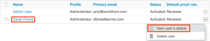

# [!DNL Workfront Proof]中的验证权限配置文件

>[!IMPORTANT]
>
>本文提及独立产品[!DNL Workfront Proof]中的功能。 有关[!DNL Adobe Workfront]内部校对的信息，请参阅[校对](../../../review-and-approve-work/proofing/proofing.md)。

作为[!DNL Workfront]管理员或[!DNL Workfront Proof]管理员，您可以将验证权限配置文件分配给用户，以指定用户将拥有的对系统中所有验证的验证权能。 有关配置用户的验证权限配置文件的信息，请参阅[在 [!DNL Workfront Proof]](../../../workfront-proof/wp-acct-admin/account-settings/config-user-pref-in-wp.md)中配置用户的验证权限配置文件。

>[!NOTE]
>
>您还可以执行以下操作：
>
>* 授予用户对单个验证的特定角色。 有关验证角色的更多信息，请参阅[在 [!DNL Workfront Proof]](../../../workfront-proof/wp-work-proofsfiles/share-proofs-and-files/manage-proof-roles.md)中管理验证角色。
>* 为您的组织中的用户创建自定义配置文件。 有关详细信息，请参阅[在 [!DNL Workfront Proof]](../../../workfront-proof/wp-acct-admin/account-settings/configure-custom-profiles.md)中配置自定义配置文件。
>

下表显示每个验证权限配置文件的可用权限。

| **拥有的项目** |  |  |  |  | **其他用户的项目** |  |  | **管理员** | **帐单** |
|---|---|---|---|---|---|---|---|---|---|
|   | **添加** | **视图** | **编辑** | **删除** | **视图** | **编辑** | **删除** | **编辑和删除** | **编辑** |
| 账单管理员 |  |  |  |  |  |  |  |  |  |
| 管理员 |  |  |  |  |  |  |  |  |   |
| 监督人 |  |  |  |  |  |  |  |   |   |
| 管理器 |  |  |  |  |   |   |   |   |   |
| 观察人 |   |  |   |   |   |   |   |   |   |
| 访客 |   |  |   |   |   |   |   |   |   |

{style="table-layout:auto"}

有关角色和权限，请考虑以下事项：

* 分配的配置文件权限仅与您自己帐户中的用户和项目相关。 卫星帐户则属于例外，主（中心）帐户的管理员和账单管理员可以从中心帐户级别访问和管理这些帐户的帐户设置和账单。
* 账单管理员和账单管理员可以删除用户。 这只能在帐户设置中完成。
* 当账单管理员和管理员查看其帐户中其他用户拥有的验证时，他们将以审阅者的角色查看它们。
* 使用“只读”角色，账单管理员和管理员可以访问与其共享的文件夹中或由他们创建的文件夹中的验证。

以下部分介绍了在标准[!DNL Workfront Proof]设置中与该配置文件关联的每个配置文件和权限：

* [帐单管理员](#billing-administrator)
* [管理员](#administrator)
* [主管](#supervisor)
* [经理](#manager)
* [观察者](#observer)
* [访客](#visitor)
* [来宾](#guest)

## 账单管理员 {#billing-administrator}

帐单管理员有权访问 [!DNL Workfront Proof][&#128279;](../../../workfront-proof/wp-acct-admin/account-settings/account-settings.md) and [The [!DNL Workfront Proof] 帐单页面](../../../workfront-proof/wp-billingsettings/manage-your-billing/wp-billing-page.md)中的帐户设置，并具有以下权限：

可以生成校样、上载文件和创建文件夹。 有关详细信息，请参阅[在 [!DNL Workfront Proof]](../../../workfront-proof/wp-work-proofsfiles/create-proofs-and-files/generate-proofs.md)中生成验证、[将文件和Web内容上传到 [!DNL Workfront Proof]](../../../workfront-proof/wp-work-proofsfiles/create-proofs-and-files/upload-files-web-content.md)以及[在 [!DNL Workfront Proof]](../../../workfront-proof/wp-work-proofsfiles/organize-your-work/create-folders.md)中创建文件夹。

可以查看、编辑和删除自己创建的验证和文件。

可以查看、编辑和删除组织中的所有用户创建的验证和文件。

可以删除其他用户的公用文件夹。 有关详细信息，请参阅[在 [!DNL Workfront Proof]](../../../workfront-proof/wp-work-proofsfiles/organize-your-work/manage-folders.md)中管理文件夹。

具有对帐户中创建的所有验证的编辑权限。

可以设置为拖放区域所有者。 有关详细信息，请参阅[在 [!DNL Workfront Proof]](../../../workfront-proof/wp-acct-admin/account-settings/configure-dropzone-in-wp.md)中配置拖放区域。

可以访问帐单页面并编辑帐单详细信息。 有关详细信息，请参阅[帐单页面 [!DNL Workfront Proof] &#x200B;](../../../workfront-proof/wp-billingsettings/manage-your-billing/wp-billing-page.md)。

可以访问“帐户设置”页并编辑帐户详细信息。 有关详细信息，请参阅 [!DNL Workfront Proof][&#128279;](../../../workfront-proof/wp-acct-admin/account-settings/account-settings.md)中的帐户设置。

可以清空垃圾桶。 有关详细信息，请参阅[还原并清空 [!DNL Workfront Proof]](../../../workfront-proof/wp-work-proofsfiles/manage-your-work/restore-and-empty-trash.md)中的垃圾桶。

可以添加、编辑和删除用户。

可以创建组并添加新联系人。

可以删除联系人。

如果校样中没有回复，可以编辑校样。

无法编辑校对回复。

无法删除其他用户的专用文件夹。 有关详细信息，请参阅[在 [!DNL Workfront Proof]](../../../workfront-proof/wp-work-proofsfiles/organize-your-work/manage-folders.md)中管理文件夹。

有关帐户设置的信息，请参阅 [!DNL Workfront Proof][&#128279;](../../../workfront-proof/wp-acct-admin/account-settings/account-settings.md)中的帐户设置。

有关计费的信息，请参阅[计费页面 [!DNL Workfront Proof] &#x200B;](../../../workfront-proof/wp-billingsettings/manage-your-billing/wp-billing-page.md)。

### 管理员 {#administrator}

管理员有权访问[帐户设置](https://support.workfront.com/hc/en-us/sections/115000912147-Account-Settings)并具有以下权限：

可以创建校样、上载文件和创建文件夹。 有关详细信息，请参阅[在 [!DNL Workfront Proof]](../../../workfront-proof/wp-work-proofsfiles/create-proofs-and-files/generate-proofs.md)中生成验证、[将文件和Web内容上传到 [!DNL Workfront Proof]](../../../workfront-proof/wp-work-proofsfiles/create-proofs-and-files/upload-files-web-content.md)以及[在 [!DNL Workfront Proof]](../../../workfront-proof/wp-work-proofsfiles/organize-your-work/create-folders.md)中创建文件夹。

可以查看、编辑和删除校样和它们创建的文件。

可以查看、编辑和删除组织中的所有用户创建的验证和文件。

可以删除其他用户的公用文件夹。 有关详细信息，请参阅[在 [!DNL Workfront Proof]](../../../workfront-proof/wp-work-proofsfiles/organize-your-work/manage-folders.md)中管理文件夹。

具有对帐户中创建的所有验证的编辑权限。

可以设置为拖放区域所有者。 有关详细信息，请参阅[在 [!DNL Workfront Proof]](../../../workfront-proof/wp-acct-admin/account-settings/configure-dropzone-in-wp.md)中配置拖放区域。

可以访问“帐户设置”页并编辑帐户详细信息。 有关详细信息，请参阅 [!DNL Workfront Proof][&#128279;](../../../workfront-proof/wp-acct-admin/account-settings/account-settings.md)中的帐户设置。

可以清空垃圾桶。 有关详细信息，请参阅[还原并清空 [!DNL Workfront Proof]](../../../workfront-proof/wp-work-proofsfiles/manage-your-work/restore-and-empty-trash.md)中的垃圾桶。

可以添加、编辑和删除用户。

可以创建组并添加新联系人。

可以删除联系人。

如果校样中没有回复，可以编辑校样。

无法编辑校对回复。

无法删除其他用户的专用文件夹。 有关详细信息，请参阅[在 [!DNL Workfront Proof]](../../../workfront-proof/wp-work-proofsfiles/organize-your-work/manage-folders.md)中管理文件夹。

无法访问帐单页面或编辑帐单详细信息。 有关详细信息，请参阅[帐单页面 [!DNL Workfront Proof] &#x200B;](../../../workfront-proof/wp-billingsettings/manage-your-billing/wp-billing-page.md)。

### 监督人 {#supervisor}

主管具有以下权限：

可以创建校样、上载文件和创建文件夹。 有关详细信息，请参阅[在 [!DNL Workfront Proof]](../../../workfront-proof/wp-work-proofsfiles/create-proofs-and-files/generate-proofs.md)中生成验证、[将文件和Web内容上传到 [!DNL Workfront Proof]](../../../workfront-proof/wp-work-proofsfiles/create-proofs-and-files/upload-files-web-content.md)以及[在 [!DNL Workfront Proof]](../../../workfront-proof/wp-work-proofsfiles/organize-your-work/create-folders.md)中创建文件夹。

可以查看、编辑和删除自己创建的验证和文件。

可以查看、编辑和删除组织中的所有用户创建的验证和文件。

可以删除其他用户的公用文件夹。 有关详细信息，请参阅[在 [!DNL Workfront Proof]](../../../workfront-proof/wp-work-proofsfiles/organize-your-work/manage-folders.md)中管理文件夹。

具有对帐户中创建的所有验证的编辑权限。

可以设置为拖放区域所有者。 有关详细信息，请参阅[在 [!DNL Workfront Proof]](../../../workfront-proof/wp-acct-admin/account-settings/configure-dropzone-in-wp.md)中配置拖放区域。

可以创建组并添加新联系人。

可以删除联系人。

如果校样中没有回复，可以编辑校样。

无法编辑校对回复。

无法删除其他用户的专用文件夹。 有关详细信息，请参阅 [!DNL Workfront Proof][&#128279;](../../../workfront-proof/wp-work-proofsfiles/organize-your-work/folders.md)中的文件夹。

无法访问帐单页面或帐户设置。 有关详细信息，请参阅 [!DNL Workfront Proof][&#128279;](../../../workfront-proof/wp-acct-admin/account-settings/account-settings.md)中的帐单页面 [!DNL Workfront Proof] 和[帐户设置。](../../../workfront-proof/wp-billingsettings/manage-your-billing/wp-billing-page.md)

无法添加、编辑或删除用户。

不能清空垃圾桶。 有关详细信息，请参阅[还原并清空 [!DNL Workfront Proof]](../../../workfront-proof/wp-work-proofsfiles/manage-your-work/restore-and-empty-trash.md)中的垃圾桶。

### 管理器 {#manager}

经理具有以下权限：

可以创建校样、上载文件和创建文件夹。 有关详细信息，请参阅[在 [!DNL Workfront Proof]](../../../workfront-proof/wp-work-proofsfiles/create-proofs-and-files/generate-proofs.md)中生成验证、[将文件和Web内容上传到 [!DNL Workfront Proof]](../../../workfront-proof/wp-work-proofsfiles/create-proofs-and-files/upload-files-web-content.md)以及[在 [!DNL Workfront Proof]](../../../workfront-proof/wp-work-proofsfiles/organize-your-work/create-folders.md)中创建文件夹。

可以查看、编辑和删除自己创建或拥有的验证和文件。

可以查看、审阅和批准其他用户的验证（共享文件夹中所有内容的只读权限）。 有关详细信息，请参阅[在 [!DNL Workfront Proof]](../../../workfront-proof/wp-work-proofsfiles/share-proofs-and-files/manage-proof-roles.md)中管理校对角色。

可以创建组并添加新联系人。

无法查看、编辑或删除组织中其他用户创建的验证和文件。

无法编辑校样或回复。

无法删除其他用户的专用文件夹。 有关详细信息，请参阅[在 [!DNL Workfront Proof]](../../../workfront-proof/wp-work-proofsfiles/organize-your-work/manage-folders.md)中管理文件夹。

无法删除其他用户的公用文件夹。 有关详细信息，请参阅[在 [!DNL Workfront Proof]](../../../workfront-proof/wp-work-proofsfiles/organize-your-work/manage-folders.md)中管理文件夹。

无法访问帐单页面或帐户设置。 有关详细信息，请参阅 [!DNL Workfront Proof][&#128279;](../../../workfront-proof/wp-acct-admin/account-settings/account-settings.md)中的帐单页面 [!DNL Workfront Proof] 和[帐户设置。](../../../workfront-proof/wp-billingsettings/manage-your-billing/wp-billing-page.md)

无法将设置为拖放区域所有者。 有关详细信息，请参阅[在 [!DNL Workfront Proof]](../../../workfront-proof/wp-acct-admin/account-settings/configure-dropzone-in-wp.md)中配置拖放区域。

不能清空垃圾桶。 有关详细信息，请参阅[还原并清空 [!DNL Workfront Proof]](../../../workfront-proof/wp-work-proofsfiles/manage-your-work/restore-and-empty-trash.md)中的垃圾桶。

无法添加、编辑或删除用户。

无法删除联系人。

### 观察人 {#observer}

观察者具有以下权限：

可以查看、审阅和批准其他用户的验证（共享文件夹中所有内容的只读权限）。 有关详细信息，请参阅[在 [!DNL Workfront Proof]](../../../workfront-proof/wp-work-proofsfiles/share-proofs-and-files/manage-proof-roles.md)中管理校对角色。

可以查看与它们明确共享的文件。

可以查看联系人和组

无法创建校样、上载文件和创建文件夹。 有关详细信息，请参阅[将文件和Web内容上载到 [!DNL Workfront Proof]](../../../workfront-proof/wp-work-proofsfiles/create-proofs-and-files/upload-files-web-content.md)。

无法查看、编辑或删除组织中其他用户创建的验证和文件。

无法编辑校样或回复。

无法删除组织中创建的任何项目。

无法访问帐单页面或帐户设置。 有关详细信息，请参阅 [!DNL Workfront Proof][&#128279;](../../../workfront-proof/wp-acct-admin/account-settings/account-settings.md)中的帐单页面 [!DNL Workfront Proof] 和[帐户设置。](../../../workfront-proof/wp-billingsettings/manage-your-billing/wp-billing-page.md)

无法将设置为拖放区域所有者。 有关详细信息，请参阅[在 [!DNL Workfront Proof]](../../../workfront-proof/wp-acct-admin/account-settings/configure-dropzone-in-wp.md)中配置拖放区域。

不能清空垃圾桶。 有关详细信息，请参阅[还原并清空 [!DNL Workfront Proof]](../../../workfront-proof/wp-work-proofsfiles/manage-your-work/restore-and-empty-trash.md)中的垃圾桶。

无法添加、编辑或删除用户。

无法创建组或添加新联系人。

无法删除联系人。

>[!NOTE]
>
>观察者可用的菜单和功能有限。
>
>* 观察者在其功能板中看不到标题菜单或绿色的新菜单
>* 观察者在其“设置”中看不到以下链接：帐户设置、计费
>

### 访客 {#visitor}

访客具有以下权限：

可以查看、审阅和批准其他用户的验证（共享文件夹中所有内容的只读权限）。 有关详细信息，请参阅[在 [!DNL Workfront Proof]](../../../workfront-proof/wp-work-proofsfiles/share-proofs-and-files/manage-proof-roles.md)中管理校对角色。

可以查看与它们明确共享的文件。

无法查看联系人和组

无法创建校样、上载文件和创建文件夹。 有关详细信息，请参阅[将文件和Web内容上载到 [!DNL Workfront Proof]](../../../workfront-proof/wp-work-proofsfiles/create-proofs-and-files/upload-files-web-content.md)。

无法查看、编辑或删除组织中其他用户创建的验证和文件。

无法编辑校样或回复。

无法删除组织中创建的任何项目。

无法访问帐单页面或帐户设置。 有关详细信息，请参阅 [!DNL Workfront Proof][&#128279;](../../../workfront-proof/wp-acct-admin/account-settings/account-settings.md)中的帐单页面 [!DNL Workfront Proof] 和[帐户设置。](../../../workfront-proof/wp-billingsettings/manage-your-billing/wp-billing-page.md)

无法将设置为拖放区域所有者。 有关详细信息，请参阅[在 [!DNL Workfront Proof]](../../../workfront-proof/wp-acct-admin/account-settings/configure-dropzone-in-wp.md)中配置拖放区域。

不能清空垃圾桶。 有关详细信息，请参阅[还原并清空 [!DNL Workfront Proof]](../../../workfront-proof/wp-work-proofsfiles/manage-your-work/restore-and-empty-trash.md)中的垃圾桶。

无法添加、编辑或删除用户。

无法创建组或添加新联系人。

无法删除联系人。

>[!NOTE]
>
>访客可用的菜单和功能有限。
>
>* 访客在其功能板中看不到标题菜单或绿色的新建菜单
>* 访客在其“设置”中看不到以下链接：帐户设置、账单
>

### 来宾 {#guest}

访客配置文件用于向没有自己的Workfront Proof帐户的审阅人授予验证访问权限。 来宾可以通过其个人电子邮件通知直接访问与其共享的校样。

可以查看、审阅和批准与它们明确共享的校样。

可以查看与它们明确共享的文件。

无法访问仪表板。

不能与它们共享文件夹。 有关详细信息，请参阅[在 [!DNL Workfront Proof]](../../../workfront-proof/wp-work-proofsfiles/organize-your-work/manage-folders.md)中管理文件夹。

无法将作为作者或版主添加到验证。 有关详细信息，请参阅[在 [!DNL Workfront Proof]](../../../workfront-proof/wp-work-proofsfiles/share-proofs-and-files/manage-proof-roles.md)中管理校对角色。

>[!NOTE]
>
>来宾不是Workfront Proof用户，因此他们无法在自己的功能板中看到与其共享的所有验证。

## 编辑用户的验证权限配置文件

管理员和账单管理员可以编辑帐户中所有用户的权限配置文件。

1. 要查找要编辑的用户，请执行下列操作之一：

   * 导航到&#x200B;**[!UICONTROL 帐户设置]**，然后单击&#x200B;**[!UICONTROL 用户]**&#x200B;选项卡。

   * 转到&#x200B;**[!UICONTROL 联系人]**&#x200B;页面。

1. 单击要编辑其权限的用户名。 

1. 单击&#x200B;**[!UICONTROL 权限配置文件]**&#x200B;下拉菜单，然后选择新的权限配置文件。：

   

   权限配置文件包括“管理员”、“主管”、“经理”和“观察者”。

1. 单击菜单之外的任意位置进行保存。

>[!NOTE]
>
>管理员无法分配计费管理员配置文件。 您可以在以下日志中找到配置文件更改列表：
>
>* 帐户活动日志
>* 用户的配置文件日志（仅供该用户访问）
>

有关活动日志的详细信息，请参阅[了解 [!DNL Workfront Proof] 活动审核记录](../../../workfront-proof/wp-work-proofsfiles/basic-features/activity-audit-trail.md)。
