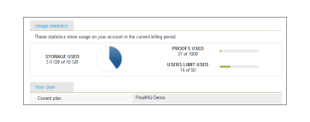

# 品牌化[!DNL Workfront Proof]网站 — 高级

>[!IMPORTANT]
>
>本文提及独立产品[!DNL Workfront Proof]中的功能。 有关[!DNL Adobe Workfront]内部校对的信息，请参阅[校对](../../../review-and-approve-work/proofing/proofing.md)。

高级品牌推广适用于Select和Premium计划，并包含在计划的成本中。

有关基本品牌的信息（包括登录页面、电子邮件通知和验证），请参阅[品牌化 [!DNL Workfront Proof] 站点](../../../workfront-proof/wp-acct-admin/branding/brand-wp-site.md)。

高级品牌策略选项包括自定义以下区域：

* 标题和文本颜色
* Web应用程序标头
* 菜单栏和文本颜色
* 功能板欢迎框和快速入门框
* 页脚文本
* 法维孔
* 页面标题
* 帮助链接

以下部分更详细地描述了高级品牌策略：

## 高级品牌推广概述

您将在[帐户设置](https://support.workfront.com/hc/en-us/sections/115000912147-Account-Settings)页面的选项卡中找到[!UICONTROL 品牌策略配置]部分。 若要将更改应用于您的帐户，请确保品牌策略选项设置为[!UICONTROL 已启用] (1)。

有关如何配置“高级品牌策略”选项(2-14)的更多详细信息，请参阅以下部分。

## 高级品牌策略配置

您可以为[!DNL Workfront Proof]的以下区域设置品牌：

* [Web 应用程序](#web-application)
* [标头](#header)
* [标题链接](#header-links)
* [侧栏](#sidebar)
* [欢迎框](#welcome-box)
* [章节标题](#section-headers)

### Web 应用程序 {#web-application}

您可以为Web应用程序页眉(2)选择三个品牌推广选项：

* 标题中的品牌推广图像
* 标题中的帐户名称
* 如果禁用品牌策略，[!DNL Workfront Proof]徽标将保留在Web应用程序的标题中

品牌推广图像 — 最大大小为550x90像素。 您可以使用JPG、GIF或PNG，并且支持透明背景。

帐户名称 — 取自您的帐户详细信息，并以白色字体显示。 您的帐户名称最多可包含60个字符（包括空格和标点符号）。

### 标头 {#header}

在此字段(3)中，可以设置标题的背景，也可以选择纯色或背景图像。

颜色 — 在此，如同在颜色方案配置的所有其他品牌化字段中一样，您可以输入所选十六进制颜色值或使用方便的拾色器（单击文本字段将打开弹出窗口）。 默认的标题背景颜色为#232d2e。

背景图像 — 可与品牌推广图像相结合。

* 您可以使用JPG、GIF或PNG — 对于具有透明度的文件，使用白色背景色显示。
* 页眉的高度为96px，并且不会为[!UICONTROL 不重复]选项调整已上传图像的大小。
* 背景图像位于左上方。

### 标题链接 {#header-links}

在此字段(4)中，您可以在帐户右上角显示的标题菜单中修改链接的用户名颜色和颜色。

### 侧栏 {#sidebar}

选择菜单栏(5)和菜单字体(6)的颜色以自定义侧栏

>[!NOTE]
>
>将常量十六进制值添加到所选菜单栏的颜色，即可自动调整悬停颜色。

无法自定义新验证按钮颜色。

### 欢迎框 {#welcome-box}

在此字段(7)中，您可以设置在“功能板”页面上显示的欢迎框颜色。

### 章节标题 {#section-headers}

这些字段允许您自定义[[!UICONTROL 帐户设置]](https://support.workfront.com/hc/en-us/sections/115000912147-Account-Settings)页面上节标题的背景(8)和字体颜色(9)。

**页脚**

在品牌策略配置的此字段(10)中，您可以构建一个页脚，该页脚将显示在所有帐户页面的底部。 您可以使用内置的WYSIWYG编辑器，也可以简单地粘贴您自己的设计。

>[!NOTE]
>
>无法在页脚文本编辑器中编辑HTML，但可以粘贴复制的设计（包括所有链接和图像）。

**Favicon和页面标题**

您可以通过设置您自己的Favicon图像（.ICO文件） (11)和页面标题(12)来自定义[!DNL Workfront Proof]页面在浏览器中的显示方式 — 这些页面将显示在所有帐户页面的浏览器选项卡/窗口标题中。

>[!NOTE]
>
>对于在您的帐户中创建的所有验证，您的Favicon也会显示在[!DNL Workfront Proof]查看器窗口的标题中。

**帮助链接**

您可以自定义自己的帮助链接，将用户和审阅人指向您自己的内容。 若要激活此功能，请将[!UICONTROL 帮助链接]选项(13)设置为“已启用”，并在下一个字段(14)中添加您的链接。 您最多可以配置四个链接，这些链接将可用：

* 在[!UICONTROL 帮助]链接下的[!UICONTROL 标题]菜单中
  

* 在[!DNL Workfront Proof] [!UICONTROL 查看器]侧边栏的[!UICONTROL 帮助]面板中
  

此外，企业计划客户还可以选择完全自定义以下内容：

* 完全自定义登陆页面（例如，登录和注销页面、忘记密码页面）
* 完全自定义您的域

请通过sales.team@workfront.com联系我们，了解更多有关其他品牌推广选项的信息。

<!--
<h2 data-mc-conditions="QuicksilverOrClassic.Draft mode">Custom Domains</h2>
-->

<!--

Our Select and Premium plans include the option to purchase a fully-branded domain. This means that you can customize your URL as well as all links included in notification emails.&nbsp;

-->

<!--

For more information, please see&nbsp;<a href="../../../workfront-proof/wp-acct-admin/branding/configure-branded-domain-in-wp.md" class="MCXref xref">Configure a branded domain in Workfront Proof</a>.

-->

<!--
<h2 data-mc-conditions="QuicksilverOrClassic.Draft mode">Custom Page Branding</h2>
-->

<!--

Custom branding of the Workfront Proof pages is a paid service and by default&nbsp;includes full customization of the following:

-->

<!--
  <li data-mc-conditions="QuicksilverOrClassic.Draft mode"><a href="https://app.proofhq.com/login">Log in/landing page</a> </li>
  -->

<!--
  <li data-mc-conditions="QuicksilverOrClassic.Draft mode"><a href="https://app.proofhq.com/logout">Logout page</a> </li>
  -->

<!--
  <li data-mc-conditions="QuicksilverOrClassic.Draft mode"><a href="https://app.proofhq.com/login/password">Forgot password page</a> </li>
  -->

<!--
<h3 data-mc-conditions="QuicksilverOrClassic.Draft mode">Design Elements</h3>
-->

<!--

Please create your design&nbsp;in&nbsp;a .PSD file with all the elements placed in the separate layers - this will allow us to prepare the scalable pages for you.

-->

<!--

There are no particular restrictions on the .PSD files, and the look and layout of the pages is completely up to you. However please make sure that the key elements are included in your design:

-->

<!--

<strong>Login Page</strong>    

-->

<!--

<strong>Logout page</strong>    

-->

<!--

<strong>Forgot password</strong>    

-->

<!--

<strong>Inactivity alert</strong>    

-->

<!--

<strong>Invalid email address</strong>    

-->

<!--

<strong>Inactivity and incorrect email address</strong>    

-->

<!--
<note type="note">
&nbsp;The separate designs for the alerts are not required. If you'd like us to leave the default style of the messages, as shown on the screencasts above, please let us know. The team will match the colors with your design.
</note>
-->

<!--

If you'd like to have placeholder text in the text fields, please include this in your designs.

-->

<!--
<note type="note">
The wording of the alerts cannot be changed as these are the system messages.
</note>
-->

<!--

<strong>2. Fonts</strong> 

-->

<!--

Please make sure that the text is not rasterized but kept as the text layers, unless you want the particular elements to be displayed as images on your landing pages.

-->

<!--

If you use custom fonts in your design, please make sure to include the following font files: EOT + .TTF + OTF + SVG + WOFF for support in all browsers.

-->

<!--
<note type="note">
&nbsp; You need to hold an appropriate license, which allows implementing your selected fonts on the web pages.
</note>
-->

<!--

If you use the standard and widely available fonts, the font files are not required. Please see the following lists for reference:

-->

<!--
  <li data-mc-conditions="QuicksilverOrClassic.Draft mode"><a href="http://www.w3schools.com/cssref/css_websafe_fonts.asp">Websafe fonts listed in the standard Font families</a> </li>
  -->

<!--
  <li data-mc-conditions="QuicksilverOrClassic.Draft mode"><a href="https://www.google.com/fonts">Open Source Google fonts</a> </li>
  -->

<!--

<strong>3. Screen resolution</strong> 

-->

<!--

We support 1024x768 screen resolution (1366x768 for wide screens) and upwards. However, for the landing pages designs we do recommend using higher resolution for the better results on the various screens. The best practice would be to determine what screen resolution is the most common on your users' machines and prepare a slightly bigger design.

-->

<!--

<strong>4. Browsers compatibility</strong> 

-->

<!--

The newer browsers generally don't require any custom code to display the pages properly. However, if your users have the older browser versions installed on their machines some code adjustments may be needed.

-->

<!--

By default we do prepare the pages compatible with the following browsers:

-->

<!--
  <li data-mc-conditions="QuicksilverOrClassic.Draft mode">Internet Explorer 9+</li>
  -->

<!--
  <li data-mc-conditions="QuicksilverOrClassic.Draft mode">Safari 6.x+</li>
  -->

<!--
  <li data-mc-conditions="QuicksilverOrClassic.Draft mode">Chrome 22+ *</li>
  -->

<!--
  <li data-mc-conditions="QuicksilverOrClassic.Draft mode">Firefox 15+ *</li>
  -->

<!--

* Preferred browsers 

-->

<!--
<note type="note"> Workfront Proof will not design your custom pages, the PSD files must be supplied by you, but if you have any questions, please contact our Support team.
</note>
-->
