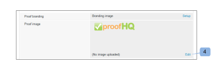

# 品牌化[!DNL Workfront Proof]网站

>[!IMPORTANT]
>
>本文提及独立产品[!DNL Workfront]校对中的功能。 有关[!DNL Adobe Workfront]内部校对的信息，请参阅[校对](../../../review-and-approve-work/proofing/proofing.md)。

作为[!DNL Workfront Proof]管理员，您可以对您的[!DNL Workfront Proof]帐户进行品牌化，以便为您和您的用户提供更加自定义的体验。

所有计划均提供基本帐户品牌推广，无需额外付费。

有关高级品牌化的信息，包括标题、菜单栏、仪表板等的品牌化，请参阅[品牌化 [!DNL Workfront Proof] 网站 — 高级](../../../workfront-proof/wp-acct-admin/branding/brand-wp-site-advanced.md)。 高级品牌仅在Select和Premium计划上可用

有关如何对[!DNL Workfront]校对站点的各个方面进行品牌化的信息，请参阅以下部分：

## 在[!DNL Workfront Proof]登录页面上启用品牌策略

要在您的帐户中启用品牌策略，请执行以下操作：

1. 以[!DNL Workfront Proof]管理员身份登录到[!DNL Workfront Proof]。
1. 单击[!DNL Workfront Proof]界面右上角的&#x200B;**[!UICONTROL 帐户设置]**。

   有关您可以配置的各种帐户设置的详细信息，请参阅[帐户设置。](https://support.workfront.com/hc/en-us/sections/115000912147-Account-Settings)

1. 单击&#x200B;**[!UICONTROL 设置]**&#x200B;选项卡。
1. 在&#x200B;**[!UICONTROL 品牌]**&#x200B;部分中，单击&#x200B;**[!UICONTROL 启用]**。 (1)

   

   品牌图像现在显示在您的登录页面上。

   >[!NOTE]
   >
   >如果您通过主[!DNL Workfront]校对登录URL访问，则品牌推广图像不会显示在您的登录页面上。 例如，`https://www.proofhq.com/login`。 它仅在您通过自定义子域或全品牌域访问登录页面时显示。 要访问您的自定义登录页面，只需在浏览器中键入您的帐户URL即可。 例如，`http://<yoursubdomain>.proofhq.com.` <!--For more information about fully branded domains, see "Fully Branded Domains" in the article [Configure a branded domain in [!DNL Workfront Proof]](../../../workfront-proof/wp-acct-admin/branding/configure-branded-domain-in-wp.md).-->

   

## 在验证中启用品牌化

要将您自己的品牌图像添加到帐户中创建的每个验证的[!UICONTROL 验证加载]页面，请执行以下操作：

1. 以[!DNL Workfront Proof]管理员身份登录到[!DNL Workfront Proof]。
1. 单击[!DNL Workfront Proof]界面右上角的&#x200B;**[!UICONTROL 帐户设置]**。

   有关您可以配置的各种帐户设置的详细信息，请参阅[帐户设置。](https://support.workfront.com/hc/en-us/sections/115000912147-Account-Settings)

1. 单击&#x200B;**[!UICONTROL 设置]**&#x200B;选项卡。
1. 在&#x200B;**[!UICONTROL 品牌]**&#x200B;部分中，单击&#x200B;**[!UICONTROL 验证品牌]**&#x200B;旁边的&#x200B;**[!UICONTROL 设置]**。 (1)

   

1. 从下拉菜单中选择&#x200B;**[!UICONTROL 品牌推广图像]**。
如果选择**[!UICONTROL 禁用]**，则验证加载页面上会显示[!DNL Workfront Proof]徽标

1. 单击&#x200B;**[!UICONTROL 保存]**。 (3)

   

1. 单击&#x200B;**[!UICONTROL 编辑]**&#x200B;以选择品牌策略图像(4)。

   您可以使用JPG、GIF或PNG。 支持透明度。 建议的图像大小为150x300px。 登录和注销页面上的图像大小将调整为这些尺寸。

   

1. 选择要上载的图像。 (5)
1. 单击&#x200B;**[!UICONTROL 保存]**。

   您的品牌图像现在显示在帐户中创建的每个验证的验证加载页面上。

   

## 品牌推广电子邮件通知

您可以配置要包含在发送给审阅人的电子邮件通知中的品牌推广图像。 此图像的大小已调整为最大尺寸90x550px。

要设置电子邮件品牌，请执行以下操作：

1. 以[!DNL Workfront Proof]管理员身份登录到[!DNL Workfront Proof]。
1. 单击[!DNL Workfront Proof]界面右上角的&#x200B;**[!UICONTROL 帐户设置]**。

   有关您可以配置的各种帐户设置的详细信息，请参阅[帐户设置。](https://support.workfront.com/hc/en-us/sections/115000912147-Account-Settings)

1. 单击&#x200B;**[!UICONTROL 设置]**&#x200B;选项卡。
1. 在&#x200B;**[!UICONTROL 品牌]**&#x200B;部分中，单击电子邮件应用程序图像(1)旁边的&#x200B;**[!UICONTROL 编辑]**。
   

1. 选择要用于标记电子邮件的图像。 (2)

   如果已配置电子邮件品牌策略，并且要禁用它，请单击&#x200B;**[!UICONTROL 清除]**。 (4)

   

1. 单击&#x200B;**[!UICONTROL 保存]**。

   该图像现在出现在所有验证通知电子邮件中。 (3)

   

<!--
<h2 data-mc-conditions="QuicksilverOrClassic.Draft mode">Custom Sub-Domains</h2>
-->

<!--

You can add your brand name to your Workfront Proof account URL. For example, your URL might look like this:

-->

<!--

<strong>http://yoursubdomain.proofhq.com</strong> 

-->

<!--

This customization is also included in all your proof links, as well as in the 'From' email address for your proof notifications.

-->

<!--

For more information on how to set up a branded sub-domain, see <a href="../../../workfront-proof/wp-acct-admin/branding/configure-branded-domain-in-wp.md" class="MCXref xref">Configure a branded domain in Workfront Proof</a>

-->

## 通过API隐藏按钮和链接

如果您通过[!DNL Workfront Proof] API创建验证，则可以禁止显示按钮和链接并创建自己的自定义链接。

有关详细信息，请参阅[[!DNL Workfront Proof] API](https://api.proofhq.com/)。
