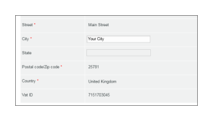

# [!DNL Workfront Proof]计费页面

>[!IMPORTANT]
>
>本文提及独立产品[!DNL Workfront Proof]中的功能。 有关[!DNL Adobe Workfront]内部校对的信息，请参阅[校对](../../../review-and-approve-work/proofing/proofing.md)。

## 计费页面

若要访问[!UICONTROL 帐单]页面，请打开屏幕右上方的&#x200B;**[!UICONTROL 设置]**&#x200B;菜单，然后在下拉菜单中选择&#x200B;**[!UICONTROL 帐单]**。

[!UICONTROL 帐单]页面包含以下内容：

* 帐户名称(1)
* 帐户列表（例如，如果您有Satellite帐户）(2)
* 更改计划(3)
* 更改付款详细信息(4)
* 新卫星帐户(5)
* 关闭帐户(6)
* 当前计划信息(7)
* 帐单联系人和地址(8)
* 使用情况统计数据(9)
* 记帐历史记录(10)
* 计费活动(11)

  

## [!UICONTROL 当前计划]

此部分(7)显示当前计划的详细信息，包括：

* 计划的名称
* 当前付款方式
* 当前计划的开始日期和完成日期
* 下一个计划类型
* 下一个计划付款方式

  有关详细信息，请参阅[在 [!DNL Workfront Proof]](../../../workfront-proof/wp-billingsettings/manage-your-billing/choose-payment-method-in-wp.md)中选择付款方式。

## [!UICONTROL 帐单联系人和地址]

此部分(8)显示您帐户的主要帐单联系人和地址详细信息。

只能从您帐户上设置为账单管理员的用户中选择账单联系人。 在Satellite帐户上，此字段只能设置主帐户的账单管理员。

>[!NOTE]
>
> 您的帐户中可以有多个账单管理员，但只有在[!UICONTROL 账单联系人]字段中选择的其中一个将收到所有账单通知和帐户使用情况警报。

这包括以下通知电子邮件：

* 校对用法
* 发票
* 降级
* 延迟付款/帐户暂停警报
* 信用卡故障

  

[!UICONTROL 帐单抄送]字段还允许您添加要复制到所有帐单相关电子邮件上的电子邮件地址。 单击字段以激活倾斜编辑并输入您选择的电子邮件地址（这也可以是现有用户的电子邮件地址）。

## [!UICONTROL 帐单地址]

此部分使用内联编辑，因此只需单击字段即可输入/编辑文本。

>[!NOTE]
>
> 我们将此地址包含在您的订阅发票中，以确保此数据始终保持最新。

## [!UICONTROL 使用情况统计数据]

此部分显示当前计费时段内您的帐户的使用情况统计数据，包括以下内容：

* 使用的存储空间
* 使用的验证
* 使用的用户限制

### [!UICONTROL 使用情况警告]

当您的帐户到达以下地址时，将通过电子邮件通知您帐户中设置为账单联系人(1)的 [!DNL Workfront] Proof[&#128279;](../../../workfront-proof/wp-acct-admin/account-settings/proof-perm-profiles-in-wp.md)中的[!UICONTROL 验证权限配置文件]：

* 存储容量的75%和98%
* 75%，然后100%证明限制

一旦达到验证或存储限制，您也会在[!UICONTROL 计费]页面顶部看到警报：

* 对于已达到的验证限制

  

* 对于达到的存储限制

>[!NOTE]
>
>当在帐户中创建验证时，您的验证计数已用尽，无法通过删除验证来恢复。

通过删除验证和文件并随后清空[!UICONTROL 垃圾桶]，可以释放存储空间。

请记住，如果您需要更多验证、存储或用户，您可以随时升级您的帐户；升级会立即生效。

## [!UICONTROL 记帐历史记录]

此部分显示任何最近计费期间的活动。 您也可以从此部分下载您的发票。

有关详细信息，请参阅[正在下载您的 [!DNL Workfront Proof] 发票](../../../workfront-proof/wp-billingsettings/manage-your-billing/download-wp-invoice.md)。

## [!UICONTROL 记帐活动]

此部分显示您的计费设置的最新更改，例如[!DNL Workfront Proof]计划的订阅、升级、降级和续订。

如果您将计划更改为具有更低用户限制(1)的计划，则在启动新计划时，超出新限制的用户将自动停用。 此活动也将在您的帐户日志(2)中捕获。

