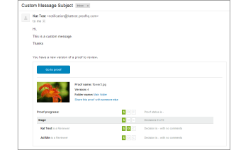

# [!UICONTROL 新版本]电子邮件

>[!IMPORTANT]
>
>本文介绍了独立产品[！DNL [!DNL Workfront Proof]]中的功能。 有关[！DNL [!DNL Adobe Workfront]]中校对的信息，请参阅[校对](../../../review-and-approve-work/proofing/proofing.md)。

<!--

Does this apply to PiW?

-->

当您创建[!UICONTROL 新版本]的验证时，将发送新版本电子邮件。 您可以使用与[!UICONTROL 新验证]电子邮件相同的方式自定义和禁用它们。

>[!NOTE]
>
>如果在[!UICONTROL 帐户设置]中将电子邮件通知禁用为默认值，审阅人将不会收到任何[!UICONTROL 新版本]电子邮件，除非在新版本页面上选中[!UICONTROL 通过电子邮件通知联系人]框。

