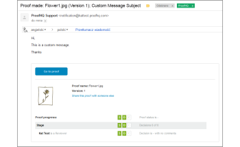
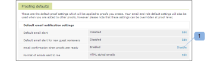

# 的 [!UICONTROL 制作校样] 电子邮件

>[!IMPORTANT]
>
>本文介绍独立产品中的功能 [!DNL Workfront Proof]. 有关内部校对的信息 [!DNL Adobe Workfront]，请参阅 [校对](../../../review-and-approve-work/proofing/proofing.md).

A [!UICONTROL 制作校样] 仅当验证创建者创建了验证时，才会向验证创建者发送电子邮件。 如果人员创建了验证并让另一个人成为所有者，则只有新所有者也会收到 [!UICONTROL 制作的证明] 电子邮件。 创建者和/或所有者将不会获得；他们只能得到 [!UICONTROL 制作校样] 电子邮件。 有关 [!UICONTROL 新校样] 电子邮件，请参阅 [[!UICONTROL 新校样] 电子邮件](../../../workfront-proof/wp-emailsntfctns/proof-notifications-and-reminders/new-proof-email.md).

用户可以禁用 [!UICONTROL 制作校样] 电子邮件，如下所述。

>[!NOTE]
>
> 如果校样的创建者或所有者 [!UICONTROL 制作校样] 电子邮件在其个人设置中默认处于禁用状态，他们将不会收到任何 [!UICONTROL 制作校样] 或 [!UICONTROL 新校样] 电子邮件，即使 [!UICONTROL 通过电子邮件通知用户] 框 [!UICONTROL 新校样] 页面。

A [!UICONTROL 制作校样] 电子邮件包含您的个人消息（如果您包含其中一个）和以下校样详细信息：

* 校对名称
* 证明的个人链接
* 版本号
* 校样的缩略图
* 校对进度
* 指向与他人共享校样的链接
* 这允许您共享原始文件的校样URL和/或下载链接。

>[!NOTE]
>
> 共享校样链接不允许您向校样明确添加审阅者，您将只共享公共校样URL，收件人将收到对校样的只读访问权限。

请参阅 [在中共享校样 [!DNL Workfront Proof]](../../../workfront-proof/wp-work-proofsfiles/share-proofs-and-files/share-proof.md) 以了解更多信息。

如果您不希望此链接显示在收件人的电子邮件中，则应禁用 [!UICONTROL 公共共享] 校样设置([!UICONTROL 下载原始文件] 和 [!UICONTROL 公共URL])。

## 禁用 [!UICONTROL 制作校样] 电子邮件

1. 单击 **[!UICONTROL 设置]** > **[!UICONTROL 个人设置]**，打开 **[!UICONTROL 校对默认值]** ，然后单击 **[!UICONTROL 禁用]** 下一页 **[!UICONTROL 准备好校样时发送电子邮件确认]**.

1. 

1. 请参阅 [在Workfront校样中配置电子邮件通知设置](../../../workfront-proof/wp-emailsntfctns/email-alerts/config-email-notification-settings-wp.md) 以了解更详细的说明。
1. 如果在 [!UICONTROL 帐户设置]，校样的创建者或所有者将不会收到任何 [!UICONTROL 制作校样] 或 [!UICONTROL 新校样] 电子邮件，即使在其个人设置中启用此设置，并且 [!UICONTROL 通过电子邮件通知用户] 框 [!UICONTROL 新校样] 页面。
