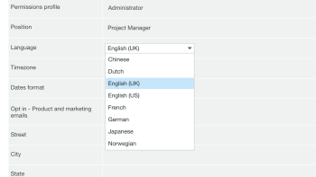

# [!DNL Workfront Proof]中的语言设置

>[!IMPORTANT]
>
>本文提及独立产品[!DNL Workfront Proof]中的功能。 有关[!DNL Adobe Workfront]内部校对的信息，请参阅[校对](../../../review-and-approve-work/proofing/proofing.md)。

作为[!DNL Workfront Proof]管理员，您可以为帐户中的所有用户选择要在[!DNL Workfront Proof]中使用的语言。

## [!DNL Workfront Proof]中支持的语言

[!DNL Workfront Proof]提供以下语言版本：

* 英语（美国/英国）
* 巴西语（葡萄牙语）
* 中文
* 荷兰语
* 法语
* 德语
* 日语
* 挪威语
* 西班牙语
* 瑞典语

## 更改[!UICONTROL 帐户设置]中的默认语言

要更改帐户的默认语言，请执行以下步骤。

1. 转到[!DNL Workfront Proof]中&#x200B;**[!UICONTROL 帐户设置]**&#x200B;的&#x200B;**[!UICONTROL 详细信息]**&#x200B;选项卡。

1. 在&#x200B;**[!UICONTROL 帐户详细信息]**&#x200B;部分中，为&#x200B;**[!UICONTROL 默认语言]**&#x200B;设置单击&#x200B;**[!UICONTROL 编辑]**。

1. 在下拉菜单中，选择您的默认语言。\
   

1. 单击&#x200B;**[!UICONTROL 保存]。**

## 更改[!UICONTROL 个人设置]中的默认语言

各个[!DNL Workfront Proof]用户可以指定与其帐户中默认使用的语言不同的语言。 要更改个人默认语言，请执行以下步骤。

1. 转到[!DNL Workfront Proof]中&#x200B;**[!UICONTROL 个人设置]**&#x200B;中的&#x200B;**[!UICONTROL 个人详细信息]**&#x200B;选项卡。\
   有关详细信息，请参阅[管理 [!DNL Workfront Proof] 用户](../../../workfront-proof/wp-acct-admin/account-settings/manage-wp-users.md)。

1. 单击&#x200B;**[!UICONTROL 语言]**&#x200B;设置中的可见语言。
1. 在下拉菜单中，选择您的首选语言。 您的选择将会自动保存。\
   

## 使用非拉丁字母添加验证评论

您可以使用与默认语言不同的字母表添加注释。 当其他验证收件人查看时，评论将以您用于添加内容的语言显示。

您可以从以下字母表中选择：

* 拉丁文脚本
* 中文
* 朝鲜语
* 日语
* 西里尔文
* 希伯来语
* 阿拉伯语
* 希腊语

## 校对查看器语言设置

在验证查看者中调整语言的能力取决于访问验证的人是用户还是访客。

对于[!DNL Workfront Proof]用户，验证查看器在其[!UICONTROL 个人设置]中以默认语言集显示内容。

对于来宾，校对查看器在[!UICONTROL 个人设置]中以校对所有者设置的语言显示内容。

>[!NOTE]
>
>如果帐户中存在自定义操作或决策，则无论审阅人的语言首选项如何，都将以最初添加这些操作或决策的语言显示。
